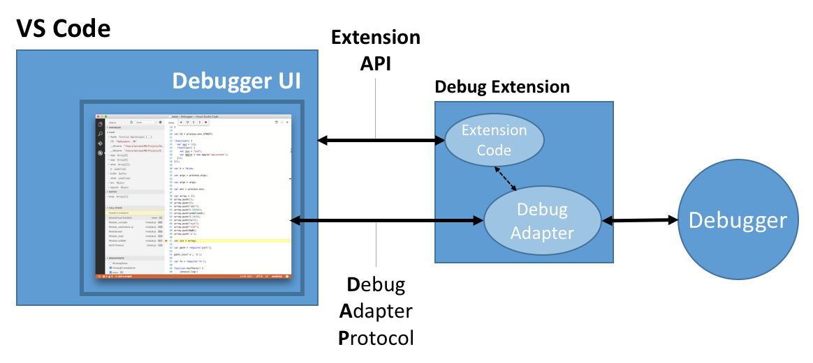

# The Debug API

Visual Studio Code allows extension authors to create new **debugger extensions** or add **features** to existing debug functionality.

Two types of APIs exist for the two areas:

- a mature and powerful **wire protocol** that allows to integrate new debuggers under VS Code's common debugger user interface,
- regular **extension API** that covers some but not all areas of VS Code's debugging functionality.

The reason for these two fundamentally different APIs is the fact that VS Code's "pluggable debuggers" predate the VS Code extension architecture (and that we couldn't remove the protocol based approach for backward compatibility).

The following diagram shows how both types of APIs coexist in VS Code today:



A **Debug Adapter** is typically a standalone executable that talks to a real debugger and translates between the
**Debug Adapter Protocol** and the concrete protocol or API of the debugger. Since a debug adapter can be implemented in the language that is best suited for a given debugger or runtime, the wire protocol is more important than the API of a particular client library that implements that protocol.

Since a debug adapter is not a VS Code extension by itself, it is wrapped as an **Debugger Extension**, but this does not need to contribute any additional code. This extension is just used as a "container" that provides the necessary contributions in the `package.json`. When a debug session is started, VS Code "reaches" into the debugger extension, starts the debug adapter, and then communicates with it by using the debug adapter protocol.

Recently we've started to add the following extension API for VS Code's debugging functionality.

## Debug Extension API

All extension API for debug is located under the `vscode.debug` namespace which you can always refer to via the [`vscode` namespace API reference](/docs/extensionAPI/vscode-api.md#debug) in our documentation.

### Debug Type specific Hooks

All configuration related "hooks" for a specific debug type are available through a `DebugConfigurationProvider`.

A `DebugConfigurationProvider` is registered for a specific debug type through the `registerDebugConfigurationProvider` function. The debug type itself is contributed via the [`debuggers` contribution](/docs/extensionAPI/extension-points.md#contributesdebuggers).

Currently the following "hooks" are available:

- Whenever VS Code needs the initial debug configurations for a newly created `launch.json` it calls `provideDebugConfigurations` for all registered `DebugConfigurationProvider`s and merges the returned debug configurations into the `launch.json`. If this method is not implemented, VS Code uses the initial configurations statically contributed in the package.json.
- A method `resolveDebugConfiguration` is called by VS Code very early when starting a new debug session. The implementation of `resolveDebugConfiguration` can "massage" the passed debug configuration by filling in missing values or by adding/changing/removing attributes. It is even possible to change the debug type "on the fly" through this mechanism.
- The method `debugAdapterExecutable` is called by VS Code late in the process of starting a debug session, when a debug adapter is needed. The method should return the file path of the debug adapter executable (and optional arguments passed to it). If this method is not implemented, VS Code uses the statically contributed path from the package.json.

### Debug Session life-cycle API

A debug session is represented as an object of type `DebugSession` in the extension API. Its life-cycle is controlled and can be tracked as follows:

- Debugging can be started with the `startDebugging` function which takes either a named debug or compound configuration, or an in-memory configuration.
- An `onDidStartDebugSession` event indicates that a debug session has been started.
- The currently active debug session is available as the variable `activeDebugSession` and changes are reported through the `onDidChangeActiveDebugSession` event.
- An `onDidTerminateDebugSession` event indicates that a debug session has terminated.

### Debug Session API

The current debug session API is rather thin:
- debug adapter protocol requests can be sent to the debuggee with the `customRequest` method,
- custom debug adapter protocol events are reported through `onDidReceiveDebugSessionCustomEvent`.

### Breakpoints API

Different types of breakpoints are represented as different subclasses of `Breakpoint`. Currently supported are `SourceBreakpoint` and `FunctionBreakpoint`.

- The set of all breakpoints of a workspace can be accessed through `vscode.debug.breakpoints`. Use an `instanceof` check to determine the concrete type of individual breakpoint objects.
- Notification about added, removed, or changed breakpoints is received via `vscode.debug.onDidChangeBreakpoints`.
- `SourceBreakpoints` and `FunctionBreakpoints` can be added by `addBreakpoints` and `removeBreakpoints` functions.

Please note that accessing breakpoints initially returns an empty array but triggers a subsequent `BreakpointsChangeEvent` event that updates `vscode.debug.breakpoints` to the correct set. So if your code relies on the correct set of breakpoints, don't forget to register for `BreakpointsChangeEvent`s.

## Debug Adapter Protocol (DAP)

You can find the [Debug Adapter Protocol](https://microsoft.github.io/debug-adapter-protocol) specification expressed as a [JSON schema](https://github.com/Microsoft/vscode-debugadapter-node/blob/master/debugProtocol.json) or as a (generated) [TypeScript definition](https://github.com/Microsoft/vscode-debugadapter-node/blob/master/protocol/src/debugProtocol.ts) file in the
[`vscode-debugadapter-node`](https://github.com/Microsoft/vscode-debugadapter-node) repository.
Both files show the detailed structure of the individual protocol requests, responses and events.
The protocol is also available as the NPM module [`vscode-debugprotocol`](https://www.npmjs.com/package/vscode-debugprotocol).

We have implemented client libraries for the Debug Adapter Protocol in TypeScript and C#, but only the JavaScript/TypeScript client library is already available as an NPM module [`vscode-debugadapter-node`](https://github.com/Microsoft/vscode-debugadapter-node). You can find the C# client library in the [Mono Debug](https://github.com/Microsoft/vscode-mono-debug/blob/master/src/DebugSession.cs) repository.

The following debugger extension projects can serve as examples for how to implement debug adapters:

GitHub Project | Description | Implementation Language
--- | --- | ---
[Mock Debug](https://github.com/Microsoft/vscode-mock-debug.git) | A 'fake' debugger | TypeScript
[Node Debug2](https://github.com/Microsoft/vscode-node-debug2.git) | The built-in CDP-based Node.js debugger |TypeScript
[Node Debug](https://github.com/Microsoft/vscode-node-debug.git) | The built-in "legacy" Node.js debugger |TypeScript
[Mono Debug](https://github.com/Microsoft/vscode-mono-debug.git) | A simple C# debugger for Mono | C#


## The Debug Adapter Protocol in a Nutshell

In this section we give a high-level overview of the interaction between VS Code and a debug adapter.
This should help you in your implementation of a debug adapter based on the Debug Adapter Protocol.

When a debug session starts, VS Code launches the debug adapter executable and talks to it through *stdin* and *stdout*. VS Code sends an **initialize** request to configure the adapter with information about the path format (native or URI) and whether line and column values are 0 or 1 based.
If your adapter is derived from the TypeScript or C# default implementation `DebugSession`, you don't have to handle the initialize request yourself.

Depending on the 'request' attribute used in the launch configuration created by the user, VS Code either sends a *launch* or an *attach* request.
For **launch** the debug adapter has to launch a runtime or program so that it can be debugged.
If the program can interact with the user through stdin/stdout, it is important that the debug adapter launches the program in an interactive terminal or console.
For **attach** the debug adapter has to attach or connect to an already running program.

Since arguments for both requests are highly dependent on a specific debug adapter implementation, the Debug Adapter Protocol does not prescribe any arguments. Instead VS Code passes all arguments from the user's launch configuration to the *launch* or *attach* requests.
A schema for IntelliSense and hover information for these attributes can be contributed in the `package.json` of the debug adapter extension. This will guide the user when creating or editing launch configurations.

Since VS Code persists breakpoints on behalf of the debug adapter, it has to register the breakpoints with the debug adapter when a session starts.
Since VS Code does not know when is a good time for this, the debug adapter is expected to send an **initialize** event to VS Code
to announce that it is ready to accept breakpoint configuration requests.

VS Code will then send all breakpoints by calling these breakpoint configuration requests:

* **setBreakpoints** for every source file with breakpoints,
* **setFunctionBreakpoints** if the debug adapter supports function breakpoints,
* **setExceptionBreakpoints** if the debug adapter supports any exception options,
* **configurationDoneRequest** to indicate the end of the configuration sequence.

So don't forget to send the *initialize* event when you are ready to accept breakpoints. Otherwise persisted breakpoints are not restored.

The *setBreakpoint* request sets all breakpoints that exist for a file (so it is not incremental).
A simple implementation of this semantics in the debug adapter is to clear all breakpoints for a file and then set the breakpoints specified in the request.
*setBreakpoints* and *setFunctionBreakpoints* are expected to return the 'actual' breakpoints and VS Code updates the UI dynamically if a breakpoint could not be set at the requested position and was moved by the debugger backend.

Whenever the program stops (on program entry, because a breakpoint was hit, an exception occurred, or the user requested execution to be paused),
the debug adapter has to send a **stopped** event with the appropriate reason and thread id.
Upon receipt VS Code will first request the **threads** (see below), and then the **stacktrace** (a list of stack frames) for the thread mentioned in the stopped event.
If the user then drills into the stack frame, VS Code first requests the **scopes** for a stack frame, and then the **variables** for a scope.
If a variable is itself structured, VS Code requests its properties through additional *variables* requests.
This leads to the following hierarchy:

```
Threads
   Stackframes
      Scopes
         Variables
            ...
               Variables
```

The VS Code debug UI supports multiple threads (but you are probably not aware of this if you are only using the Node.js debugger). Whenever VS Code receives a **stopped** or a **thread** event, VS Code requests all **threads** that exist at that point in time and displays them if there are more than one. If only one thread is detected, the VS Code UI stays in single thread mode. **Thread** events are optional but a debug adapter can send them to force VS Code to update the threads UI dynamically even when not in a stopped state.

After a successful **launch** or **attach** VS Code requests the baseline of currently existing threads with the **threads** request and then starts to listen for **thread** events to detect new or terminated threads. Even if your debug adapter does not support multiple threads, it must implement the **threads** request and return a single (dummy) thread. The id of this thread must be used in all requests where a thread id is required, e.g. **stacktrace**, **pause**, **continue**, **next**, **stepIn**, and **stepOut**.

VS Code terminates a debug session with the **disconnect** request.
If the debug target was 'launched' *disconnect* is expected to terminate the target program (even forcefully if necessary).
If the debug target has been 'attached' initially, *disconnect* should detach it from the target (so that it will continue to run).
In both cases and in the case that the target terminated normally or crashed the debug adapter must fire a **terminated** event.
After receiving a response from the *disconnect* request, VS Code will terminate the debug adapter.

## Next Steps

To learn more about VS Code extensibility model, try these topics:

* [Example: Debugger](/docs/extensions/example-debuggers.md) - See a working 'mock' debugger example
* [Extension API Overview](/docs/extensionAPI/overview.md) - Learn about the full VS Code extensibility model.
* [Extension Manifest File](/docs/extensionAPI/extension-manifest.md) - VS Code package.json extension manifest file reference
* [Contribution Points](/docs/extensionAPI/extension-points.md) - VS Code contribution points reference
