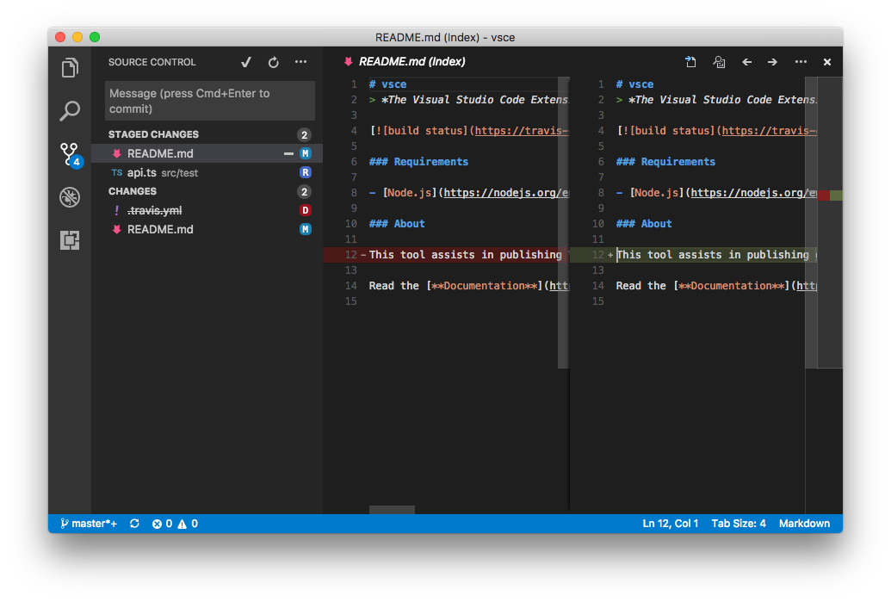
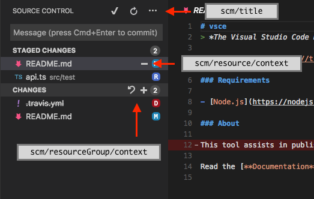
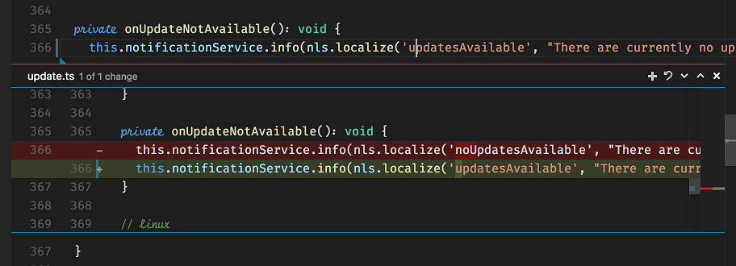

# Source Control in VS Code

Visual Studio Code allows extension authors to define Source Control Management (SCM) features its extension API. There is a slim, yet powerful API surface which allows many different SCM systems to be integrated in Visual Studio Code, while having a common user interface in all of them.



**SCM providers** are the key component to the SCM extensibility story. Code itself ships with one: the Git SCM provider. If you want to integrate another SCM system, you'll want to start by implementing an SCM provider. Let's start with this.

Note that you can always refer to the [`vscode` namespace API reference](http://code.visualstudio.com/docs/extensionAPI/vscode-api#_scm) in our docs.

## SCM Model

An SCM provider is the entity resposible for populating the SCM model with **resources**. SCM resources are themselves organized in **resource groups**. An SCM provider should return a sorted collection of resource groups.

You can register a new SCM provider with `vscode.scm.registerSCMProvider`.

In order to understand those concepts, let's take the [Git provider](https://github.com/Microsoft/vscode/tree/master/extensions/git) as an example as well as the following result of a `git status` call:

```
vsce master* → git status
On branch master
Your branch is up-to-date with 'origin/master'.
Changes to be committed:
  (use "git reset HEAD <file>..." to unstage)

        modified:   README.md
        renamed:    src/api.ts -> src/test/api.ts

Changes not staged for commit:
  (use "git add/rm <file>..." to update what will be committed)
  (use "git checkout -- <file>..." to discard changes in working directory)

        deleted:    .travis.yml
        modified:   README.md
```

There are many things going on in this workspace. First, the `README.md` file has been modified, staged and then modified once again. The `src/api.ts` file has been moved to `src/test/api.ts` and that move was staged. Finally, the `.travis.yml` file has been deleted.

For this workspace, Git defines two SCM resource groups: the **working tree** and the **index**. Each _file change_ within that group is an SCM resource:

- **Index** resource group (2 resources)
  - `README.md`, modified
  - `src/test/api.ts`, renamed from `src/api.ts`
- **Working Tree** resource group (2 resources)
  - `.travis.yml`, deleted
  - `README.md`, modified

Note how the same file, `README.md`, can be contained within two different SCM resources.

Here's how a provider is able to return this model:

```ts
export interface SCMProvider {
  resources: SCMResourceGroup[];
  onDidChange?: Event<SCMProvider>;
}
```

The `resources` field is a pointer to the model at any given point in time. A provider is able to let Code know that this model has changed by firing the `onDidChange` event.

## SCM View

By providing SCM resources, the SCM provider is able to populate the SCM view in Code. SCM resources are customizable using `SCMResourceDecorations`:

```ts
export interface SCMResource {
  readonly decorations?: SCMResourceDecorations;
}
```

The previous example would be sufficient to populate a simple list in the SCM view, but there are many user interactions that the user might want to perform with each resource. For instance, what happens when the user clicks a resource? The SCM provider can optionally implement an `open` method to handle this action:

```ts
export interface SCMProvider {
  open?(resource: SCMResource): void;
}
```

The Git provider simply opens editors when resources are opened.

### Menus

There are three SCM menu ids where you can place menu items, in order to provide the user with a much richer user interface.



The `scm/title` menu is located to the right of the SCM view title. The menu items in the `navigation` group will be inline, while all the others will be within the `…` dropdown.

The `scm/resourceGroup/context` and `scm/resource/context` are quite similar. The former will let you customize resource groups, while the latter refers to simple resources. Place menu items in the `inline` group to have them inline. Every other group will be represented in a the context menu usually accessible using the mouse right-click. Commands called from within this menu will have  the respective resources (and groups) on which they should act passed as arguments. Note that the SCM view supports multiple selection thus a command might receive more than one resource at a time in its arguments.

You can differentiate between each resource and resource group in each menu item's `when` clause, making use of the following fields:

```ts
export interface SCMResourceGroup {
  contextKey?: string;
}

export interface SCMProvider {
  contextKey?: string;
  stateContextKey?: string;
}
```

The values of the properties above will be used as the values for different context keys, which you can rely on, in the `when` clauses of your menu items. Here's how Git is able to show a menu item for its `git.stage` command:

```json
{
  "command": "git.stage",
  "when": "scmProvider == git && scmProviderState == idle && scmResourceGroup == merge",
  "group": "inline"
}
```

Note the use of the `scmProvider`, `scmProviderState` and `scmResourceGroup` contexts keys. Their values are defined in instances of `SCMResourceGroup` returned by the Git instance of `SCMProvider`.

### SCM Input Box

The SCM Input Box, located atop of the SCM view, allows the user to input a message. SCM providers can get (and set) this message in order to achieve fulfill operations. In Git, for example, this is used as the commit box, in which users type in commit messages and git commit commands pick them up.

```ts
export interface SCMInputBox {
  value: string;
}

export namespace scm {
  export const inputBox: SCMInputBox;
}
```

The user can type <kbd>Ctrl+Enter</kbd> (or <kbd>Cmd+Enter</kbd> on macOS) to accept any message. This reflects on the API via the following event:

```ts
export namespace scm {
  export const onDidAcceptInputValue: Event<SCMInputBox>;
}
```

Git, for example, listens on this event and creates a commit with the SCM Input Box's contents.

## Quick Diff

Code also supports displaying **quick diff** editor gutter decorations.



These decorations are computed by Code itself. All you need to do is provide Code with the original contents of any given file.

```ts
export interface SCMProvider {
  provideOriginalResource?(uri: Uri, token: CancellationToken): ProviderResult<Uri>;
}
```

Using the `provideOriginalResource` method, your provider is able to tell Code what's the `Uri` of the original resource that matches the resource which `Uri` is provided as an argument.

You can combine this API with the [`registerTextDocumentContentProvider` method in the `workspace` namespace](/docs/extensionAPI/vscode-api#_workspace), which lets you provide contents for arbitrary resources, given a `Uri`.

## Misc

Besides having a `scm.activeProvider` field and `scm.onDidChangeActiveProvider` event, which allow you to know what's the currently chosen SCM provider, this documentation pretty much explains the SCM API. Make sure to also check out the [SCM API documentation](/docs/extensionAPI/vscode-api#_scm).

Remember to always refer to the [Git provider implementation](https://github.com/Microsoft/vscode/tree/master/extensions/git), it's always a great source of example code against the SCM API.

## Next Steps

To learn more about VS Code extensibility model, try these topics:

* [Extension API Overview](/docs/extensionAPI/overview.md) - Learn about the full VS Code extensibility model.
* [Extension Manifest File](/docs/extensionAPI/extension-manifest.md) - VS Code package.json extension manifest file reference
* [Contribution Points](/docs/extensionAPI/extension-points.md) - VS Code contribution points reference
