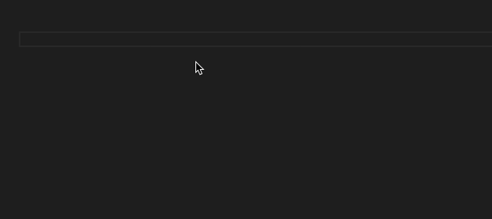
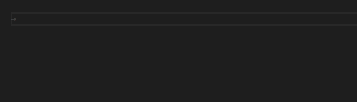
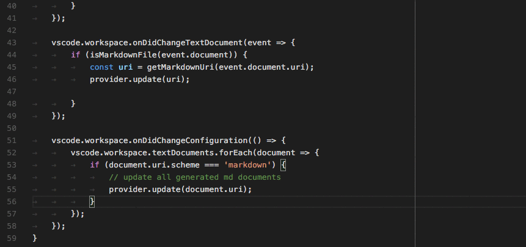
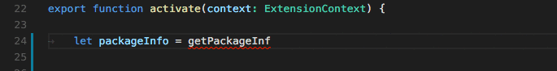
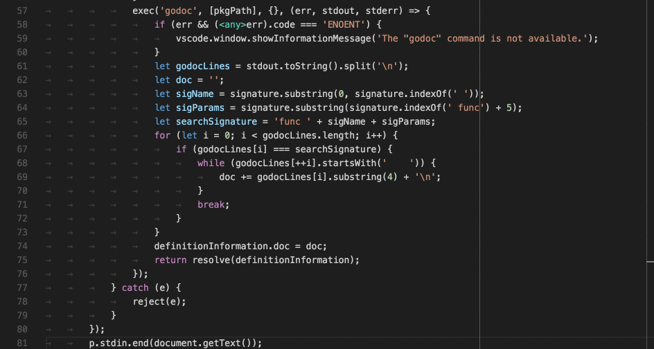
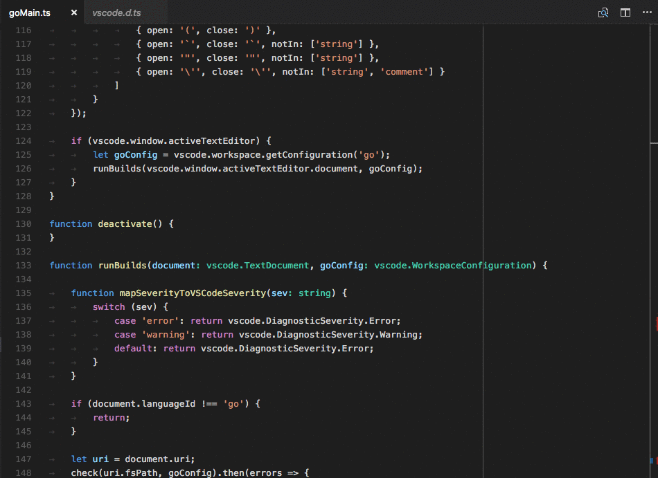
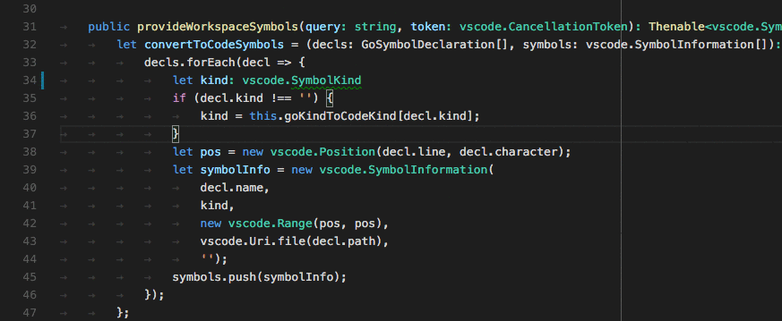
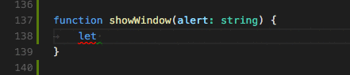

# Language Extension Guidelines

When you hear about a language being supported in VS Code, you usually think first of syntax highlighting, code completion, and if applicable,
debugging support. This is a good start, but language extensions can do a lot more.

With just configuration files, an extension can support syntax highlighting, snippets, and smart bracket matching. For more advanced language features, you need to extend VS Code through its extensibility [API](/docs/extensionAPI/vscode-api.md) or by providing a [language server](/docs/extensions/example-language-server).

A language server is a stand-alone server that speaks the [language server protocol](https://github.com/Microsoft/language-server-protocol/blob/master/protocol.md). You can implement the server in the programming language that is best suited for the task. For example, if there are good libraries written in Python for the language you want to support, you might want to consider implementing your language server in Python. If you choose to implement your language server in JavaScript or TypeScript, you can build on top of the VS Code [npm modules](https://github.com/Microsoft/vscode-languageserver-node).

Besides the implementation language, you have flexibility in deciding which parts of the language server protocol your language server implements. Your language server announces its capabilities in response to the protocol's `initialize` method.

However, the language server architecture is not the only way to provide language features in an extension. You can also implement features directly in your main extension code. In the guidelines below, we show both the **Language Server Protocol** approach (configuration and required events) and also a **Direct Implementation** section showing how to programmatically register specific language feature providers (ex. `registerHoverProvider`).

To make it easier for you to decide what to implement first and what to improve upon later, we show the language features as they appear in VS Code and follow with the classes and methods or language server protocol messages they map to.  Also included is guidance on the **Basic** support required as well as descriptions of **Advanced** implementations.

## Configuration Based Language Support

[Syntax highlighting](/docs/extensionAPI/language-support.md#syntax-highlighting), [snippets](/docs/extensionAPI/language-support.md#source-code-snippets), and [smart bracket matching](/docs/extensionAPI/language-support.md#smart-bracket-matching) can be implemented declaratively with configuration files and don't require writing any extension code.

### Language identifiers

VS Code maps different language configurations and providers to specific programming languages through a language identifier. This is a lowercase string representing the programming language or file type. For example, JavaScript has a language id of `javascript` and Markdown files `markdown`.

## Syntax Highlighting


In order to support syntax highlighting, your extension needs to register a TextMate grammar `.tmLanguage` for its language in its `package.json` file.

```json
"contributes": {
    "languages": [
        {
            "id": "markdown",
            ...
        }
    ],
    "grammars": [
        {
            "language": "markdown",
            "scopeName": "text.html.markdown",
            "path": "./syntaxes/markdown.tmLanguage"
        }
    ], ...
}
```

>**Basic**
>
>Start with a simple grammar that supports colorization of strings, comments, and keywords.

>**Advanced**
>
>Provide a grammar that understands terms and expressions and thus supports colorization of variables and function references etc.

## Source Code Snippets



With code snippets, you can provide useful source code templates with placeholders. You need to register a file that contains the snippets for your language in your extension's `package.json` file. You can learn about VS Code's snippet schema in [Creating Your Own Snippets](/docs/editor/userdefinedsnippets.md#creating-your-own-snippets).

```json
"contributes": {
    "snippets": [
        {
            "language": "javascript",
            "path": "./snippets/javascript.json"
        }, ...
    ], ...
}
```

>**Basic**
>
>Provide snippets with placeholders such as this example for `markdown`:
>
>```json
>"Insert ordered list": {
>    "prefix": "ordered list",
>    "body": [
>        "1. ${first}",
>        "2. ${second}",
>        "3. ${third}",
>        "$0"
>    ],
>    "description": "Insert ordered list"
>}
>```

>**Advanced**
>
>Provide snippets that use explicit tab stops to guide the user and use nested placeholders such as this example for `groovy`:
>
>```json
>"key: \"value\" (Hash Pair)": {
>        "prefix": "key",
>        "body": "${1:key}: ${2:\"${3:value}\"}"
>    }
>```

## Smart Bracket Matching



You can provide a language configuration in your extension's `package.json` file.

```json
"contributes": {
    "languages": [
        {
            "id": "typescript",
            ...
            "configuration": "./language-configuration.json"
        }, ...
    ]
    ...
}
```

>**Basic**
>
>None

>**Advanced**
>
>Here is an example from `TypeScript`:
>
>```json
>{
>    "comments": {
>        "lineComment": "//",
>        "blockComment": [ "/*", "*/" ]
>    },
>    "brackets": [
>        ["{", "}"],
>        ["[", "]"],
>        ["(", ")"],
>        ["<", ">"]
>    ],
>    "autoClosingPairs": [
>        { "open": "{", "close": "}" },
>        { "open": "[", "close": "]" },
>        { "open": "(", "close": ")" },
>        { "open": "'", "close": "'", "notIn": ["string", "comment"] },
>        { "open": "\"", "close": "\"", "notIn": ["string"] },
>        { "open": "`", "close": "`", "notIn": ["string", "comment"] },
>        { "open": "/**", "close": " */", "notIn": ["string"] }
>    ],
>    "surroundingPairs": [
>        ["{", "}"],
>        ["[", "]"],
>        ["(", ")"],
>        ["<", ">"],
>        ["'", "'"],
>        ["\"", "\""],
>        ["`", "`"]
>    ]
>}
>```

## Programmatic Language Support

The rest of the language features require writing extension code to handle requests from VS Code. You can implement your language extension as a standalone server implementing the [language server protocol](https://github.com/Microsoft/language-server-protocol/blob/master/protocol.md) or directly register providers in your extension's `activate` method. Both approaches are shown in two sections called **LANGUAGE SERVER PROTOCOL** and **DIRECT IMPLEMENTATION**.

The language server protocol approach follows the pattern of describing your server's capabilities in the response to the `initialize` request and then handling specific requests based on the user's actions.

The direct implementation approach requires you register your feature provider when your extension is activated, often providing a `DocumentSelector` to identify the programming languages the provider supports.

In the examples below, the providers are being registered for Go language files.

```typescript
const GO_MODE: vscode.DocumentFilter = { language: 'go', scheme: 'file' };
```

## Show Hovers

Hovers show information about the symbol/object that's below the mouse cursor. This is usually the type of the symbol and a description.



#### Language Server Protocol

In the response to the `initialize` method, your language server needs to announce that it provides hovers.

```json
{
    ...
    "capabilities" : {
        "hoverProvider" : "true",
        ...
    }
}
```

In addition, your language server needs to respond to the `textDocument/hover` request.

#### Direct Implementation

```typescript
class GoHoverProvider implements HoverProvider {
    public provideHover(
        document: TextDocument, position: Position, token: CancellationToken):
        Thenable<Hover> {
    ...
    }
}

export function activate(ctx: vscode.ExtensionContext): void {
    ...
    ctx.subscriptions.push(
        vscode.languages.registerHoverProvider(
            GO_MODE, new GoHoverProvider()));
    ...
}
```

>**Basic**
>
>Show type information and include documentation if available.

>**Advanced**
>
>Colorize method signatures in the same style you colorize the code.

## Show Code Completion Proposals

Code completions provide context sensitive suggestions to the user.


#### Language Server Protocol

In the response to the `initialize` method, your language server needs to announce that it provides completions and whether or not it supports the `completionItem\resolve` method to provide additional information for the computed completion items.

```json
{
    ...
    "capabilities" : {
        "completionProvider" : {
            "resolveProvider": "true",
            "triggerCharacters": [ '.' ]
        }
        ...
    }
}
```

#### Direct Implementation

```typescript
class GoCompletionItemProvider implements vscode.CompletionItemProvider {
    public provideCompletionItems(
        document: vscode.TextDocument, position: vscode.Position, token: vscode.CancellationToken):
        Thenable<vscode.CompletionItem[]> {
    ...
    }
}

export function activate(ctx: vscode.ExtensionContext): void {
    ...
    ctx.subscriptions.push(getDisposable());
    ctx.subscriptions.push(
        vscode.languages.registerCompletionItemProvider(
            GO_MODE, new GoCompletionItemProvider(), '.', '\"'));
    ...
}
```

>**Basic**
>
>You don't support resolve providers.

>**Advanced**
>
>You support resolve providers that compute additional information for completion proposal the user selects. This information is displayed along-side the selected item.

## Provide Diagnostics

Diagnostics are a way to indicate issues with the code.


#### Language Server Protocol

Your language server send the `textDocument/publishDiagnostics` message to the language client. The message carries an array of diagnostic items for a resource URI.

**Note**: The client does not ask the server for diagnostics. The server pushes the diagnostic information to the client.

#### Direct Implementation

```typescript
let diagnosticCollection: vscode.DiagnosticCollection;

export function activate(ctx: vscode.ExtensionContext): void {
  ...
  ctx.subscriptions.push(getDisposable());
  diagnosticCollection = vscode.languages.createDiagnosticCollection('go');
  ctx.subscriptions.push(diagnosticCollection);
  ...
}

function onChange() {
  let uri = document.uri;
  check(uri.fsPath, goConfig).then(errors => {
    diagnosticCollection.clear();
    let diagnosticMap: Map<string, vscode.Diagnostic[]> = new Map();
    errors.forEach(error => {
      let canonicalFile = vscode.Uri.file(error.file).toString();
      let range = new vscode.Range(error.line-1, error.startColumn, error.line-1, error.endColumn);
      let diagnostics = diagnosticMap.get(canonicalFile);
      if (!diagnostics) { diagnostics = []; }
      diagnostics.push(new vscode.Diagnostic(range, error.msg, error.severity));
      diagnosticMap.set(canonicalFile, diagnostics);
    });
    diagnosticMap.forEach((diags, file) => {
      diagnosticCollection.set(vscode.Uri.parse(file), diags);
    });
  })
}
```

>**Basic**
>
>Report diagnostics for open editors. Minimally, this needs to happen on every save. Better, diagnostics should be computed based on the un-saved contents of the editor.

>**Advanced**
>
>Report diagnostics not only for the open editors but for all resources in the open folder, no matter whether they have ever been opened in an editor or not.

## Help With Function and Method Signatures

When the user enters a function or method, display information about the function/method that is being called.



#### Language Server Protocol

In the response to the `initialize` method, your language server needs to announce that it provides signature help.

```json
{
    ...
    "capabilities" : {
        "signatureHelpProvider" : {
            "triggerCharacters": [ '(' ]
        }
        ...
    }
}
```

In addition, your language server needs to respond to the `textDocument/signatureHelp` request.

#### Direct Implementation

```typescript
class GoSignatureHelpProvider implements SignatureHelpProvider {
    public provideSignatureHelp(
        document: TextDocument, position: Position, token: CancellationToken):
        Promise<SignatureHelp> {
    ...
    }
}

export function activate(ctx: vscode.ExtensionContext): void {
    ...
    ctx.subscriptions.push(
        vscode.languages.registerSignatureHelpProvider(
            GO_MODE, new GoSignatureHelpProvider(), '(', ','));
    ...
}
```

>**Basic**
>
>Ensure that the signature help contains the documentation of the parameters of the function or method.

>**Advanced**
>
>Nothing additional.

## Show Definitions of a Symbol

Allow the user to see the definition of variables/functions/methods right where the variables/functions/methods are being used.


#### Language Server Protocol

In the response to the `initialize` method, your language server needs to announce that it provides goto-definition locations.

```json
{
    ...
    "capabilities" : {
        "definitionProvider" : "true"
        ...
    }
}
```

In addition, your language server needs to respond to the `textDocument/definition` request.

#### Direct Implementation

```typescript
class GoDefinitionProvider implements vscode.DefinitionProvider {
    public provideDefinition(
        document: vscode.TextDocument, position: vscode.Position, token: vscode.CancellationToken):
        Thenable<vscode.Location> {
    ...
    }
}

export function activate(ctx: vscode.ExtensionContext): void {
    ...
    ctx.subscriptions.push(
        vscode.languages.registerDefinitionProvider(
            GO_MODE, new GoDefinitionProvider()));
    ...
}
```

>**Basic**
>
>If a symbol is ambivalent, you can show multiple definitions.

>**Advanced**
>
>Nothing additional.

## Find All References to a Symbol

Allow the user to see all the source code locations where a certain variable/function/method/symbol is being used.



#### Language Server Protocol

In the response to the `initialize` method, your language server needs to announce that it provides symbol reference locations.

```json
{
    ...
    "capabilities" : {
        "referencesProvider" : "true"
        ...
    }
}
```

In addition, your language server needs to respond to the `textDocument/references` request.

#### Direct Implementation

```typescript
class GoReferenceProvider implements vscode.ReferenceProvider {
    public provideReferences(
        document: vscode.TextDocument, position: vscode.Position,
        options: { includeDeclaration: boolean }, token: vscode.CancellationToken):
        Thenable<vscode.Location[]> {
    ...
    }
}

export function activate(ctx: vscode.ExtensionContext): void {
    ...
    ctx.subscriptions.push(
        vscode.languages.registerReferenceProvider(
            GO_MODE, new GoReferenceProvider()));
    ...
}
```

>**Basic**
>
>Return the location (resource URI and range) for all references.

>**Advanced**
>
>Nothing additional.

## Highlight All Occurrences of a Symbol in a Document

Allow the user to see all occurrences of a symbol in the open editor.


#### Language Server Protocol

In the response to the `initialize` method, your language server needs to announce that it provides symbol document locations.

```json
{
    ...
    "capabilities" : {
        "documentHighlightProvider" : "true"
        ...
    }
}
```

In addition, your language server needs to respond to the `textDocument/documentHighlight` request.

#### Direct Implementation

```typescript
class GoDocumentHighlightProvider implements vscode.DocumentHighlightProvider {
    public provideDocumentHighlights(
        document: vscode.TextDocument, position: vscode.Position, token: vscode.CancellationToken):
        vscode.DocumentHighlight[] | Thenable<vscode.DocumentHighlight[]>;
    ...
    }
}

export function activate(ctx: vscode.ExtensionContext): void {
    ...
    ctx.subscriptions.push(
        vscode.languages.registerDocumentHighlightProvider(
            GO_MODE, new GoDocumentHighlightProvider()));
    ...
}
```

>**Basic**
>
>You return the ranges in the editor's document where the references are being found.

>**Advanced**
>
>Nothing additional.

## Show all Symbol Definitions Within a Document

Allow the user to quickly navigate to any symbol definition in the open editor.



#### Language Server Protocol

In the response to the `initialize` method, your language server needs to announce that it provides symbol document locations.

```json
{
    ...
    "capabilities" : {
        "documentSymbolProvider" : "true"
        ...
    }
}
```

In addition, your language server needs to respond to the `textDocument/documentSymbol` request.

#### Direct Implementation

```typescript
class GoDocumentSymbolProvider implements vscode.DocumentSymbolProvider {
    public provideDocumentSymbols(
        document: vscode.TextDocument, token: vscode.CancellationToken):
        Thenable<vscode.SymbolInformation[]> {
    ...
    }
}

export function activate(ctx: vscode.ExtensionContext): void {
    ...
    ctx.subscriptions.push(
        vscode.languages.registerDocumentSymbolProvider(
            GO_MODE, new GoDocumentSymbolProvider()));
    ...
}
```

>**Basic**
>
>Return all symbols in the document. Define the kinds of symbols such as variables, functions, classes, methods, etc.

>**Advanced**
>
>Nothing additional.

## Show all All Symbol Definitions in Folder

Allow the user to quickly navigate to symbol definitions anywhere in the folder (workspace) opened in VS Code.


#### Language Server Protocol

In the response to the `initialize` method, your language server needs to announce that it provides global symbol locations.

```json
{
    ...
    "capabilities" : {
        "workspaceSymbolProvider" : "true"
        ...
    }
}
```

In addition, your language server needs to respond to the `workspace/symbol` request.

#### Direct Implementation

```typescript
class GoWorkspaceSymbolProvider implements vscode.WorkspaceSymbolProvider {
    public provideWorkspaceSymbols(
        query: string, token: vscode.CancellationToken):
        Thenable<vscode.SymbolInformation[]> {
    ...
    }
}

export function activate(ctx: vscode.ExtensionContext): void {
    ...
    ctx.subscriptions.push(
        vscode.languages.registerWorkspaceSymbolProvider(
            new GoWorkspaceSymbolProvider()));
    ...
}
```

>**Basic**
>
>Return all symbols define by the source code within the open folder. Define the kinds of symbols such as variables, functions, classes, methods, etc.

>**Advanced**
>
>Nothing additional.

## Possible Actions on Errors or Warnings

Provide the user with possible corrective actions right next to an error or warning. If actions are available, a light bulb appears next to the error or warning. When the user clicks the light bulb, a list of available Code Actions is presented.



#### Language Server Protocol

In the response to the `initialize` method, your language server needs to announce that it provides Code Actions.

```json
{
    ...
    "capabilities" : {
        "codeActionProvider" : "true"
        ...
    }
}
```

In addition, your language server needs to respond to the `textDocument/codeAction` request.

#### Direct Implementation

```typescript
class GoCodeActionProvider implements vscode.CodeActionProvider {
    public provideCodeActions(
        document: vscode.TextDocument, range: vscode.Range,
        context: vscode.CodeActionContext, token: vscode.CancellationToken):
        Thenable<vscode.Command[]> {
    ...
    }
}

export function activate(ctx: vscode.ExtensionContext): void {
    ...
    ctx.subscriptions.push(
        vscode.languages.registerCodeActionsProvider(
            GO_MODE, new GoCodeActionProvider()));
    ...
}
```

>**Basic**
>
>Provide Code Actions for error/warning correcting actions.

>**Advanced**
>
>In addition, provide source code manipulation actions such as refactoring. For example, `Extract Method`.

## CodeLens - Show Actionable Context Information Within Source Code

Provide the user with actionable, contextual information that is displayed interspersed with the source code.


#### Language Server Protocol

In the response to the `initialize` method, your language server needs to announce that it provides CodeLens results and whether it supports the `codeLens\resolve` method to bind the CodeLens to its command.

```json
{
    ...
    "capabilities" : {
        "codeLensProvider" : {
            "resolveProvider": "true"
        }
        ...
    }
}
```

In addition, your language server needs to respond to the `textDocument/codeLens` request.

#### Direct Implementation

```typescript
class GoRCodeLensProvider implements vscode.CodeLensProvider {
    public provideCodeLenses(document: TextDocument, token: CancellationToken):
        CodeLens[] | Thenable<CodeLens[]> {
    ...
    }

    public resolveCodeLens?(codeLens: CodeLens, token: CancellationToken):
         CodeLens | Thenable<CodeLens> {
    ...
    }
}

export function activate(ctx: vscode.ExtensionContext): void {
    ...
    ctx.subscriptions.push(
        vscode.languages.registerCodeLensProvider(
            GO_MODE, new GoCodeLensProvider()));
    ...
}
```

>**Basic**
>
>Define the CodeLens results that are available for a document.

>**Advanced**
>
>Bind the CodeLens results to a command by responding to `codeLens/resolve`.

## Rename Symbols

Allow the user to rename a symbol and update all references to the symbol.


#### Language Server Protocol

In the response to the `initialize` method, your language server needs to announce that it provides for renaming.

```json
{
    ...
    "capabilities" : {
        "renameProvider" : "true"
        ...
    }
}
```

In addition, your language server needs to respond to the `textDocument/rename` request.

#### Direct Implementation

```typescript
class GoRenameProvider implements vscode.RenameProvider {
    public provideRenameEdits(
        document: vscode.TextDocument, position: vscode.Position,
        newName: string, token: vscode.CancellationToken):
        Thenable<vscode.WorkspaceEdit> {
    ...
    }
}

export function activate(ctx: vscode.ExtensionContext): void {
    ...
    ctx.subscriptions.push(
        vscode.languages.registerRenameProvider(
            GO_MODE, new GoRenameProvider()));
    ...
}
```

>**Basic**
>
>Don't provide rename support.

>**Advanced**
>
>Return the list of all workspace edits that need to be performed, for example all edits across all files that contain references to the symbol.

## Format Source Code in an Editor

Provide the user with support for formatting whole documents.


#### Language Server Protocol

In the response to the `initialize` method, your language server needs to announce that it provides document formatting.

```json
{
    ...
    "capabilities" : {
        "documentFormattingProvider" : "true"
        ...
    }
}
```

In addition, your language server needs to respond to the `textDocument/formatting` request.

#### Direct Implementation

```typescript
class GoDocumentFormatter implements vscode.DocumentFormattingEditProvider {
    public formatDocument(document: vscode.TextDocument):
        Thenable<vscode.TextEdit[]> {
    ...
    }
}

export function activate(ctx: vscode.ExtensionContext): void {
    ...
    ctx.subscriptions.push(
        vscode.languages.registerDocumentFormattingEditProvider(
            GO_MODE, new GoDocumentFormatter()));
    ...
}
```

>**Basic**
>
>Don't provide formatting support.

>**Advanced**
>
>You should always return the smallest possible text edits that result in the source code being formatted. This is crucial to ensure that markers such as diagnostic results are adjusted correctly and are not lost.

## Format the Selected Lines in an Editor

Provide the user with support for formatting a selected range of lines in a document.


#### Language Server Protocol

In the response to the `initialize` method, your language server needs to announce that it provides formatting support for ranges of lines.

```json
{
    ...
    "capabilities" : {
        "documentRangeFormattingProvider" : "true"
        ...
    }
}
```

In addition, your language server needs to respond to the `textDocument/rangeFormatting` request.

#### Direct Implementation

```typescript
class GoDocumentRangeFormatter implements vscode.DocumentRangeFormattingEditProvider{
    public provideDocumentRangeFormattingEdits(
        document: vscode.TextDocument, range: vscode.Range,
        options: vscode.FormattingOptions, token: vscode.CancellationToken):
        Thenable<vscode.TextEdit[]>;
    ...
    }
}

export function activate(ctx: vscode.ExtensionContext): void {
    ...
    ctx.subscriptions.push(
        vscode.languages.registerDocumentRangeFormattingEditProvider(
            GO_MODE, new GoDocumentRangeFormatter()));
    ...
}
```

>**Basic**
>
>Don't provide formatting support.

>**Advanced**
>
>You should always return the smallest possible text edits that result in the source code being formatted. This is crucial to ensure that markers such as diagnostic results are adjusted corrected and are not lost.

## Incrementally Format Code as the User Types

Provide the user with support for formatting text as they type.

**Note**: The user [setting](/docs/getstarted/settings.md) `editor.formatOnType` controls whether source code gets formatted or not as the user types.



#### Language Server Protocol

In the response to the `initialize` method, your language server needs to announce that it provides formatting as the user types. It also needs to tell the client on which characters formatting should be triggered. `moreTriggerCharacters` is optional.

```json
{
    ...
    "capabilities" : {
        "documentOnTypeFormattingProvider" : {
            "firstTriggerCharacter": "}",
            "moreTriggerCharacter": [";", ","]
        }
        ...
    }
}
```

In addition, your language server needs to respond to the `textDocument/onTypeFormatting` request.

#### Direct Implementation

```typescript
class GoOnTypingFormatter implements vscode.OnTypeFormattingEditProvider{
    public provideOnTypeFormattingEdits(
        document: vscode.TextDocument, position: vscode.Position,
        ch: string, options: vscode.FormattingOptions, token: vscode.CancellationToken):
        Thenable<vscode.TextEdit[]>;
    ...
    }
}

export function activate(ctx: vscode.ExtensionContext): void {
    ...
    ctx.subscriptions.push(
        vscode.languages.registerOnTypeFormattingEditProvider(
            GO_MODE, new GoOnTypingFormatter()));
    ...
}
```

>**Basic**
>
>Don't provide formatting support.

>**Advanced**
>
>You should always return the smallest possible text edits that result in the source code being formatted. This is crucial to ensure that markers such as diagnostic results are adjusted corrected and are not lost.


