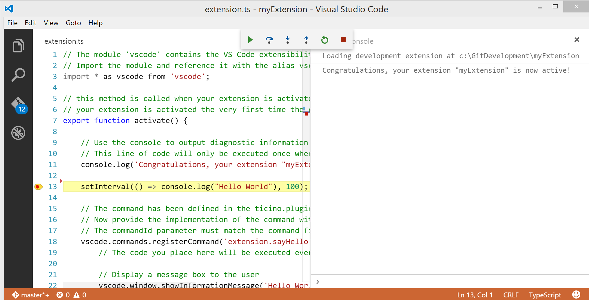

# Running and Debugging Extensions

This topic explains how to run and debug Visual Studio Code extensions, both extensions that you created or those you installed from the VS Code [Marketplace](https://marketplace.visualstudio.com/VSCode).

### General debugging topics

If you are looking for general information on debugging in VS Code or installing additional debuggers, try these topics:

* [Debugging in VS Code](/docs/editor/debugging.md) - Learn about VS Code's support for debugging, including the built-in Node.js debugger.
* [Debugger Extensions](https://code.visualstudio.com/docs/editor/debugging.md#debugger-extensions) - Install other language debuggers through extensions to support languages such Python, C++, and C#.
* [Extension Marketplace](https://code.visualstudio.com/docs/editor/extension-gallery) - The VS Code Marketplace has thousands of useful extensions you can install for free to increase your productivity.

### Extension authors

For information about creating your own extension to integrate a debugger into VS Code, see these topics:

* [Example - Debuggers](/docs/extensions/example-debuggers.md) - This tutorial explains the [VS Code Debug Protocol](https://github.com/Microsoft/vscode-debugadapter-node) through a [Mock Debug Adaptor](https://github.com/Microsoft/vscode-mock-debug) example.
* [Debugging API](/docs/extensionAPI/api-debugging.md) - A detailed reference on the VS Code Debug Protocol.

## Troubleshooting extensions

This topic will first start with general troubleshooting of extensions and then move on to running and debugging your own extensions.

### Developer Tools console

If an extension you installed isn't working correctly, a good first step is to look at the **Developer Tools** console. Hopefully the extension author added instructive logging when they developed their extension. VS Code is running on Electron using web technology so you get the power of the Chrome **Developer Tools** within VS Code.

To open the **Developer Tools** console, use the **Help** > **Toggle Developer Tools** command (Windows/Linux: `Ctrl+Shift+I`, macOS: `Cmd+Shift+I`) and then select the **Console** tab. Try exercising the extension functionality and check the console output. You should see `console.log` messages from the extension and the VS Code Extension Host as well as details of any thrown exceptions.


>**Tip for extension authors**: Help out your users by providing helpful logging when you create your extension. The more information you give users, the more likely they will be able to solve dependency and configuration problems on their own. Good logging will also help you more quickly resolve real issues.

### Extension README

Extensions may have additional dependencies like standalone linters or compilers or custom configuration files in order to run correctly. The extension's README, displayed in the **Extensions** view **Details** pane, include details on configuration and use of the extension. Go to the **Extensions** view (`kb(workbench.view.extensions)`), select the extension under **INSTALLED** section, and look at the **Details** tab.


You can also click the extension name in the upper banner and you'll go to the extension's Marketplace page where you can find a link to the extension's GitHub repository under **Resources** which may have more documentation.

## Creating your own extension

You can use VS Code to develop an extension for VS Code and VS Code provides several tools that simplify extension development:

* Yeoman generators to scaffold an extension
* IntelliSense, hover, and code navigation for the extension API
* Compiling TypeScript (when implementing an extension in TypeScript)
* Running and debugging an extension
* Publishing an extension

We suggest you start your extension by scaffolding out the basic files. You can use the `yo code` Yeoman generator to do this and we cover the details in the [extension generator](/docs/extensions/yocode.md) topic.  The generator will ensure everything is set up so you have a great development experience.

> **Note**: The following sections assume you used the `yo code` Yeoman extension generator to create an extension project with the appropriate `launch.json` and `task.json`.

## Running and Debugging your extension

You can easily run your extension under the debugger by pressing `F5`. This opens a new VS Code window with your extension loaded. Output from your extension shows up in the `Debug Console`. You can set break points, step through your code, and inspect variables either in the `Debug` view or the `Debug Console`.



Depending on your extension, you may need more specific instruction on configuring debugging. There are extension walkthroughs which have additional details for debug adapter and language service extensions:

* [Example - Language Server](/docs/extensions/example-language-server.md) - Learn how to implement a language server extension.
* [Example - Debuggers](/docs/extensions/example-debuggers.md) - Integrate a debugger through the VS Code Debug Protocol.

## Compiling TypeScript

If you are writing your extension in TypeScript then your code must first be compiled to JavaScript.

The TypeScript compilation is setup as follows in the generated extension:

* A `tsconfig.json` defines the compile options for the TypeScript compiler. Read more about it at the [TypeScript wiki](https://www.typescriptlang.org/docs/handbook/tsconfig-json.html) or in our [TypeScript Language Section](/docs/languages/typescript.md#tsconfigjson).
* A TypeScript compiler with the proper version is included inside the node_modules folder.
* The API definition is included in `node_modules/vscode`.

The TypeScript compilation is triggered before running your extension. This is done with the `preLaunchTask` attribute defined in the
`.vscode/launch.json` file which declares a task to be executed before starting the debugging session. The task is defined inside the `.vscode/tasks.json` file.

> **Note:** The TypeScript compiler is started in watch mode, so that it compiles the files as you make changes.

## Launching your extension

Your extension is launched in a new window with the title `Extension Development Host`. This window runs VS Code or more
precisely the `Extension Host` with your extension under development.

You can accomplish the same from the command line using the `extensionDevelopmentPath` option. This option tells VS Code in what
other locations it should look for extensions, for example:

>`code --extensionDevelopmentPath=_my_extension_folder`.

Once the Extension Host is launched, VS Code attaches the debugger to it and starts the debug session.

This is what happens when pressing `F5`:

 1. `.vscode/launch.json` instructs to first run a task named `npm`.
 2. `.vscode/tasks.json` defines the task `npm` as a shell command to `npm run compile`.
 3. `package.json` defines the script `compile` as `tsc -watch -p ./`
 4. This eventually invokes the TypeScript compiler included in node_modules, which generates `out/src/extension.js` and `out/src/extension.js.map`.
 5. Once the TypeScript compilation task is finished, the `code --extensionDevelopmentPath=${workspaceFolder}` process is spawned.
 6. The second instance of VS Code is launched in a special **Extension Host** mode and it searches for an extension at `${workspaceFolder}`.

## Changing and reloading your extension

Since the TypeScript compiler is run in watch mode, the TypeScript files are automatically compiled as you make changes. You can observe
the compilation progress on the left side of the VS Code Status Bar. On the Status Bar you can also see the error and warning counts of a
compilation. When the compilation is complete with no errors, you must reload the **Extension Development Host** so that it picks up
your changes. You have two options to do this:

* Click on the Debug view **Restart** action to relaunch the **Extension Development Host** window.
* Press `kbstyle(Ctrl+R)` (Mac: `kbstyle(Cmd+R)`) in the Extension Development Host window.

## Profiling your extension

You can profile your extension using the Chrome DevTools Memory and CPU profiler.

Do the following:

1. Start VS Code from the command line the with `--inspect-extensions=<port>`-flag, for example `code --inspect-extensions=9333`.
2. In VS Code, from the **Command Palette** (`kb(workbench.action.showCommands)`), select **Developer: Toggle Developer Tools**, hit `Enter`.
3. Select the **Console** tab and find a message that starts with `"Debugger listening on port 9333"` and that ends with a `chrome-devtools` link.
4. Open that link in a Chrome browser for dedicated DevTools for the extension host.
5. Use the Memory and CPU profiler to understand how memory and compute resources are being used.


## Next Steps

* [Testing your Extension](/docs/extensions/testing-extensions.md) - Learn how to write unit and integration tests for your extension
* [Publishing Tool](/docs/extensions/publish-extension.md) - Publish your extension with the vsce command line tool.
* [Extension Manifest file](/docs/extensionAPI/extension-manifest.md) - VS Code extension manifest file reference
* [Extension API](/docs/extensionAPI/overview.md) - Learn about the VS Code extensibility APIs

## Common Questions

**Q: How can I use API from my extension that was introduced in a newer release of VS Code?**

**A:** If your extension is using an API that was introduced in a newer release of VS Code, you have to declare this dependency in the
`engines` field of the `package.json` file of the extension.

Here are the steps:

* Set the minimal version of VS Code that your extension requires in the `engine` field of the `package.json`.
* Make sure your devDependency for the `vscode` module is at least `0.11.0`.
* Add a `postinstall` script to your `package.json` like this:

```json
"scripts": {
    "postinstall": "node ./node_modules/vscode/bin/install"
}
```

* Type `npm install` from the root of your extension.
* The `vscode` module will download the appropriate version of `vscode.d.ts` based on the `engine` field you declared.
* Go back to VS Code and see how the API for the specific version you chose appears in IntelliSense and validation.
