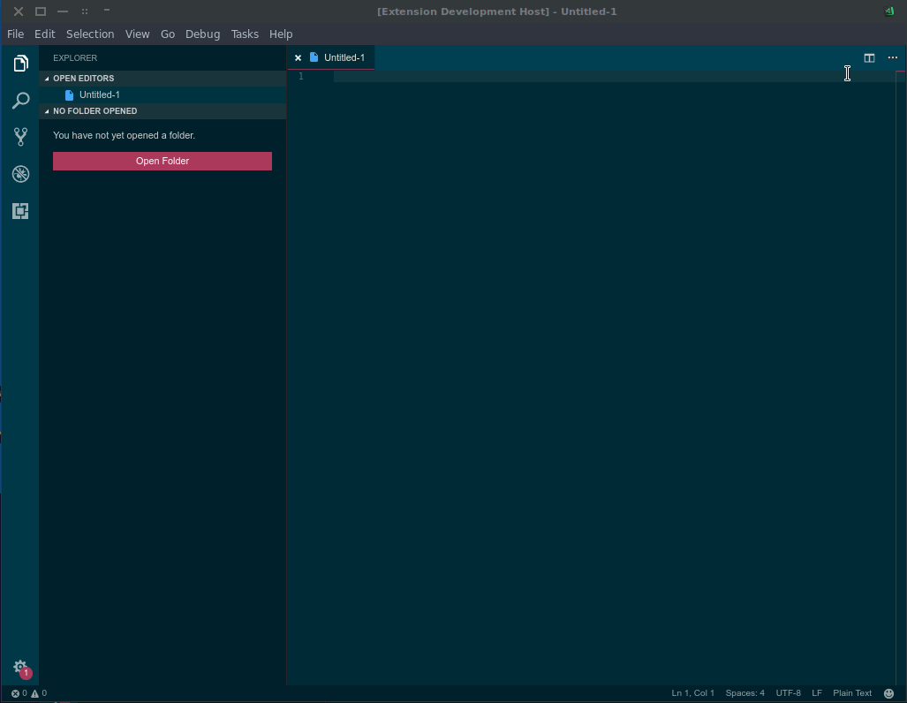
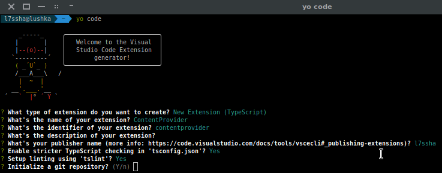

# Example - Content Provider

This end to end tutorial how to display html document in VS Code. We'll create a Content Provider which displays a desired html document and is invocable from command.

There is some demo of what we are doing.



> **Tip:** Similar code you can find on [official samples repository](https://github.com/Microsoft/vscode-extension-samples/tree/master/contentprovider-sample). My example you can find [here](https://github.com/l7ssha/example-content-provider).

## Overview

This example has three sections which will take you through a set of related concepts:

1. [Creating Content Provider](/docs/extensions/example-content-provider.md#create-content-provider)
2. [Creating command to interact with Provider](/docs/extensions/example-content-provider.md#interact-with-provider)

First make sure you have the latest VS Code extension generator installed then run it:

```bash
npm install -g yo generator-code
yo code
```

This will open up the extension generator - we will base this example on the TypeScript `New Extension` option. For now, fill in the fields the same way you see them completed in the image below (using 'ContentProvider' as the extension name and your own name as the publisher).



You can now open VS Code as described in the generator output:

```bash
cd ContentProvider
code .
```

## Run the extension

Before we go on, we can run the extension to make sure everything works as expected by pressing `kb(workbench.action.debug.start)`. As you saw in the previous "Hello World" walkthrough, VS Code opens another window (the **[Extension Development Host]** window) in which your extension will be loaded. You should find the "Hello World" command in the Command Palette (press `kb(workbench.action.showCommands)`) and when you select it, you will see an information box at the top of the window saying "Hello World".

## Create Content Provider

For now you can delete all code from `export function activate(..)`. We'll replace it later. At the end of file create new class (call it as you want). Class have to implement `vscode.TextDocumentContentProvider`. VS Code should for you generate overrides.

In this example we are just loading plain html document to variable and then returns this variable. You can use many templates engines to create dynamic contents.

Some examples of using template engines:
* [DisMPD Extension - Mustache](https://github.com/l7ssha/DisMPD/blob/master/src/DismpdProvider.ts)
* [Spell Checker by Jason-Rev - Pug](https://github.com/Jason-Rev/vscode-spell-checker/tree/master/client/src/infoViewer)

If you want to update content of provider you can create method which will do this or expose certain properties and watch for changes.

```javascript
export class ExampleContentProvider implements vscode.TextDocumentContentProvider {
    private _onDidChange = new vscode.EventEmitter<vscode.Uri>();   // Event emitter which invokes document updates

    // Get global path to resources folder. Here we are combining actual directory with relative path to resources from this folder
    private resources = path.join(__dirname, '../resources');
    private html: string = "";  // html document buffer

    constructor() {
        // Load html text to string
        fs.readFile(path.join(this.resources, "index.html"), (_: NodeJS.ErrnoException, data: Buffer) => {
            this.html = data.toString();
        });
    }

    get onDidChange(): vscode.Event<vscode.Uri> {
        return this._onDidChange.event;
    }

    // You can invoke this method from external place to update provider
    public update(uri: vscode.Uri) {
        this._onDidChange.fire(uri);
    }

    // Main method which returns string to display in window.
    // In this example we just loading file in constructor to variable, and returning it here.
    provideTextDocumentContent(_: vscode.Uri): vscode.ProviderResult<string> {
        return this.html;
    }
}
```
For customizing your document you can use CSS. Just embed your css styles in html document. Background, font, font colors (and many more) are provided by theme, so you dont have to specify it, but you can if you want.

> **Tip:** If you want to have css in separated file you have to  use full path. Relative path don't work.

## Interact with Provider

As we create a provider, now we must code some access to it. At the beginning we have to specify an url to our page. `example` you can replace with you desired name. This uri is used only in extension logic, you can't see it in editor. Next instantiate a new object of our content provider.

And finally register command which will invoke our provider. In this command we are invoking other commands which grabs content at `uri` (`uri` is handled by our provider) and displays in window. Here we also listening for error. If error occurred - display error message.

```javascript
export function activate(context: vscode.ExtensionContext) {
    let uri = vscode.Uri.parse('example://authority/example');  // Our window uri. `example` is your desired name.

    let provider = new ExampleContentProvider();    // Instantiate our provider object

    // Register provider. First argument should be same as in our uri
    let registration = vscode.workspace.registerTextDocumentContentProvider('example', provider);

    // We have to register command to show window. This command invokes other command that gets string which returned content provider
    // And displays it in window.
    // Remember to add your command to `package.json`
    let openProvider = vscode.commands.registerCommand('exampleprovider.open', () => {
        // Here we are discarding event if command is successful. We need an error message when opening is unsuccessful.
        return vscode.commands.executeCommand('vscode.previewHtml', uri, vscode.ViewColumn.Two, 'Example Content Provider').then(_ => {}, _ => {
            vscode.window.showErrorMessage('Cant open!');
        });
    });

    // Push registrations
    context.subscriptions.push(registration, openProvider);
}
```
At the end we need add some code into `package.json`.

Replace `"activationEvent"` with your command or as I - with dot:

```json
"activationEvents": [
    "*"
],
```

Next `"contributes"` section. Here we are have to register command and our content provider.

```json
"contributes": {
    "commands": [
        {
            "command": "exampleprovider.open",
            "title": "Open Content Provider"
        }
    ],
    "menus": {
        "editor/title": [
            {
                "command": "exampleprovider.open",
                "when": "*"
            }
        ]
    }
},
```

## Automatic updates

If you want to update your content automatic when other window content changes look at [`activationEvents` article](/docs/extensionAPI/activation-events.md).

## Installing your Extension Locally

So far, the extension you have written only runs in a special instance of VS Code, the Extension Development Host instance. To make your extension available to all VS Code instances, copy the extension folder contents to a new folder under [your `.vscode/extensions` folder](/docs/extensions/yocode.md#your-extensions-folder).

## Publishing your Extension

Read about how to [Share an Extension](/docs/extensions/publish-extension.md).

## Next Steps

Read on to find out about:

* [Extension Generator](/docs/extensions/yocode.md) - Learn about other options in the Yo Code extension generator.
* [Extension API](/docs/extensionAPI/overview.md) - Get an overview of the Extension API.
* [Publishing Tool](/docs/extensions/publish-extension.md) - Learn how to publish an extension to the public Marketplace.
* [Editor API](/docs/extensionAPI/vscode-api.md#window) - Learn more about Text Documents, Text Editors and editing text.
* [Additional Extension Examples](/docs/extensions/samples.md) - Take a look at our list of example extension projects.
