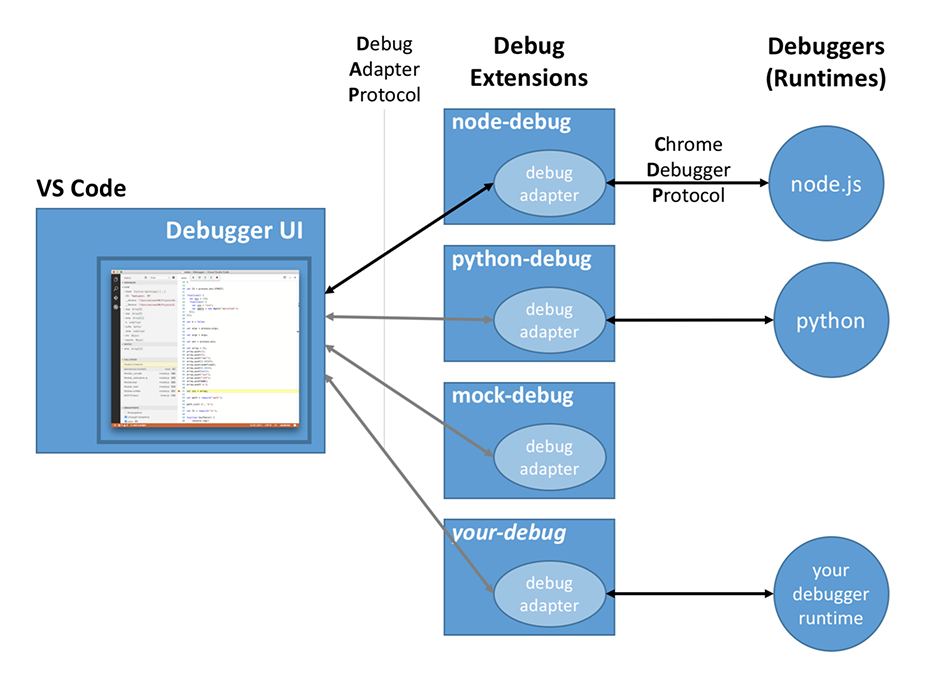
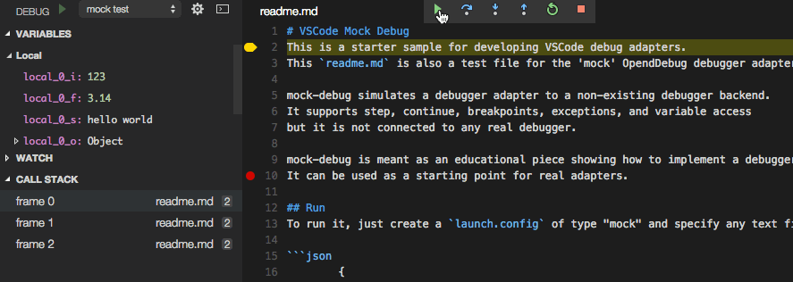

# Example - Debuggers

Since Visual Studio Code implements a generic (language agnostic) debug UI, it cannot talk to real debuggers but instead talks
to so-called *debug adapters* through an abstract wire protocol. We call this protocol the *VS Code Debug Protocol* (or CDP for short).
A debug adapter is a standalone executable that typically talks to a real debugger and translates between the abstract CDP and the concrete protocol of the debugger.



In order to avoid problems with local firewalls, VS Code talks to the adapter through stdin/stdout instead of using a more sophisticated communication mechanism.

Every debug adapter defines a debug `type` which is referenced from a VS Code launch configuration.
When a debug session is started, VS Code looks up the debug adapter based on the debug type and launches the executable as a separate process.
When the debug session ends, the adapter is stopped.

Debug adapters are part of VS Code's extensible architecture: they are contributed as extensions. What sets them apart from other extensions is the fact that the debug adapter code is not running in the extension host, but as a separate standalone program. The reasons for this are twofold: first, it makes it possible to implement the adapter in the language most suitable for the given debugger or runtime. Second, a standalone program can more easily run in elevated mode if the need arises.

Visual Studio Code ships with a debugger extension for Node.js. More debugger extensions are available from the [VS Code Marketplace](https://marketplace.visualstudio.com/vscode/Debuggers) or you can create a debugger extension yourself.

This document will show you how to create a new debugger extension.

## Installing a Sample Debug Extension

Since creating a debug adapter from scratch is a bit heavy for this tutorial, we will start with a simple debug adapter which we have created as an educational debug adapter 'starter kit'. It is called 'mock-debug' because it does not talk to a real debugger but it 'mocks' one. So mock-debug simulates a debugger adapter and supports step, continue, breakpoints, exceptions, and variable access but it is not connected to any real debugger.

Before delving into the development setup for mock-debug, let's first install a [pre-built version](https://marketplace.visualstudio.com/items/andreweinand.mock-debug)
from the VS Code Marketplace and play with it:

* use the **Command Palette** `Extensions: Install Extension` to find and install the mock-debug extension,
* restart VS Code.

To try it:

* In VS Code, create a test project with a new "program" file `readme.md` and enter several lines of arbitrary text.
* Switch to the Debug view and press the gear icon.
* VS Code will let you select a debug environment (select "Mock Debugger") and creates a default launch configuration for it.

If you now start the launch configuration, you can 'step through' the target file, set and hit breakpoints, and run into exceptions (if the word `exception` appears in a line).



## Development Setup for mock-debug

Now let's get the source for mock-debug and start development on it within VS Code:

```
git clone https://github.com/Microsoft/vscode-mock-debug.git
cd vscode-mock-debug
npm install
```

Open the project folder `vscode-mock-debug` in VS Code.

What's in the package?

* the mock-debug implementation lives in `src/mockDebug.ts`. There you find the request handlers for the various requests of the CDP.
* `package.json`, the manifest for the mock-debug extension:
  - lists the contributions of the mock-debug extension.
  - the `compile` and `watch` scripts are used to transpile the TypeScript source into the `out` folder and watch for subsequent source modifications.
  - the two dependencies `vscode-debugprotocol` and `vscode-debugadapter` are NPM modules that simplify the development of node-based debug adapters.

Now build and launch the debug adapter by selecting the `Launch Extension` configuration and hitting `F5`.
Initially this will do a full transpile of the TypeScript sources into the `out` folder.
After the full build, a 'watcher task' is started that incrementally transpiles any changes you make.

After building, a new VS Code window shows up where the mock-debug extension runs in debug mode.
You can now open your test project with the `readme.md` file from above and 'debug' it.

This approach for launching the debug extension like any other extension works well for **running** the extension but not for **debugging** it. The problem is that the debug adapter runs as a separate process outside of the extension host.
The solution for this problem is to run the debug adapter in server mode:

* run the `mock-debug server` launch configuration to start the debug adapter in server mode (it listens on port 4711)
* set a breakpoint at the beginning of method `launchRequest(...)` in file `mockDebug.ts`
* open the test project with the `readme.md` in an additional VS Code window
* in that project add a top-level `debugServer` attribute like this:

```json
{
    "version": "0.2.0",

    "debugServer": 4711,

    "configurations": [{
        "name": "mock test",
        "request": "launch",
        "type": "mock",
        "program": "${workspaceRoot}/readme.md",
        "stopOnEntry": true
    }]
}
```

* if you now launch this debug configuration, VS Code does not launch a debug adapter as a separate process but directly connects to local port 4711.
* you should hit the breakpoint in `launchRequest`.

With this setup you can now easily edit, transpile, and debug the mock debug and turn it into the debug adapter you want to create.


## Implementing the VS Code Debug Protocol

A debug adapter has to implement the *VS Code Debug Protocol*. You can find more details [here](/docs/extensionAPI/api-debugging.md).


## Anatomy of the Debug Adapter package.json

Let's have a closer look at the debug adapter contribution of an VS Code extension.
Like every VS Code extension, a debug adapter extension has a `package.json` file that declares the fundamental properties **name**, **publisher**,
and **version** of the extension. Use the **categories** field to make the extension easier to find in the VS Code Extension Marketplace.

```json
{
	"name": "mock-debug",
	"version": "0.10.18",
	"publisher": "vscode",
	"description": "Starter extension for developing debug adapters for VS Code.",
	"engines": { "vscode": "0.10.x" },
	"categories": ["Debuggers"],

	"contributes": {
		"debuggers": [{
			"type": "mock",
			"label": "Mock Debugger",

			"enableBreakpointsFor": { "languageIds": ["markdown"] },

			"program": "./out/mockDebug.js",
			"runtime": "node",

			"configurationAttributes": {
				"launch": {
					"required": ["program"],
					"properties": {
						"program": {
							"type": "string",
							"description": "Workspace relative path to a text file.",
							"default": "${workspaceRoot}/readme.md"
						},
						"stopOnEntry": {
							"type": "boolean",
							"description": "Automatically stop after launch.",
							"default": true
						}
					}
				}
			},

			"initialConfigurations": [
				{
					"name": "Mock-Debug",
					"type": "mock",
					"request": "launch",
					"program": "readme.md",
					"stopOnEntry": true
				}
			]
		}]
	}
}
```

More interesting is the specific **debuggers** section under **contributes**.

Here one debug adapter is introduced under a (unique) debug **type**.
The user can reference this type in his launch configurations.
The optional attribute **label** can be used to give the debug type a nicer name when showing it in the UI.

With the attribute **enableBreakpointsFor** you can list the language file types for which setting breakpoints will be enabled.

Since a debug adapter is a standalone application, a path to that application is specified under the **program** attribute.
In order to make the extension self-contained the application must live inside the extension folder.
By convention we keep this applications inside a folder named `out` or `bin` but you are free to use a different name.

Since VS Code runs on different platforms, we have to make sure that the debug adapter program supports the different platforms as well.
For this we have the following options:

1. If the program is implemented in a platform independent way, e.g. as program that runs on a runtime that is available on all supported platforms, you can specify this runtime via the **runtime** attribute. As of today, VS Code supports 'node' and 'mono' runtimes. Our mock-debug adapter from above uses this approach.

2. If your debug-adapter implementation needs different executables on different platforms, the **program** attribute can be qualified for specific platforms like this:

	```json
	"debuggers": [{
		"type": "gdb",
		"windows": {
			"program": "./bin/gdbDebug.exe",
		},
		"osx": {
			"program": "./bin/gdbDebug.sh",
		},
		"linux": {
			"program": "./bin/gdbDebug.sh",
		}
	}]
	```

3. A combination of both approaches is possible too. The following example is from the mono-debug adapter which is implemented as a mono application that needs a runtime on OS X and Linux:

	```json
	"debuggers": [{
		"type": "mono",
		"program": "./bin/monoDebug.exe",
		"osx": {
			"runtime": "mono"
		},
		"linux": {
			"runtime": "mono"
		}
	}]
	```

**configurationAttributes** represent attributes that are specific for your debugger and are used for validation and suggestion of values in 'launch.json'.

**initialConfigurations** is used when VS Code generates the 'launch.json'. This should be a default launch configuration that covers configuration attributes of your adapter.


## Publishing your Debug Adapter

Once you have created your debug adapter you can publish it to the Marketplace:

* update the attributes in the `package.json` to reflect the naming and purpose of your debug adapter.
* upload to the Marketplace as described in [Share an Extension](/docs/tools/vscecli.md) section.

## Common Questions

Nothing yet

