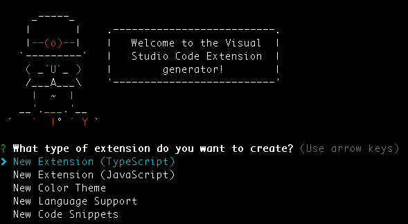
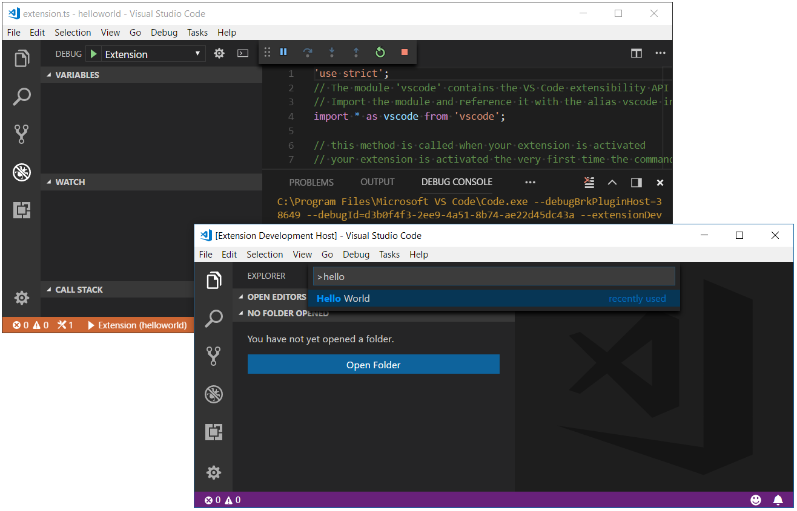
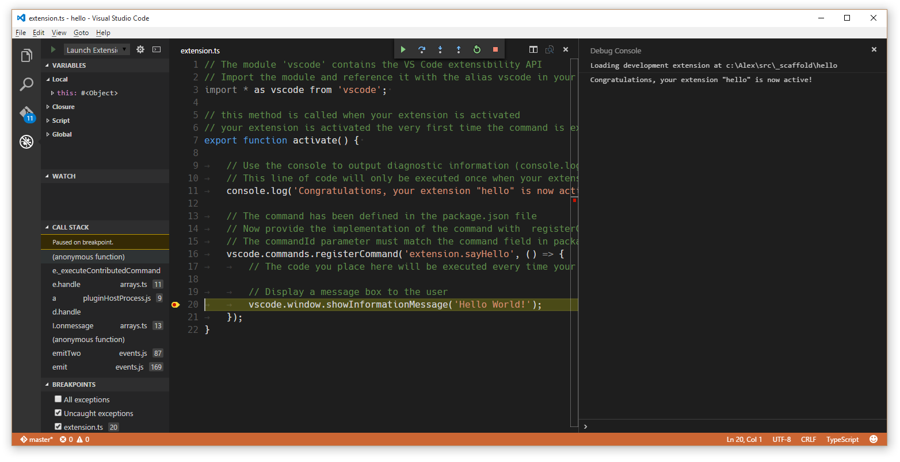
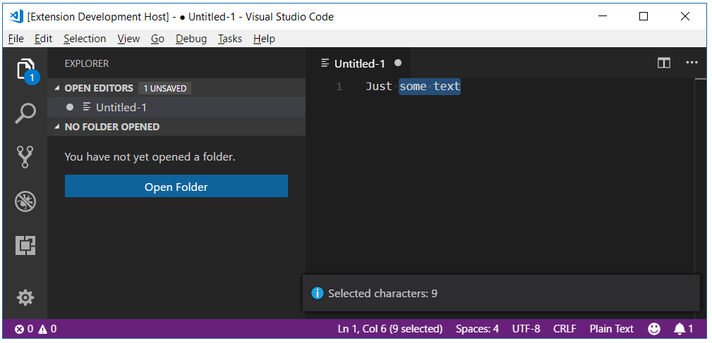

# Example - Hello World

## Your First Extension

This document will guide you through creating your first VS Code extension ("Hello World") and explain the basic VS Code extensibility concepts.

In this walkthrough, you'll add a new command to VS Code which will display a simple "Hello World" message.  Later in the walkthrough, you'll interact with the VS Code editor and query for the user's currently selected text.

## Prerequisites

You need [Node.js](https://nodejs.org/en/) installed and available in your `$PATH`. Node.js includes [npm](https://www.npmjs.com/), the Node.js Package Manager, which will be used to install the extension generator.

## Generate a New Extension

The simplest way to add your own functionality to VS Code is through adding a command. A command registers a callback function which can be invoked from the **Command Palette** or with a key binding.

We have written a Yeoman generator to help get you started. Install Yeoman and the [Yeoman VS Code Extension generator](/docs/extensions/yocode.md) and scaffold a new extension:

```sh
npm install -g yo generator-code
yo code
```

For the hello world extension, you can either create a **TypeScript** extension or a **JavaScript** one. For this example, we pick a **TypeScript** extension.



## Running your Extension

* Launch VS Code, choose `File` > `Open Folder` and pick the folder that you generated.
* Press `kb(workbench.action.debug.start)` or click on the `Debug` icon and click `Start`.
* A new instance of VS Code will start in a special mode (`Extension Development Host`) and **this new instance is now aware of your extension**.
* Press `kb(workbench.action.showCommands)` and run the command named `Hello World`.
* Congratulations! You've just created and executed your first VS Code command!



## The Structure of an Extension

After running, the generated extension should have the following structure:

```
.
├── .gitignore
├── .vscode                     // VS Code integration
│   ├── launch.json
│   ├── settings.json
│   └── tasks.json
├── .vscodeignore               // files ignored when publishing extension
├── README.md
├── src
│   └── extension.ts            // the source of the extension entry point
├── test                        // test folder
│   ├── extension.test.ts       // extension.test.js, in case of JavaScript extension
│   └── index.ts                // index.js, in case of JavaScript extension
├── node_modules
│   ├── vscode                  // include vscode type definition file for extension development
│   └── typescript              // compiler for typescript (TypeScript only)
├── out                         // compilation output (TypeScript only)
│   ├── extension.js            // the extension entry point
│   ├── extension.js.map
│   └── test
│       ├── extension.test.js
│       ├── extension.test.js.map
│       ├── index.js
│       └── index.js.map
├── package.json                // extension's manifest
├── tsconfig.json               // jsconfig.json, in case of JavaScript extension
└── vsc-extension-quickstart.md // extension development quick start
```

Let's go through the purpose of all these files and explain what they do:

### The extension manifest: `package.json`

* Please read the [`package.json` extension manifest reference](/docs/extensionAPI/extension-manifest.md)
* More information on [`package.json` contribution points](/docs/extensionAPI/extension-points.md)
* Each VS Code extension must have a `package.json` file that describes it and its capabilities.
* VS Code reads this file during start-up and reacts to each `contributes` section immediately.

#### Example TypeScript extension manifest

```json
{
    "name": "myFirstExtension",
    "description": "",
    "version": "0.0.1",
    "publisher": "",
    "engines": {
        "vscode": "^1.5.0"
    },
    "categories": [
        "Other"
    ],
    "activationEvents": [
        "onCommand:extension.sayHello"
    ],
    "main": "./out/extension",
    "contributes": {
        "commands": [{
            "command": "extension.sayHello",
            "title": "Hello World"
        }]
    },
    "scripts": {
        "vscode:prepublish": "tsc -p ./",
        "compile": "tsc -watch -p ./",
        "postinstall": "node ./node_modules/vscode/bin/install",
        "test": "node ./node_modules/vscode/bin/test"
    },
    "devDependencies": {
       "typescript": "^2.0.3",
        "vscode": "^1.5.0",
        "mocha": "^2.3.3",
        "@types/node": "^6.0.40",
        "@types/mocha": "^2.2.32"
   }
}
```

> **Note:** A JavaScript extension doesn't require the `scripts` field as no compilation is needed.

* This specific package.json describes an extension that:
 * *contributes* an entry to the Command Palette (`kb(workbench.action.showCommands)`) with the label `"Hello world"` that will invoke a command `"extension.sayHello"`.
 * requests to get loaded (*activationEvents*) when the command `"extension.sayHello"` is invoked.
 * has its *main* JavaScript code in a file called `"./out/extension.js"`.

> **Note:** VS Code **does not** load the code of an extension eagerly at start-up. An extension must describe, through the [`activationEvents`](/docs/extensionAPI/activation-events.md) property under what conditions it should get activated (loaded).

### Generated Code

The generated extension's code is in `extension.ts` (or `extension.js` in case of a JavaScript extension):

```javascript
// The module 'vscode' contains the VS Code extensibility API
// Import the module and reference it with the alias vscode in your code below
import * as vscode from 'vscode';

// this method is called when your extension is activated
// your extension is activated the very first time the command is executed
export function activate(context: vscode.ExtensionContext) {

    // Use the console to output diagnostic information (console.log) and errors (console.error)
    // This line of code will only be executed once when your extension is activated
    console.log('Congratulations, your extension "my-first-extension" is now active!');

    // The command has been defined in the package.json file
    // Now provide the implementation of the command with  registerCommand
    // The commandId parameter must match the command field in package.json
    var disposable = vscode.commands.registerCommand('extension.sayHello', () => {
        // The code you place here will be executed every time your command is executed

        // Display a message box to the user
        vscode.window.showInformationMessage('Hello World!');
    });

    context.subscriptions.push(disposable);
}
```

* Each extension should export from its main file a function named `activate()`, which VS Code will invoke **only once** when any of the `activationEvents` described in the `package.json` file occur.
* If an extension makes use of OS resources (e.g. spawns processes), the extension can export from its main file a function named `deactivate()` where it can do clean-up work and VS Code will invoke that function on shutdown.
* This specific extension imports the `vscode` API and then registers a command, associating a function to be called when the command `"extension.sayHello"` gets invoked. The command's implementation displays a "Hello world" message in VS Code.

> **Note:** The `contributes` section of the `package.json` adds an entry to the Command Palette.  The code in extension.ts/.js defines the implementation of `"extension.sayHello"`.

> **Note:** For TypeScript extensions, the generated file `out/extension.js` will be loaded at runtime and executed by VS Code.

### Miscellaneous files

* `.vscode/launch.json` defines launching VS Code in the Extension Development mode. It also points with `preLaunchTask` to a task defined in `.vscode/tasks.json` that runs the TypeScript compiler.
* `.vscode/settings.json` by default excludes the `out` folder.  You can modify which file types you want to hide.
* `.gitignore` - Tells Git version control which patterns to ignore.
* [`.vscodeignore`](/docs/extensions/publish-extension.md#advanced-usage) - Tells the packaging tool which files to ignore when publishing the extension.
* `README.md` - README file describing your extension for VS Code users.
* `vsc-extension-quickstart.md` - A Quick Start guide for you.
* `test/extension.test.ts` - you can put your extension unit tests in here and run your tests against the VS Code API (see [Testing Your Extension](/docs/extensions/testing-extensions.md))

## Extension Activation

Now that the roles of the files included in the extension are clarified, here is how your extension gets activated:

* The extension development instance discovers the extension and reads its `package.json` file.
* Later when you press `kb(workbench.action.showCommands)`:
 * The registered commands are displayed in the Command Palette.
 * In this list there is now an entry `"Hello world"` that is defined in the `package.json`.
* When selecting the `"Hello world"` command:
 * The command `"extension.sayHello"` is invoked:
   * An activation event `"onCommand:extension.sayHello"` is created.
   * All extensions listing this activation event in their `activationEvents` are activated.
     * The file at `./out/extension.js` gets loaded in the JavaScript VM.
     * VS Code looks for an exported function `activate` and calls it.
     * The command `"extension.sayHello"` is registered and its implementation is now defined.
 * The command `"extension.sayHello"` implementation function is invoked.
 * The command implementation displays the "Hello World" message.

## Debugging your Extension

Set a breakpoint, for example inside the registered command, and run the `"Hello world"` command in the Extension Development VS Code instance.



> **Note:** For TypeScript extensions, even though VS Code loads and executes `out/extension.js`, you are actually able to debug the original TypeScript code due to the generated source map `out/extension.js.map` and VS Code's debugger support for source maps.

> **Tip:** The Debug Console will show all the messages you log to the console.

To learn more about the extension [development environment](/docs/extensions/debugging-extensions.md).

## A Simple Change

In `extension.ts` (or `extension.js`, in a JavaScript extension), try replacing the `extension.sayHello` command implementation to show the number of characters selected in the editor:

```javascript
var editor = vscode.window.activeTextEditor;
if (!editor) {
    return; // No open text editor
}

var selection = editor.selection;
var text = editor.document.getText(selection);

// Display a message box to the user
vscode.window.showInformationMessage('Selected characters: ' + text.length);
```

> **Tip:** Once you make changes to the extension source code, you need to restart the **Extension Development Host** instance of VS Code. You can do that by using `kbstyle(Ctrl+R)` (macOS: `kbstyle(Cmd+R)`) in the **Extension Development Host** instance or by clicking the **Restart** button at the top of your primary VS Code instance.

Create a file (**File** > **New File**), type some text and select it. When you run the **Hello World** command, you should now see the count of selected characters.



## Installing your Extension Locally

So far, the extension you have written only runs in a special instance of VS Code, the Extension Development instance. To get your extension running in all instances of VS Code, you need to copy it to a new folder under your local extensions folder:

* Windows: `%USERPROFILE%\.vscode\extensions`
* Mac/Linux: `$HOME/.vscode/extensions`

## Publishing your Extension

Read about how to [Share an Extension](/docs/extensions/publish-extension.md).

## Next Steps

In this walkthrough, we've seen a very simple extension. For a more detailed example, see the [Word Count Example](/docs/extensions/example-word-count.md) which shows how to target a specific language (Markdown) and listen to the editor's document changed events.

If you'd like to read more generally about the extension APIs, try these topics:

* [Extension API Overview](/docs/extensionAPI/overview.md) - Learn about the full VS Code extensibility model.
* [API Principles and Patterns](/docs/extensionAPI/patterns-and-principles.md) - VS Code extensibility is based on several guiding principles and patterns.
* [Contribution Points](/docs/extensionAPI/extension-points.md) - Details about the various VS Code contribution points.
* [Activation Events](/docs/extensionAPI/activation-events.md) - VS Code activation events reference
* [Additional Extension Examples](/docs/extensions/samples.md) - Take a look at our list of example extension projects.
