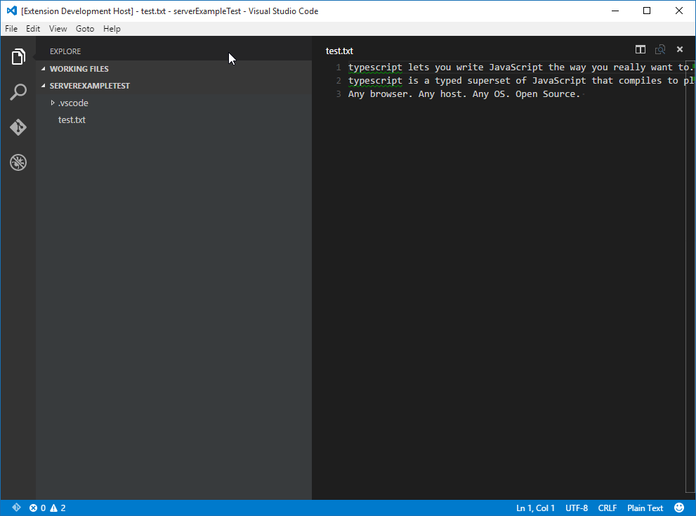
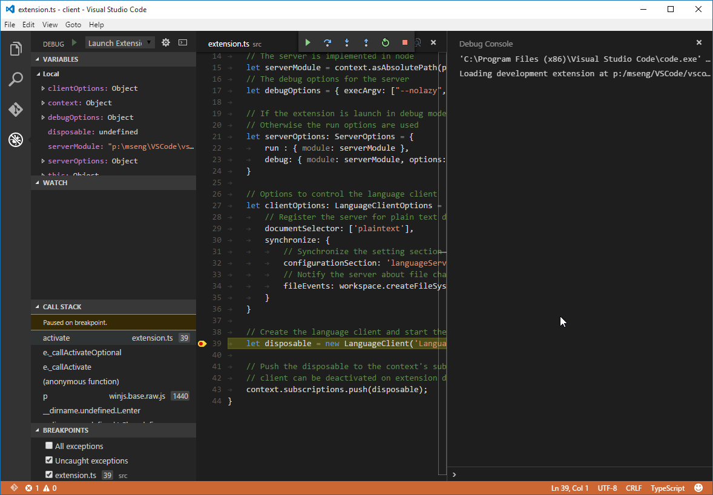
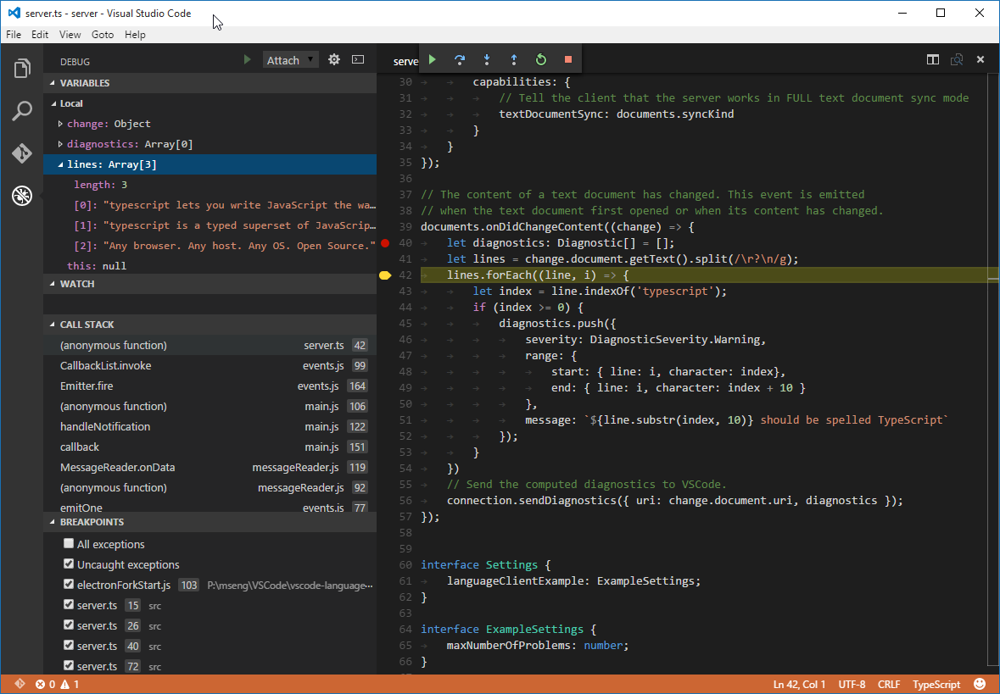
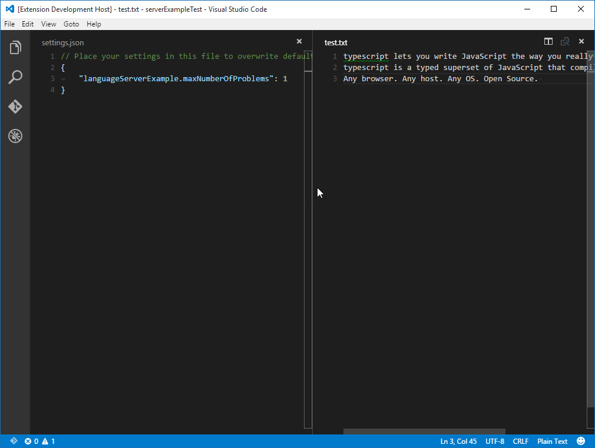
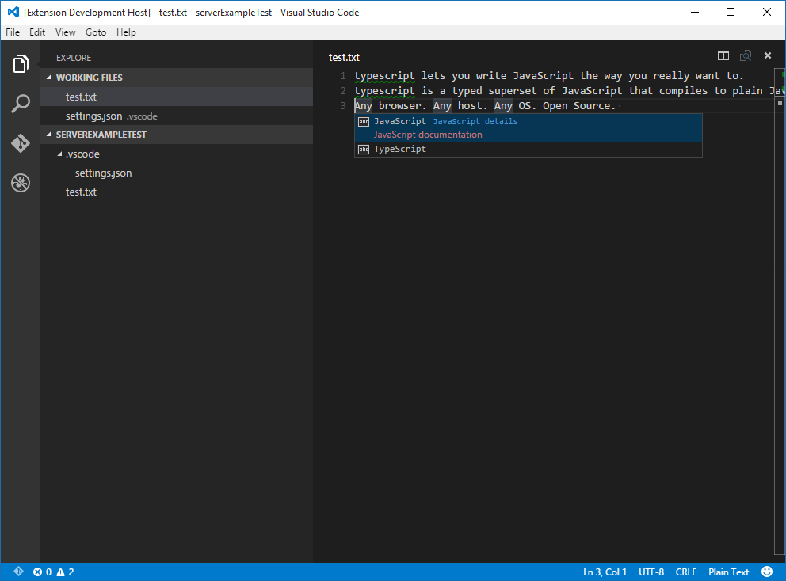

# Example - Language Server

Language servers allow you to add your own validation logic to files open in VS Code. Typically you just validate programming languages. However validating other file types is useful as well. A language server could, for example, check files for inappropriate language.

In general, validating programming language can be expensive. Especially when validation requires parsing multiple files and building up abstract syntax trees. To avoid that performance cost, language servers in VS Code are executed in a separate process. This architecture also makes it possible that language servers can be written in other languages besides TypeScript/JavaScript and that they can support expensive additional language features like code completion or `Find All References`.

The remaining document assumes that you are familiar with normal extension development for VS Code.

## Implement your own Language Server

Language servers can be implemented in any language. However, right now VS Code only provides libraries for Node.js. Additional libraries will follow in the future. A good starting point for a language server implementation in Node.js is the example repository [Language Server Node Example](https://github.com/Microsoft/vscode-languageserver-node-example.git). 

Clone the repository and then do:

```bash
> cd client
> npm install
> code .
> cd ../server
> npm install
> code .
```

## Explaining the 'Client'

The client is actually a normal VS Code extension. It contains a `package.json` file in the root of the workspace folder. There are three interesting sections of that file.  

First look the `activationEvents`:

```json
"activationEvents": [
    "onLanguage:plaintext"
]
```

This section tells VS Code to activate the extension as soon as a plain text file is opened (e.g. a file with the extension `.txt`). 

Next look at the `configuration` section:

```json
"configuration": {
    "type": "object",
    "title": "Example configuration",
    "properties": {
        "languageServerExample.maxNumberOfProblems": {
            "type": "number",
            "default": 100,
            "description": "Controls the maximum number of problems produced by the server."
        }
    }
}
```

This section contributes `configuration` settings to VS Code. The example will explain how these settings are sent over to the language server on startup and on every change of the settings. 

The last part adds a dependency to the `vscode-languageclient` library:

```json
"dependencies": {
    "vscode-languageclient": "^1.4.2"
}
```

As mentioned, the client is implemented as a normal VS Code extension.

Below is the content of the corresponding extension.ts file:

```typescript
/* --------------------------------------------------------------------------------------------
 * Copyright (c) Microsoft Corporation. All rights reserved.
 * Licensed under the MIT License. See License.txt in the project root for license information.
 * ------------------------------------------------------------------------------------------ */
'use strict';

import * as path from 'path';

import { workspace, Disposable, ExtensionContext } from 'vscode';
import { LanguageClient, LanguageClientOptions, SettingMonitor, ServerOptions } from 'vscode-languageclient';

export function activate(context: ExtensionContext) {

    // The server is implemented in node
    let serverModule = context.asAbsolutePath(path.join('server', 'server.js'));
    // The debug options for the server
    let debugOptions = { execArgv: ["--nolazy", "--debug=6004"] };

    // If the extension is launch in debug mode the debug server options are use
    // Otherwise the run options are used
    let serverOptions: ServerOptions = {
        run : { module: serverModule, transport: TransportKind.ipc },
        debug: { module: serverModule, transport: TransportKind.ipc, options: debugOptions }
    }

    // Options to control the language client
    let clientOptions: LanguageClientOptions = {
        // Register the server for plain text documents
        documentSelector: ['plaintext'],
        synchronize: {
            // Synchronize the setting section 'languageServerExample' to the server
            configurationSection: 'languageServerExample',
            // Notify the server about file changes to '.clientrc files contain in the workspace
            fileEvents: workspace.createFileSystemWatcher('**/.clientrc')
        }
    }

    // Create the language client and start the client.
    let disposable = new LanguageClient('Language Server Example', serverOptions, clientOptions).start();

    // Push the disposable to the context's subscriptions so that the 
    // client can be deactivated on extension deactivation
    context.subscriptions.push(disposable);
}
```

## Explaining the 'Server'

In the example, the server is also implemented in TypeScript and executed using Node.js. Since VS Code already ships with a Node.js runtime, there is no need to provide your own, unless you have very specific requirements for the runtime. 

The interesting section in the server's package.json file is:

```json
"dependencies": {
    "vscode-languageserver": "^1.4.1"
}
```

This pulls in the vscode-languageserver library.

Below is a server implementation that uses the provided simple text document manager which synchronizes text documents by always sending the file's full content from VS Code to the server.

```typescript
/* --------------------------------------------------------------------------------------------
 * Copyright (c) Microsoft Corporation. All rights reserved.
 * Licensed under the MIT License. See License.txt in the project root for license information.
 * ------------------------------------------------------------------------------------------ */
'use strict';

import {
    createConnection, IConnection,
    TextDocuments, ITextDocument, Diagnostic,
    InitializeParams, InitializeResult
} from 'vscode-languageserver';

// Create a connection for the server. The connection uses Node's IPC as a transport
let connection: IConnection = createConnection(new IPCMessageReader(process), new IPCMessageWriter(process));

// Create a simple text document manager. The text document manager
// supports full document sync only
let documents: TextDocuments = new TextDocuments();
// Make the text document manager listen on the connection
// for open, change and close text document events
documents.listen(connection);

// After the server has started the client sends an initilize request. The server receives
// in the passed params the rootPath of the workspace plus the client capabilites. 
let workspaceRoot: string;
connection.onInitialize((params): InitializeResult => {
    workspaceRoot = params.rootPath;
    return {
        capabilities: {
            // Tell the client that the server works in FULL text document sync mode
            textDocumentSync: documents.syncKind
        }
    }
});

// Listen on the connection
connection.listen();
```

## Adding a Simple Validation

To add document validation to the server, we simply add a listener to the text document manager that gets called whenever the content of a text document changes. It is then up to the server to decide when the best time is to validate a document. In the example implementation, the server validates the plain text document and flags all occurrences of `typescript` with a message to spell it `TypeScript`. The corresponding code snippet looks like this:

```typescript
// The content of a text document has changed. This event is emitted
// when the text document first opened or when its content has changed.
documents.onDidChangeContent((change) => {
    let diagnostics: Diagnostic[] = [];
    let lines = change.document.getText().split(/\r?\n/g);
    lines.forEach((line, i) => {
        let index = line.indexOf('typescript');
        if (index >= 0) {
            diagnostics.push({
                severity: DiagnosticSeverity.Warning,
                range: {
                    start: { line: i, character: index},
                    end: { line: i, character: index + 10 }
                },
                message: `${line.substr(index, 10)} should be spelled TypeScript`,
                source: 'ex'
            });
        }
    })
    // Send the computed diagnostics to VS Code.
    connection.sendDiagnostics({ uri: change.document.uri, diagnostics });
});
```

### Diagnostics Tips and Tricks!

* If the start and end positions are the same, VS Code will squiggle the word at that position.
* If you want to squiggle until the end of the line, then set the character of the end position to Number.MAX_VALUE.

To test the language server do the following:

* Go to the VS Code instance containing the server code (see above) and press `kb(workbench.action.tasks.build)` to start the build task. The task compiles the server code and installs (e.g. copies) it into the extension folder.
* Now go back to the VS Code instance with the extension (client) and press `kb(workbench.action.debug.start)` to launch an additional `Extension Development Host` instance of VS Code that executes the extension code.
* Create a test.txt file in the root folder and paste the following content:

```plaintext
typescript lets you write JavaScript the way you really want to.
typescript is a typed superset of JavaScript that compiles to plain JavaScript.
Any browser. Any host. Any OS. Open Source.
```

The `Extension Development Host` instance will then look like this:



## Debugging both Client and Server

Debugging the client code is as easy as debugging a normal extension. Simply set a breakpoint in the VS Code instance that contains the client code and debug the extension by pressing `kb(workbench.action.debug.start)`. For a detailed description about launching and debugging an extension see [Running and Debugging Your Extension](/docs/extensions/debugging-extensions.md).



Since the server is started by the `LanguageClient` running in the extension (client), we need to attach a debugger to the running server. To do so, switch to the VS Code instance containing the server code and press `kb(workbench.action.debug.start)`. This will attach the debugger to the server. Use the normal Debug View to interact with the running server.



## Using Configuration Settings in the Server

When writing the client part of the extension we already defined a setting to control the maximum numbers of problems reported. We also instructed the `LanguageClient` to sync these settings to the server using the syncronization configuration

```typescript
synchronize: {
    // Synchronize the setting section 'languageClientExample' to the server
    configurationSection: 'languageServerExample',
    // Notify the server about file changes to '.clientrc files contain in the workspace
    fileEvents: workspace.createFileSystemWatcher('**/.clientrc')
}
```

The only thing we need to do now is to listen to configuration changes on the server side and if a settings changes revalidate the open text documents. To be able to reuse the validate logic of the document change event handling we extract the code into a `validateTextDocument` function and modify the code to honor a `maxNumberOfProblems` variable:

```typescript
function validateTextDocument(textDocument: ITextDocument): void {
    let diagnostics: Diagnostic[] = [];
    let lines = textDocument.getText().split(/\r?\n/g);
    let problems = 0;
    for (var i = 0; i < lines.length && problems < maxNumberOfProblems; i++) {
        let line = lines[i];
        let index = line.indexOf('typescript');
        if (index >= 0) {
            problems++;
            diagnostics.push({
                severity: DiagnosticSeverity.Warning,
                range: {
                    start: { line: i, character: index},
                    end: { line: i, character: index + 10 }
                },
                message: `${line.substr(index, 10)} should be spelled TypeScript`
            });
        }
    }
    // Send the computed diagnostics to VS Code.
    connection.sendDiagnostics({ uri: textDocument.uri, diagnostics });
}
```

The handling of the configuration change is done by adding a notification handler for configuration changes to the connection. The corresponding code looks like this:

```typescript
// The settings interface describe the server relevant settings part
interface Settings {
    languageServerExample: ExampleSettings;
}

// These are the example settings we defined in the client's package.json
// file
interface ExampleSettings {
    maxNumberOfProblems: number;
}

// hold the maxNumberOfProblems setting
let maxNumberOfProblems: number;
// The settings have changed. Is send on server activation
// as well.
connection.onDidChangeConfiguration((change) => {
    let settings = <Settings>change.settings;
    maxNumberOfProblems = settings.languageServerExample.maxNumberOfProblems || 100;
    // Revalidate any open text documents
    documents.all().forEach(validateTextDocument);
});
```

Starting the client again and changing the setting to maximum report 1 problem results in the following validation:



## Adding additional Language Features

The first interesting feature a language server usually implements is validation of documents. In that sense even a linter counts as a language server and in VS Code linters are usually implemented as language servers (see [eslint](https://github.com/Microsoft/vscode-eslint) and [jshint](https://github.com/Microsoft/vscode-jshint) for examples). But there is more to language servers. They can provide code complete, find all references or goto definition. The example code below adds code completion to the server. It simply proposes the two words 'TypeScript' and 'JavaScript'.

```typescript
// This handler provides the initial list of the completion items.
connection.onCompletion((textDocumentPosition: TextDocumentIdentifier): CompletionItem[] => {
    // The pass parameter contains the position of the text document in 
    // which code complete got requested. For the example we ignore this
    // info and always provide the same completion items.
    return [
        {
            label: 'TypeScript',
            kind: CompletionItemKind.Text,
            data: 1
        },
        {
            label: 'JavaScript',
            kind: CompletionItemKind.Text,
            data: 2
        }
    ]
});

// This handler resolve additional information for the item selected in
// the completion list.
connection.onCompletionResolve((item: CompletionItem): CompletionItem => {
    if (item.data === 1) {
        item.detail = 'TypeScript details',
        item.documentation = 'TypeScript documentation'
    } else if (item.data === 2) {
        item.detail = 'JavaScript details',
        item.documentation = 'JavaScript documentation'
    }
    return item;
});
```

The `data` fields is used to uniquely identify a completion item in the resolve handler. The data property is transparent for the protocol. Since the underlying message passing protocol is JSON based the data field should only hold data that is serializable to and from JSON.

All that is missing is to tell VS Code that the server support code completion requests. To do so, flag the corresponding capability in the intialize handler:

```typescript
connection.onInitialize((params): InitializeResult => {
    ...
    return {
        capabilities: {
            ...
            // Tell the client that the server support code complete
            completionProvider: {
                resolveProvider: true
            }
        }
    }
});
```

The screen shot below shows the completed code running on a plain text file:



## Additional Language Server features

The following language features are currently support in a language server besides code complete:

* _Document Highlights_: highlights all 'equal' symbols in a text document.
* _Hover_: provides hover information for a symbol selected in a text document.
* _Signature Help_: provides signature help for a symbol selected in a text document.
* _Goto Definition_: provides goto definition support for a symbol selected in a text document.
* _Find References_: finds all project-wide references for a symbol selected in a text document.
* _List Document Symbols_: lists all symbols defined in a text document.
* _List Workspace Symbols_: lists all project-wide symbols.
* _Code Actions_: compute commands for a given text document and range.
* _CodeLens_: compute CodeLens statistics for a given text document.
* _Document Formatting_: this includes formatting of whole documents, document ranges and formatting on type.
* _Rename_: project-wide rename of a symbol.

## Incremental Text Document Synchronization

The example uses the simple text document manager provided by the `vscode-languageserver` module to synchronize documents between VS Code and the language server. This has two drawbacks:

* lots of data transfer since the whole content of a text document is sent to the server repeatedly.
* if an existing language library is used, such libraries usually support incremental document updates to avoid unnecessary parsing and abstract syntax tree creation.

The protocol therefore supports incremental document synchronization as well. To make use of incremental document synchronization a server needs to install three notification handlers:

* _onDidOpenTextDocument_: is called when a text document got opened in VS Code.
* _onDidChangeTextDocument_: is called when the content of a text document changes in VS Code.
* _onDidCloseTextDocument_: is called when a text document got closed in VS Code.

Below a code snippet that illustrates how to hook these notification handlers on a connection and how to return the right capability on initialize: 

```typescript
connection.onInitialize((params): InitializeResult => {
    ...
    return {
        capabilities: {
            // Enable incremental document sync
            textDocumentSync: TextDocumentSyncKind.Incremental,
            ...
        }
    }
});

connection.onDidOpenTextDocument((params) => {
    // A text document got opened in VS Code.
    // params.uri uniquely identifies the document. For documents store on disk this is a file URI.
    // params.text the initial full content of the document.
});

connection.onDidChangeTextDocument((params) => {
    // The content of a text document did change in VS Code.
    // params.uri uniquely identifies the document.
    // params.contentChanges describe the content changes to the document.
});

connection.onDidCloseTextDocument((params) => {
    // A text document got closed in VS Code.
    // params.uri uniquely identifies the document.
});
```

## Next Steps

To learn more about VS Code extensibility model, try these topic:

* [vscode API Reference](/docs/extensionAPI/vscode-api.md) - Learn about deep language integration with VS Code language services.

## Common Questions

**Q: When I try to attach to the server, I get "cannot connect to runtime process (timeout after 5000ms)"?**

**A:** You will see this timeout error if the server isn't running when you try to attach the debugger.  The client starts the language server so make sure you have started the client in order to have a running server.


