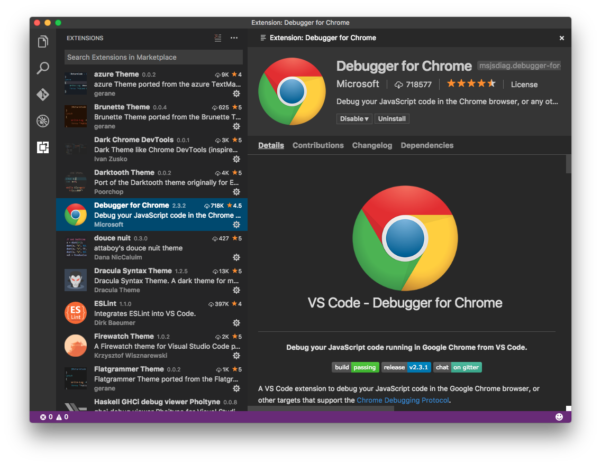

# Installing Extensions

## Install from the Marketplace

The easiest way to install an extension is to use the Extensions View inside VS Code to query and install any extension that is published to the Visual Studio Marketplace.



You can query for extensions, sort the results, read each one's details, check out what contributions they bring into VS Code, and read its Changelog.

Installing extensions from the Marketplace comes with the added benefit of getting update notifications when their authors publish new versions.

## Side Loading

VS Code looks for extensions under your extensions folder `.vscode/extensions`. Depending on your platform it is located in the following folders:

* **Windows** `%USERPROFILE%\.vscode\extensions`
* **Mac** `~/.vscode/extensions`
* **Linux** `~/.vscode/extensions`

If you want to load your extension or customization each time VS Code runs, copy your project to a new folder under `.vscode/extensions`. For example: `~/.vscode/extensions/myextension`.

### Install from a VSIX

You can manually install an VS Code extension packaged in a `.vsix` file.  Simply install using the VS Code `--install-extension` command line switch providing the path to the `.vsix` file.

```
code --install-extension myextension.vsix
```

The extension will be installed under your user `.vscode/extensions` folder. You may provide the `--install-extension` multiple times on the command line to install multiple extensions at once.

You can also install a `.vsix` with the **Install from VSIX...** command in the Extensions View command dropdown.

### Sharing Privately with Others

If you want to share your extension or customization with others privately, you can simply send them a copy of the output from the generator and ask them to add it under their `.vscode/extensions` folder. Alternatively, package your extension using the [vsce publishing tool](/docs/tools/vscecli.md) by running `vsce package` and send them the `.vsix` file.

## Next Steps

* [Extension Marketplace](/docs/editor/extension-gallery.md) - Learn more about VS Code's public extension Marketplace.
* [Publishing Extensions](/docs/extensions/publish-extension.md) - Put your extension on the Marketplace.
* [Publishing Tool Reference](/docs/tools/vscecli.md) - Learn how to package and publish your extensions.