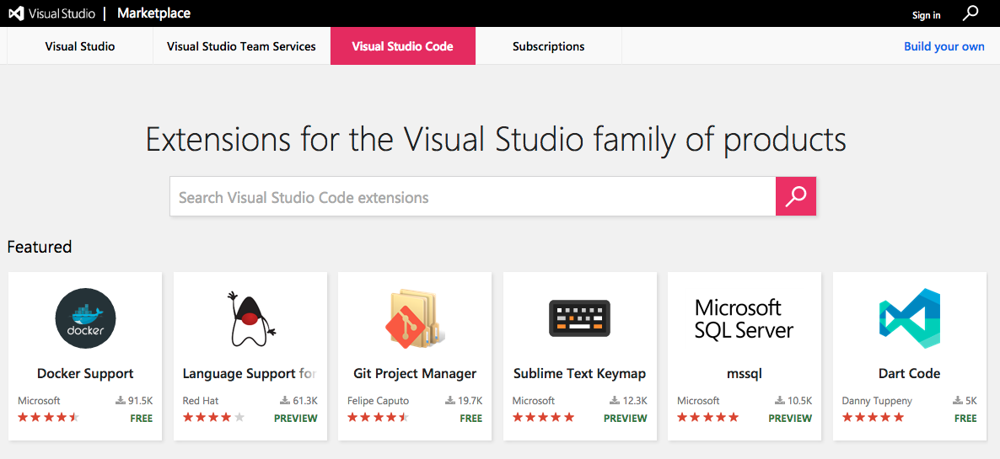

# Publishing Extensions

## Visual Studio Code Compatiblity

When authoring an extension, you will need to describe what is the extension's compatibility to Visual Studio Code itself. This can done via the `engine.vscode` field inside `package.json`:

```json
{
  "engines": {
    "vscode": "^1.8.0"
  }
}
```

A value of `1.8.0` means that your extension is compatible only with VS Code `1.8.0`. A value of `^1.8.0` means that your extension is compatible with VS Code `1.8.0` and
onwards, including `1.8.1`, `1.9.0`, etc.

You can use the `engine.vscode` field to make sure the extension only gets installed for clients which contain the API you depend on. This mechanism plays well with the
Stable release as well as the Insiders one.

For example, imagine that the latest Stable version of VS Code is `1.8.0` and that during `1.9.0`'s development a new API is introduced and thus made available in the Insider release through version `1.9.0-insider`. If you want to publish an extension version which benefits from this API, you should indicate a version dependency of `^1.9.0`. Your new extension version will be installed only on VS Code `>=1.9.0`, which means all current Insider customers will get it, while the Stable ones will only get the update when Stable reaches `1.9.0`.

## Visual Studio Marketplace

The [Visual Studio Marketplace](https://marketplace.visualstudio.com/vscode) is the ideal place to publish your extensions on. It supports [categories](https://marketplace.visualstudio.com/search?target=VSCode&category=Debuggers&sortBy=Downloads), [tags](https://marketplace.visualstudio.com/search?term=tag%3Apython&target=VSCode&sortBy=Relevance), [rich extension pages](https://marketplace.visualstudio.com/items?itemName=ms-vscode.csharp), etc.

[](https://marketplace.visualstudio.com/vscode)

### Publishing to the Marketplace

If you want to share your extension with others in the VS Code [Extension Marketplace](/docs/editor/extension-gallery.md), you should use the [vsce publishing tool](/docs/tools/vscecli.md) to package it up and submit it.

## Next Steps

* [Extension Marketplace](/docs/editor/extension-gallery.md) - Learn more about VS Code's public extension Marketplace.
* [Publishing Tool Reference](/docs/tools/vscecli.md) - Learn how to package and publish your extensions.