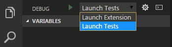
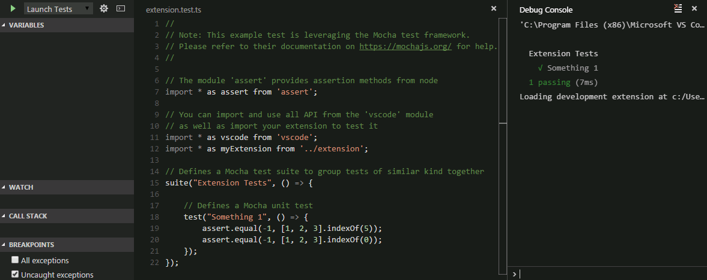

# Testing Your Extension

VS Code supports running and debugging tests for your extension that require the VS Code API. These tests will run inside a special instance of VS Code, the `Extension Development Host`, and have access to the full APIs. We refer to these tests as integration tests, because they go beyond unit tests that can run in isolation from a VS Code window. This documentation focuses on VS Code integration tests. For unit testing, you can use any popular testing framework, like [Mocha](http://mochajs.org/) or [Jasmine](http://jasmine.github.io/).

## Yo Code Test Scaffolding

The basic [yo code generator](/docs/extensions/yocode.md) extension project includes a sample test as well as the necessary infrastructure to run it.

**Note**: The documentation below assumes that you created a TypeScript extension but the same also applies for a JavaScript extension. However, some file names may be different.

After you've created a new extension and opened the project in VS Code, you can select the `Launch Tests` configuration from the dropdown at the top of the Debug View.



With this configuration chosen, when you run `Debug: Start` (`kb(workbench.action.debug.start)`), VS Code launches your extension in the `Extension Development Host` instance and runs your tests. Test output goes to the Debug Console where you can see the test results.



The generated test uses the [Mocha test framework](http://mochajs.org/) for its test runner and library.

The extension project comes with a `test` folder that includes an `index.ts` file which defines the Mocha test runner configuration and an `extension.test.ts` which has the example `Something 1` test. You can typically leave `index.ts` untouched, but you can modify it to adjust the configuration of Mocha.

```
├── test
│   ├── extension.test.ts
│   └── index.ts
```

You can create more `test.ts` files under the `test` folder and they will automatically be built (to `out/test`) and run. The test runner will only consider files matching the name pattern `*.test.ts`.

## Launch Tests configuration

The `Launch Tests` configuration is defined in the project's `.vscode\launch.json` file.  It is similar the `Launch Extension` configuration with the addition of the `--extensionTestsPath` argument which points to the compiled test files (assuming this is a TypeScript project).

```json
{
    "name": "Launch Tests",
    "type": "extensionHost",
    "request": "launch",
    "runtimeExecutable": "${execPath}",
    "args": ["--extensionDevelopmentPath=${workspaceRoot}", "--extensionTestsPath=${workspaceRoot}/out/test" ],
    "stopOnEntry": false,
    "sourceMaps": true,
    "outFiles": ["${workspaceRoot}/out/test/**/*.js"],
    "preLaunchTask": "npm"
}
```

## Passing Arguments to the Extension Development Host

You can set the file or folder that the test instance should open by inserting the path at the front of the argument list for the launch configuration.

```json
"args": ["file or folder name", "--extensionDevelopmentPath=${workspaceRoot}", "--extensionTestsPath=${workspaceRoot}/out/test" ],
```

This way you can run your tests with predictable content and folder structure.

## Excluding test files from your extension package

If you decide to share your extension, you may not want to include the tests in your extension package.  The [`.vscodeignore`](/docs/extensions/publish-extension.md#advance-usage) file lets you exclude test files when you package and publish your extension with the [`vsce` publishing tool](/docs/extensions/publish-extension.md).  By default, the `yo code` generated extension project excludes the `test` and `out/test` folders.

```
out/test/**
test/**
```

## Running tests automatically on Travis CI build machines

You can run extension tests automatically on build machines like [Travis CI](http://travis-ci.org).

In order to enable automated extension tests, the `vscode` npm module provides a test command that will:

* download and unzip VS Code
* launch your extension tests inside VS Code
* print the results to the console and return with an exit code according to test success or failure

To enable this test command, open your `package.json` and add the following entry to the `scripts` section:

```json
"test": "node ./node_modules/vscode/bin/test"
```

You can then enable Travis CI easily with a top-level `.travis.yml` configuration like this:

```yml
sudo: false

os:
  - osx
  - linux

before_install:
  - if [ $TRAVIS_OS_NAME == "linux" ]; then
      export CXX="g++-4.9" CC="gcc-4.9" DISPLAY=:99.0;
      sh -e /etc/init.d/xvfb start;
      sleep 3;
    fi

install:
  - npm install
  - npm run vscode:prepublish

script:
  - npm test --silent
```

The script above will run the tests on both Linux and Mac. Note that in order to run the tests on Linux, you need to have
a `before_install` configuration as above to enable Linux to start VS Code from the build.

There are some optional environment variables to configure the test runner:

| Name        | Description       |
| ------------|-------------------|
| `CODE_VERSION` | Version of VS Code to run the tests against (e.g. `0.10.10`) |
| `CODE_DOWNLOAD_URL` | Full URL of a VS Code drop to use for running tests against |
| `CODE_TESTS_PATH` | Location of the tests to execute |
| `CODE_TESTS_WORKSPACE` | Location of a workspace to open for the test instance |

## Running tests on Windows with AppVeyor

You can also run extension tests on Windows with [AppVeyor](http://www.appveyor.com/). To get started, you can review the VS Code integration tests AppVeyor [configuration file](https://github.com/Microsoft/vscode/blob/master/appveyor.yml).

## Next Steps

* [Debugging your Extension](/docs/extensions/debugging-extensions.md) - Learn more about how to run and debug your extension
* [vsce](/docs/extensions/publish-extension.md) - Publish your extension with the VSCE command line tool.
* [Extension Manifest file](/docs/extensionAPI/extension-manifest.md) - VS Code extension manifest file reference
* [Extension API](/docs/extensionAPI/overview.md) - Learn about the VS Code extensibility APIs