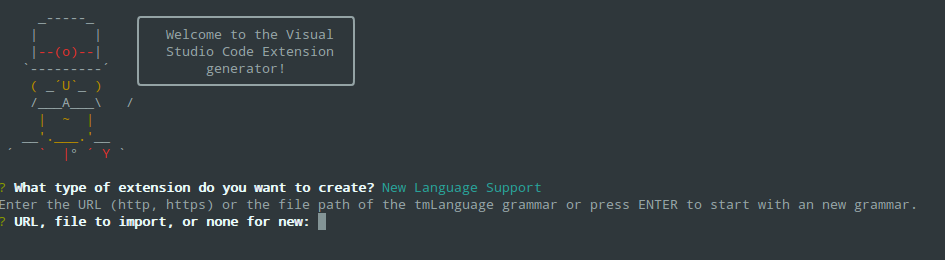
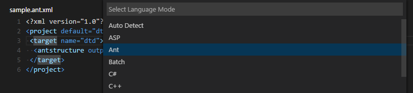

# Themes, Snippets and Colorizers

Custom themes, snippets and language syntax colorizers bring an editor to life. There are lots of existing TextMate customization files available and VS Code lets you easily package and reuse these. You can directly use `.tmTheme`, `.tmSnippets`, and `.tmLanguage` files in your extensions and share them in the extension [Marketplace](https://marketplace.visualstudio.com/VSCode). This topic describes how to reuse TextMate files as well as create and share your own themes, snippets and colorizers.

## Adding a new Theme

You can also add new TextMate theme files (.tmTheme) to your VS Code installation using VS Code's [Yeoman](http://yeoman.io) extension generator, [yo code](/docs/extensions/yocode.md). The extension generator takes an existing TextMate theme file and packages it for use in VS Code.

[ColorSublime](http://colorsublime.com) has hundreds of existing TextMate themes to choose from.  Pick a theme you like and copy the Download link to use in the Yeoman generator.  It will be in a format like `"http://colorsublime.com/theme/download/(number)"`.  The 'code' generator will prompt you for the URL or file location of the .tmTheme file, the theme name, and other information related to the theme.


Copy the generated theme folder to a new folder under [your `.vscode/extensions` folder](/docs/extensions/yocode.md#your-extensions-folder) and restart VS Code.

Open the Color Theme picker theme with **File** > **Preferences** > **Color Theme** and you can see your theme in the dropdown.  Arrow up and down to see a live preview of your theme.


## Publishing a Theme to the Extension Marketplace

If you'd like to share your new theme with the community, you can publish it to the [Extension Marketplace](/docs/editor/extension-gallery.md). Use the [vsce publishing tool](/docs/extensions/publish-extension.md) to package your theme and publish it to the VS Code Marketplace.

> **Tip:** To make it easy for users to find your theme, include the word "theme" in the extension description and set the `Category` to `Theme` in your `package.json`.

We also have recommendations on how to make your extension look great on the VS Code Marketplace, see [Marketplace Presentation Tips](/docs/extensionAPI/extension-manifest.md#marketplace-presentation-tips).

## Creating a Custom Theme

You can also author your own TextMate themes from scratch. Consult the TextMate [theme](https://manual.macromates.com/en/themes) and language grammar [naming conventions](https://manual.macromates.com/en/language_grammars#naming_conventions) documentation for details.

Besides the TextMate language grammar standard scopes, VS Code also has custom theme settings which you can use to tune your own theme:

- `rangeHighlight`: Background color of range highlighted, like by Quick open and Find features.
- `selectionHighlight`: Background color of regions highlighted while selecting.
- `inactiveSelection`: Background color of selections when not in focus.
- `wordHighlight`: Background color of a symbol during read-access, like reading a variable.
- `wordHighlightStrong`: Background color of a symbol during write-access, like writing to a variable.
- `findMatchHighlight`: Background color of regions matching the search.
- `currentFindMatchHighlight`: Background color of the current region matching the search.
- `findRangeHighlight`: Background color of regions selected for search.
- `linkForeground`: Color of links.
- `activeLinkForeground`: Color of active links.
- `hoverHighlight`: Background color when hovered.
- `referenceHighlight`: Background color of a reference when finding all references.
- `guide`: Color of the guides displayed to indicate nesting levels.

You can find an example VS Code theme [here](https://github.com/Microsoft/vscode-extension-samples/tree/master/theme-sample) which includes the custom settings.

Authoring a theme is fairly tricky as the grammars all behave a bit differently. Try to follow the TextMate conventions and avoid language specific rules in your theme as grammars can also be replaced by extensions.

## New Tools for inspecting TextMate Scopes

To help with theme authoring, there is a widget to inspect the scopes of a token and the matching theme rule. You can launch the widget with **Developer Tools: Inspect TM Scopes** from the **Command Palette** (`kb(workbench.action.showCommands)`).


## Adding a new Icon Theme

You can create your own icon theme from icons (preferably SVG) and from icon fonts. As example, check out the two built-in themes: [Minimal](https://github.com/Microsoft/vscode/tree/master/extensions/theme-defaults) and [Seti](https://github.com/Microsoft/vscode/tree/master/extensions/theme-seti).

To begin, create a VS Code extension and add the `iconTheme` contribution point.

```json
"contributes": {
    "iconThemes": [
        {
            "id": "turtles",
            "label": "Turtles",
            "path": "./fileicons/turtles-icon-theme.json"
        }
    ]
}
```

The `id` is the identifier for the icon theme. It is currently only used internally. In the future, it might be used in the settings, so make it unique but also readable. `label` is shown in the icon theme picker drop-down. The `path` points to a file in the extension that defines the icon set. If your icon set name follows the `*icon-theme.json` name scheme, you will get completion support and hovers in VS Code.

### Icon Set File

The icon set file is a JSON file consisting file icon associations and icon definitions.

An icon association maps a file type ('file', 'folder', 'json-file'...) to an icon definition. Icon definitions define where the icon is located: That can be an image file or also glyph in a font.

### Icon definitions

The `iconDefinitions` section contains all definitions. Each definition has an id, which will be used to reference the definition. A definition can be referenced also by more than one file association.

```json
    "iconDefinitions": {
        "_folder_dark": {
            "iconPath": "./images/Folder_16x_inverse.svg"
        }
    }
```

This icon definition above contains a definition with the identifier `_folder_dark`.

The following properties are supported:

- `iconPath`: When using a svg/png: the path to the image.
- `fontCharacter`: When using a glyph font: The character in the font to use.
- `fontColor`: When using a glyph font: The color to use for the glyph.
- `fontSize`: When using a font: The font size. By default, the size specified in the font specification is used. Should be a relative size (e.g. 150%) to the parent font size.
- `fontId`: When using a font: The id of the font. If not specified, the first font specified in font specification section will be picked.

### File association

Icons can be associated to folders, folder names, files, file extensions, file names and [language ids](/docs/extensionAPI/extension-points#_contributeslanguages).

Additionally each of these associations can be refined for 'light' and 'highContrast' color themes.

Each file association points to an icon definition.

```json
"file": "_file_dark",
"folder": "_folder_dark",
"folderExpanded": "_folder_open_dark",
"folderNames": {
    ".vscode": "_vscode_folder",
},
"fileExtensions": {
    "ini": "_ini_file",
},
"fileNames": {
    "win.ini": "_win_ini_file",
},
"languageIds": {
    "ini": "_ini_file"
},
"light": {
    "folderExpanded": "_folder_open_light",
    "folder": "_folder_light",
    "file": "_file_light",
    "fileExtensions": {
        "ini": "_ini_file_light",
    }
},
"highContrast": {
}
```

- `file` is the default file icon, shown for all files that don't match any extension, filename or language id. Currently all properties defined by the definition of the file icon will be inherited (only relevant for font glyphs, useful for the fontSize).
- `folder` is the folder icon for collapsed folders, and if `folderExpanded` is not set, also for expanded folders. Icons for specific folder names can be associated using the `folderNames` property.
The folder icon is optional. If not set, no icon will be shown for folder.
- `folderExpanded` is the folder icon for expanded folders. The expanded folder icon is optional. If not set, the icon defined for `folder` will be shown.
- `folderNames` associates folder names to icons. The key of the set is the folder name, not including any path segments. Patterns or wildcards are not supported. Folder name matching is case insensitive.
- `folderNamesExpanded` associates folder names to icons for expanded folder. The key of the set is the folder name, not including any path segments. Patterns or wildcards are not supported. Folder name matching is case insensitive.
- `languageIds` associates languages to icons. The key in the set is the language id as defined in the [language contribution point](/docs/extensionAPI/extension-points#_contributeslanguages). The language of a file is evaluated based on the file extensions and file names as defined in the language contribution. Note that the 'first line match' of the language contribution is not considered.
- `fileExtensions` associates file extensions to icons. The key in the set is the file extension name. The extension name is a file name segment after a dot (not including the dot). File names with multiple dots such as `lib.d.ts` can match multiple extensions; 'd.ts' and 'ts'. Extensions are compared case insensitive.
- `fileNames` associates file names to icons. The key in the set is the full file name, not including any path segments. Patterns or wildcards are not supported. File name matching is case insensitive. A 'fileName' match is the strongest match, and the icon associated to the file name will be preferred over an icon of a matching fileExtension and also of a matching language Id.

A file extension match is preferred over a language match, but is weaker than a file name match.

The `light` and the `highContrast` section have the same file association properties as just listed. They allow to override icons for the corresponding themes.

### Font definitions

The 'fonts' section lets you declare any number of glyph fonts that you want to use.
You can later reference these font in the icon definitions. The font declared first will be used as by default if an icon definition does not specify a font id.

Copy the font file into your extension and set the path accordingly.
It is recommended to use [WOFF](https://developer.mozilla.org/en-US/docs/Web/Guide/WOFF) fonts.

- Set 'woff' as the format.
- the weight property values are defined [here](https://developer.mozilla.org/en-US/docs/Web/CSS/font-weight#Values).
- the style property values are defined [here](https://developer.mozilla.org/en-US/docs/Web/CSS/@font-face/font-style#Values).
- the size should be relative to the font size where the icon is used. Therefore always use percentage.

```json
    "fonts": [
        {
            "id": "turtles-font",
            "src": [
                {
                    "path": "./turtles.woff",
                    "format": "woff"
                }
            ],
            "weight": "normal",
            "style": "normal",
            "size": "150%"
        }
    ],
    "iconDefinitions": {
        "_file": {
            "fontCharacter": "\\E002",
            "fontColor": "#5f8b3b",
            "fontId": "turtles-font"
        }
    }
```

---

## Using TextMate Snippets

You can also add TextMate snippets (.tmSnippets) to your VS Code installation using the [yo code](/docs/extensions/yocode.md) extension generator. The generator has an option `New Code Snippets` which lets you point to a folder containing multiple .tmSnippets files and they will be packaged into a VS Code snippet extension.  The generator also supports Sublime snippets (.sublime-snippets).

The final generator output has two files: an extension manifest `package.json` which has metadata to integrate the snippets into VS Code and a `snippets.json` file which includes the snippets converted to the VS Code snippet format.

```bash
.
├── snippets                    // VS Code integration
│   └── snippets.json           // The JSON file w/ the snippets
└── package.json                // extension's manifest
```

Copy the generated snippets folder to a new folder under [your `.vscode/extensions` folder](/docs/extensions/yocode.md#your-extensions-folder) and restart VS Code.

## Sharing Your Snippets in the Marketplace

Once you have created your snippets and tested them out, you can share them with the community.

To do this, you need to create a snippet extension.  If you've used the `yo code` extension generator, your snippet extension is ready to be published.

If you want to share user snippets, you'll need to package your snippet json file along with an extension manifest which has the necessary metadata to integrate the snippets into VS Code.

Depending on your platform, your user snippets file is located here:

- **Windows** `%APPDATA%\Code\User\snippets\(language).json`
- **Mac** `$HOME/Library/Application Support/Code/User/snippets/(language).json`
- **Linux** `$HOME/.config/Code/User/snippets/(language).json`

where `(language).json` depends on the targeted language of the snippets (e.g. `markdown.json` for Markdown snippets).  Create a new folder for your extension and copy your snippet file to a `snippets` subdirectory.

Now add an extension manifest package.json file to the extension folder.  The snippet extension manifest follows the structure defined in the [Extension Manifest](/docs/extensionAPI/extension-manifest.md) reference and provides a [`snippets` contribution](/docs/extensionAPI/extension-points.md#contributessnippets).

Below is an example manifest for Markdown snippets:

```json
{
    "name": "DM-Markdown",
    "publisher": "mscott",
    "description": "Dunder Mifflin Markdown snippets",
    "version": "0.1.0",
    "engines": { "vscode": "0.10.x" },
    "categories": ["Snippets"],
    "contributes": {
        "snippets": [
            {
                "language": "markdown",
                "path": "./snippets/markdown.json"
            }
        ]
    }
}
```

Note that snippets need to be associated with a `language` identifier.  This can be a [language supported](/docs/languages/overview.md) directly by VS Code or a language provided by an extension.  Make sure the `language` identifier is correct.

You then use the [vsce publishing tool](/docs/extensions/publish-extension.md) to publish the snippet extension to the [VS Code Extension Marketplace](/docs/editor/extension-gallery.md).

> **Tip:** To make it easy for users to find your snippet, include the word "snippet" in the extension description and set the `Category` to `Snippets` in your `package.json`.

We also have recommendations on how to make your extension look great on the VS Code Marketplace, see [Marketplace Presentation Tips](/docs/extensionAPI/extension-manifest.md#marketplace-presentation-tips).

---

## Adding a New Language (Colorizer)

Using the ['code' Yeoman generator](/docs/extensions/yocode.md), you can create an extension that adds syntax highlighting and bracket matching for a language to your VS Code installation.

Central to language support is a TextMate [language specification](https://manual.macromates.com/en/language_grammars) file (.tmLanguage) that describes the colorizer rules. The yeoman generator either takes an existing TextMate language specification file or lets you start with a fresh one.

A good place to look for existing TextMate .tmLanguage files is on GitHub. Search for a TextMate bundle for the language you are interested in and then navigate to the `Syntaxes` folder.  The 'code' Yeoman generator can import either .tmLanguage or .pList files.  When prompted for the URL or file location, pass the raw path to the .tmLanguage file e.g. https://raw.githubusercontent.com/textmate/ant.tmbundle/master/Syntaxes/Ant.tmLanguage. Make sure that the path points to the content of the file, not the HTML file showing the content.



The generator will prompt you for other information such a unique name (this should be unique to avoid clashing with other extensions) and the language name, aliases and file extensions. You also have to provide the top level scope name of the grammar. That scope name must match the scope name in the tmLanguage file.

When the generator is finished, open the created folder in Visual Studio Code. Have a look at the generated `<languageid>.configuration.json` file: It contains more language settings such as the tokens used for comments and brackets.  Make sure the configurations are accurate.

Here is an example for a language with XML-like brackets:

```json
{
    "comments": {
        "lineComment": "",
        "blockComment": ["<!--", "-->"]
    },
    "brackets": [
        ["<", ">"]
    ],
    "autoClosingPairs": [
        ["<", ">"],
        ["'", "'"],
        ["\"", "\""]
    ],
    "surroundingPairs": [
        ["<", ">"],
        ["'", "'"],
        ["\"", "\""]
    ]
}
```

For more details check out the [languages contribution point documentation](/docs/extensionAPI/extension-points.md#contributeslanguages).

The generated `vsc-extension-quickstart.md` file also contains more information on how to run and debug your extension.

To use your extension in your stable VS Code installation, copy the complete output folder to a new folder under [your `.vscode/extensions` folder](/docs/extensions/yocode.md#your-extensions-folder) and restart VS Code.  When you restart VS Code, your new language will be visible in the language specifier drop-down and you'll get full colorization and bracket/tag matching for files matching the language's file extension.



## Publishing Language Support to the Extension Marketplace

If you'd like to share your new language with the community, you can publish it to the [Extension Marketplace](/docs/editor/extension-gallery.md). Use the [vsce publishing tool](/docs/extensions/publish-extension.md) to package your extension and publish it to the VS Code Marketplace.

> **Tip:** To make it easy for users to find your language support, include the language name and words "language" or "language support" in the extension description and set the `Category` to `Languages` in your `package.json`.

We also have recommendations on how to make your extension look great on the VS Code Marketplace, see [Marketplace Presentation Tips](/docs/extensionAPI/extension-manifest.md#marketplace-presentation-tips).

## Add to your Language Support Extension

When you're adding a new language to VS Code, it is also great to add language [snippets](/docs/editor/userdefinedsnippets.md) to support common editing actions. It is easy to [combine multiple extensions](/docs/extensionAPI/extension-manifest.md#combining-extension-contributions) like snippets and colorizers into the same extension. You can modify the colorizer extension manifest `package.json` to include a `snippets` contribution and the snippets.json.

```json
{
    "name": "language-latex",
    "description": "LaTeX Language Support",
    "version": "0.0.1",
    "publisher": "someone",
    "engines": {
        "vscode": "0.10.x"
    },
    "categories": [
        "Languages",
        "Snippets"
    ],
    "contributes": {
        "languages": [{
            "id": "latex",
            "aliases": ["LaTeX", "latex"],
            "extensions": [".tex"]
        }],
        "grammars": [{
            "language": "latex",
            "scopeName": "text.tex.latex",
            "path": "./syntaxes/latex.tmLanguage"
        }],
        "snippets": [
            {
                "language": "latex",
                "path": "./snippets/snippets.json"
            }
        ]
    }
}
```

## Language Identifiers

In VS Code, each language mode has a unique specific language identifier. That identifier is rarely seen by the user except in the settings, e.g. when associating file extensions to a language:

```json
    "files.associations": {
        "*.myphp": "php"
    }
```

Note that casing matters for exact identifier matching ('Markdown' != 'markdown')

The language identifier becomes essential for VS Code extension developers when adding new language capabilities or when replacing a language support.

Every language defines its *id* through the `languages` configuration point:

```json
    "languages": [{
        "id": "java",
        "extensions": [ ".java", ".jav" ],
        "aliases": [ "Java", "java" ]
    }]
```

Language supports are added using the language identifier:

```json
    "grammars": [{
        "language": "groovy",
        "scopeName": "source.groovy",
        "path": "./syntaxes/Groovy.tmLanguage"
    }],
    "snippets": [{
        "language": "groovy",
        "path": "./snippets/groovy.json"
    }]
```

### New identifier guidelines

When defining a new language identifier, use the following guidelines:

- Use the lowercased programming language name.
- Search for other extensions in the Marketplace to find out if a language identifier has already been used.

You can find a list of known language identifiers [language identifier reference](/docs/languages/identifiers.md).

## Next Steps

If you'd like to learn more about VS Code extensibility, try these topics:

* [Extending Visual Studio Code](/docs/extensions/overview.md) - Learn about other ways to extend VS Code
* [Additional Extension Examples](/docs/extensions/samples.md) - Take a look at our list of example extension projects.

## Common Questions

**Q: What parts of VS code can I theme with a custom color theme?**

The VS Code color themes affect the editor input area (text foreground, background, selection, lineHighlight, caret, and the syntax tokens) as well as some of the custom UI (see the list in [Creating a Theme](/docs/extensions/themes-snippets-colorizers.md#creating-a-custom-theme)). When contributing a theme, you also specify a base theme: light (`vs`), dark (`vs-dark`) and high contrast (`hc-black`). The base theme is used for all other areas in the workbench such as the File Explorer. Base themes are not customizable or contributable by extensions.

**Q: Is there a list of scopes that I can use in my custom color theme?**

VS Code themes are standard TextMate themes and the tokenizers used in VS code are well established TextMate tokenizers, mostly maintained by the community and in use in other products.

To learn about what scopes are used where, check out the [TextMate documentation](https://manual.macromates.com/en/themes) and this useful [blog post](https://www.apeth.com/nonblog/stories/textmatebundle.html).  A great place to examine themes is [here](https://tmtheme-editor.herokuapp.com/).

**Q: I created a snippets extension but they aren't showing up in the VS Code editor?**

**A:** Be sure you have correctly specified the `language` identifier for your snippet (e.g. `markdown` for Markdown .md files, `plaintext` for Plain Text .txt files).  Also verify that the relative path to the snippets json file is correct.

**Q: Can I add more file extensions to my colorizer?**

**A:** Yes, the `yo code` generator provides the default file extensions from the .tmLanguage file but you can easily add more file extensions to a `languages` contribution `extensions` array.  In the example below, the `.asp` file extension has been added to the default `.asa` file extension.

```json
{
    "name": "asp",
    "version": "0.0.1",
    "engines": {
        "vscode": "0.10.x"
    },
    "publisher": "none",
    "contributes": {
        "languages": [{
            "id": "asp",
            "aliases": ["ASP", "asp"],
            "extensions": [".asa", ".asp"]
        }],
        "grammars": [{
            "language": "asp",
            "scopeName": "source.asp",
            "path": "./syntaxes/asp.tmLanguage"
        }]
    }
}
```

**Q: Can I add more file extensions to an existing colorizer?**

**A:** Yes. To extend an existing colorizer, you can associate a file extension to an existing language identifier with the `files.associations` [setting](/docs/getstarted/settings.md).  IntelliSense will show you the list of currently available language ids.

For example, the setting below adds the `.mmd` file extension to the `markdown` colorizer:

```json
    "files.associations": {
        "*.mmd": "markdown"
    }
```

**Q: What if I want to completely override an existing colorizer?**

**A:** Yes. You override the colorizer by providing a new `grammars` element for an existing language id. Also, add a `extensionDependencies` attribute that contains the name of the extension that defines the grammar that you want to replace.

```json
{
    "name": "override-xml",
    "version": "0.0.1",
    "engines": {
        "vscode": "0.10.x"
    },
    "publisher": "none",
    "extensionDependencies": [
        "xml"
    ],
    "contributes": {
        "grammars": [{
            "language": "xml",
            "scopeName": "text.xml",
            "path": "./syntaxes/BetterXML.tmLanguage"
        }]
    }
}
```
