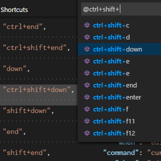

# Key Bindings for Visual Studio Code

Visual Studio Code lets you perform most tasks directly from the keyboard.  This page lists out the default bindings (keyboard shortcuts) and describes how you can update them.

>**Note:** If you visit this page on a Mac, you will see the key bindings for the Mac.  If you visit using Windows or Linux, you will see the keys for that platform. If you need the key bindings for another platform, hover your mouse over the key you are interested in.

## Keyboard Shortcuts editor

Visual Studio Code provides a rich and easy keyboard shortcuts editing experience using **Keyboard Shortcuts** editor. It lists all available commands with and without keybindings and you can easily change / remove / reset their keybindings using the available actions. It also has a search box on the top that helps you in finding commands or keybindings. You can open this editor by going to the menu under **File**  > **Preferences** > **Keyboard Shortcuts**. (**Code** > **Preferences** > **Keyboard Shortcuts** on macOS)


Most importantly, you can see keybindings according to your keyboard layout. For example, key binding `kbstyle(Cmd+\)` in US keyboard layout will be shown as `kbstyle(Ctrl+Shift+Alt+Cmd+7)` when layout is changed to German. The dialog to enter key binding will assign the correct and desired key binding as per your keyboard layout.

For doing more advanced keyboard shortcut customization, read [Advanced Customization](/docs/getstarted/keybindings.md#advanced-customization).

## Keymap extensions

Keyboard shortcuts are vital to productivity and changing keyboarding habits can be tough. To help with this, **File** > **Preferences** > **Keymap Extensions** shows you a list of popular keymap extensions. These extensions modify the VS Code shortcuts to match those of other editors so you don't need to learn new keyboard shortcuts. There is also a [Keymaps category](https://marketplace.visualstudio.com/search?target=VSCode&category=Keymaps&sortBy=Downloads) of extensions in the Marketplace.

<div class="marketplace-extensions-curated-keymaps"></div>

> Tip: Click on an extension tile above to read the description and reviews to decide which extension is best for you. See more in the [Marketplace](https://marketplace.visualstudio.com/vscode).

## Keyboard Shortcuts Reference

We also have a printable version of these keyboard shortcuts. **Help** > **Keyboard Shortcut Reference** displays a condensed PDF version suitable for printing as an easy reference.

Below are links to the three platform-specific versions:

* [Windows](https://go.microsoft.com/fwlink/?linkid=832145)
* [macOS](https://go.microsoft.com/fwlink/?linkid=832143)
* [Linux](https://go.microsoft.com/fwlink/?linkid=832144)

## Detecting keybinding conflicts

If you have many extensions installed or you have [customized](/docs/getstarted/keybindings.md#advanced-customization) your keyboard shortcuts, you can sometimes have keybinding conflicts where the same keyboard shortcut is mapped to several commands. This can result in confusing behavior, especially if different keybindings are going in and out of scope as you move around the editor.

The **Keyboard Shortcuts** editor has a context menu command **Show Same Keybindings**, which will filter the keybindings based on a keyboard shortcut to display conflicts.


Pick a command with the keybinding you think is overloaded and you can see if multiple commands are defined, the source of the keybindings and when they are active.


## Advanced customization

All keyboard shortcuts in VS Code can be customized via the `keybindings.json` file.

* To configure keyboard shortcuts the way you want, open **Keyboard Shortcuts** editor and click on **{}** button on the right of the editor title bar.
* This will open your `keybindings.json` file where you can overwrite the [Default Keybindings](/docs/getstarted/keybindings.md#default-keybindings).

## Keyboard rules

The keyboard shortcuts dispatching is done by analyzing a list of rules that are expressed in JSON. Here are some examples:

```json
// Keybindings that are active when the focus is in the editor
{ "key": "home",            "command": "cursorHome",                  "when": "editorTextFocus" },
{ "key": "shift+home",      "command": "cursorHomeSelect",            "when": "editorTextFocus" },

// Keybindings that are complementary
{ "key": "f5",              "command": "workbench.action.debug.continue", "when": "inDebugMode" },
{ "key": "f5",              "command": "workbench.action.debug.start",    "when": "!inDebugMode" },

// Global keybindings
{ "key": "ctrl+f",          "command": "actions.find" },
{ "key": "alt+left",        "command": "workbench.action.navigateBack" },
{ "key": "alt+right",       "command": "workbench.action.navigateForward" },

// Global keybindings using chords (two separate keypress actions)
{ "key": "ctrl+k enter",    "command": "workbench.action.keepEditor" },
{ "key": "ctrl+k ctrl+w",   "command": "workbench.action.closeAllEditors" },
```

Each rule consists of:

* a `key` that describes the pressed keys.
* a `command` containing the identifier of the command to execute.
* an **optional** `when` clause containing a boolean expression that will be evaluated depending on the current **context**.

Chords (two separate keypress actions) are described by separating the two keypresses with a space. For example, `kbstyle(Ctrl+K Ctrl+C)`.

When a key is pressed:

* the rules are evaluated from **bottom** to **top**.
* the first rule that matches, both the `key` and in terms of `when`, is accepted.
* no more rules are processed.
* if a rule is found and has a `command` set, the `command` is executed.

The additional `keybindings.json` rules are appended at runtime to the bottom of the default rules, thus allowing them to overwrite the default rules. The `keybindings.json` file is watched by VS Code so editing it while VS Code is running will update the rules at runtime.

## Accepted keys

The `key` is made up of modifiers and the key itself.

The following modifiers are accepted:

Platform|Modifiers
--|---------
macOS|`kbstyle(Ctrl+)`, `kbstyle(Shift+)`, `kbstyle(Alt+)`, `kbstyle(Cmd+)`
Windows|`kbstyle(Ctrl+)`, `kbstyle(Shift+)`, `kbstyle(Alt+)`, `kbstyle(Win+)`
Linux|`kbstyle(Ctrl+)`, `kbstyle(Shift+)`, `kbstyle(Alt+)`, `kbstyle(Meta+)`

The following keys are accepted:

* `kbstyle(f1-f19)`, `kbstyle(a-z)`, `kbstyle(0-9)`
* ``kbstyle(`)``, `kbstyle(-)`, `kbstyle(=)`, `kbstyle([)`, `kbstyle(])`, `kbstyle(\)`, `kbstyle(;)`, `kbstyle(')`, `kbstyle(,)`, `kbstyle(.)`, `kbstyle(/)`
* `kbstyle(left)`, `kbstyle(up)`, `kbstyle(right)`, `kbstyle(down)`, `kbstyle(pageup)`, `kbstyle(pagedown)`, `kbstyle(end)`, `kbstyle(home)`
* `kbstyle(tab)`, `kbstyle(enter)`, `kbstyle(escape)`, `kbstyle(space)`, `kbstyle(backspace)`, `kbstyle(delete)`
* `kbstyle(pausebreak)`, `kbstyle(capslock)`, `kbstyle(insert)`
* `kbstyle(numpad0-numpad9)`, `kbstyle(numpad_multiply)`, `kbstyle(numpad_add)`, `kbstyle(numpad_separator)`
* `kbstyle(numpad_subtract)`, `kbstyle(numpad_decimal)`, `kbstyle(numpad_divide)`

## Command arguments

You can invoke a command with arguments. This is useful if you often perform the same operation on a specific file or folder. You can add a custom keyboard shortcut to do exactly what you want.

The following is an example overriding the `kbstyle(Enter)` key to print some text:

```json
  { "key": "enter", "command": "type",
                    "args": { "text": "Hello World" },
                    "when": "editorTextFocus" }
```

The type command will receive `{"text": "Hello World"}` as its first argument and add "Hello World" to the file instead of producing the default command.

For more information on commands that take arguments, refer to [Built-in Commands](/api/references/commands.md).

## Removing a specific key binding rule

You can write a key binding rule that targets the removal of a specific default key binding. With the `keybindings.json`, it was always possible to redefine all the key bindings of VS Code, but it can be difficult to make a small tweak, especially around overloaded keys, such as `kbstyle(Tab)` or `kbstyle(Escape)`. To remove a specific key binding, add a `-` to the `command` and the rule will be a removal rule.

Here is an example:

```json
// In Default Keyboard Shortcuts
...
{ "key": "tab", "command": "tab", "when": ... },
{ "key": "tab", "command": "jumpToNextSnippetPlaceholder", "when": ... },
{ "key": "tab", "command": "acceptSelectedSuggestion", "when": ... },
...

// To remove the second rule, for example, add in keybindings.json:
{ "key": "tab", "command": "-jumpToNextSnippetPlaceholder" }

```

## Keyboard layouts

>**Note:** This section relates only to key bindings, not to typing in the editor.

The keys above are string representations for virtual keys and do not necessarily relate to the produced character when they are pressed. More precisely:

* Reference: [Virtual-Key Codes (Windows)](https://msdn.microsoft.com/library/windows/desktop/dd375731)
* `kbstyle(tab)` for `VK_TAB` (`0x09`)
* `kbstyle(;)` for `VK_OEM_1` (`0xBA`)
* `kbstyle(=)` for `VK_OEM_PLUS` (`0xBB`)
* `kbstyle(,)` for `VK_OEM_COMMA` (`0xBC`)
* `kbstyle(-)` for `VK_OEM_MINUS` (`0xBD`)
* `kbstyle(.)` for `VK_OEM_PERIOD` (`0xBE`)
* `kbstyle(/)` for `VK_OEM_2` (`0xBF`)
* ``kbstyle(`)`` for `VK_OEM_3` (`0xC0`)
* `kbstyle([)` for `VK_OEM_4` (`0xDB`)
* `kbstyle(\)` for `VK_OEM_5` (`0xDC`)
* `kbstyle(])` for `VK_OEM_6` (`0xDD`)
* `kbstyle(')` for `VK_OEM_7` (`0xDE`)
* etc.

Different keyboard layouts usually reposition the above virtual keys or change the characters produced when they are pressed. When using a different keyboard layout than the standard US, Visual Studio Code does the following:

All the key bindings are rendered in the UI using the current system's keyboard layout. For example, `Split Editor` when using a French (France) keyboard layout is now rendered as `kbstyle(Ctrl+*)`:


When editing `keybindings.json`, VS Code highlights misleading key bindings, those that are represented in the file with the character produced under the standard US keyboard layout, but that need pressing keys with different labels under the current system's keyboard layout. For example, here is how the **Default Keyboard Shortcuts** rules look like when using a French (France) keyboard layout:


There is also a widget that helps input the key binding rule when editing `keybindings.json`. To launch the **Define Keybinding** widget, press `kb(editor.action.defineKeybinding)`. The widget listens for key presses and renders the serialized JSON representation in the text box and below it, the keys that VS Code has detected under your current keyboard layout. Once you've typed the key combination you want, you can press `kbstyle(Enter)` and a rule snippet will be inserted.


>**Note:** On Linux, Visual Studio Code detects your current keyboard layout on start-up and then caches this information. For a good experience, we recommend restarting VS Code if you change your keyboard layout.

## Keyboard layout-independent bindings

Using scan codes, it is possible to define keybindings which do not change with the change of the keyboard layout. For example:

```json
{ "key": "cmd+[Slash]", "command": "editor.action.commentLine",
                           "when": "editorTextFocus" }
```

Accepted scan codes:

* `kbstyle([F1]-[F19])`, `kbstyle([KeyA]-[KeyZ])`, `kbstyle([Digit0]-[Digit9])`
* `kbstyle([Backquote])`, `kbstyle([Minus])`, `kbstyle([Equal])`, `kbstyle([BracketLeft])`, `kbstyle([BracketRight])`, `kbstyle([Backslash])`, `kbstyle([Semicolon])`, `kbstyle([Quote])`, `kbstyle([Comma])`, `kbstyle([Period])`, `kbstyle([Slash])`
* `kbstyle([ArrowLeft])`, `kbstyle([ArrowUp])`, `kbstyle([ArrowRight])`, `kbstyle([ArrowDown])`, `kbstyle([PageUp])`, `kbstyle([PageDown])`, `kbstyle([End])`, `kbstyle([Home])`
* `kbstyle([Tab])`, `kbstyle([Enter])`, `kbstyle([Escape])`, `kbstyle([Space])`, `kbstyle([Backspace])`, `kbstyle([Delete])`
* `kbstyle([Pause])`, `kbstyle([CapsLock])`, `kbstyle([Insert])`
* `kbstyle([Numpad0]-[Numpad9])`, `kbstyle([NumpadMultiply])`, `kbstyle([NumpadAdd])`, `kbstyle([NumpadComma])`
* `kbstyle([NumpadSubtract])`, `kbstyle([NumpadDecimal])`, `kbstyle([NumpadDivide])`

## 'when' clause contexts

VS Code gives you fine control over when your key bindings are enabled through the optional `when` clause.  If your key binding doesn't have a `when` clause, the key binding is globally available at all times.

Below are some of the possible `when` clause contexts which evaluate to Boolean true/false. For conditional expressions, you can use either equality `==` (`"editorLangId == typescript"`) or inequality `!=` (`"resourceExtname != .js"`).

Context name | True when
------------ | ------------
**Editor contexts** |
editorFocus | An editor has focus, either the text or a widget.
editorTextFocus | The text in an editor has focus (cursor is blinking).
textInputFocus | Any editor has focus (regular editor, debug REPL, etc.).
inputFocus | Any text input area has focus (editors or text boxes).
editorHasSelection | Text is selected in the editor.
editorHasMultipleSelections | Multiple regions of text are selected (multiple cursors).
editorReadOnly | The editor is read only.
editorLangId | True when the editor's associated [language Id](/docs/languages/identifiers.md) matches. Example: `"editorLangId == typescript"`.
isInDiffEditor | The active editor is a difference editor.
**Operating system contexts** |
isLinux | True when the OS is Linux
isMac | True when the OS is macOS
isWindows | True when the OS is Windows
**Mode contexts** |
inDebugMode | A debug session is running.
debugType | True when debug type matches. Example: `"debugType == 'node'"`.
inSnippetMode | The editor is in snippet mode.
inQuickOpen | The Quick Open drop-down has focus.
**Resource contexts** |
resourceScheme | True when the resource Uri scheme matches. Example: `"resourceScheme == file"`
resourceFilename | True when the Explorer or editor filename matches. Example: `"resourceFilename == gulpfile.js"`
resourceExtname | True when the Explorer or editor filename extension matches. Example: `"resourceExtname == .js"`
resourceLangId | True when the Explorer or editor title [language Id](/docs/languages/identifiers.md) matches. Example: `"resourceLangId == markdown"`
**Explorer contexts** |
explorerViewletVisible | True if Explorer view is visible.
explorerViewletFocus | True if Explorer view has keyboard focus.
filesExplorerFocus | True if File Explorer section has keyboard focus.
openEditorsFocus | True if OPEN EDITORS section has keyboard focus.
explorerResourceIsFolder | True if a folder is selected in the Explorer.
**Editor widget contexts** |
findWidgetVisible | Editor Find widget is visible.
suggestWidgetVisible | Suggestion widget (IntelliSense) is visible.
suggestWidgetMultipleSuggestions | Multiple suggestions are displayed.
renameInputVisible | Rename input text box is visible.
referenceSearchVisible | Peek References peek window is open.
inReferenceSearchEditor | The Peek References peek window editor has focus.
config.editor.stablePeek | Keep peek editors open (controlled by `editor.stablePeek` setting).
quickFixWidgetVisible | Quick Fix widget is visible.
parameterHintsVisible | Parameter hints are visible (controlled by `editor.parameterHints.enabled` setting).
parameterHintsMultipleSignatures | Multiple parameter hints are displayed.
**Integrated terminal contexts** |
terminalFocus | An integrated terminal has focus.
**Global UI contexts** |
notificationFocus | Notification has keyboard focus.
notificationCenterVisible | Notification Center is visible at the bottom right of VS Code.
notificationToastsVisible | Notification toast is visible at the bottom right of VS Code.
searchViewletVisible | Search view is open.
sideBarVisible | Side Bar is displayed.
sideBarFocus | Side Bar has focus.
panelFocus | Panel has focus.
editorIsOpen | True if one editor is open.
inZenMode | Window is in Zen Mode.
inDebugRepl | Focus is in the Debug Console REPL.
textCompareEditorVisible | At least one diff (compare) view is visible.
workspaceFolderCount | Count of workspace folders.
replaceActive | Search view Replace text box is open.
view | True when view identifier matches. Example: `"view == myViewsExplorerID"`.
viewItem | True when viewItem context matches. Example:  `"viewItem == someContextValue"`.
**Configuration settings contexts** |
config.editor.minimap.enabled | True when the setting `editor.minimap.enabled` is `true`.

>**Note**: You can use any user or workspace setting that evaluates to a boolean here with the prefix `"config."`.

The list above isn't exhaustive and you may see some `when` contexts for specific VS Code UI in the **Default Keyboard Shortcuts**.

### Active/Focused view or panel 'when' clause context

You can have a keybinding that is enabled only when a specific view or panel is visible.

Context name | True when
------------ | ------------
activeViewlet | True when view is visible. Example: `"activeViewlet == 'workbench.view.explorer'"`
activePanel | True when panel is visible. Example: `"activePanel == 'workbench.panel.output'"`

View Identifiers:

* workbench.view.explorer - File Explorer
* workbench.view.search - Search
* workbench.view.scm - Source Control
* workbench.view.debug - Debug
* workbench.view.extensions - Extensions

Panel Identifiers:

* workbench.panel.markers - Problems
* workbench.panel.output - Output
* workbench.panel.repl - Debug Console
* workbench.panel.terminal - Integrated Terminal
* workbench.panel.comments - Comments
* workbench.view.search - Search when `search.location` is set to `panel`

If you want a keybinding that is enabled only when a specific view or panel has focus, use `sideBarFocus` or `panelFocus` in combination with `activeViewlet` or `activiewFocus`.

For example, the when clause below is true only when the File Explorer has focus:

```json
"sideBarFocus && activeViewlet == 'workbench.view.explorer'"
```

### key-value when clause operator

There is a key-value pair operator for `when` clauses. The expression `key =~ value` treats the right hand side as a regular expression to match against the left hand side. For example, to contribute context menu items for all Docker files, one could use:

```json
   "when": "resourceFilename =~ /docker/"
```

## Custom keybindings for refactorings

The `editor.action.codeAction` command lets you configure keybindings for specific [Refactorings](/docs/editor/refactoring.md) (Code Actions). For example, the keybinding below triggers the **Extract function** refactoring Code Actions:

```json
{
  "key": "ctrl+shift+r ctrl+e",
  "command": "editor.action.codeAction",
  "args": {
    "kind": "refactor.extract.function"
  }
}
```

This is covered in depth in the [Refactoring](/docs/editor/refactoring.md#keybindings-for-code-actions) topic where you can learn about different kinds of Code Actions and how to prioritize them in the case of multiple possible refactorings.

## Default Keyboard Shortcuts

You can view all default keyboard shortcuts in VS Code in the **Keyboard Shortcuts** editor


or as a JSON file using the command **Preferences: Open Default Keyboard Shortcuts (JSON)**.

>**Note:** The following keys are rendered assuming a standard US keyboard layout. If you use a different keyboard layout, please [read below](/docs/getstarted/keybindings.md#keyboard-layouts). You can view the currently active keyboard shortcuts in VS Code in the **Command Palette** (**View** -> **Command Palette**) or in the **Keyboard Shortcuts** editor (**File** > **Preferences** > **Keyboard Shortcuts**).

Some commands included below do not have default keyboard shortcuts and so are displayed as `kbstyle(unassigned)` but you can assign your own keybindings.

### Basic Editing

Key|Command|Command id
---|-------|----------
`kb(editor.action.clipboardCutAction)`|Cut line (empty selection)|`editor.action.clipboardCutAction`
`kb(editor.action.clipboardCopyAction)`|Copy line (empty selection)|`editor.action.clipboardCopyAction`
`kb(editor.action.deleteLines)`|Delete Line|`editor.action.deleteLines`
`kb(editor.action.insertLineAfter)`|Insert Line Below|`editor.action.insertLineAfter`
`kb(editor.action.insertLineBefore)`|Insert Line Above|`editor.action.insertLineBefore`
`kb(editor.action.moveLinesDownAction)`|Move Line Down|`editor.action.moveLinesDownAction`
`kb(editor.action.moveLinesUpAction)`|Move Line Up|`editor.action.moveLinesUpAction`
`kb(editor.action.copyLinesDownAction)`|Copy Line Down|`editor.action.copyLinesDownAction`
`kb(editor.action.copyLinesUpAction)`|Copy Line Up|`editor.action.copyLinesUpAction`
`kb(editor.action.addSelectionToNextFindMatch)`|Add Selection To Next Find Match|`editor.action.addSelectionToNextFindMatch`
`kb(editor.action.moveSelectionToNextFindMatch)`|Move Last Selection To Next Find Match|`editor.action.moveSelectionToNextFindMatch`
`kb(cursorUndo)`|Undo last cursor operation|`cursorUndo`
`kb(editor.action.insertCursorAtEndOfEachLineSelected)`|Insert cursor at end of each line selected|`editor.action.insertCursorAtEndOfEachLineSelected`
`kb(editor.action.selectHighlights)`|Select all occurrences of current selection|`editor.action.selectHighlights`
`kb(editor.action.changeAll)`|Select all occurrences of current word|`editor.action.changeAll`
`kb(expandLineSelection)`|Select current line|`expandLineSelection`
`kb(editor.action.insertCursorBelow)`|Insert Cursor Below|`editor.action.insertCursorBelow`
`kb(editor.action.insertCursorAbove)`|Insert Cursor Above|`editor.action.insertCursorAbove`
`kb(editor.action.jumpToBracket)`|Jump to matching bracket|`editor.action.jumpToBracket`
`kb(editor.action.indentLines)`|Indent Line|`editor.action.indentLines`
`kb(editor.action.outdentLines)`|Outdent Line|`editor.action.outdentLines`
`kb(cursorHome)`|Go to Beginning of Line|`cursorHome`
`kb(cursorEnd)`|Go to End of Line|`cursorEnd`
`kb(cursorBottom)`|Go to End of File|`cursorBottom`
`kb(cursorTop)`|Go to Beginning of File|`cursorTop`
`kb(scrollLineDown)`|Scroll Line Down|`scrollLineDown`
`kb(scrollLineUp)`|Scroll Line Up|`scrollLineUp`
`kb(scrollPageDown)`|Scroll Page Down|`scrollPageDown`
`kb(scrollPageUp)`|Scroll Page Up|`scrollPageUp`
`kb(editor.fold)`|Fold (collapse) region|`editor.fold`
`kb(editor.unfold)`|Unfold (uncollapse) region|`editor.unfold`
`kb(editor.foldRecursively)`|Fold (collapse) all subregions|`editor.foldRecursively`
`kb(editor.unfoldRecursively)`|Unfold (uncollapse) all subregions|`editor.unfoldRecursively`
`kb(editor.foldAll)`|Fold (collapse) all regions|`editor.foldAll`
`kb(editor.unfoldAll)`|Unfold (uncollapse) all regions|`editor.unfoldAll`
`kb(editor.action.addCommentLine)`|Add Line Comment|`editor.action.addCommentLine`
`kb(editor.action.removeCommentLine)`|Remove Line Comment|`editor.action.removeCommentLine`
`kb(editor.action.commentLine)`|Toggle Line Comment|`editor.action.commentLine`
`kb(editor.action.blockComment)`|Toggle Block Comment|`editor.action.blockComment`
`kb(actions.find)`|Find|`actions.find`
`kb(editor.action.startFindReplaceAction)`|Replace|`editor.action.startFindReplaceAction`
`kb(editor.action.nextMatchFindAction)`|Find Next|`editor.action.nextMatchFindAction`
`kb(editor.action.previousMatchFindAction)`|Find Previous|`editor.action.previousMatchFindAction`
`kb(editor.action.selectAllMatches)`|Select All Occurrences of Find Match|`editor.action.selectAllMatches`
`kb(toggleFindCaseSensitive)`|Toggle Find Case Sensitive|`toggleFindCaseSensitive`
`kb(toggleFindRegex)`|Toggle Find Regex|`toggleFindRegex`
`kb(toggleFindWholeWord)`|Toggle Find Whole Word|`toggleFindWholeWord`
`kb(editor.action.toggleTabFocusMode)`|Toggle Use of Tab Key for Setting Focus|`editor.action.toggleTabFocusMode`
`kb(toggleRenderWhitespace)`|Toggle Render Whitespace|`toggleRenderWhitespace`
`kb(editor.action.toggleWordWrap)`|Toggle Word Wrap|`editor.action.toggleWordWrap`

### Rich Languages Editing

Key|Command|Command id
---|-------|----------
`kb(editor.action.triggerSuggest)`|Trigger Suggest|`editor.action.triggerSuggest`
`kb(editor.action.triggerParameterHints)`|Trigger Parameter Hints|`editor.action.triggerParameterHints`
`kb(editor.action.formatDocument)`|Format Document|`editor.action.formatDocument`
`kb(editor.action.formatSelection)`|Format Selection|`editor.action.formatSelection`
`kb(editor.action.revealDefinition)`|Go to Definition|`editor.action.revealDefinition`
`kb(editor.action.showHover)`|Show Hover|`editor.action.showHover`
`kb(editor.action.peekDefinition)`|Peek Definition|`editor.action.peekDefinition`
`kb(editor.action.revealDefinitionAside)`|Open Definition to the Side|`editor.action.revealDefinitionAside`
`kb(editor.action.quickFix)`|Quick Fix|`editor.action.quickFix`
`kb(editor.action.referenceSearch.trigger)`|Peek References|`editor.action.referenceSearch.trigger`
`kb(editor.action.rename)`|Rename Symbol|`editor.action.rename`
`kb(editor.action.inPlaceReplace.down)`|Replace with Next Value|`editor.action.inPlaceReplace.down`
`kb(editor.action.inPlaceReplace.up)`|Replace with Previous Value|`editor.action.inPlaceReplace.up`
`kb(editor.action.smartSelect.expand)`|Expand AST Selection|`editor.action.smartSelect.expand`
`kb(editor.action.smartSelect.shrink)`|Shrink AST Selection|`editor.action.smartSelect.shrink`
`kb(editor.action.trimTrailingWhitespace)`|Trim Trailing Whitespace|`editor.action.trimTrailingWhitespace`
`kb(workbench.action.editor.changeLanguageMode)`|Change Language Mode|`workbench.action.editor.changeLanguageMode`

### Navigation

Key|Command|Command id
---|-------|----------
`kb(workbench.action.showAllSymbols)`|Show All Symbols|`workbench.action.showAllSymbols`
`kb(workbench.action.gotoLine)`|Go to Line...|`workbench.action.gotoLine`
`kb(workbench.action.quickOpen)`|Go to File..., Quick Open|`workbench.action.quickOpen`
`kb(workbench.action.gotoSymbol)`|Go to Symbol...|`workbench.action.gotoSymbol`
`kb(workbench.actions.view.problems)`|Show Problems|`workbench.actions.view.problems`
`kb(editor.action.marker.nextInFiles)`|Go to Next Error or Warning|`editor.action.marker.nextInFiles`
`kb(editor.action.marker.prevInFiles)`|Go to Previous Error or Warning|`editor.action.marker.prevInFiles`
`kb(workbench.action.showCommands)` or `kbstyle(F1)`|Show All Commands|`workbench.action.showCommands`
`kb(workbench.action.openPreviousRecentlyUsedEditorInGroup)`|Navigate Editor Group History|`workbench.action.openPreviousRecentlyUsedEditorInGroup`
`kb(workbench.action.navigateBack)`|Go Back|`workbench.action.navigateBack`
`kb(workbench.action.quickInputBack)`|Go back in Quick Input|`workbench.action.quickInputBack`
`kb(workbench.action.navigateForward)`|Go Forward|`workbench.action.navigateForward`

### Editor/Window Management

Key|Command|Command id
---|-------|----------
`kb(workbench.action.newWindow)`|New Window|`workbench.action.newWindow`
`kb(workbench.action.closeWindow)`|Close Window|`workbench.action.closeWindow`
`kb(workbench.action.closeActiveEditor)`|Close Editor|`workbench.action.closeActiveEditor`
`kb(workbench.action.closeFolder)`|Close Folder|`workbench.action.closeFolder`
`kb(workbench.action.navigateEditorGroups)`|Cycle Between Editor Groups|`workbench.action.navigateEditorGroups`
`kb(workbench.action.splitEditor)`|Split Editor|`workbench.action.splitEditor`
`kb(workbench.action.focusFirstEditorGroup)`|Focus into First Editor Group|`workbench.action.focusFirstEditorGroup`
`kb(workbench.action.focusSecondEditorGroup)`|Focus into Second Editor Group|`workbench.action.focusSecondEditorGroup`
`kb(workbench.action.focusThirdEditorGroup)`|Focus into Third Editor Group|`workbench.action.focusThirdEditorGroup`
`kb(workbench.action.focusPreviousGroup)`|Focus into Editor Group on the Left|`workbench.action.focusPreviousGroup`
`kb(workbench.action.focusNextGroup)`|Focus into Editor Group on the Right|`workbench.action.focusNextGroup`
`kb(workbench.action.moveEditorLeftInGroup)`| Move Editor Left |`workbench.action.moveEditorLeftInGroup`
`kb(workbench.action.moveEditorRightInGroup)`| Move Editor Right |`workbench.action.moveEditorRightInGroup`
`kb(workbench.action.moveActiveEditorGroupLeft)`|Move Active Editor Group Left|`workbench.action.moveActiveEditorGroupLeft`
`kb(workbench.action.moveActiveEditorGroupRight)`|Move Active Editor Group Right|`workbench.action.moveActiveEditorGroupRight`
`kb(workbench.action.moveEditorToNextGroup)`|Move Editor into Next Group|`workbench.action.moveEditorToNextGroup`
`kb(workbench.action.moveEditorToPreviousGroup)`|Move Editor into Previous Group|`workbench.action.moveEditorToPreviousGroup`

### File Management

Key|Command|Command id
---|-------|----------
`kb(workbench.action.files.newUntitledFile)`|New File|`workbench.action.files.newUntitledFile`
`kb(workbench.action.files.openFile)`|Open File...|`workbench.action.files.openFile`
`kb(workbench.action.files.save)`|Save|`workbench.action.files.save`
`kb(workbench.action.files.saveAll)`|Save All|`workbench.action.files.saveAll`
`kb(workbench.action.files.saveAs)`|Save As...|`workbench.action.files.saveAs`
`kb(workbench.action.closeActiveEditor)`|Close|`workbench.action.closeActiveEditor`
`kb(workbench.action.closeOtherEditors)`|Close Others|`workbench.action.closeOtherEditors`
`kb(workbench.action.closeEditorsInGroup)`|Close Group|`workbench.action.closeEditorsInGroup`
`kb(workbench.action.closeEditorsInOtherGroups)`|Close Other Groups|`workbench.action.closeEditorsInOtherGroups`
`kb(workbench.action.closeEditorsToTheLeft)`|Close Group to Left|`workbench.action.closeEditorsToTheLeft`
`kb(workbench.action.closeEditorsToTheRight)`|Close Group to Right|`workbench.action.closeEditorsToTheRight`
`kb(workbench.action.closeAllEditors)`|Close All|`workbench.action.closeAllEditors`
`kb(workbench.action.reopenClosedEditor)`|Reopen Closed Editor|`workbench.action.reopenClosedEditor`
`kb(workbench.action.keepEditor)`|Keep Open|`workbench.action.keepEditor`
`kb(workbench.action.openNextRecentlyUsedEditorInGroup)`|Open Next|`workbench.action.openNextRecentlyUsedEditorInGroup`
`kb(workbench.action.openPreviousRecentlyUsedEditorInGroup)`|Open Previous|`workbench.action.openPreviousRecentlyUsedEditorInGroup`
`kb(workbench.action.files.copyPathOfActiveFile)`|Copy Path of Active File|`workbench.action.files.copyPathOfActiveFile`
`kb(workbench.action.files.revealActiveFileInWindows)`|Reveal Active File in Windows|`workbench.action.files.revealActiveFileInWindows`
`kb(workbench.action.files.showOpenedFileInNewWindow)`|Show Opened File in New Window|`workbench.action.files.showOpenedFileInNewWindow`
`kb(workbench.files.action.compareFileWith)`|Compare Opened File With|`workbench.files.action.compareFileWith`

### Display

Key|Command|Command id
---|-------|----------
`kb(workbench.action.toggleFullScreen)`|Toggle Full Screen|`workbench.action.toggleFullScreen`
`kb(workbench.action.toggleZenMode)`|Toggle Zen Mode|`workbench.action.toggleZenMode`
`kb(workbench.action.exitZenMode)`|Leave Zen Mode|`workbench.action.exitZenMode`
`kb(workbench.action.zoomIn)`|Zoom in|`workbench.action.zoomIn`
`kb(workbench.action.zoomOut)`|Zoom out|`workbench.action.zoomOut`
`kb(workbench.action.zoomReset)`|Reset Zoom|`workbench.action.zoomReset`
`kb(workbench.action.toggleSidebarVisibility)`|Toggle Sidebar Visibility|`workbench.action.toggleSidebarVisibility`
`kb(workbench.view.explorer)`|Show Explorer / Toggle Focus|`workbench.view.explorer`
`kb(workbench.view.search)`|Show Search|`workbench.view.search`
`kb(workbench.view.scm)`|Show Source Control|`workbench.view.scm`
`kb(workbench.view.debug)`|Show Debug|`workbench.view.debug`
`kb(workbench.view.extensions)`|Show Extensions|`workbench.view.extensions`
`kb(workbench.action.output.toggleOutput)`|Show Output|`workbench.action.output.toggleOutput`
`kb(workbench.action.quickOpenView)`|Quick Open View|`workbench.action.quickOpenView`
`kb(workbench.action.terminal.openNativeConsole)`|Open New Command Prompt|`workbench.action.terminal.openNativeConsole`
`kb(markdown.showPreview)`|Toggle Markdown Preview|`markdown.showPreview`
`kb(markdown.showPreviewToSide)`|Open Preview to the Side|`markdown.showPreviewToSide`
`kb(workbench.action.terminal.toggleTerminal)`|Toggle Integrated Terminal|`workbench.action.terminal.toggleTerminal`

### Search

Key|Command|Command id
---|-------|----------
`kb(workbench.view.search)`|Show Search|`workbench.view.search`
`kb(workbench.action.replaceInFiles)`|Replace in Files|`workbench.action.replaceInFiles`
`kb(toggleSearchCaseSensitive)`|Toggle Match Case|`toggleSearchCaseSensitive`
`kb(toggleSearchWholeWord)`|Toggle Match Whole Word|`toggleSearchWholeWord`
`kb(toggleSearchRegex)`|Toggle Use Regular Expression|`toggleSearchRegex`
`kb(workbench.action.search.toggleQueryDetails)`|Toggle Search Details|`workbench.action.search.toggleQueryDetails`
`kb(search.action.focusNextSearchResult)`|Focus Next Search Result|`search.action.focusNextSearchResult`
`kb(search.action.focusPreviousSearchResult)`|Focus Previous Search Result|`search.action.focusPreviousSearchResult`
`kb(history.showNext)`|Show Next Search Term|`history.showNext`
`kb(history.showPrevious)`|Show Previous Search Term|`history.showPrevious`

### Preferences

Key|Command|Command id
---|-------|----------
`kb(workbench.action.openSettings)`|Open Settings|`workbench.action.openSettings`
`kb(workbench.action.openWorkspaceSettings)`|Open Workspace Settings|`workbench.action.openWorkspaceSettings`
`kb(workbench.action.openGlobalKeybindings)`|Open Keyboard Shortcuts|`workbench.action.openGlobalKeybindings`
`kb(workbench.action.openSnippets)`|Open User Snippets|`workbench.action.openSnippets`
`kb(workbench.action.selectTheme)`|Select Color Theme|`workbench.action.selectTheme`
`kb(workbench.action.configureLocale)`|Configure Display Language|`workbench.action.configureLocale`

### Debug

Key|Command|Command id
---|-------|----------
`kb(editor.debug.action.toggleBreakpoint)`|Toggle Breakpoint|`editor.debug.action.toggleBreakpoint`
`kb(workbench.action.debug.start)`|Start|`workbench.action.debug.start`
`kb(workbench.action.debug.continue)`|Continue|`workbench.action.debug.continue`
`kb(workbench.action.debug.run)`|Start (without debugging)|`workbench.action.debug.run`
`kb(workbench.action.debug.pause)`|Pause|`workbench.action.debug.pause`
`kb(workbench.action.debug.stepInto)`|Step Into|`workbench.action.debug.stepInto`
`kb(workbench.action.debug.stepOut)`|Step Out|`workbench.action.debug.stepOut`
`kb(workbench.action.debug.stepOver)`|Step Over|`workbench.action.debug.stepOver`
`kb(workbench.action.debug.stop)`|Stop|`workbench.action.debug.stop`
`kb(editor.debug.action.showDebugHover)`|Show Hover|`editor.debug.action.showDebugHover`

### Tasks

Key|Command|Command id
---|-------|----------
`kb(workbench.action.tasks.build)`|Run Build Task|`workbench.action.tasks.build`
`kb(workbench.action.tasks.test)`|Run Test Task|`workbench.action.tasks.test`

### Extensions

Key|Command|Command id
---|-------|----------
`kb(workbench.extensions.action.installExtension)`|Install Extension|`workbench.extensions.action.installExtension`
`kb(workbench.extensions.action.showInstalledExtensions)`|Show Installed Extensions|`workbench.extensions.action.showInstalledExtensions`
`kb(workbench.extensions.action.listOutdatedExtensions)`|Show Outdated Extensions|`workbench.extensions.action.listOutdatedExtensions`
`kb(workbench.extensions.action.showRecommendedExtensions)`|Show Recommended Extensions|`workbench.extensions.action.showRecommendedExtensions`
`kb(workbench.extensions.action.showPopularExtensions)`|Show Popular Extensions|`workbench.extensions.action.showPopularExtensions`
`kb(workbench.extensions.action.updateAllExtensions)`|Update All Extensions|`workbench.extensions.action.updateAllExtensions`

## Next steps

Now that you know about our Key binding support, what's next...

* [Language Support](/docs/languages/overview.md) - Our Good, Better, Best language grid to see what you can expect
* [Debugging](/docs/editor/debugging.md) - This is where VS Code really shines
* [Node.js](/docs/nodejs/nodejs-tutorial.md) - End to end Node.js scenario with a sample app

## Common questions

### How can I find out what command is bound to a specific key?

In the **Default Keyboard Shortcuts**, open `Quick Outline` by pressing `kb(workbench.action.gotoSymbol)`



### How to add a key binding to an action? For example, add Ctrl+D to Delete Lines

Find a rule that triggers the action in the **Default Keyboard Shortcuts** and write a modified version of it in your `keybindings.json` file:

```json
// Original, in Default Keyboard Shortcuts
{ "key": "ctrl+shift+k",          "command": "editor.action.deleteLines",
                                     "when": "editorTextFocus" },
// Modified, in User/keybindings.json, Ctrl+D now will also trigger this action
{ "key": "ctrl+d",                "command": "editor.action.deleteLines",
                                     "when": "editorTextFocus" },
```

### How can I add a key binding for only certain file types?

Use the `editorLangId` context key in your `when` clause:

```json
{ "key": "shift+alt+a",           "command": "editor.action.blockComment",
                                     "when": "editorTextFocus && editorLangId == csharp" },
```

### I have modified my key bindings in `keybindings.json`, why don't they work?

The most common problem is a syntax error in the file. Otherwise, try removing the `when` clause or picking a different `key`. Unfortunately, at this point, it is a trial and error process.
