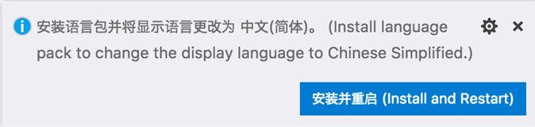
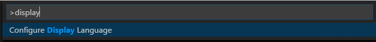

# Display Language

Visual Studio Code ships by default with English as the display language and other [languages](#available-locales) rely on Language Pack [extensions](/docs/editor/extension-gallery.md) available from the [Marketplace](https://marketplace.visualstudio.com/search?target=VSCode&category=Language%20Packs&sortBy=Downloads).

 VS Code detects the operating system's UI language and will prompt you to install the appropriate Language Pack, if available on the Marketplace. Below is an example recommending a Simplified Chinese Language Pack:



After installing the Language Pack extension and following the prompt to restart, VS Code will use the Language Pack matching your operating system's UI language.

## Changing the Display Language

You can also override the default UI language by explicitly setting the VS Code display language using the **Configure Display Language** command.

Press `kb(workbench.action.showCommands)` to bring up the **Command Palette** then start typing "display" to filter and display the **Configure Display Language** command.



Press `kbstyle(Enter)` and a list of installed languages by [locale](#available-locales) is displayed, with the current `locale` highlighted.


Use the "Install additional languages..." option to install more Language Packs from the [Marketplace](https://marketplace.visualstudio.com/search?target=VSCode&category=Language%20Packs&sortBy=Downloads), or select a different `locale` from the list. Changing the `locale` requires a restart of VS Code. You will be prompted to restart when you select a `locale`.

The **Configure Display Language** command creates a `locale.json` file in your user VS Code folder. Depending on your platform, the `locale.json` file is located here:
* **Windows** `%APPDATA%\Code\User\locale.json`
* **macOS** `$HOME/Library/Application Support/Code/User/locale.json`
* **Linux** `$HOME/.config/Code/User/locale.json`

The `locale` can also be changed by editing this file and restarting VS Code.

## Available locales

Display Language | Locale
-----------------|-------
English (US) | `en`
Simplified Chinese | `zh-CN`
Traditional Chinese | `zh-TW`
French | `fr`
German | `de`
Italian | `it`
Spanish | `es`
Japanese | `ja`
Korean | `ko`
Russian | `ru`
Bulgarian | `bg`
Hungarian | `hu`
Portuguese (Brazil) | `pt-br`
Turkish | `tr`

## Marketplace Language Packs

As described above, VS Code ships with English as the default display language, but other languages are available through [Marketplace Language Packs](https://marketplace.visualstudio.com/search?target=VSCode&category=Language%20Packs&sortBy=Downloads).

You can search for Language Packs in the Extensions view (`kb(workbench.view.extensions)`) by typing the language you are looking for along with `category:"Language Packs"`.


You can have multiple Language Packs installed and select the current display language with the **Configure Display Language** command.

## Setting the Language

If you want to use a specific language for a VS Code session, you can use the command-line switch `--locale` to specify a locale when you launch VS Code.

Below is an example of using the `--locale` command-line switch to set the VS Code display language to French:

```bash
code . --locale=fr
```

**Note**: You must have the appropriate Language Pack installed for the language you specify with the command-line switch. If the matching Language Pack is not installed, VS Code will display English.

## Common questions

### Unable to write to file because the file is dirty

This notification may mean that your `locale.json` file wasn't saved after a previous change. Make sure the file is saved and try to install the Language Pack again.