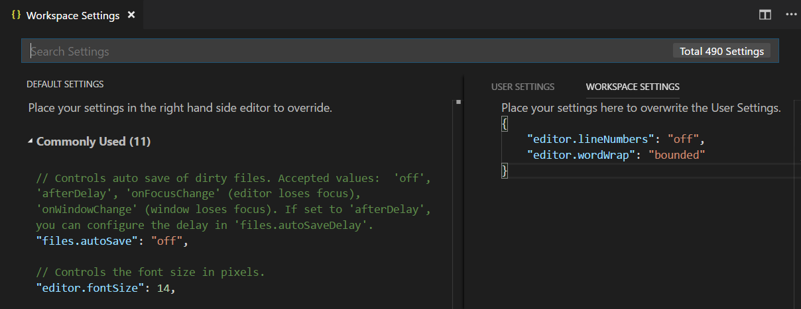

# User and Workspace Settings

It is easy to configure Visual Studio Code to your liking through its various settings. Nearly every part of VS Code's editor, user interface, and functional behavior has options you can modify.


VS Code provides two different scopes for settings:

* **User Settings** - Settings that apply globally to any instance of VS Code you open.
* **Workspace Settings** - Settings stored inside your workspace and only apply when the workspace is opened.

Workspace settings override user settings. Workspace settings are specific to a project and can be shared across developers on a project.

>**Note**: A VS Code "workspace" is usually just your project root folder. Workspace settings as well as [debugging](/docs/editor/debugging.md) and [task](/docs/editor/tasks.md) configurations are stored at the root in a `.vscode` folder. You can also have more than one root folder in a VS Code workspace through a feature called [Multi-root workspaces](/docs/editor/multi-root-workspaces.md). You can learn more in the [What is a VS Code "workspace"?](/docs/editor/workspaces.md) article.

## Creating User and Workspace Settings

To open your user and workspace settings, use the following VS Code menu command:

* On Windows/Linux - **File** > **Preferences** > **Settings**
* On macOS - **Code** > **Preferences** > **Settings**

You can also open the Settings editor from the **Command Palette** (`kb(workbench.action.showCommands)`) with **Preferences: Open Settings** or use the keyboard shortcut (`kb(workbench.action.openSettings)`).

In the example below, the color theme and the file icon theme have been changed.



Changes to settings are reloaded by VS Code as you change them. Modified settings are now indicated with a _blue line_ similar to modified lines in the editor. The gear icon opens a context menu with options to reset the setting to its default value as well as copy setting as JSON.

>**Note:** Workspace settings are useful for sharing project specific settings across a team.

## Settings editor

When you open the settings editor, you can search and discover settings you are looking for. When you search using the Search bar, it will not only show and highlight the settings matching your criteria, but also filter out those which are not matching. This makes finding settings quick and easy.


**Note**: VS Code extensions can also add their own custom settings and they will be visible under an **Extensions** section.

### Edit settings

Each setting can be edited by either a **checkbox**, an **input** or by a **dropdown**. Edit the text or select the option you want to change to the desired settings.


### Settings groups

Default settings are represented in groups so that you can navigate them easily. It has a **Commonly Used** group at the top, which shows popular customizations.


Below is a [copy of the default settings](/docs/getstarted/settings.md#default-settings) that come with VS Code.

## Settings file locations

By default VS Code shows the Settings editor, but you can still edit the underlying `settings.json` file by using the **Open Settings (JSON)** command or by changing your default settings editor with the `workbench.settings.editor` setting.

Depending on your platform, the user settings file is located here:

* **Windows** `%APPDATA%\Code\User\settings.json`
* **macOS** `$HOME/Library/Application Support/Code/User/settings.json`
* **Linux** `$HOME/.config/Code/User/settings.json`

The workspace settings file is located under the `.vscode` folder in your root folder.

>**Note:** In case of a [Multi-root Workspace](/docs/editor/multi-root-workspaces.md#settings), workspace settings are located inside the workspace configuration file.

## Language-specific editor settings

To customize your editor by language, run the global command **Preferences: Configure Language Specific Settings** (command ID: `workbench.action.configureLanguageBasedSettings`) from the **Command Palette** (`kb(workbench.action.showCommands)`) which opens the language picker. Select the language you want, which then opens your user `settings.json` with the language entry where you can add applicable settings.


Select the language via the dropdown:


Add language-specific settings to your user settings:


If you have a file open and you want to customize the editor for this file type, select the Language Mode in the Status Bar to the bottom-right of the VS Code window. This opens the Language Mode picker with an option **Configure 'language_name' language based settings**. Selecting this opens your user `settings.json` with the language entry where you can add applicable settings.

Language-specific editor settings in your user settings override workspace settings.

You can scope language-specific settings to the workspace by placing them in the workspace settings just like other settings. If you have settings defined for a language in both user and workspace scopes, then they are merged by giving precedence to the ones defined in the workspace.

The following examples customize editor settings for language modes `typescript` and `markdown`.

```json
{
  "[typescript]": {
    "editor.formatOnSave": true,
    "editor.formatOnPaste": true
  },
  "[markdown]": {
    "editor.formatOnSave": true,
    "editor.wordWrap": "on",
    "editor.renderWhitespace": "all",
    "editor.acceptSuggestionOnEnter": "off"
  }
}
```

You can use IntelliSense in `settings.json` to help you find allowed language-based settings. All editor settings and some non-editor settings are supported. Some languages have default language-specific settings already set, which you can review in `defaultSettings.json` opened with the **Preferences: Open Default Settings** command.

## Settings precedence

Configurations can be overridden at multiple levels by the different setting scopes:

* User settings - Apply globally to all VS Code instances.
* Workspace setting - Apply to the open folder or workspace and override User settings.
* Workspace Folder settings - Apply to a specific folder of a [multi-root workspace](/docs/editor/multi-root-workspaces.md). Override User and Workspace settings.

Setting values can be of various types:

* String - `"files.autoSave": "afterDelay"`
* Boolean - `"editor.minimap.enabled": true`
* Number - `"files.autoSaveDelay": 1000`
* Array - `"editor.rulers": []`
* Object - `"search.exclude": { "**/node_modules": true, "**/bower_components": true }`

Values with primitive types and Array type are overridden but those with Object type are merged. For example, `workbench.colorCustomizations` takes an Object that specifies a group of UI elements and their desired colors.

If your user settings set the editor backgrounds to blue and green:

```json
  "workbench.colorCustomizations": {
    "editor.background": "#000088",
    "editor.selectionBackground": "#008800"
  }
```

And your open workspace settings set the editor foreground to red:

```json
  "workbench.colorCustomizations": {
    "editor.foreground": "#880000",
    "editor.selectionBackground": "#00FF00"
  }
```

The result, when that workspace is open, is the combination of those two color customizations, as if you had specified:

```json
  "workbench.colorCustomizations": {
    "editor.background": "#000088",
    "editor.selectionBackground": "#00FF00",
    "editor.foreground": "#880000"
  }
```

If there are conflicting values, such as `editor.selectionBackground` in the example above, the usual override behavior occurs with workspace values taking precedence over user values.

## Settings and security

Some settings allow you to specify an executable that VS Code will run to perform certain operations. For example, you can choose which shell the Integrated Terminal should use. For enhanced security, such settings can only be defined in user settings and not at workspace scope.

Here is the list of settings not supported in workspace settings:

* `git.path`
* `terminal.external.windowsExec`
* `terminal.external.osxExec`
* `terminal.external.linuxExec`

The first time you open a workspace that defines any of these settings, VS Code will warn you and then always ignore the values after that.

## Default settings

Below are the Visual Studio Code default settings and their values. You can also view the default values in the Settings editor.

```json
{

// Editor

    // Controls whether the editor shows CodeLens.
    "diffEditor.codeLens": false,

    // When enabled, the diff editor ignores changes in leading or trailing whitespace.
    "diffEditor.ignoreTrimWhitespace": true,

    // Timeout in milliseconds after which diff computation is cancelled. Use 0 for no timeout.
    "diffEditor.maxComputationTime": 5000,

    // Controls whether the diff editor shows +/- indicators for added/removed changes.
    "diffEditor.renderIndicators": true,

    // Controls whether the diff editor shows the diff side by side or inline.
    "diffEditor.renderSideBySide": true,

    //  - off: Lines will never wrap.
    //  - on: Lines will wrap at the viewport width.
    //  - inherit: Lines will wrap according to the `editor.wordWrap` setting.
    "diffEditor.wordWrap": "inherit",

    // Controls whether suggestions should be accepted on commit characters. For example, in JavaScript, the semi-colon (`;`) can be a commit character that accepts a suggestion and types that character.
    "editor.acceptSuggestionOnCommitCharacter": true,

    // Controls whether suggestions should be accepted on `Enter`, in addition to `Tab`. Helps to avoid ambiguity between inserting new lines or accepting suggestions.
    //  - on
    //  - smart: Only accept a suggestion with `Enter` when it makes a textual change.
    //  - off
    "editor.acceptSuggestionOnEnter": "on",

    // Controls whether the editor should run in a mode where it is optimized for screen readers. Setting to on will disable word wrapping.
    //  - auto: The editor will use platform APIs to detect when a Screen Reader is attached.
    //  - on: The editor will be permanently optimized for usage with a Screen Reader. Word wrapping will be disabled.
    //  - off: The editor will never be optimized for usage with a Screen Reader.
    "editor.accessibilitySupport": "auto",

    // Controls whether the editor should automatically close brackets after the user adds an opening bracket.
    //  - always
    //  - languageDefined: Use language configurations to determine when to autoclose brackets.
    //  - beforeWhitespace: Autoclose brackets only when the cursor is to the left of whitespace.
    //  - never
    "editor.autoClosingBrackets": "languageDefined",

    // Controls whether the editor should remove adjacent closing quotes or brackets when deleting.
    //  - always
    //  - auto: Remove adjacent closing quotes or brackets only if they were automatically inserted.
    //  - never
    "editor.autoClosingDelete": "auto",

    // Controls whether the editor should type over closing quotes or brackets.
    //  - always
    //  - auto: Type over closing quotes or brackets only if they were automatically inserted.
    //  - never
    "editor.autoClosingOvertype": "auto",

    // Controls whether the editor should automatically close quotes after the user adds an opening quote.
    //  - always
    //  - languageDefined: Use language configurations to determine when to autoclose quotes.
    //  - beforeWhitespace: Autoclose quotes only when the cursor is to the left of whitespace.
    //  - never
    "editor.autoClosingQuotes": "languageDefined",

    // Controls whether the editor should automatically adjust the indentation when users type, paste, move or indent lines.
    //  - none: The editor will not insert indentation automatically.
    //  - keep: The editor will keep the current line's indentation.
    //  - brackets: The editor will keep the current line's indentation and honor language defined brackets.
    //  - advanced: The editor will keep the current line's indentation, honor language defined brackets and invoke special onEnterRules defined by languages.
    //  - full: The editor will keep the current line's indentation, honor language defined brackets, invoke special onEnterRules defined by languages, and honor indentationRules defined by languages.
    "editor.autoIndent": "full",

    // Controls whether the editor should automatically surround selections when typing quotes or brackets.
    //  - languageDefined: Use language configurations to determine when to automatically surround selections.
    //  - quotes: Surround with quotes but not brackets.
    //  - brackets: Surround with brackets but not quotes.
    //  - never
    "editor.autoSurround": "languageDefined",

    // Code action kinds to be run on save.
    "editor.codeActionsOnSave": {},

    // Controls whether the editor shows CodeLens.
    "editor.codeLens": true,

    // Controls the font family for CodeLens.
    "editor.codeLensFontFamily": "",

    // Controls the font size in pixels for CodeLens. When set to `0`, the 90% of `editor.fontSize` is used.
    "editor.codeLensFontSize": 0,

    // Controls whether the editor should render the inline color decorators and color picker.
    "editor.colorDecorators": true,

    // Enable that the selection with the mouse and keys is doing column selection.
    "editor.columnSelection": false,

    // Controls if empty lines should be ignored with toggle, add or remove actions for line comments.
    "editor.comments.ignoreEmptyLines": true,

    // Controls whether a space character is inserted when commenting.
    "editor.comments.insertSpace": true,

    // Controls whether syntax highlighting should be copied into the clipboard.
    "editor.copyWithSyntaxHighlighting": true,

    // Control the cursor animation style.
    "editor.cursorBlinking": "blink",

    // Controls whether the smooth caret animation should be enabled.
    "editor.cursorSmoothCaretAnimation": false,

    // Controls the cursor style.
    "editor.cursorStyle": "line",

    // Controls the minimal number of visible leading and trailing lines surrounding the cursor. Known as 'scrollOff' or 'scrollOffset' in some other editors.
    "editor.cursorSurroundingLines": 0,

    // Controls when `cursorSurroundingLines` should be enforced.
    //  - default: `cursorSurroundingLines` is enforced only when triggered via the keyboard or API.
    //  - all: `cursorSurroundingLines` is enforced always.
    "editor.cursorSurroundingLinesStyle": "default",

    // Controls the width of the cursor when `editor.cursorStyle` is set to `line`.
    "editor.cursorWidth": 0,

    // Defines a default formatter which takes precedence over all other formatter settings. Must be the identifier of an extension contributing a formatter.
    "editor.defaultFormatter": null,

    // Controls whether the Go to Definition mouse gesture always opens the peek widget.
    "editor.definitionLinkOpensInPeek": false,

    // Controls whether `editor.tabSize#` and `#editor.insertSpaces` will be automatically detected when a file is opened based on the file contents.
    "editor.detectIndentation": true,

    // Controls whether the editor should allow moving selections via drag and drop.
    "editor.dragAndDrop": true,

    // Controls whether copying without a selection copies the current line.
    "editor.emptySelectionClipboard": true,

    // Scrolling speed multiplier when pressing `Alt`.
    "editor.fastScrollSensitivity": 5,

    // Controls whether the Find Widget should add extra lines on top of the editor. When true, you can scroll beyond the first line when the Find Widget is visible.
    "editor.find.addExtraSpaceOnTop": true,

    // Controls the condition for turning on find in selection automatically.
    //  - never: Never turn on Find in selection automatically (default).
    //  - always: Always turn on Find in selection automatically.
    //  - multiline: Turn on Find in selection automatically when multiple lines of content are selected.
    "editor.find.autoFindInSelection": "never",

    // Controls whether the cursor should jump to find matches while typing.
    "editor.find.cursorMoveOnType": true,

    // Controls whether the Find Widget should read or modify the shared find clipboard on macOS.
    "editor.find.globalFindClipboard": false,

    // Controls whether the search automatically restarts from the beginning (or the end) when no further matches can be found.
    "editor.find.loop": true,

    // Controls whether the search string in the Find Widget is seeded from the editor selection.
    "editor.find.seedSearchStringFromSelection": true,

    // Controls whether the editor has code folding enabled.
    "editor.folding": true,

    // Controls whether the editor should highlight folded ranges.
    "editor.foldingHighlight": true,

    // Controls the strategy for computing folding ranges.
    //  - auto: Use a language-specific folding strategy if available, else the indentation-based one.
    //  - indentation: Use the indentation-based folding strategy.
    "editor.foldingStrategy": "auto",

    // Controls the font family.
    "editor.fontFamily": "Consolas, 'Courier New', monospace",

    // Configures font ligatures or font features. Can be either a boolean to enable/disable ligatures or a string for the value of the CSS 'font-feature-settings' property.
    "editor.fontLigatures": false,

    // Controls the font size in pixels.
    "editor.fontSize": 14,

    // Controls the font weight. Accepts "normal" and "bold" keywords or numbers between 1 and 1000.
    "editor.fontWeight": "normal",

    // Controls whether the editor should automatically format the pasted content. A formatter must be available and the formatter should be able to format a range in a document.
    "editor.formatOnPaste": false,

    // Format a file on save. A formatter must be available, the file must not be saved after delay, and the editor must not be shutting down.
    "editor.formatOnSave": false,

    // Controls if format on save formats the whole file or only modifications. Only applies when `editor.formatOnSave` is enabled.
    //  - file: Format the whole file.
    //  - modifications: Format modifications (requires source control).
    "editor.formatOnSaveMode": "file",

    // Controls whether the editor should automatically format the line after typing.
    "editor.formatOnType": false,

    // Controls whether the editor should render the vertical glyph margin. Glyph margin is mostly used for debugging.
    "editor.glyphMargin": true,

    // Alternative command id that is being executed when the result of 'Go to Declaration' is the current location.
    "editor.gotoLocation.alternativeDeclarationCommand": "editor.action.goToReferences",

    // Alternative command id that is being executed when the result of 'Go to Definition' is the current location.
    "editor.gotoLocation.alternativeDefinitionCommand": "editor.action.goToReferences",

    // Alternative command id that is being executed when the result of 'Go to Implementation' is the current location.
    "editor.gotoLocation.alternativeImplementationCommand": "",

    // Alternative command id that is being executed when the result of 'Go to Reference' is the current location.
    "editor.gotoLocation.alternativeReferenceCommand": "",

    // Alternative command id that is being executed when the result of 'Go to Type Definition' is the current location.
    "editor.gotoLocation.alternativeTypeDefinitionCommand": "editor.action.goToReferences",

    // Controls the behavior the 'Go to Declaration'-command when multiple target locations exist.
    //  - peek: Show peek view of the results (default)
    //  - gotoAndPeek: Go to the primary result and show a peek view
    //  - goto: Go to the primary result and enable peek-less navigation to others
    "editor.gotoLocation.multipleDeclarations": "peek",

    // Controls the behavior the 'Go to Definition'-command when multiple target locations exist.
    //  - peek: Show peek view of the results (default)
    //  - gotoAndPeek: Go to the primary result and show a peek view
    //  - goto: Go to the primary result and enable peek-less navigation to others
    "editor.gotoLocation.multipleDefinitions": "peek",

    // Controls the behavior the 'Go to Implementations'-command when multiple target locations exist.
    //  - peek: Show peek view of the results (default)
    //  - gotoAndPeek: Go to the primary result and show a peek view
    //  - goto: Go to the primary result and enable peek-less navigation to others
    "editor.gotoLocation.multipleImplementations": "peek",

    // Controls the behavior the 'Go to References'-command when multiple target locations exist.
    //  - peek: Show peek view of the results (default)
    //  - gotoAndPeek: Go to the primary result and show a peek view
    //  - goto: Go to the primary result and enable peek-less navigation to others
    "editor.gotoLocation.multipleReferences": "peek",

    // Controls the behavior the 'Go to Type Definition'-command when multiple target locations exist.
    //  - peek: Show peek view of the results (default)
    //  - gotoAndPeek: Go to the primary result and show a peek view
    //  - goto: Go to the primary result and enable peek-less navigation to others
    "editor.gotoLocation.multipleTypeDefinitions": "peek",

    // Controls whether the cursor should be hidden in the overview ruler.
    "editor.hideCursorInOverviewRuler": false,

    // Controls whether the editor should highlight the active indent guide.
    "editor.highlightActiveIndentGuide": true,

    // Controls the delay in milliseconds after which the hover is shown.
    "editor.hover.delay": 300,

    // Controls whether the hover is shown.
    "editor.hover.enabled": true,

    // Controls whether the hover should remain visible when mouse is moved over it.
    "editor.hover.sticky": true,

    // Enables the inline hints in the editor.
    "editor.inlineHints.enabled": true,

    // Controls font family of inline hints in the editor.
    "editor.inlineHints.fontFamily": "Consolas, 'Courier New', monospace",

    // Controls font size of inline hints in the editor. When set to `0`, the 90% of `editor.fontSize` is used.
    "editor.inlineHints.fontSize": 0,

    // Insert spaces when pressing `Tab`. This setting is overridden based on the file contents when `editor.detectIndentation` is on.
    "editor.insertSpaces": true,

    // Controls the letter spacing in pixels.
    "editor.letterSpacing": 0,

    // Enables the code action lightbulb in the editor.
    "editor.lightbulb.enabled": true,

    // Controls the line height. Use 0 to compute the line height from the font size.
    "editor.lineHeight": 0,

    // Controls the display of line numbers.
    //  - off: Line numbers are not rendered.
    //  - on: Line numbers are rendered as absolute number.
    //  - relative: Line numbers are rendered as distance in lines to cursor position.
    //  - interval: Line numbers are rendered every 10 lines.
    "editor.lineNumbers": "on",

    // Controls whether the editor has linked editing enabled. Depending on the language, related symbols, e.g. HTML tags, are updated while editing.
    "editor.linkedEditing": false,

    // Controls whether the editor should detect links and make them clickable.
    "editor.links": true,

    // Highlight matching brackets.
    "editor.matchBrackets": "always",

    // Controls whether the minimap is shown.
    "editor.minimap.enabled": true,

    // Limit the width of the minimap to render at most a certain number of columns.
    "editor.minimap.maxColumn": 120,

    // Render the actual characters on a line as opposed to color blocks.
    "editor.minimap.renderCharacters": true,

    // Scale of content drawn in the minimap: 1, 2 or 3.
    "editor.minimap.scale": 1,

    // Controls when the minimap slider is shown.
    "editor.minimap.showSlider": "mouseover",

    // Controls the side where to render the minimap.
    "editor.minimap.side": "right",

    // Controls the size of the minimap.
    //  - proportional: The minimap has the same size as the editor contents (and might scroll).
    //  - fill: The minimap will stretch or shrink as necessary to fill the height of the editor (no scrolling).
    //  - fit: The minimap will shrink as necessary to never be larger than the editor (no scrolling).
    "editor.minimap.size": "proportional",

    // A multiplier to be used on the `deltaX` and `deltaY` of mouse wheel scroll events.
    "editor.mouseWheelScrollSensitivity": 1,

    // Zoom the font of the editor when using mouse wheel and holding `Ctrl`.
    "editor.mouseWheelZoom": false,

    // The modifier to be used to add multiple cursors with the mouse. The Go To Definition and Open Link mouse gestures will adapt such that they do not conflict with the multicursor modifier.
    //  - ctrlCmd: Maps to `Control` on Windows and Linux and to `Command` on macOS.
    //  - alt: Maps to `Alt` on Windows and Linux and to `Option` on macOS.
    "editor.multiCursorModifier": "alt",

    // Controls pasting when the line count of the pasted text matches the cursor count.
    //  - spread: Each cursor pastes a single line of the text.
    //  - full: Each cursor pastes the full text.
    "editor.multiCursorPaste": "spread",

    // Controls whether the editor should highlight semantic symbol occurrences.
    "editor.occurrencesHighlight": true,

    // Controls whether a border should be drawn around the overview ruler.
    "editor.overviewRulerBorder": true,

    // Controls the amount of space between the bottom edge of the editor and the last line.
    "editor.padding.bottom": 0,

    // Controls the amount of space between the top edge of the editor and the first line.
    "editor.padding.top": 0,

    // Controls whether the parameter hints menu cycles or closes when reaching the end of the list.
    "editor.parameterHints.cycle": false,

    // Enables a pop-up that shows parameter documentation and type information as you type.
    "editor.parameterHints.enabled": true,

    // Controls whether to focus the inline editor or the tree in the peek widget.
    //  - tree: Focus the tree when opening peek
    //  - editor: Focus the editor when opening peek
    "editor.peekWidgetDefaultFocus": "tree",

    // Controls whether suggestions should automatically show up while typing.
    "editor.quickSuggestions": {
        "other": true,
        "comments": false,
        "strings": false
    },

    // Controls the delay in milliseconds after which quick suggestions will show up.
    "editor.quickSuggestionsDelay": 10,

    // Enable/disable the ability to preview changes before renaming
    "editor.rename.enablePreview": true,

    // Controls whether the editor should render control characters.
    "editor.renderControlCharacters": false,

    // Render last line number when the file ends with a newline.
    "editor.renderFinalNewline": true,

    // Controls whether the editor should render indent guides.
    "editor.renderIndentGuides": true,

    // Controls how the editor should render the current line highlight.
    //  - none
    //  - gutter
    //  - line
    //  - all: Highlights both the gutter and the current line.
    "editor.renderLineHighlight": "line",

    // Controls if the editor should render the current line highlight only when the editor is focused.
    "editor.renderLineHighlightOnlyWhenFocus": false,

    // Controls how the editor should render whitespace characters.
    //  - none
    //  - boundary: Render whitespace characters except for single spaces between words.
    //  - selection: Render whitespace characters only on selected text.
    //  - trailing: Render only trailing whitespace characters.
    //  - all
    "editor.renderWhitespace": "selection",

    // Controls whether selections should have rounded corners.
    "editor.roundedSelection": true,

    // Render vertical rulers after a certain number of monospace characters. Use multiple values for multiple rulers. No rulers are drawn if array is empty.
    "editor.rulers": [],

    // Controls the number of extra characters beyond which the editor will scroll horizontally.
    "editor.scrollBeyondLastColumn": 5,

    // Controls whether the editor will scroll beyond the last line.
    "editor.scrollBeyondLastLine": true,

    // Controls whether the Linux primary clipboard should be supported.
    "editor.selectionClipboard": true,

    // Scroll only along the predominant axis when scrolling both vertically and horizontally at the same time. Prevents horizontal drift when scrolling vertically on a trackpad.
    "editor.scrollPredominantAxis": true,

    // Controls whether the editor should highlight matches similar to the selection.
    "editor.selectionHighlight": true,

    // Controls whether the semanticHighlighting is shown for the languages that support it.
    //  - true: Semantic highlighting enabled for all color themes.
    //  - false: Semantic highlighting disabled for all color themes.
    //  - configuredByTheme: Semantic highlighting is configured by the current color theme's `semanticHighlighting` setting.
    "editor.semanticHighlighting.enabled": "configuredByTheme",

    // Overrides editor semantic token color and styles from the currently selected color theme.
    "editor.semanticTokenColorCustomizations": {},

    // Controls strikethrough deprecated variables.
    "editor.showDeprecated": true,

    // Controls when the folding controls on the gutter are shown.
    //  - always: Always show the folding controls.
    //  - mouseover: Only show the folding controls when the mouse is over the gutter.
    "editor.showFoldingControls": "mouseover",

    // Controls fading out of unused code.
    "editor.showUnused": true,

    // Whether leading and trailing whitespace should always be selected.
    "editor.smartSelect.selectLeadingAndTrailingWhitespace": true,

    // Controls whether the editor will scroll using an animation.
    "editor.smoothScrolling": false,

    // Controls whether snippets are shown with other suggestions and how they are sorted.
    //  - top: Show snippet suggestions on top of other suggestions.
    //  - bottom: Show snippet suggestions below other suggestions.
    //  - inline: Show snippets suggestions with other suggestions.
    //  - none: Do not show snippet suggestions.
    "editor.snippetSuggestions": "inline",

    // Keep peek editors open even when double clicking their content or when hitting `Escape`.
    "editor.stablePeek": false,

    // Emulate selection behavior of tab characters when using spaces for indentation. Selection will stick to tab stops.
    "editor.stickyTabStops": false,

    // Controls whether filtering and sorting suggestions accounts for small typos.
    "editor.suggest.filterGraceful": true,

    // Controls whether words are overwritten when accepting completions. Note that this depends on extensions opting into this feature.
    //  - insert: Insert suggestion without overwriting text right of the cursor.
    //  - replace: Insert suggestion and overwrite text right of the cursor.
    "editor.suggest.insertMode": "insert",

    // Controls whether sorting favors words that appear close to the cursor.
    "editor.suggest.localityBonus": false,

    // Controls whether remembered suggestion selections are shared between multiple workspaces and windows (needs `editor.suggestSelection`).
    "editor.suggest.shareSuggestSelections": false,

    // When enabled IntelliSense shows `class`-suggestions.
    "editor.suggest.showClasses": true,

    // When enabled IntelliSense shows `color`-suggestions.
    "editor.suggest.showColors": true,

    // When enabled IntelliSense shows `constant`-suggestions.
    "editor.suggest.showConstants": true,

    // When enabled IntelliSense shows `constructor`-suggestions.
    "editor.suggest.showConstructors": true,

    // When enabled IntelliSense shows `customcolor`-suggestions.
    "editor.suggest.showCustomcolors": true,

    // When enabled IntelliSense shows `enumMember`-suggestions.
    "editor.suggest.showEnumMembers": true,

    // When enabled IntelliSense shows `enum`-suggestions.
    "editor.suggest.showEnums": true,

    // When enabled IntelliSense shows `event`-suggestions.
    "editor.suggest.showEvents": true,

    // When enabled IntelliSense shows `field`-suggestions.
    "editor.suggest.showFields": true,

    // When enabled IntelliSense shows `file`-suggestions.
    "editor.suggest.showFiles": true,

    // When enabled IntelliSense shows `folder`-suggestions.
    "editor.suggest.showFolders": true,

    // When enabled IntelliSense shows `function`-suggestions.
    "editor.suggest.showFunctions": true,

    // Controls whether to show or hide icons in suggestions.
    "editor.suggest.showIcons": true,

    // Controls whether suggest details show inline with the label or only in the details widget.
    "editor.suggest.showInlineDetails": true,

    // When enabled IntelliSense shows `interface`-suggestions.
    "editor.suggest.showInterfaces": true,

    // When enabled IntelliSense shows `issues`-suggestions.
    "editor.suggest.showIssues": true,

    // When enabled IntelliSense shows `keyword`-suggestions.
    "editor.suggest.showKeywords": true,

    // When enabled IntelliSense shows `method`-suggestions.
    "editor.suggest.showMethods": true,

    // When enabled IntelliSense shows `module`-suggestions.
    "editor.suggest.showModules": true,

    // When enabled IntelliSense shows `operator`-suggestions.
    "editor.suggest.showOperators": true,

    // When enabled IntelliSense shows `property`-suggestions.
    "editor.suggest.showProperties": true,

    // When enabled IntelliSense shows `reference`-suggestions.
    "editor.suggest.showReferences": true,

    // When enabled IntelliSense shows `snippet`-suggestions.
    "editor.suggest.showSnippets": true,

    // Controls the visibility of the status bar at the bottom of the suggest widget.
    "editor.suggest.showStatusBar": false,

    // When enabled IntelliSense shows `struct`-suggestions.
    "editor.suggest.showStructs": true,

    // When enabled IntelliSense shows `typeParameter`-suggestions.
    "editor.suggest.showTypeParameters": true,

    // When enabled IntelliSense shows `unit`-suggestions.
    "editor.suggest.showUnits": true,

    // When enabled IntelliSense shows `user`-suggestions.
    "editor.suggest.showUsers": true,

    // When enabled IntelliSense shows `value`-suggestions.
    "editor.suggest.showValues": true,

    // When enabled IntelliSense shows `variable`-suggestions.
    "editor.suggest.showVariables": true,

    // When enabled IntelliSense shows `text`-suggestions.
    "editor.suggest.showWords": true,

    // Controls whether an active snippet prevents quick suggestions.
    "editor.suggest.snippetsPreventQuickSuggestions": true,

    // Font size for the suggest widget. When set to `0`, the value of `editor.fontSize` is used.
    "editor.suggestFontSize": 0,

    // Line height for the suggest widget. When set to `0`, the value of `editor.lineHeight` is used. The minimum value is 8.
    "editor.suggestLineHeight": 0,

    // Controls whether suggestions should automatically show up when typing trigger characters.
    "editor.suggestOnTriggerCharacters": true,

    // Controls how suggestions are pre-selected when showing the suggest list.
    //  - first: Always select the first suggestion.
    //  - recentlyUsed: Select recent suggestions unless further typing selects one, e.g. `console.| -> console.log` because `log` has been completed recently.
    //  - recentlyUsedByPrefix: Select suggestions based on previous prefixes that have completed those suggestions, e.g. `co -> console` and `con -> const`.
    "editor.suggestSelection": "recentlyUsed",

    // Enables tab completions.
    //  - on: Tab complete will insert the best matching suggestion when pressing tab.
    //  - off: Disable tab completions.
    //  - onlySnippets: Tab complete snippets when their prefix match. Works best when 'quickSuggestions' aren't enabled.
    "editor.tabCompletion": "off",

    // The number of spaces a tab is equal to. This setting is overridden based on the file contents when `editor.detectIndentation` is on.
    "editor.tabSize": 4,

    // Overrides editor syntax colors and font style from the currently selected color theme.
    "editor.tokenColorCustomizations": {},

    // Remove trailing auto inserted whitespace.
    "editor.trimAutoWhitespace": true,

    // Controls whether clicking on the empty content after a folded line will unfold the line.
    "editor.unfoldOnClickAfterEndOfLine": false,

    // Remove unusual line terminators that might cause problems.
    //  - auto: Unusual line terminators are automatically removed.
    //  - off: Unusual line terminators are ignored.
    //  - prompt: Unusual line terminators prompt to be removed.
    "editor.unusualLineTerminators": "prompt",

    // Inserting and deleting whitespace follows tab stops.
    "editor.useTabStops": true,

    // Controls whether completions should be computed based on words in the document.
    "editor.wordBasedSuggestions": true,

    // Controls from which documents word based completions are computed.
    //  - currentDocument: Only suggest words from the active document.
    //  - matchingDocuments: Suggest words from all open documents of the same language.
    //  - allDocuments: Suggest words from all open documents.
    "editor.wordBasedSuggestionsMode": "matchingDocuments",

    // Characters that will be used as word separators when doing word related navigations or operations.
    "editor.wordSeparators": "`~!@#$%^&*()-=+[{]}\\|;:'\",.<>/?",

    // Controls how lines should wrap.
    //  - off: Lines will never wrap.
    //  - on: Lines will wrap at the viewport width.
    //  - wordWrapColumn: Lines will wrap at `editor.wordWrapColumn`.
    //  - bounded: Lines will wrap at the minimum of viewport and `editor.wordWrapColumn`.
    "editor.wordWrap": "off",

    // Controls the wrapping column of the editor when `editor.wordWrap` is `wordWrapColumn` or `bounded`.
    "editor.wordWrapColumn": 80,

    // Controls the indentation of wrapped lines.
    //  - none: No indentation. Wrapped lines begin at column 1.
    //  - same: Wrapped lines get the same indentation as the parent.
    //  - indent: Wrapped lines get +1 indentation toward the parent.
    //  - deepIndent: Wrapped lines get +2 indentation toward the parent.
    "editor.wrappingIndent": "same",

    // Controls the algorithm that computes wrapping points.
    //  - simple: Assumes that all characters are of the same width. This is a fast algorithm that works correctly for monospace fonts and certain scripts (like Latin characters) where glyphs are of equal width.
    //  - advanced: Delegates wrapping points computation to the browser. This is a slow algorithm, that might cause freezes for large files, but it works correctly in all cases.
    "editor.wrappingStrategy": "simple",

// SCM

    // Controls whether inline actions are always visible in the Source Control view.
    "scm.alwaysShowActions": false,

    // Controls whether repositories should always be visible in the SCM view.
    "scm.alwaysShowRepositories": false,

    // Controls whether the SCM view should automatically reveal and select files when opening them.
    "scm.autoReveal": true,

    // Controls the count badge on the Source Control icon on the Activity Bar.
    //  - all: Show the sum of all Source Control Provider count badges.
    //  - focused: Show the count badge of the focused Source Control Provider.
    //  - off: Disable the Source Control count badge.
    "scm.countBadge": "all",

    // Controls the default Source Control repository view mode.
    //  - tree: Show the repository changes as a tree.
    //  - list: Show the repository changes as a list.
    "scm.defaultViewMode": "list",

    // Controls diff decorations in the editor.
    //  - all: Show the diff decorations in all available locations.
    //  - gutter: Show the diff decorations only in the editor gutter.
    //  - overview: Show the diff decorations only in the overview ruler.
    //  - minimap: Show the diff decorations only in the minimap.
    //  - none: Do not show the diff decorations.
    "scm.diffDecorations": "all",

    // Controls the behavior of Source Control diff gutter decorations.
    //  - diff: Show the inline diff peek view on click.
    //  - none: Do nothing.
    "scm.diffDecorationsGutterAction": "diff",

    // Controls the visibility of the Source Control diff decorator in the gutter.
    //  - always: Show the diff decorator in the gutter at all times.
    //  - hover: Show the diff decorator in the gutter only on hover.
    "scm.diffDecorationsGutterVisibility": "always",

    // Controls the width(px) of diff decorations in gutter (added & modified).
    "scm.diffDecorationsGutterWidth": 3,

    // Controls the font for the input message. Use `default` for the workbench user interface font family, `editor` for the `editor.fontFamily`'s value, or a custom font family.
    "scm.inputFontFamily": "default",

    // Controls the font size for the input message in pixels.
    "scm.inputFontSize": 13,

    // Controls the count badges on Source Control Provider headers. These headers only appear when there is more than one provider.
    //  - hidden: Hide Source Control Provider count badges.
    //  - auto: Only show count badge for Source Control Provider when non-zero.
    //  - visible: Show Source Control Provider count badges.
    "scm.providerCountBadge": "hidden",

    // Controls how many repositories are visible in the Source Control Repositories section. Set to `0` to be able to manually resize the view.
    "scm.repositories.visible": 10,

// Workbench

    // Defines a default kernel provider which takes precedence over all other kernel providers settings. Must be the identifier of an extension contributing a kernel provider.
    "notebook.kernelProviderAssociations": [],

    // Controls the behavior of clicking an activity bar icon in the workbench.
    //  - toggle: Hide the side bar if the clicked item is already visible.
    //  - focus: Focus side bar if the clicked item is already visible.
    "workbench.activityBar.iconClickBehavior": "toggle",

    // Controls the visibility of the activity bar in the workbench.
    "workbench.activityBar.visible": true,

    // Overrides colors from the currently selected color theme.
    "workbench.colorCustomizations": {},

    // Specifies the color theme used in the workbench.
    "workbench.colorTheme": "Default Dark+",

    // Controls the number of recently used commands to keep in history for the command palette. Set to 0 to disable command history.
    "workbench.commandPalette.history": 50,

    // Controls whether the last typed input to the command palette should be restored when opening it the next time.
    "workbench.commandPalette.preserveInput": false,

    // Controls if the centered layout should automatically resize to maximum width when more than one group is open. Once only one group is open it will resize back to the original centered width.
    "workbench.editor.centeredLayoutAutoResize": true,

    // Controls the behavior of empty editor groups when the last tab in the group is closed. When enabled, empty groups will automatically close. When disabled, empty groups will remain part of the grid.
    "workbench.editor.closeEmptyGroups": true,

    // Controls whether editors showing a file that was opened during the session should close automatically when getting deleted or renamed by some other process. Disabling this will keep the editor open  on such an event. Note that deleting from within the application will always close the editor and that dirty files will never close to preserve your data.
    "workbench.editor.closeOnFileDelete": false,

    // Controls whether editor file decorations should use badges.
    "workbench.editor.decorations.badges": true,

    // Controls whether editor file decorations should use colors.
    "workbench.editor.decorations.colors": true,

    // Controls whether opened editors show as preview. Preview editors do not keep open and are reused until explicitly set to be kept open (e.g. via double click or editing) and show up with an italic font style.
    "workbench.editor.enablePreview": true,

    // Controls whether editors remain in preview when a code navigation is started from them. Preview editors do not keep open and are reused until explicitly set to be kept open (e.g. via double click or editing). This value is ignored when `workbench.editor.enablePreview` is disabled.
    "workbench.editor.enablePreviewFromCodeNavigation": false,

    // Controls whether editors opened from Quick Open show as preview. Preview editors do not keep open and are reused until explicitly set to be kept open (e.g. via double click or editing). This value is ignored when `workbench.editor.enablePreview` is disabled.
    "workbench.editor.enablePreviewFromQuickOpen": false,

    // Controls whether tabs are closed in most recently used order or from left to right.
    "workbench.editor.focusRecentEditorAfterClose": true,

    // Controls whether a top border is drawn on modified (dirty) editor tabs or not. This value is ignored when `workbench.editor.showTabs` is disabled.
    "workbench.editor.highlightModifiedTabs": false,

    // Controls the format of the label for an editor.
    //  - default: Show the name of the file. When tabs are enabled and two files have the same name in one group the distinguishing sections of each file's path are added. When tabs are disabled, the path relative to the workspace folder is shown if the editor is active.
    //  - short: Show the name of the file followed by its directory name.
    //  - medium: Show the name of the file followed by its path relative to the workspace folder.
    //  - long: Show the name of the file followed by its absolute path.
    "workbench.editor.labelFormat": "default",

    // Controls if the number of opened editors should be limited or not. When enabled, less recently used editors that are not dirty will close to make space for newly opening editors.
    "workbench.editor.limit.enabled": false,

    // Controls if the limit of maximum opened editors should apply per editor group or across all editor groups.
    "workbench.editor.limit.perEditorGroup": false,

    // Controls the maximum number of opened editors. Use the `workbench.editor.limit.perEditorGroup` setting to control this limit per editor group or across all groups.
    "workbench.editor.limit.value": 10,

    // Navigate between open files using mouse buttons four and five if provided.
    "workbench.editor.mouseBackForwardToNavigate": true,

    // Controls where editors open. Select `left` or `right` to open editors to the left or right of the currently active one. Select `first` or `last` to open editors independently from the currently active one.
    "workbench.editor.openPositioning": "right",

    // Controls the default direction of editors that are opened side by side (e.g. from the Explorer). By default, editors will open on the right hand side of the currently active one. If changed to `down`, the editors will open below the currently active one.
    "workbench.editor.openSideBySideDirection": "right",

    // Controls the sizing of pinned editor tabs. Pinned tabs are sorted to the beginning of all opened tabs and typically do not close until unpinned. This value is ignored when `workbench.editor.showTabs` is disabled.
    //  - normal: A pinned tab inherits the look of non pinned tabs.
    //  - compact: A pinned tab will show in a compact form with only icon or first letter of the editor name.
    //  - shrink: A pinned tab shrinks to a compact fixed size showing parts of the editor name.
    "workbench.editor.pinnedTabSizing": "normal",

    // Restores the last view state (e.g. scroll position) when re-opening textual editors after they have been closed.
    "workbench.editor.restoreViewState": true,

    // Controls whether an editor is revealed in any of the visible groups if opened. If disabled, an editor will prefer to open in the currently active editor group. If enabled, an already opened editor will be revealed instead of opened again in the currently active editor group. Note that there are some cases where this setting is ignored, e.g. when forcing an editor to open in a specific group or to the side of the currently active group.
    "workbench.editor.revealIfOpen": false,

    // Controls whether scrolling over tabs will open them or not. By default tabs will only reveal upon scrolling, but not open. You can press and hold the Shift-key while scrolling to change this behavior for that duration. This value is ignored when `workbench.editor.showTabs` is disabled.
    "workbench.editor.scrollToSwitchTabs": false,

    // Controls whether opened editors should show with an icon or not. This requires a file icon theme to be enabled as well.
    "workbench.editor.showIcons": true,

    // Controls whether opened editors should show in tabs or not.
    "workbench.editor.showTabs": true,

    // Controls if editor groups can be split from drag and drop operations by dropping an editor or file on the edges of the editor area.
    "workbench.editor.splitOnDragAndDrop": true,

    // Controls the sizing of editor groups when splitting them.
    //  - distribute: Splits all the editor groups to equal parts.
    //  - split: Splits the active editor group to equal parts.
    "workbench.editor.splitSizing": "distribute",

    // Controls the position of the editor's tabs close buttons, or disables them when set to 'off'. This value is ignored when `workbench.editor.showTabs` is disabled.
    "workbench.editor.tabCloseButton": "right",

    // Controls the sizing of editor tabs. This value is ignored when `workbench.editor.showTabs` is disabled.
    //  - fit: Always keep tabs large enough to show the full editor label.
    //  - shrink: Allow tabs to get smaller when the available space is not enough to show all tabs at once.
    "workbench.editor.tabSizing": "fit",

    // Controls the height of the scrollbars used for tabs and breadcrumbs in the editor title area.
    //  - default: The default size.
    //  - large: Increases the size, so it can be grabbed more easily with the mouse.
    "workbench.editor.titleScrollbarSizing": "default",

    // Controls if the untitled hint should be inline text in the editor or a floating button or hidden.
    "workbench.editor.untitled.hint": "default",

    // Controls the format of the label for an untitled editor.
    //  - content: The name of the untitled file is derived from the contents of its first line unless it has an associated file path. It will fallback to the name in case the line is empty or contains no word characters.
    //  - name: The name of the untitled file is not derived from the contents of the file.
    "workbench.editor.untitled.labelFormat": "content",

    // Controls whether tabs should be wrapped over multiple lines when exceeding available space or whether a scrollbar should appear instead. This value is ignored when `workbench.editor.showTabs` is disabled.
    "workbench.editor.wrapTabs": false,

    // Configure which editor to use for specific file types.
    "workbench.editorAssociations": [],

    // Configure the opener to use for external URIs (http, https).
    "workbench.externalUriOpeners": {},

    // Controls font aliasing method in the workbench.
    //  - default: Sub-pixel font smoothing. On most non-retina displays this will give the sharpest text.
    //  - antialiased: Smooth the font on the level of the pixel, as opposed to the subpixel. Can make the font appear lighter overall.
    //  - none: Disables font smoothing. Text will show with jagged sharp edges.
    //  - auto: Applies `default` or `antialiased` automatically based on the DPI of displays.
    "workbench.fontAliasing": "default",

    // Controls the delay in milliseconds after which the hover is shown for workbench items (ex. some extension provided tree view items). Already visible items may require a refresh before reflecting this setting change.
    "workbench.hover.delay": 500,

    // Specifies the file icon theme used in the workbench or 'null' to not show any file icons.
    //  - null: No file icons
    //  - vs-minimal
    //  - vs-seti
    "workbench.iconTheme": "vs-seti",

    // Controls whether keyboard navigation in lists and trees is automatically triggered simply by typing. If set to `false`, keyboard navigation is only triggered when executing the `list.toggleKeyboardNavigation` command, for which you can assign a keyboard shortcut.
    "workbench.list.automaticKeyboardNavigation": true,

    // Controls whether lists and trees support horizontal scrolling in the workbench. Warning: turning on this setting has a performance implication.
    "workbench.list.horizontalScrolling": false,

    // Controls the keyboard navigation style for lists and trees in the workbench. Can be simple, highlight and filter.
    //  - simple: Simple keyboard navigation focuses elements which match the keyboard input. Matching is done only on prefixes.
    //  - highlight: Highlight keyboard navigation highlights elements which match the keyboard input. Further up and down navigation will traverse only the highlighted elements.
    //  - filter: Filter keyboard navigation will filter out and hide all the elements which do not match the keyboard input.
    "workbench.list.keyboardNavigation": "highlight",

    // The modifier to be used to add an item in trees and lists to a multi-selection with the mouse (for example in the explorer, open editors and scm view). The 'Open to Side' mouse gestures - if supported - will adapt such that they do not conflict with the multiselect modifier.
    //  - ctrlCmd: Maps to `Control` on Windows and Linux and to `Command` on macOS.
    //  - alt: Maps to `Alt` on Windows and Linux and to `Option` on macOS.
    "workbench.list.multiSelectModifier": "ctrlCmd",

    // Controls how to open items in trees and lists using the mouse (if supported). Note that some trees and lists might choose to ignore this setting if it is not applicable.
    "workbench.list.openMode": "singleClick",

    // Controls whether lists and trees have smooth scrolling.
    "workbench.list.smoothScrolling": false,

    // Controls the default location of the panel (terminal, debug console, output, problems). It can either show at the bottom, right, or left of the workbench.
    "workbench.panel.defaultLocation": "bottom",

    // Controls whether the panel opens maximized. It can either always open maximized, never open maximized, or open to the last state it was in before being closed.
    //  - always: Always maximize the panel when opening it.
    //  - never: Never maximize the panel when opening it. The panel will open un-maximized.
    //  - preserve: Open the panel to the state that it was in, before it was closed.
    "workbench.panel.opensMaximized": "preserve",

    // Specifies the preferred color theme for dark OS appearance when `window.autoDetectColorScheme` is enabled.
    "workbench.preferredDarkColorTheme": "Default Dark+",

    // Specifies the preferred color theme used in high contrast mode when `window.autoDetectHighContrast` is enabled.
    "workbench.preferredHighContrastColorTheme": "Default High Contrast",

    // Specifies the preferred color theme for light OS appearance when `window.autoDetectColorScheme` is enabled.
    "workbench.preferredLightColorTheme": "Default Light+",

    // Specifies the product icon theme used.
    //  - Default: Default
    "workbench.productIconTheme": "Default",

    // Controls whether Quick Open should close automatically once it loses focus.
    "workbench.quickOpen.closeOnFocusLost": true,

    // Controls whether the last typed input to Quick Open should be restored when opening it the next time.
    "workbench.quickOpen.preserveInput": false,

    // Controls the hover feedback delay in milliseconds of the dragging area in between views/editors.
    "workbench.sash.hoverDelay": 300,

    // Controls the feedback area size in pixels of the dragging area in between views/editors. Set it to a larger value if you feel it's hard to resize views using the mouse.
    "workbench.sash.size": 4,

    // Determines which settings editor to use by default.
    //  - ui: Use the settings UI editor.
    //  - json: Use the JSON file editor.
    "workbench.settings.editor": "ui",

    // Controls whether to enable the natural language search mode for settings. The natural language search is provided by a Microsoft online service.
    "workbench.settings.enableNaturalLanguageSearch": true,

    // Controls whether opening keybinding settings also opens an editor showing all default keybindings.
    "workbench.settings.openDefaultKeybindings": false,

    // Controls whether opening settings also opens an editor showing all default settings.
    "workbench.settings.openDefaultSettings": false,

    // Controls the behavior of the settings editor Table of Contents while searching.
    //  - hide: Hide the Table of Contents while searching.
    //  - filter: Filter the Table of Contents to just categories that have matching settings. Clicking a category will filter the results to that category.
    "workbench.settings.settingsSearchTocBehavior": "filter",

    // Controls whether to use the split JSON editor when editing settings as JSON.
    "workbench.settings.useSplitJSON": false,

    // Controls the location of the sidebar and activity bar. They can either show on the left or right of the workbench.
    "workbench.sideBar.location": "left",

    // Controls which editor is shown at startup, if none are restored from the previous session.
    //  - none: Start without an editor.
    //  - welcomePage: Open the Welcome page.
    //  - readme: Open the README when opening a folder that contains one, fallback to 'welcomePage' otherwise.
    //  - newUntitledFile: Open a new untitled file (only applies when opening an empty window).
    //  - welcomePageInEmptyWorkbench: Open the Welcome page when opening an empty workbench.
    //  - gettingStarted: Open the Getting Started page.
    "workbench.startupEditor": "welcomePage",

    // Controls the visibility of the status bar at the bottom of the workbench.
    "workbench.statusBar.visible": true,

    // When enabled, will show the watermark tips when no editor is open.
    "workbench.tips.enabled": true,

    // Controls how tree folders are expanded when clicking the folder names. Note that some trees and lists might choose to ignore this setting if it is not applicable.
    "workbench.tree.expandMode": "singleClick",

    // Controls tree indentation in pixels.
    "workbench.tree.indent": 8,

    // Controls whether the tree should render indent guides.
    "workbench.tree.renderIndentGuides": "onHover",

    // Controls the visibility of view header actions. View header actions may either be always visible, or only visible when that view is focused or hovered over.
    "workbench.view.alwaysShowHeaderActions": false,

    // Hide categories of the welcome page's getting started section that are not relevant to you.
    "workbench.welcomePage.hiddenCategories": [],

// Window

    // If set, automatically switch to the preferred color theme based on the OS appearance.
    "window.autoDetectColorScheme": false,

    // If enabled, will automatically change to high contrast theme if the OS is using a high contrast theme.
    "window.autoDetectHighContrast": true,

    // If enabled, clicking on an inactive window will both activate the window and trigger the element under the mouse if it is clickable. If disabled, clicking anywhere on an inactive window will activate it only and a second click is required on the element.
    "window.clickThroughInactive": true,

    // Controls whether closing the last editor should also close the window. This setting only applies for windows that do not show folders.
    "window.closeWhenEmpty": false,

    // Controls whether the menu bar will be focused by pressing the Alt-key. This setting has no effect on toggling the menu bar with the Alt-key.
    "window.customMenuBarAltFocus": true,

    // Adjust the appearance of dialog windows.
    "window.dialogStyle": "native",

    // If enabled, double clicking the application icon in the title bar will close the window and the window cannot be dragged by the icon. This setting only has an effect when `window.titleBarStyle` is set to `custom`.
    "window.doubleClickIconToClose": false,

    // Controls if native full-screen should be used on macOS. Disable this option to prevent macOS from creating a new space when going full-screen.
    "window.nativeFullScreen": true,

    // Enables macOS Sierra window tabs. Note that changes require a full restart to apply and that native tabs will disable a custom title bar style if configured.
    "window.nativeTabs": false,

    // Controls whether the main menus can be opened via Alt-key shortcuts. Disabling mnemonics allows to bind these Alt-key shortcuts to editor commands instead.
    "window.enableMenuBarMnemonics": true,

    // Control the visibility of the menu bar. A setting of 'toggle' means that the menu bar is hidden and a single press of the Alt key will show it. A setting of 'compact' will move the menu into the sidebar.
    //  - classic: Menu is displayed at the top of the window and only hidden in full screen mode.
    //  - visible: Menu is always visible at the top of the window even in full screen mode.
    //  - toggle: Menu is hidden but can be displayed at the top of the window via the Alt key.
    //  - hidden: Menu is always hidden.
    //  - compact: Menu is displayed as a compact button in the sidebar. This value is ignored when `window.titleBarStyle` is `native`.
    "window.menuBarVisibility": "classic",

    // Controls the dimensions of opening a new window when at least one window is already opened. Note that this setting does not have an impact on the first window that is opened. The first window will always restore the size and location as you left it before closing.
    //  - default: Open new windows in the center of the screen.
    //  - inherit: Open new windows with same dimension as last active one.
    //  - offset: Open new windows with same dimension as last active one with an offset position.
    //  - maximized: Open new windows maximized.
    //  - fullscreen: Open new windows in full screen mode.
    "window.newWindowDimensions": "default",

    // Controls whether files should open in a new window.
    // Note that there can still be cases where this setting is ignored (e.g. when using the `--new-window` or `--reuse-window` command line option).
    //  - on: Files will open in a new window.
    //  - off: Files will open in the window with the files' folder open or the last active window.
    //  - default: Files will open in a new window unless picked from within the application (e.g. via the File menu).
    "window.openFilesInNewWindow": "off",

    // Controls whether folders should open in a new window or replace the last active window.
    // Note that there can still be cases where this setting is ignored (e.g. when using the `--new-window` or `--reuse-window` command line option).
    //  - on: Folders will open in a new window.
    //  - off: Folders will replace the last active window.
    //  - default: Folders will open in a new window unless a folder is picked from within the application (e.g. via the File menu).
    "window.openFoldersInNewWindow": "default",

    // Controls whether a new empty window should open when starting a second instance without arguments or if the last running instance should get focus.
    // Note that there can still be cases where this setting is ignored (e.g. when using the `--new-window` or `--reuse-window` command line option).
    //  - on: Open a new empty window.
    //  - off: Focus the last active running instance.
    "window.openWithoutArgumentsInNewWindow": "on",

    // Controls whether a window should restore to full screen mode if it was exited in full screen mode.
    "window.restoreFullscreen": false,

    // Controls how windows are being reopened after starting for the first time. This setting has no effect when the application is already running.
    //  - preserve: Always reopen all windows. If a folder or workspace is opened (e.g. from the command line) it opens as a new window unless it was opened before. If files are opened they will open in one of the restored windows.
    //  - all: Reopen all windows unless a folder, workspace or file is opened (e.g. from the command line).
    //  - folders: Reopen all windows that had folders or workspaces opened unless a folder, workspace or file is opened (e.g. from the command line).
    //  - one: Reopen the last active window unless a folder, workspace or file is opened (e.g. from the command line).
    //  - none: Never reopen a window. Unless a folder or workspace is opened (e.g. from the command line), an empty window will appear.
    "window.restoreWindows": "all",

    // Controls the window title based on the active editor. Variables are substituted based on the context:
    // - `${activeEditorShort}`: the file name (e.g. myFile.txt).
    // - `${activeEditorMedium}`: the path of the file relative to the workspace folder (e.g. myFolder/myFileFolder/myFile.txt).
    // - `${activeEditorLong}`: the full path of the file (e.g. /Users/Development/myFolder/myFileFolder/myFile.txt).
    // - `${activeFolderShort}`: the name of the folder the file is contained in (e.g. myFileFolder).
    // - `${activeFolderMedium}`: the path of the folder the file is contained in, relative to the workspace folder (e.g. myFolder/myFileFolder).
    // - `${activeFolderLong}`: the full path of the folder the file is contained in (e.g. /Users/Development/myFolder/myFileFolder).
    // - `${folderName}`: name of the workspace folder the file is contained in (e.g. myFolder).
    // - `${folderPath}`: file path of the workspace folder the file is contained in (e.g. /Users/Development/myFolder).
    // - `${rootName}`: name of the opened workspace or folder (e.g. myFolder or myWorkspace).
    // - `${rootPath}`: file path of the opened workspace or folder (e.g. /Users/Development/myWorkspace).
    // - `${appName}`: e.g. VS Code.
    // - `${remoteName}`: e.g. SSH
    // - `${dirty}`: a dirty indicator if the active editor is dirty.
    // - `${separator}`: a conditional separator (" - ") that only shows when surrounded by variables with values or static text.
    "window.title": "${dirty}${activeEditorShort}${separator}${rootName}${separator}${appName}",

    // Adjust the appearance of the window title bar. On Linux and Windows, this setting also affects the application and context menu appearances. Changes require a full restart to apply.
    "window.titleBarStyle": "custom",

    // Separator used by `window.title`.
    "window.titleSeparator": " - ",

    // Adjust the zoom level of the window. The original size is 0 and each increment above (e.g. 1) or below (e.g. -1) represents zooming 20% larger or smaller. You can also enter decimals to adjust the zoom level with a finer granularity.
    "window.zoomLevel": 0,

// Files

    // Configure file associations to languages (e.g. `"*.extension": "html"`). These have precedence over the default associations of the languages installed.
    "files.associations": {},

    // When enabled, the editor will attempt to guess the character set encoding when opening files. This setting can also be configured per language.
    "files.autoGuessEncoding": false,

    // Controls auto save of dirty editors.
    //  - off: A dirty editor is never automatically saved.
    //  - afterDelay: A dirty editor is automatically saved after the configured `files.autoSaveDelay`.
    //  - onFocusChange: A dirty editor is automatically saved when the editor loses focus.
    //  - onWindowChange: A dirty editor is automatically saved when the window loses focus.
    "files.autoSave": "off",

    // Controls the delay in ms after which a dirty editor is saved automatically. Only applies when `files.autoSave` is set to `afterDelay`.
    "files.autoSaveDelay": 1000,

    // The default language mode that is assigned to new files. If configured to `${activeEditorLanguage}`, will use the language mode of the currently active text editor if any.
    "files.defaultLanguage": "",

    // Moves files/folders to the OS trash (recycle bin on Windows) when deleting. Disabling this will delete files/folders permanently.
    "files.enableTrash": true,

    // The default character set encoding to use when reading and writing files. This setting can also be configured per language.
    "files.encoding": "utf8",

    // The default end of line character.
    //  - \n: LF
    //  - \r\n: CRLF
    //  - auto: Uses operating system specific end of line character.
    "files.eol": "auto",

    // Configure glob patterns for excluding files and folders. For example, the file Explorer decides which files and folders to show or hide based on this setting. Refer to the `search.exclude` setting to define search specific excludes.
    "files.exclude": {
        "**/.git": true,
        "**/.svn": true,
        "**/.hg": true,
        "**/CVS": true,
        "**/.DS_Store": true
    },

    // Controls whether unsaved files are remembered between sessions, allowing the save prompt when exiting the editor to be skipped.
    //  - off: Disable hot exit. A prompt will show when attempting to close a window with dirty files.
    //  - onExit: Hot exit will be triggered when the last window is closed on Windows/Linux or when the `workbench.action.quit` command is triggered (command palette, keybinding, menu). All windows without folders opened will be restored upon next launch. A list of previously opened windows with unsaved files can be accessed via `File > Open Recent > More...`
    //  - onExitAndWindowClose: Hot exit will be triggered when the last window is closed on Windows/Linux or when the `workbench.action.quit` command is triggered (command palette, keybinding, menu), and also for any window with a folder opened regardless of whether it's the last window. All windows without folders opened will be restored upon next launch. A list of previously opened windows with unsaved files can be accessed via `File > Open Recent > More...`
    "files.hotExit": "onExit",

    // When enabled, insert a final new line at the end of the file when saving it.
    "files.insertFinalNewline": false,

    // Controls the memory available to VS Code after restart when trying to open large files. Same effect as specifying `--max-memory=NEWSIZE` on the command line.
    "files.maxMemoryForLargeFilesMB": 4096,

    // Timeout in milliseconds after which file participants for create, rename, and delete are cancelled. Use `0` to disable participants.
    "files.participants.timeout": 60000,

    // Restore the undo stack when a file is reopened.
    "files.restoreUndoStack": true,

    // A save conflict can occur when a file is saved to disk that was changed by another program in the meantime. To prevent data loss, the user is asked to compare the changes in the editor with the version on disk. This setting should only be changed if you frequently encounter save conflict errors and may result in data loss if used without caution.
    //  - askUser: Will refuse to save and ask for resolving the save conflict manually.
    //  - overwriteFileOnDisk: Will resolve the save conflict by overwriting the file on disk with the changes in the editor.
    "files.saveConflictResolution": "askUser",

    // Enables the simple file dialog. The simple file dialog replaces the system file dialog when enabled.
    "files.simpleDialog.enable": false,

    // When enabled, will trim all new lines after the final new line at the end of the file when saving it.
    "files.trimFinalNewlines": false,

    // When enabled, will trim trailing whitespace when saving a file.
    "files.trimTrailingWhitespace": false,

    // Configure glob patterns of file paths to exclude from file watching. Patterns must match on absolute paths (i.e. prefix with ** or the full path to match properly). Changing this setting requires a restart. When you experience Code consuming lots of CPU time on startup, you can exclude large folders to reduce the initial load.
    "files.watcherExclude": {
        "**/.git/objects/**": true,
        "**/.git/subtree-cache/**": true,
        "**/node_modules/*/**": true,
        "**/.hg/store/**": true
    },

// Screencast Mode

    // Controls the font size (in pixels) of the screencast mode keyboard.
    "screencastMode.fontSize": 56,

    // Controls how long (in milliseconds) the keyboard overlay is shown in screencast mode.
    "screencastMode.keyboardOverlayTimeout": 800,

    // Controls the color in hex (#RGB, #RGBA, #RRGGBB or #RRGGBBAA) of the mouse indicator in screencast mode.
    "screencastMode.mouseIndicatorColor": "#FF0000",

    // Controls the size (in pixels) of the mouse indicator in screencast mode.
    "screencastMode.mouseIndicatorSize": 20,

    // Only show keyboard shortcuts in screencast mode.
    "screencastMode.onlyKeyboardShortcuts": false,

    // Controls the vertical offset of the screencast mode overlay from the bottom as a percentage of the workbench height.
    "screencastMode.verticalOffset": 20,

// Zen Mode

    // Controls whether turning on Zen Mode also centers the layout.
    "zenMode.centerLayout": true,

    // Controls whether turning on Zen Mode also puts the workbench into full screen mode.
    "zenMode.fullScreen": true,

    // Controls whether turning on Zen Mode also hides the activity bar either at the left or right of the workbench.
    "zenMode.hideActivityBar": true,

    // Controls whether turning on Zen Mode also hides the editor line numbers.
    "zenMode.hideLineNumbers": true,

    // Controls whether turning on Zen Mode also hides the status bar at the bottom of the workbench.
    "zenMode.hideStatusBar": true,

    // Controls whether turning on Zen Mode also hides workbench tabs.
    "zenMode.hideTabs": true,

    // Controls whether a window should restore to zen mode if it was exited in zen mode.
    "zenMode.restore": true,

    // Controls whether notifications are shown while in zen mode. If true, only error notifications will pop out.
    "zenMode.silentNotifications": true,

// File Explorer

    // Controls whether the explorer should automatically reveal and select files when opening them.
    //  - true: Files will be revealed and selected.
    //  - false: Files will not be revealed and selected.
    //  - focusNoScroll: Files will not be scrolled into view, but will still be focused.
    "explorer.autoReveal": true,

    // Controls whether the explorer should render folders in a compact form. In such a form, single child folders will be compressed in a combined tree element. Useful for Java package structures, for example.
    "explorer.compactFolders": true,

    // Controls whether the explorer should ask for confirmation when deleting a file via the trash.
    "explorer.confirmDelete": true,

    // Controls whether the explorer should ask for confirmation to move files and folders via drag and drop.
    "explorer.confirmDragAndDrop": true,

    // Controls whether file decorations should use badges.
    "explorer.decorations.badges": true,

    // Controls whether file decorations should use colors.
    "explorer.decorations.colors": true,

    // Controls whether the explorer should allow to move files and folders via drag and drop. This setting only effects drag and drop from inside the explorer.
    "explorer.enableDragAndDrop": true,

    // Controls what naming strategy to use when a giving a new name to a duplicated explorer item on paste.
    //  - simple: Appends the word "copy" at the end of the duplicated name potentially followed by a number
    //  - smart: Adds a number at the end of the duplicated name. If some number is already part of the name, tries to increase that number
    "explorer.incrementalNaming": "simple",

    // Controls the sorting order of editors in the Open Editors pane.
    //  - editorOrder: Editors are ordered in the same order editor tabs are shown.
    //  - alphabetical: Editors are ordered in alphabetical order inside each editor group.
    "explorer.openEditors.sortOrder": "editorOrder",

    // Number of editors shown in the Open Editors pane. Setting this to 0 hides the Open Editors pane.
    "explorer.openEditors.visible": 9,

    // Controls sorting order of files and folders in the explorer.
    //  - default: Files and folders are sorted by their names, in alphabetical order. Folders are displayed before files.
    //  - mixed: Files and folders are sorted by their names, in alphabetical order. Files are interwoven with folders.
    //  - filesFirst: Files and folders are sorted by their names, in alphabetical order. Files are displayed before folders.
    //  - type: Files and folders are sorted by their extensions, in alphabetical order. Folders are displayed before files.
    //  - modified: Files and folders are sorted by last modified date, in descending order. Folders are displayed before files.
    "explorer.sortOrder": "default",

// Search

    // Controls the positioning of the actionbar on rows in the search view.
    //  - auto: Position the actionbar to the right when the search view is narrow, and immediately after the content when the search view is wide.
    //  - right: Always position the actionbar to the right.
    "search.actionsPosition": "right",

    // Controls whether the search results will be collapsed or expanded.
    //  - auto: Files with less than 10 results are expanded. Others are collapsed.
    //  - alwaysCollapse
    //  - alwaysExpand
    "search.collapseResults": "alwaysExpand",

    // Configure glob patterns for excluding files and folders in fulltext searches and quick open. Inherits all glob patterns from the `files.exclude` setting.
    "search.exclude": {
        "**/node_modules": true,
        "**/bower_components": true,
        "**/*.code-search": true
    },

    // Controls whether to follow symlinks while searching.
    "search.followSymlinks": true,

    // Controls whether the search view should read or modify the shared find clipboard on macOS.
    "search.globalFindClipboard": false,

    // Controls where new `Search: Find in Files` and `Find in Folder` operations occur: either in the sidebar's search view, or in a search editor
    //  - view: Search in the search view, either in the panel or sidebar.
    //  - reuseEditor: Search in an existing search editor if present, otherwise in a new search editor.
    //  - newEditor: Search in a new search editor.
    "search.mode": "view",

    // Controls sorting order of editor history in quick open when filtering.
    //  - default: History entries are sorted by relevance based on the filter value used. More relevant entries appear first.
    //  - recency: History entries are sorted by recency. More recently opened entries appear first.
    "search.quickOpen.history.filterSortOrder": "default",

    // Whether to include results from recently opened files in the file results for Quick Open.
    "search.quickOpen.includeHistory": true,

    // Whether to include results from a global symbol search in the file results for Quick Open.
    "search.quickOpen.includeSymbols": false,

    // The default number of surrounding context lines to use when creating new Search Editors. If using `search.searchEditor.reusePriorSearchConfiguration`, this can be set to `null` (empty) to use the prior Search Editor's configuration.
    "search.searchEditor.defaultNumberOfContextLines": 1,

// Configure effect of double clicking a result in a search editor.
    //  - selectWord: Double clicking selects the word under the cursor.
    //  - goToLocation: Double clicking opens the result in the active editor group.
    //  - openLocationToSide: Double clicking opens the result in the editor group to the side, creating one if it does not yet exist.
    "search.searchEditor.doubleClickBehaviour": "goToLocation",

    // When enabled, new Search Editors will reuse the includes, excludes, and flags of the previously opened Search Editor.
    "search.searchEditor.reusePriorSearchConfiguration": false,

    // Search all files as you type.
    "search.searchOnType": true,

    // When `search.searchOnType` is enabled, controls the timeout in milliseconds between a character being typed and the search starting. Has no effect when `search.searchOnType` is disabled.
    "search.searchOnTypeDebouncePeriod": 300,

    // Update the search query to the editor's selected text when focusing the search view. This happens either on click or when triggering the `workbench.views.search.focus` command.
    "search.seedOnFocus": false,

    // Enable seeding search from the word nearest the cursor when the active editor has no selection.
    "search.seedWithNearestWord": false,

    // Controls whether to show line numbers for search results.
    "search.showLineNumbers": false,

    // Search case-insensitively if the pattern is all lowercase, otherwise, search case-sensitively.
    "search.smartCase": false,

    // Controls sorting order of search results.
    //  - default: Results are sorted by folder and file names, in alphabetical order.
    //  - fileNames: Results are sorted by file names ignoring folder order, in alphabetical order.
    //  - type: Results are sorted by file extensions, in alphabetical order.
    //  - modified: Results are sorted by file last modified date, in descending order.
    //  - countDescending: Results are sorted by count per file, in descending order.
    //  - countAscending: Results are sorted by count per file, in ascending order.
    "search.sortOrder": "default",

    // Controls whether to use global `.gitignore` and `.ignore` files when searching for files.
    "search.useGlobalIgnoreFiles": false,

    // Controls whether to use `.gitignore` and `.ignore` files when searching for files.
    "search.useIgnoreFiles": true,

    // Controls whether to open Replace Preview when selecting or replacing a match.
    "search.useReplacePreview": true,

// HTTP

    // The proxy setting to use. If not set, will be inherited from the `http_proxy` and `https_proxy` environment variables.
    "http.proxy": "",

    // The value to send as the `Proxy-Authorization` header for every network request.
    "http.proxyAuthorization": null,

    // Controls whether the proxy server certificate should be verified against the list of supplied CAs.
    "http.proxyStrictSSL": true,

    // Use the proxy support for extensions.
    //  - off: Disable proxy support for extensions.
    //  - on: Enable proxy support for extensions.
    //  - override: Enable proxy support for extensions, override request options.
    "http.proxySupport": "override",

    // Controls whether CA certificates should be loaded from the OS. (On Windows and macOS, a reload of the window is required after turning this off.)
    "http.systemCertificates": true,

// Keyboard

    // Controls the dispatching logic for key presses to use either `code` (recommended) or `keyCode`.
    "keyboard.dispatch": "code",

    // Enables the macOS touchbar buttons on the keyboard if available.
    "keyboard.touchbar.enabled": true,

    // A set of identifiers for entries in the touchbar that should not show up (for example `workbench.action.navigateBack`).
    "keyboard.touchbar.ignored": [],

// Update

    // Enable to download and install new VS Code versions in the background on Windows.
    "update.enableWindowsBackgroundUpdates": true,

    // Configure whether you receive automatic updates. Requires a restart after change. The updates are fetched from a Microsoft online service.
    //  - none: Disable updates.
    //  - manual: Disable automatic background update checks. Updates will be available if you manually check for updates.
    //  - start: Check for updates only on startup. Disable automatic background update checks.
    //  - default: Enable automatic update checks. Code will check for updates automatically and periodically.
    "update.mode": "default",

    // Show Release Notes after an update. The Release Notes are fetched from a Microsoft online service.
    "update.showReleaseNotes": true,

// Debug

    // Controls when the comments panel should open.
    "comments.openPanel": "openOnSessionStartWithComments",

    // Allow setting breakpoints in any file.
    "debug.allowBreakpointsEverywhere": false,

    // Controls if the debug console should be automatically closed when the debug session ends.
    "debug.console.closeOnEnd": false,

    // Controls if the debug console should collapse identical lines and show a number of occurrences with a badge.
    "debug.console.collapseIdenticalLines": true,

    // Controls the font family in the debug console.
    "debug.console.fontFamily": "default",

    // Controls the font size in pixels in the debug console.
    "debug.console.fontSize": 14,

    // Controls if the debug console should suggest previously typed input.
    "debug.console.historySuggestions": true,

    // Controls the line height in pixels in the debug console. Use 0 to compute the line height from the font size.
    "debug.console.lineHeight": 0,

    // Controls if the lines should wrap in the debug console.
    "debug.console.wordWrap": true,

    // Controls whether the workbench window should be focused when the debugger breaks.
    "debug.focusWindowOnBreak": true,

    // Show variable values inline in editor while debugging.
    "debug.inlineValues": false,

    // Controls when the internal debug console should open.
    "debug.internalConsoleOptions": "openOnFirstSessionStart",

    // Controls what to do when errors are encountered after running a preLaunchTask.
    //  - debugAnyway: Ignore task errors and start debugging.
    //  - showErrors: Show the Problems view and do not start debugging.
    //  - prompt: Prompt user.
    //  - abort: Cancel debugging.
    "debug.onTaskErrors": "prompt",

    // Controls when the debug view should open.
    "debug.openDebug": "openOnFirstSessionStart",

    // Automatically open the explorer view at the end of a debug session.
    "debug.openExplorerOnEnd": false,

    // Controls what editors to save before starting a debug session.
    //  - allEditorsInActiveGroup: Save all editors in the active group before starting a debug session.
    //  - nonUntitledEditorsInActiveGroup: Save all editors in the active group except untitled ones before starting a debug session.
    //  - none: Don't save any editors before starting a debug session.
    "debug.saveBeforeStart": "allEditorsInActiveGroup",

    // Controls whether breakpoints should be shown in the overview ruler.
    "debug.showBreakpointsInOverviewRuler": false,

    // Controls whether inline breakpoints candidate decorations should be shown in the editor while debugging.
    "debug.showInlineBreakpointCandidates": true,

    // Controls when the debug status bar should be visible.
    //  - never: Never show debug in status bar
    //  - always: Always show debug in status bar
    //  - onFirstSessionStart: Show debug in status bar only after debug was started for the first time
    "debug.showInStatusBar": "onFirstSessionStart",

    // Controls whether the debug sub-sessions are shown in the debug tool bar. When this setting is false the stop command on a sub-session will also stop the parent session.
    "debug.showSubSessionsInToolBar": false,

    // Before starting a new debug session in an integrated or external terminal, clear the terminal.
    "debug.terminal.clearBeforeReusing": false,

    // Controls the location of the debug toolbar. Either `floating` in all views, `docked` in the debug view, or `hidden`.
    "debug.toolBarLocation": "floating",

    // Global debug launch configuration. Should be used as an alternative to 'launch.json' that is shared across workspaces.
    "launch": {
        "configurations": [],
        "compounds": []
    },

// HTML

    // Enable/disable autoclosing of HTML tags.
    "html.autoClosingTags": true,

    // A list of relative file paths pointing to JSON files following the custom data format.
    // VS Code loads custom data on startup to enhance its HTML support for the custom HTML tags, attributes and attribute values you specify in the JSON files.
    // The file paths are relative to workspace and only workspace folder settings are considered.
    "html.customData": [],

    // List of tags, comma separated, where the content shouldn't be reformatted. `null` defaults to the `pre` tag.
    "html.format.contentUnformatted": "pre,code,textarea",

    // Enable/disable default HTML formatter.
    "html.format.enable": true,

    // End with a newline.
    "html.format.endWithNewline": false,

    // List of tags, comma separated, that should have an extra newline before them. `null` defaults to `"head, body, /html"`.
    "html.format.extraLiners": "head, body, /html",

    // Format and indent `{{#foo}}` and `{{/foo}}`.
    "html.format.indentHandlebars": false,

    // Indent `<head>` and `<body>` sections.
    "html.format.indentInnerHtml": false,

    // Maximum number of line breaks to be preserved in one chunk. Use `null` for unlimited.
    "html.format.maxPreserveNewLines": null,

    // Controls whether existing line breaks before elements should be preserved. Only works before elements, not inside tags or for text.
    "html.format.preserveNewLines": true,

    // Honor django, erb, handlebars and php templating language tags.
    "html.format.templating": false,

    // List of tags, comma separated, that shouldn't be reformatted.
    "html.format.unformatted": "wbr",

    // Keep text content together between this string.
    "html.format.unformattedContentDelimiter": "",

    // Wrap attributes.
    //  - auto: Wrap attributes only when line length is exceeded.
    //  - force: Wrap each attribute except first.
    //  - force-aligned: Wrap each attribute except first and keep aligned.
    //  - force-expand-multiline: Wrap each attribute.
    //  - aligned-multiple: Wrap when line length is exceeded, align attributes vertically.
    //  - preserve: Preserve wrapping of attributes.
    //  - preserve-aligned: Preserve wrapping of attributes but align.
    "html.format.wrapAttributes": "auto",

    // Alignment size when using 'force aligned' and 'aligned multiple' in `html.format.wrapAttributes` or `null` to use the default indent size.
    "html.format.wrapAttributesIndentSize": null,

    // Maximum amount of characters per line (0 = disable).
    "html.format.wrapLineLength": 120,

    // Show tag and attribute documentation in hover.
    "html.hover.documentation": true,

    // Show references to MDN in hover.
    "html.hover.references": true,

    // Controls whether the built-in HTML language support suggests HTML5 tags, properties and values.
    "html.suggest.html5": true,

    // Traces the communication between VS Code and the HTML language server.
    "html.trace.server": "off",

    // Controls whether the built-in HTML language support validates embedded scripts.
    "html.validate.scripts": true,

    // Controls whether the built-in HTML language support validates embedded styles.
    "html.validate.styles": true,

// JSON

    // Enable/disable default JSON formatter
    "json.format.enable": true,

    // The maximum number of outline symbols and folding regions computed (limited for performance reasons).
    "json.maxItemsComputed": 5000,

    // When enabled, JSON schemas can be fetched from http and https locations.
    "json.schemaDownload.enable": true,

    // Associate schemas to JSON files in the current project.
    "json.schemas": [],

    // Traces the communication between VS Code and the JSON language server.
    "json.trace.server": "off",

// Markdown

    // Controls where links in Markdown files should be opened.
    //  - currentGroup: Open links in the active editor group.
    //  - beside: Open links beside the active editor.
    "markdown.links.openLocation": "currentGroup",

    // Sets how line-breaks are rendered in the Markdown preview. Setting it to 'true' creates a <br> for newlines inside paragraphs.
    "markdown.preview.breaks": false,

    // Double click in the Markdown preview to switch to the editor.
    "markdown.preview.doubleClickToSwitchToEditor": true,

    // Controls the font family used in the Markdown preview.
    "markdown.preview.fontFamily": "-apple-system, BlinkMacSystemFont, 'Segoe WPC', 'Segoe UI', system-ui, 'Ubuntu', 'Droid Sans', sans-serif",

    // Controls the font size in pixels used in the Markdown preview.
    "markdown.preview.fontSize": 14,

    // Controls the line height used in the Markdown preview. This number is relative to the font size.
    "markdown.preview.lineHeight": 1.6,

    // Enable or disable conversion of URL-like text to links in the Markdown preview.
    "markdown.preview.linkify": true,

    // Mark the current editor selection in the Markdown preview.
    "markdown.preview.markEditorSelection": true,

    // Controls how links to other Markdown files in the Markdown preview should be opened.
    //  - inPreview: Try to open links in the Markdown preview.
    //  - inEditor: Try to open links in the editor.
    "markdown.preview.openMarkdownLinks": "inPreview",

    // When a Markdown preview is scrolled, update the view of the editor.
    "markdown.preview.scrollEditorWithPreview": true,

    // When a Markdown editor is scrolled, update the view of the preview.
    "markdown.preview.scrollPreviewWithEditor": true,

    // A list of URLs or local paths to CSS style sheets to use from the Markdown preview. Relative paths are interpreted relative to the folder open in the explorer. If there is no open folder, they are interpreted relative to the location of the Markdown file. All '\' need to be written as '\\'.
    "markdown.styles": [],

    // Enable debug logging for the Markdown extension.
    "markdown.trace": "off",

// PHP

    // Controls whether the built-in PHP language suggestions are enabled. The support suggests PHP globals and variables.
    "php.suggest.basic": true,

    // Enable/disable built-in PHP validation.
    "php.validate.enable": true,

    // Points to the PHP executable.
    "php.validate.executablePath": null,

    // Whether the linter is run on save or on type.
    "php.validate.run": "onSave",

// TypeScript

    // Enable/disable automatic closing of JSX tags.
    "javascript.autoClosingTags": true,

    // Enable/disable default JavaScript formatter.
    "javascript.format.enable": true,

    // Defines space handling after a comma delimiter.
    "javascript.format.insertSpaceAfterCommaDelimiter": true,

    // Defines space handling after the constructor keyword.
    "javascript.format.insertSpaceAfterConstructor": false,

    // Defines space handling after function keyword for anonymous functions.
    "javascript.format.insertSpaceAfterFunctionKeywordForAnonymousFunctions": true,

    // Defines space handling after keywords in a control flow statement.
    "javascript.format.insertSpaceAfterKeywordsInControlFlowStatements": true,

    // Defines space handling after opening and before closing empty braces.
    "javascript.format.insertSpaceAfterOpeningAndBeforeClosingEmptyBraces": true,

    // Defines space handling after opening and before closing JSX expression braces.
    "javascript.format.insertSpaceAfterOpeningAndBeforeClosingJsxExpressionBraces": false,

    // Defines space handling after opening and before closing non-empty braces.
    "javascript.format.insertSpaceAfterOpeningAndBeforeClosingNonemptyBraces": true,

    // Defines space handling after opening and before closing non-empty brackets.
    "javascript.format.insertSpaceAfterOpeningAndBeforeClosingNonemptyBrackets": false,

    // Defines space handling after opening and before closing non-empty parenthesis.
    "javascript.format.insertSpaceAfterOpeningAndBeforeClosingNonemptyParenthesis": false,

    // Defines space handling after opening and before closing template string braces.
    "javascript.format.insertSpaceAfterOpeningAndBeforeClosingTemplateStringBraces": false,

    // Defines space handling after a semicolon in a for statement.
    "javascript.format.insertSpaceAfterSemicolonInForStatements": true,

    // Defines space handling after a binary operator.
    "javascript.format.insertSpaceBeforeAndAfterBinaryOperators": true,

    // Defines space handling before function argument parentheses.
    "javascript.format.insertSpaceBeforeFunctionParenthesis": false,

    // Defines whether an open brace is put onto a new line for control blocks or not.
    "javascript.format.placeOpenBraceOnNewLineForControlBlocks": false,

    // Defines whether an open brace is put onto a new line for functions or not.
    "javascript.format.placeOpenBraceOnNewLineForFunctions": false,

    // Defines handling of optional semicolons. Requires using TypeScript 3.7 or newer in the workspace.
    //  - ignore: Don't insert or remove any semicolons.
    //  - insert: Insert semicolons at statement ends.
    //  - remove: Remove unnecessary semicolons.
    "javascript.format.semicolons": "ignore",

    // Preferred path style for auto imports.
    //  - shortest: Prefers a non-relative import only if one is available that has fewer path segments than a relative import.
    //  - relative: Prefers a relative path to the imported file location.
    //  - non-relative: Prefers a non-relative import based on the `baseUrl` or `paths` configured in your `jsconfig.json` / `tsconfig.json`.
    //  - project-relative: Prefers a non-relative import only if the relative import path would leave the package or project directory. Requires using TypeScript 4.2+ in the workspace.
    "javascript.preferences.importModuleSpecifier": "shortest",

    // Preferred path ending for auto imports.
    //  - auto: Use project settings to select a default.
    //  - minimal: Shorten `./component/index.js` to `./component`.
    //  - index: Shorten `./component/index.js` to `./component/index`.
    //  - js: Do not shorten path endings; include the `.js` extension.
    "javascript.preferences.importModuleSpecifierEnding": "auto",

    // Preferred quote style to use for quick fixes: `single` quotes, `double` quotes, or `auto` infer quote type from existing imports.
    "javascript.preferences.quoteStyle": "auto",

    // The setting 'typescript.preferences.renameShorthandProperties' has been deprecated in favor of 'typescript.preferences.useAliasesForRenames'
    // Enable/disable introducing aliases for object shorthand properties during renames. Requires using TypeScript 3.4 or newer in the workspace.
    "javascript.preferences.renameShorthandProperties": true,

    // Enable/disable introducing aliases for object shorthand properties during renames. Requires using TypeScript 3.4 or newer in the workspace.
    "javascript.preferences.useAliasesForRenames": true,

    // Enable/disable references CodeLens in JavaScript files.
    "javascript.referencesCodeLens.enabled": false,

    // Enable/disable references CodeLens on all functions in JavaScript files.
    "javascript.referencesCodeLens.showOnAllFunctions": false,

    // Enable/disable auto import suggestions.
    "javascript.suggest.autoImports": true,

    // Complete functions with their parameter signature.
    "javascript.suggest.completeFunctionCalls": false,

    // Enable/disable suggestion to complete JSDoc comments.
    "javascript.suggest.completeJSDocs": true,

    // Enabled/disable autocomplete suggestions.
    "javascript.suggest.enabled": true,

    // Enable/disable showing completions on potentially undefined values that insert an optional chain call. Requires TS 3.7+ and strict null checks to be enabled.
    "javascript.suggest.includeAutomaticOptionalChainCompletions": true,

    // Enable/disable generating `@return` annotations for JSDoc templates. Requires using TypeScript 4.2+ in the workspace.
    "javascript.suggest.jsdoc.generateReturns": true,

    // Enable/disable including unique names from the file in JavaScript suggestions. Note that name suggestions are always disabled in JavaScript code that is semantically checked using `@ts-check` or `checkJs`.
    "javascript.suggest.names": true,

    // Enable/disable suggestions for paths in import statements and require calls.
    "javascript.suggest.paths": true,

    // Enable/disable suggestion diagnostics for JavaScript files in the editor.
    "javascript.suggestionActions.enabled": true,

    // Enable/disable automatic updating of import paths when you rename or move a file in VS Code.
    //  - prompt: Prompt on each rename.
    //  - always: Always update paths automatically.
    //  - never: Never rename paths and don't prompt.
    "javascript.updateImportsOnFileMove.enabled": "prompt",

    // Enable/disable JavaScript validation.
    "javascript.validate.enable": true,

    // Enable/disable semantic checking of JavaScript files. Existing `jsconfig.json` or `tsconfig.json` files override this setting.
    "js/ts.implicitProjectConfig.checkJs": false,

    // Enable/disable strict function types in JavaScript and TypeScript files that are not part of a project. Existing `jsconfig.json` or `tsconfig.json` files override this setting.
    "js/ts.implicitProjectConfig.strictFunctionTypes": true,

    // Enable/disable strict null checks in JavaScript and TypeScript files that are not part of a project. Existing `jsconfig.json` or `tsconfig.json` files override this setting.
    "js/ts.implicitProjectConfig.strictNullChecks": false,

    // Enable/disable automatic closing of JSX tags.
    "typescript.autoClosingTags": true,

    // Check if npm is installed for Automatic Type Acquisition.
    "typescript.check.npmIsInstalled": true,

    // Disables automatic type acquisition. Automatic type acquisition fetches `@types` packages from npm to improve IntelliSense for external libraries.
    "typescript.disableAutomaticTypeAcquisition": false,

    // Enables prompting of users to use the TypeScript version configured in the workspace for Intellisense.
    "typescript.enablePromptUseWorkspaceTsdk": false,

    // Enable/disable default TypeScript formatter.
    "typescript.format.enable": true,

    // Defines space handling after a comma delimiter.
    "typescript.format.insertSpaceAfterCommaDelimiter": true,

    // Defines space handling after the constructor keyword.
    "typescript.format.insertSpaceAfterConstructor": false,

    // Defines space handling after function keyword for anonymous functions.
    "typescript.format.insertSpaceAfterFunctionKeywordForAnonymousFunctions": true,

    // Defines space handling after keywords in a control flow statement.
    "typescript.format.insertSpaceAfterKeywordsInControlFlowStatements": true,

    // Defines space handling after opening and before closing empty braces.
    "typescript.format.insertSpaceAfterOpeningAndBeforeClosingEmptyBraces": true,

    // Defines space handling after opening and before closing JSX expression braces.
    "typescript.format.insertSpaceAfterOpeningAndBeforeClosingJsxExpressionBraces": false,

    // Defines space handling after opening and before closing non-empty braces.
    "typescript.format.insertSpaceAfterOpeningAndBeforeClosingNonemptyBraces": true,

    // Defines space handling after opening and before closing non-empty brackets.
    "typescript.format.insertSpaceAfterOpeningAndBeforeClosingNonemptyBrackets": false,

    // Defines space handling after opening and before closing non-empty parenthesis.
    "typescript.format.insertSpaceAfterOpeningAndBeforeClosingNonemptyParenthesis": false,

    // Defines space handling after opening and before closing template string braces.
    "typescript.format.insertSpaceAfterOpeningAndBeforeClosingTemplateStringBraces": false,

    // Defines space handling after a semicolon in a for statement.
    "typescript.format.insertSpaceAfterSemicolonInForStatements": true,

    // Defines space handling after type assertions in TypeScript.
    "typescript.format.insertSpaceAfterTypeAssertion": false,

    // Defines space handling after a binary operator.
    "typescript.format.insertSpaceBeforeAndAfterBinaryOperators": true,

    // Defines space handling before function argument parentheses.
    "typescript.format.insertSpaceBeforeFunctionParenthesis": false,

    // Defines whether an open brace is put onto a new line for control blocks or not.
    "typescript.format.placeOpenBraceOnNewLineForControlBlocks": false,

    // Defines whether an open brace is put onto a new line for functions or not.
    "typescript.format.placeOpenBraceOnNewLineForFunctions": false,

    // Defines handling of optional semicolons. Requires using TypeScript 3.7 or newer in the workspace.
    //  - ignore: Don't insert or remove any semicolons.
    //  - insert: Insert semicolons at statement ends.
    //  - remove: Remove unnecessary semicolons.
    "typescript.format.semicolons": "ignore",

    // Enable/disable implementations CodeLens. This CodeLens shows the implementers of an interface.
    "typescript.implementationsCodeLens.enabled": false,

    // Sets the locale used to report JavaScript and TypeScript errors. Default of `null` uses VS Code's locale.
    "typescript.locale": null,

    // Specifies the path to the npm executable used for Automatic Type Acquisition.
    "typescript.npm": null,

    // Preferred path style for auto imports.
    //  - shortest: Prefers a non-relative import only if one is available that has fewer path segments than a relative import.
    //  - relative: Prefers a relative path to the imported file location.
    //  - non-relative: Prefers a non-relative import based on the `baseUrl` or `paths` configured in your `jsconfig.json` / `tsconfig.json`.
    //  - project-relative: Prefers a non-relative import only if the relative import path would leave the package or project directory. Requires using TypeScript 4.2+ in the workspace.
    "typescript.preferences.importModuleSpecifier": "shortest",

    // Preferred path ending for auto imports.
    //  - auto: Use project settings to select a default.
    //  - minimal: Shorten `./component/index.js` to `./component`.
    //  - index: Shorten `./component/index.js` to `./component/index`.
    //  - js: Do not shorten path endings; include the `.js` extension.
    "typescript.preferences.importModuleSpecifierEnding": "auto",

    // Enable/disable searching `package.json` dependencies for available auto imports.
    //  - auto: Search dependencies based on estimated performance impact.
    //  - on: Always search dependencies.
    //  - off: Never search dependencies.
    "typescript.preferences.includePackageJsonAutoImports": "auto",

    // Preferred quote style to use for quick fixes: `single` quotes, `double` quotes, or `auto` infer quote type from existing imports.
    "typescript.preferences.quoteStyle": "auto",

    // Enable/disable introducing aliases for object shorthand properties during renames. Requires using TypeScript 3.4 or newer in the workspace.
    "typescript.preferences.useAliasesForRenames": true,

    // Enable/disable references CodeLens in TypeScript files.
    "typescript.referencesCodeLens.enabled": false,

    // Enable/disable references CodeLens on all functions in TypeScript files.
    "typescript.referencesCodeLens.showOnAllFunctions": false,

    // Report style checks as warnings.
    "typescript.reportStyleChecksAsWarnings": true,

    // Enable/disable auto import suggestions.
    "typescript.suggest.autoImports": true,

    // Complete functions with their parameter signature.
    "typescript.suggest.completeFunctionCalls": false,

    // Enable/disable suggestion to complete JSDoc comments.
    "typescript.suggest.completeJSDocs": true,

    // Enabled/disable autocomplete suggestions.
    "typescript.suggest.enabled": true,

    // Enable/disable showing completions on potentially undefined values that insert an optional chain call. Requires TS 3.7+ and strict null checks to be enabled.
    "typescript.suggest.includeAutomaticOptionalChainCompletions": true,

    // Enable/disable generating `@return` annotations for JSDoc templates. Requires using TypeScript 4.2+ in the workspace.
    "typescript.suggest.jsdoc.generateReturns": true,

    // Enable/disable suggestions for paths in import statements and require calls.
    "typescript.suggest.paths": true,

    // Enable/disable suggestion diagnostics for TypeScript files in the editor.
    "typescript.suggestionActions.enabled": true,

    // Controls auto detection of tsc tasks.
    //  - on: Create both build and watch tasks.
    //  - off: Disable this feature.
    //  - build: Only create single run compile tasks.
    //  - watch: Only create compile and watch tasks.
    "typescript.tsc.autoDetect": "on",

    // Specifies the folder path to the tsserver and lib*.d.ts files under a TypeScript install to use for IntelliSense, for example: `./node_modules/typescript/lib`.
    // - When specified as a user setting, the TypeScript version from `typescript.tsdk` automatically replaces the built-in TypeScript version.
    // - When specified as a workspace setting, `typescript.tsdk` allows you to switch to use that workspace version of TypeScript for IntelliSense with the `TypeScript: Select TypeScript version` command.
    "typescript.tsdk": null,

    // Enables tracing TS server performance to a directory. These trace files can be used to diagnose TS Server performance issues. The log may contain file paths, source code, and other potentially sensitive information from your project.
    "typescript.tsserver.enableTracing": false,

    // Enables logging of the TS server to a file. This log can be used to diagnose TS Server issues. The log may contain file paths, source code, and other potentially sensitive information from your project.
    "typescript.tsserver.log": "off",

    // Set the maximum amount of memory (in MB) to allocate to the TypeScript server process
    "typescript.tsserver.maxTsServerMemory": 3072,

    // Additional paths to discover TypeScript Language Service plugins.
    "typescript.tsserver.pluginPaths": [],

    // Enables tracing of messages sent to the TS server. This trace can be used to diagnose TS Server issues. The trace may contain file paths, source code, and other potentially sensitive information from your project.
    "typescript.tsserver.trace": "off",

    // Enable/disable spawning a separate TypeScript server that can more quickly respond to syntax related operations, such as calculating folding or computing document symbols. Requires using TypeScript 3.4.0 or newer in the workspace.
    "typescript.tsserver.useSeparateSyntaxServer": true,

    // Configure which watching strategies should be used to keep track of files and directories. Requires using TypeScript 3.8+ in the workspace.
    "typescript.tsserver.watchOptions": {},

    // Enable/disable automatic updating of import paths when you rename or move a file in VS Code.
    //  - prompt: Prompt on each rename.
    //  - always: Always update paths automatically.
    //  - never: Never rename paths and don't prompt.
    "typescript.updateImportsOnFileMove.enabled": "prompt",

    // Enable/disable TypeScript validation.
    "typescript.validate.enable": true,

    // Controls which files are searched by go to symbol in workspace.
    //  - allOpenProjects: Search all open JavaScript or TypeScript projects for symbols. Requires using TypeScript 3.9 or newer in the workspace.
    //  - currentProject: Only search for symbols in the current JavaScript or TypeScript project.
    "typescript.workspaceSymbols.scope": "allOpenProjects",

// Testing

    // Configures when the error peek view is automatically opened.
    //  - failureAnywhere: Open automatically no matter where the failure is.
    //  - failureInVisibleDocument: Open automatically when a test fails in a visible document.
    "testing.automaticallyOpenPeekView": "failureInVisibleDocument",

    // Controls whether to automatically open the peek view during auto-run mode.
    "testing.automaticallyOpenPeekViewDuringAutoRun": false,

    // How long to wait, in milliseconds, after a test is marked as outdated and starting a new run.
    "testing.autoRun.delay": 1000,

    // Controls which tests are automatically run.
    //  - allInWorkspace: Automatically run and then re-run all tests in the workspace.
    //  - onlyPreviouslyRun: Only re-run tests that have been run before, when they change.
    "testing.autoRun.mode": "allInWorkspace",

// CSS

    // Insert semicolon at end of line when completing CSS properties.
    "css.completion.completePropertyWithSemicolon": true,

    // By default, VS Code triggers property value completion after selecting a CSS property. Use this setting to disable this behavior.
    "css.completion.triggerPropertyValueCompletion": true,

    // A list of relative file paths pointing to JSON files following the custom data format.
    // VS Code loads custom data on startup to enhance its CSS support for the custom CSS properties, at directives, pseudo classes and pseudo elements you specify in the JSON files.
    // The file paths are relative to workspace and only workspace folder settings are considered.
    "css.customData": [],

    // Show tag and attribute documentation in CSS hovers.
    "css.hover.documentation": true,

    // Show references to MDN in CSS hovers.
    "css.hover.references": true,

    // Invalid number of parameters.
    "css.lint.argumentsInColorFunction": "error",

    // Do not use `width` or `height` when using `padding` or `border`.
    "css.lint.boxModel": "ignore",

    // When using a vendor-specific prefix make sure to also include all other vendor-specific properties.
    "css.lint.compatibleVendorPrefixes": "ignore",

    // Do not use duplicate style definitions.
    "css.lint.duplicateProperties": "ignore",

    // Do not use empty rulesets.
    "css.lint.emptyRules": "warning",

    // Avoid using `float`. Floats lead to fragile CSS that is easy to break if one aspect of the layout changes.
    "css.lint.float": "ignore",

    // `@font-face` rule must define `src` and `font-family` properties.
    "css.lint.fontFaceProperties": "warning",

    // Hex colors must consist of three or six hex numbers.
    "css.lint.hexColorLength": "error",

    // Selectors should not contain IDs because these rules are too tightly coupled with the HTML.
    "css.lint.idSelector": "ignore",

    // IE hacks are only necessary when supporting IE7 and older.
    "css.lint.ieHack": "ignore",

    // Avoid using `!important`. It is an indication that the specificity of the entire CSS has gotten out of control and needs to be refactored.
    "css.lint.important": "ignore",

    // Import statements do not load in parallel.
    "css.lint.importStatement": "ignore",

    // Property is ignored due to the display. E.g. with `display: inline`, the `width`, `height`, `margin-top`, `margin-bottom`, and `float` properties have no effect.
    "css.lint.propertyIgnoredDueToDisplay": "warning",

    // The universal selector (`*`) is known to be slow.
    "css.lint.universalSelector": "ignore",

    // Unknown at-rule.
    "css.lint.unknownAtRules": "warning",

    // Unknown property.
    "css.lint.unknownProperties": "warning",

    // Unknown vendor specific property.
    "css.lint.unknownVendorSpecificProperties": "ignore",

    // A list of properties that are not validated against the `unknownProperties` rule.
    "css.lint.validProperties": [],

    // When using a vendor-specific prefix, also include the standard property.
    "css.lint.vendorPrefix": "warning",

    // No unit for zero needed.
    "css.lint.zeroUnits": "ignore",

    // Traces the communication between VS Code and the CSS language server.
    "css.trace.server": "off",

    // Enables or disables all validations.
    "css.validate": true,

// LESS

    // Insert semicolon at end of line when completing CSS properties.
    "less.completion.completePropertyWithSemicolon": true,

    // By default, VS Code triggers property value completion after selecting a CSS property. Use this setting to disable this behavior.
    "less.completion.triggerPropertyValueCompletion": true,

    // Show tag and attribute documentation in LESS hovers.
    "less.hover.documentation": true,

    // Show references to MDN in LESS hovers.
    "less.hover.references": true,

    // Invalid number of parameters.
    "less.lint.argumentsInColorFunction": "error",

    // Do not use `width` or `height` when using `padding` or `border`.
    "less.lint.boxModel": "ignore",

    // When using a vendor-specific prefix make sure to also include all other vendor-specific properties.
    "less.lint.compatibleVendorPrefixes": "ignore",

    // Do not use duplicate style definitions.
    "less.lint.duplicateProperties": "ignore",

    // Do not use empty rulesets.
    "less.lint.emptyRules": "warning",

    // Avoid using `float`. Floats lead to fragile CSS that is easy to break if one aspect of the layout changes.
    "less.lint.float": "ignore",

    // `@font-face` rule must define `src` and `font-family` properties.
    "less.lint.fontFaceProperties": "warning",

    // Hex colors must consist of three or six hex numbers.
    "less.lint.hexColorLength": "error",

    // Selectors should not contain IDs because these rules are too tightly coupled with the HTML.
    "less.lint.idSelector": "ignore",

    // IE hacks are only necessary when supporting IE7 and older.
    "less.lint.ieHack": "ignore",

    // Avoid using `!important`. It is an indication that the specificity of the entire CSS has gotten out of control and needs to be refactored.
    "less.lint.important": "ignore",

    // Import statements do not load in parallel.
    "less.lint.importStatement": "ignore",

    // Property is ignored due to the display. E.g. with `display: inline`, the `width`, `height`, `margin-top`, `margin-bottom`, and `float` properties have no effect.
    "less.lint.propertyIgnoredDueToDisplay": "warning",

    // The universal selector (`*`) is known to be slow.
    "less.lint.universalSelector": "ignore",

    // Unknown at-rule.
    "less.lint.unknownAtRules": "warning",

    // Unknown property.
    "less.lint.unknownProperties": "warning",

    // Unknown vendor specific property.
    "less.lint.unknownVendorSpecificProperties": "ignore",

    // A list of properties that are not validated against the `unknownProperties` rule.
    "less.lint.validProperties": [],

    // When using a vendor-specific prefix, also include the standard property.
    "less.lint.vendorPrefix": "warning",

    // No unit for zero needed.
    "less.lint.zeroUnits": "ignore",

    // Enables or disables all validations.
    "less.validate": true,

// SCSS (Sass)

    // Insert semicolon at end of line when completing CSS properties.
    "scss.completion.completePropertyWithSemicolon": true,

    // By default, VS Code triggers property value completion after selecting a CSS property. Use this setting to disable this behavior.
    "scss.completion.triggerPropertyValueCompletion": true,

    // Show tag and attribute documentation in SCSS hovers.
    "scss.hover.documentation": true,

    // Show references to MDN in SCSS hovers.
    "scss.hover.references": true,

    // Invalid number of parameters.
    "scss.lint.argumentsInColorFunction": "error",

    // Do not use `width` or `height` when using `padding` or `border`.
    "scss.lint.boxModel": "ignore",

    // When using a vendor-specific prefix make sure to also include all other vendor-specific properties.
    "scss.lint.compatibleVendorPrefixes": "ignore",

    // Do not use duplicate style definitions.
    "scss.lint.duplicateProperties": "ignore",

    // Do not use empty rulesets.
    "scss.lint.emptyRules": "warning",

    // Avoid using `float`. Floats lead to fragile CSS that is easy to break if one aspect of the layout changes.
    "scss.lint.float": "ignore",

    // `@font-face` rule must define `src` and `font-family` properties.
    "scss.lint.fontFaceProperties": "warning",

    // Hex colors must consist of three or six hex numbers.
    "scss.lint.hexColorLength": "error",

    // Selectors should not contain IDs because these rules are too tightly coupled with the HTML.
    "scss.lint.idSelector": "ignore",

    // IE hacks are only necessary when supporting IE7 and older.
    "scss.lint.ieHack": "ignore",

    // Avoid using `!important`. It is an indication that the specificity of the entire CSS has gotten out of control and needs to be refactored.
    "scss.lint.important": "ignore",

    // Import statements do not load in parallel.
    "scss.lint.importStatement": "ignore",

    // Property is ignored due to the display. E.g. with `display: inline`, the `width`, `height`, `margin-top`, `margin-bottom`, and `float` properties have no effect.
    "scss.lint.propertyIgnoredDueToDisplay": "warning",

    // The universal selector (`*`) is known to be slow.
    "scss.lint.universalSelector": "ignore",

    // Unknown at-rule.
    "scss.lint.unknownAtRules": "warning",

    // Unknown property.
    "scss.lint.unknownProperties": "warning",

    // Unknown vendor specific property.
    "scss.lint.unknownVendorSpecificProperties": "ignore",

    // A list of properties that are not validated against the `unknownProperties` rule.
    "scss.lint.validProperties": [],

    // When using a vendor-specific prefix, also include the standard property.
    "scss.lint.vendorPrefix": "warning",

    // No unit for zero needed.
    "scss.lint.zeroUnits": "ignore",

    // Enables or disables all validations.
    "scss.validate": true,

// Extensions

    // When enabled, automatically checks extensions for updates. If an extension has an update, it is marked as outdated in the Extensions view. The updates are fetched from a Microsoft online service.
    "extensions.autoCheckUpdates": true,

    // When enabled, automatically installs updates for extensions. The updates are fetched from a Microsoft online service.
    "extensions.autoUpdate": true,

    // When enabled, editors with extension details will be automatically closed upon navigating away from the Extensions View.
    "extensions.closeExtensionDetailsOnViewChange": false,

    // When an extension is listed here, a confirmation prompt will not be shown when that extension handles a URI.
    "extensions.confirmedUriHandlerExtensionIds": [],

    // When enabled, the notifications for extension recommendations will not be shown.
    "extensions.ignoreRecommendations": false,

// Output

    // Enable/disable the ability of smart scrolling in the output view. Smart scrolling allows you to lock scrolling automatically when you click in the output view and unlocks when you click in the last line.
    "output.smartScroll.enabled": true,

// Settings Sync

    // List of extensions to be ignored while synchronizing. The identifier of an extension is always `${publisher}.${name}`. For example: `vscode.csharp`.
    "settingsSync.ignoredExtensions": [],

    // Configure settings to be ignored while synchronizing.
    "settingsSync.ignoredSettings": [],

    // Synchronize keybindings for each platform.
    "settingsSync.keybindingsPerPlatform": true,

// Notebooks

    // When enabled notebook breadcrumbs contain code cells.
    "notebook.breadcrumbs.showCodeCells": true,

    // Where the cell toolbar should be shown, or whether it should be hidden.
    "notebook.cellToolbarLocation": "right",

    // Whether to use the enhanced text diff editor for notebook.
    "notebook.diff.enablePreview": true,

    // Hide Metadata Differences
    "notebook.diff.ignoreMetadata": false,

    // Hide Outputs Differences
    "notebook.diff.ignoreOutputs": false,

    // Priority list for output mime types
    "notebook.displayOrder": [],

    // When enabled notebook outline shows code cells.
    "notebook.outline.showCodeCells": false,

    // Whether the cell status bar should be shown.
    "notebook.showCellStatusBar": true,

// Terminal

    // Customizes what kind of terminal to launch.
    //  - integrated: Use VS Code's integrated terminal.
    //  - external: Use the configured external terminal.
    "terminal.explorerKind": "integrated",

// External Terminal

    // Customizes which terminal to run on Linux.
    "terminal.external.linuxExec": "xterm",

    // Customizes which terminal application to run on macOS.
    "terminal.external.osxExec": "Terminal.app",

    // Customizes which terminal to run on Windows.
    "terminal.external.windowsExec": "C:\\Windows\\System32\\cmd.exe",

// Integrated Terminal

    // Whether or not to allow chord keybindings in the terminal. Note that when this is true and the keystroke results in a chord it will bypass `terminal.integrated.commandsToSkipShell`, setting this to false is particularly useful when you want ctrl+k to go to your shell (not VS Code).
    "terminal.integrated.allowChords": true,

    // Whether to allow menubar mnemonics (eg. alt+f) to trigger the open the menubar. Note that this will cause all alt keystrokes to skip the shell when true. This does nothing on macOS.
    "terminal.integrated.allowMnemonics": false,

    // If enabled, alt/option + click will reposition the prompt cursor to underneath the mouse when `editor.multiCursorModifier` is set to `'alt'` (the default value). This may not work reliably depending on your shell.
    "terminal.integrated.altClickMovesCursor": true,

    // A path that when set will override `terminal.integrated.shell.linux` and ignore `shellArgs` values for automation-related terminal usage like tasks and debug.
    "terminal.integrated.automationShell.linux": null,

    // A path that when set will override `terminal.integrated.shell.osx` and ignore `shellArgs` values for automation-related terminal usage like tasks and debug.
    "terminal.integrated.automationShell.osx": null,

    // A path that when set will override `terminal.integrated.shell.windows` and ignore `shellArgs` values for automation-related terminal usage like tasks and debug.
    "terminal.integrated.automationShell.windows": null,

    // A set of command IDs whose keybindings will not be sent to the shell but instead always be handled by VS Code. This allows keybindings that would normally be consumed by the shell to act instead the same as when the terminal is not focused, for example `Ctrl+P` to launch Quick Open.
    "terminal.integrated.commandsToSkipShell": [],

    // Controls whether to confirm on exit if there are active terminal sessions.
    "terminal.integrated.confirmOnExit": false,

    // Controls whether text selected in the terminal will be copied to the clipboard.
    "terminal.integrated.copyOnSelection": false,

    // Controls whether the terminal cursor blinks.
    "terminal.integrated.cursorBlinking": false,

    // Controls the style of terminal cursor.
    "terminal.integrated.cursorStyle": "block",

    // Controls the width of the cursor when `terminal.integrated.cursorStyle` is set to `line`.
    "terminal.integrated.cursorWidth": 1,

    // An explicit start path where the terminal will be launched, this is used as the current working directory (cwd) for the shell process. This may be particularly useful in workspace settings if the root directory is not a convenient cwd.
    "terminal.integrated.cwd": "",

    // Controls whether to detect and set the `$LANG` environment variable to a UTF-8 compliant option since VS Code's terminal only supports UTF-8 encoded data coming from the shell.
    //  - auto: Set the `$LANG` environment variable if the existing variable does not exist or it does not end in `'.UTF-8'`.
    //  - off: Do not set the `$LANG` environment variable.
    //  - on: Always set the `$LANG` environment variable.
    "terminal.integrated.detectLocale": "auto",

    // Controls whether bold text in the terminal will always use the "bright" ANSI color variant.
    "terminal.integrated.drawBoldTextInBrightColors": true,

    // Controls whether or not WSL distros are shown in the terminal dropdown
    "terminal.integrated.useWslProfiles": true,

    // Controls whether the terminal bell is enabled.
    "terminal.integrated.enableBell": false,

    // Whether to enable file links in the terminal. Links can be slow when working on a network drive in particular because each file link is verified against the file system. Changing this will take effect only in new terminals.
    "terminal.integrated.enableFileLinks": true,

    // Persist terminal sessions for the workspace across window reloads.
    "terminal.integrated.enablePersistentSessions": true,

    // Object with environment variables that will be added to the VS Code process to be used by the terminal on Linux. Set to `null` to delete the environment variable.
    "terminal.integrated.env.linux": {},

    // Object with environment variables that will be added to the VS Code process to be used by the terminal on macOS. Set to `null` to delete the environment variable.
    "terminal.integrated.env.osx": {},

    // Object with environment variables that will be added to the VS Code process to be used by the terminal on Windows. Set to `null` to delete the environment variable.
    "terminal.integrated.env.windows": {},

    // Whether to display the environment changes indicator on each terminal which explains whether extensions have made, or want to make changes to the terminal's environment.
    //  - off: Disable the indicator.
    //  - on: Enable the indicator.
    //  - warnonly: Only show the warning indicator when a terminal's environment is 'stale', not the information indicator that shows a terminal has had its environment modified by an extension.
    "terminal.integrated.environmentChangesIndicator": "warnonly",

    // Whether to relaunch terminals automatically if extension want to contribute to their environment and have not been interacted with yet.
    "terminal.integrated.environmentChangesRelaunch": true,

    // Scrolling speed multiplier when pressing `Alt`.
    "terminal.integrated.fastScrollSensitivity": 5,

    // Controls the font family of the terminal, this defaults to `editor.fontFamily`'s value.
    "terminal.integrated.fontFamily": "",

    // Controls the font size in pixels of the terminal.
    "terminal.integrated.fontSize": 14,

    // The font weight to use within the terminal for non-bold text. Accepts "normal" and "bold" keywords or numbers between 1 and 1000.
    "terminal.integrated.fontWeight": "normal",

    // The font weight to use within the terminal for bold text. Accepts "normal" and "bold" keywords or numbers between 1 and 1000.
    "terminal.integrated.fontWeightBold": "bold",

    // Whether new shells should inherit their environment from VS Code. This is not supported on Windows.
    "terminal.integrated.inheritEnv": true,

    // Controls the letter spacing of the terminal, this is an integer value which represents the amount of additional pixels to add between characters.
    "terminal.integrated.letterSpacing": 0,

    // Controls the line height of the terminal, this number is multiplied by the terminal font size to get the actual line-height in pixels.
    "terminal.integrated.lineHeight": 1,

    // Controls whether to force selection when using Option+click on macOS. This will force a regular (line) selection and disallow the use of column selection mode. This enables copying and pasting using the regular terminal selection, for example, when mouse mode is enabled in tmux.
    "terminal.integrated.macOptionClickForcesSelection": false,

    // Controls whether to treat the option key as the meta key in the terminal on macOS.
    "terminal.integrated.macOptionIsMeta": false,

    // When set the foreground color of each cell will change to try meet the contrast ratio specified. Example values:
    //
    // - 1: The default, do nothing.
    // - 4.5: WCAG AA compliance (minimum).
    // - 7: WCAG AAA compliance (enhanced).
    // - 21: White on black or black on white.
    "terminal.integrated.minimumContrastRatio": 1,

    // A multiplier to be used on the `deltaY` of mouse wheel scroll events.
    "terminal.integrated.mouseWheelScrollSensitivity": 1,

    // Controls how the terminal is rendered.
    //  - auto: Let VS Code guess which renderer to use.
    //  - canvas: Use the standard GPU/canvas-based renderer.
    //  - dom: Use the fallback DOM-based renderer.
    "terminal.integrated.rendererType": "auto",

    // Controls how terminal reacts to right click.
    //  - default: Show the context menu.
    //  - copyPaste: Copy when there is a selection, otherwise paste.
    //  - paste: Paste on right click.
    //  - selectWord: Select the word under the cursor and show the context menu.
    "terminal.integrated.rightClickBehavior": "copyPaste",

    // Controls the maximum amount of lines the terminal keeps in its buffer.
    "terminal.integrated.scrollback": 1000,

    // Dispatches most keybindings to the terminal instead of the workbench, overriding `terminal.integrated.commandsToSkipShell`, which can be used alternatively for fine tuning.
    "terminal.integrated.sendKeybindingsToShell": false,

    // The path of the shell that the terminal uses on Linux (default: /bin/bash).
    "terminal.integrated.shell.linux": null,

    // The path of the shell that the terminal uses on macOS (default: /bin/bash).
    "terminal.integrated.shell.osx": null,

    // The path of the shell that the terminal uses on Windows (default: PowerShell).
    "terminal.integrated.shell.windows": null,

    // The command line arguments to use when on the Linux terminal.
    "terminal.integrated.shellArgs.linux": [],

    // The command line arguments to use when on the macOS terminal.
    "terminal.integrated.shellArgs.osx": [
        "-l"
    ],

    // The command line arguments to use when on the Windows terminal.
    "terminal.integrated.shellArgs.windows": [],

    // Controls whether to show the alert "The terminal process terminated with exit code" when exit code is non-zero.
    "terminal.integrated.showExitAlert": true,

    // Controls the working directory a split terminal starts with.
    //  - workspaceRoot: A new split terminal will use the workspace root as the working directory. In a multi-root workspace a choice for which root folder to use is offered.
    //  - initial: A new split terminal will use the working directory that the parent terminal started with.
    //  - inherited: On macOS and Linux, a new split terminal will use the working directory of the parent terminal. On Windows, this behaves the same as initial.
    "terminal.integrated.splitCwd": "inherited",

    // Controls what version of unicode to use when evaluating the width of characters in the terminal. If you experience emoji or other wide characters not taking up the right amount of space or backspace either deleting too much or too little then you may want to try tweaking this setting.
    //  - 6: Version 6 of unicode, this is an older version which should work better on older systems.
    //  - 11: Version 11 of unicode, this version provides better support on modern systems that use modern versions of unicode.
    "terminal.integrated.unicodeVersion": "11",

    // Whether to use ConPTY for Windows terminal process communication (requires Windows 10 build number 18309+). Winpty will be used if this is false.
    "terminal.integrated.windowsEnableConpty": true,

    // A string containing all characters to be considered word separators by the double click to select word feature.
    "terminal.integrated.wordSeparators": " ()[]{}',\"`─",

// Tasks

    // Controls enablement of `provideTasks` for all task provider extension. If the Tasks: Run Task command is slow, disabling auto detect for task providers may help. Individual extensions may also provide settings that disable auto detection.
    "task.autoDetect": "on",

    // Configures whether to show the problem matcher prompt when running a task. Set to `true` to never prompt, or use a dictionary of task types to turn off prompting only for specific task types.
    "task.problemMatchers.neverPrompt": false,

    // Controls whether to show the task detail for tasks that have a detail in task quick picks, such as Run Task.
    "task.quickOpen.detail": true,

    // Controls the number of recent items tracked in task quick open dialog.
    "task.quickOpen.history": 30,

    // Causes the Tasks: Run Task command to use the slower "show all" behavior instead of the faster two level picker where tasks are grouped by provider.
    "task.quickOpen.showAll": false,

    // Controls whether the task quick pick is skipped when there is only one task to pick from.
    "task.quickOpen.skip": false,

    // Save all dirty editors before running a task.
    //  - always: Always saves all editors before running.
    //  - never: Never saves editors before running.
    //  - prompt: Prompts whether to save editors before running.
    "task.saveBeforeRun": "always",

    // Configures whether a warning is shown when a provider is slow
    "task.slowProviderWarning": true,

// Problems

    // Controls whether Problems view should automatically reveal files when opening them.
    "problems.autoReveal": true,

    // Show Errors & Warnings on files and folder.
    "problems.decorations.enabled": true,

    // When enabled shows the current problem in the status bar.
    "problems.showCurrentInStatus": false,

// Breadcrumb Navigation

    // Enable/disable navigation breadcrumbs.
    "breadcrumbs.enabled": true,

    // Controls whether and how file paths are shown in the breadcrumbs view.
    //  - on: Show the file path in the breadcrumbs view.
    //  - off: Do not show the file path in the breadcrumbs view.
    //  - last: Only show the last element of the file path in the breadcrumbs view.
    "breadcrumbs.filePath": "on",

    // Render breadcrumb items with icons.
    "breadcrumbs.icons": true,

    // When enabled breadcrumbs show `array`-symbols.
    "breadcrumbs.showArrays": true,

    // When enabled breadcrumbs show `boolean`-symbols.
    "breadcrumbs.showBooleans": true,

    // When enabled breadcrumbs show `class`-symbols.
    "breadcrumbs.showClasses": true,

    // When enabled breadcrumbs show `constant`-symbols.
    "breadcrumbs.showConstants": true,

    // When enabled breadcrumbs show `constructor`-symbols.
    "breadcrumbs.showConstructors": true,

    // When enabled breadcrumbs show `enumMember`-symbols.
    "breadcrumbs.showEnumMembers": true,

    // When enabled breadcrumbs show `enum`-symbols.
    "breadcrumbs.showEnums": true,

    // When enabled breadcrumbs show `event`-symbols.
    "breadcrumbs.showEvents": true,

    // When enabled breadcrumbs show `field`-symbols.
    "breadcrumbs.showFields": true,

    // When enabled breadcrumbs show `file`-symbols.
    "breadcrumbs.showFiles": true,

    // When enabled breadcrumbs show `function`-symbols.
    "breadcrumbs.showFunctions": true,

    // When enabled breadcrumbs show `interface`-symbols.
    "breadcrumbs.showInterfaces": true,

    // When enabled breadcrumbs show `key`-symbols.
    "breadcrumbs.showKeys": true,

    // When enabled breadcrumbs show `method`-symbols.
    "breadcrumbs.showMethods": true,

    // When enabled breadcrumbs show `module`-symbols.
    "breadcrumbs.showModules": true,

    // When enabled breadcrumbs show `namespace`-symbols.
    "breadcrumbs.showNamespaces": true,

    // When enabled breadcrumbs show `null`-symbols.
    "breadcrumbs.showNull": true,

    // When enabled breadcrumbs show `number`-symbols.
    "breadcrumbs.showNumbers": true,

    // When enabled breadcrumbs show `object`-symbols.
    "breadcrumbs.showObjects": true,

    // When enabled breadcrumbs show `operator`-symbols.
    "breadcrumbs.showOperators": true,

    // When enabled breadcrumbs show `package`-symbols.
    "breadcrumbs.showPackages": true,

    // When enabled breadcrumbs show `property`-symbols.
    "breadcrumbs.showProperties": true,

    // When enabled breadcrumbs show `string`-symbols.
    "breadcrumbs.showStrings": true,

    // When enabled breadcrumbs show `struct`-symbols.
    "breadcrumbs.showStructs": true,

    // When enabled breadcrumbs show `typeParameter`-symbols.
    "breadcrumbs.showTypeParameters": true,

    // When enabled breadcrumbs show `variable`-symbols.
    "breadcrumbs.showVariables": true,

    // Controls whether and how symbols are shown in the breadcrumbs view.
    //  - on: Show all symbols in the breadcrumbs view.
    //  - off: Do not show symbols in the breadcrumbs view.
    //  - last: Only show the current symbol in the breadcrumbs view.
    "breadcrumbs.symbolPath": "on",

    // Controls how symbols are sorted in the breadcrumbs outline view.
    //  - position: Show symbol outline in file position order.
    //  - name: Show symbol outline in alphabetical order.
    //  - type: Show symbol outline in symbol type order.
    "breadcrumbs.symbolSortOrder": "position",

// Telemetry

    // Enable crash reports to be sent to a Microsoft online service.
    // This option requires restart to take effect.
    "telemetry.enableCrashReporter": true,

    // Enable usage data and errors to be sent to a Microsoft online service.
    "telemetry.enableTelemetry": true,

// Outline

    // Render Outline Elements with Icons.
    "outline.icons": true,

    // Use badges for Errors & Warnings.
    "outline.problems.badges": true,

    // Use colors for Errors & Warnings.
    "outline.problems.colors": true,

    // Show Errors & Warnings on Outline Elements.
    "outline.problems.enabled": true,

    // When enabled outline shows `array`-symbols.
    "outline.showArrays": true,

    // When enabled outline shows `boolean`-symbols.
    "outline.showBooleans": true,

    // When enabled outline shows `class`-symbols.
    "outline.showClasses": true,

    // When enabled outline shows `constant`-symbols.
    "outline.showConstants": true,

    // When enabled outline shows `constructor`-symbols.
    "outline.showConstructors": true,

    // When enabled outline shows `enumMember`-symbols.
    "outline.showEnumMembers": true,

    // When enabled outline shows `enum`-symbols.
    "outline.showEnums": true,

    // When enabled outline shows `event`-symbols.
    "outline.showEvents": true,

    // When enabled outline shows `field`-symbols.
    "outline.showFields": true,

    // When enabled outline shows `file`-symbols.
    "outline.showFiles": true,

    // When enabled outline shows `function`-symbols.
    "outline.showFunctions": true,

    // When enabled outline shows `interface`-symbols.
    "outline.showInterfaces": true,

    // When enabled outline shows `key`-symbols.
    "outline.showKeys": true,

    // When enabled outline shows `method`-symbols.
    "outline.showMethods": true,

    // When enabled outline shows `module`-symbols.
    "outline.showModules": true,

    // When enabled outline shows `namespace`-symbols.
    "outline.showNamespaces": true,

    // When enabled outline shows `null`-symbols.
    "outline.showNull": true,

    // When enabled outline shows `number`-symbols.
    "outline.showNumbers": true,

    // When enabled outline shows `object`-symbols.
    "outline.showObjects": true,

    // When enabled outline shows `operator`-symbols.
    "outline.showOperators": true,

    // When enabled outline shows `package`-symbols.
    "outline.showPackages": true,

    // When enabled outline shows `property`-symbols.
    "outline.showProperties": true,

    // When enabled outline shows `string`-symbols.
    "outline.showStrings": true,

    // When enabled outline shows `struct`-symbols.
    "outline.showStructs": true,

    // When enabled outline shows `typeParameter`-symbols.
    "outline.showTypeParameters": true,

    // When enabled outline shows `variable`-symbols.
    "outline.showVariables": true,

// Timeline

    // An array of Timeline sources that should be excluded from the Timeline view.
    "timeline.excludeSources": null,

    // The number of items to show in the Timeline view by default and when loading more items. Setting to `null` (the default) will automatically choose a page size based on the visible area of the Timeline view.
    "timeline.pageSize": null,

// Default Configuration Overrides

    // Configure settings to be overridden for [css] language.
    "[css]":  {
        "editor.suggest.insertMode": "replace"
    },

    // Configure settings to be overridden for [dockerfile] language.
    "[dockerfile]":  {
        "editor.quickSuggestions": {
                "strings": true
        }
    },

    // Configure settings to be overridden for [git-commit] language.
    "[git-commit]":  {
        "editor.rulers": [
                72
        ],
        "workbench.editor.restoreViewState": false
    },

    // Configure settings to be overridden for [git-rebase] language.
    "[git-rebase]":  {
        "workbench.editor.restoreViewState": false
    },

    // Configure settings to be overridden for [go] language.
    "[go]":  {
        "editor.insertSpaces": false
    },

    // Configure settings to be overridden for [handlebars] language.
    "[handlebars]":  {
        "editor.suggest.insertMode": "replace"
    },

    // Configure settings to be overridden for [html] language.
    "[html]":  {
        "editor.suggest.insertMode": "replace"
    },

    // Configure settings to be overridden for [json] language.
    "[json]":  {
        "editor.quickSuggestions": {
                "strings": true
        },
        "editor.suggest.insertMode": "replace"
    },

    // Configure settings to be overridden for [jsonc] language.
    "[jsonc]":  {
        "editor.quickSuggestions": {
                "strings": true
        },
        "editor.suggest.insertMode": "replace"
    },

    // Configure settings to be overridden for [less] language.
    "[less]":  {
        "editor.suggest.insertMode": "replace"
    },

    // Configure settings to be overridden for [makefile] language.
    "[makefile]":  {
        "editor.insertSpaces": false
    },

    // Configure settings to be overridden for [markdown] language.
    "[markdown]":  {
        "editor.wordWrap": "on",
        "editor.quickSuggestions": false
    },

    // Configure settings to be overridden for [scss] language.
    "[scss]":  {
        "editor.suggest.insertMode": "replace"
    },

    // Configure settings to be overridden for [search-result] language.
    "[search-result]":  {
        "editor.lineNumbers": "off"
    },

    // Configure settings to be overridden for [shellscript] language.
    "[shellscript]":  {
        "files.eol": "\n"
    },

    // Configure settings to be overridden for [yaml] language.
    "[yaml]":  {
        "editor.insertSpaces": true,
        "editor.tabSize": 2,
        "editor.autoIndent": "advanced"
    },

// Remote

    // When enabled, new running processes are detected and ports that they listen on are automatically forwarded.
    "remote.autoForwardPorts": true,

    // Sets the source from which ports are automatically forwarded when `remote.autoForwardPorts` is true. On Windows and Mac remotes, the `process` option has no effect and `output` will be used. Requires a reload to take effect.
    //  - process: Ports will be automatically forwarded when discovered by watching for processes that are started and include a port.
    //  - output: Ports will be automatically forwarded when discovered by reading terminal and debug output. Not all processes that use ports will print to the integrated terminal or debug console, so some ports will be missed. Ports forwarded based on output will not be "un-forwarded" until reload or until the port is closed by the user in the Ports view.
    "remote.autoForwardPortsSource": "process",

    // When enabled extensions are downloaded locally and installed on remote.
    "remote.downloadExtensionsLocally": false,

    // Override the kind of an extension. `ui` extensions are installed and run on the local machine while `workspace` extensions are run on the remote. By overriding an extension's default kind using this setting, you specify if that extension should be installed and enabled locally or remotely.
    "remote.extensionKind": {
        "pub.name": [
            "ui"
        ]
    },

    // Set default properties that are applied to all ports that don't get properties from the setting `remote.portsAttributes`.
    "remote.otherPortsAttributes": {},

    // Set properties that are applied when a specific port number is forwarded.
    "remote.portsAttributes": {},

    // Restores the ports you forwarded in a workspace.
    "remote.restoreForwardedPorts": true,

// Emmet

    // An array of languages where Emmet abbreviations should not be expanded.
    "emmet.excludeLanguages": [
        "markdown"
    ],

    // Path to a folder containing Emmet profiles and snippets.
    "emmet.extensionsPath": [],

    // Enable Emmet abbreviations in languages that are not supported by default. Add a mapping here between the language and Emmet supported language.
    //  For example: `{"vue-html": "html", "javascript": "javascriptreact"}`
    "emmet.includeLanguages": {},

    // When set to `false`, the whole file is parsed to determine if current position is valid for expanding Emmet abbreviations. When set to `true`, only the content around the current position in CSS/SCSS/Less files is parsed.
    "emmet.optimizeStylesheetParsing": true,

    // Preferences used to modify behavior of some actions and resolvers of Emmet.
    "emmet.preferences": {},

    // Shows possible Emmet abbreviations as suggestions. Not applicable in stylesheets or when emmet.showExpandedAbbreviation is set to `"never"`.
    "emmet.showAbbreviationSuggestions": true,

    // Shows expanded Emmet abbreviations as suggestions.
    // The option `"inMarkupAndStylesheetFilesOnly"` applies to html, haml, jade, slim, xml, xsl, css, scss, sass, less and stylus.
    // The option `"always"` applies to all parts of the file regardless of markup/css.
    "emmet.showExpandedAbbreviation": "always",

    // If `true`, then Emmet suggestions will show up as snippets allowing you to order them as per `editor.snippetSuggestions` setting.
    "emmet.showSuggestionsAsSnippets": false,

    // Define profile for specified syntax or use your own profile with specific rules.
    "emmet.syntaxProfiles": {},

    // When enabled, Emmet abbreviations are expanded when pressing TAB.
    "emmet.triggerExpansionOnTab": false,

    // Variables to be used in Emmet snippets
    "emmet.variables": {},

// Git

    // Controls whether force push (with or without lease) is enabled.
    "git.allowForcePush": false,

    // Controls whether commits without running pre-commit and commit-msg hooks are allowed.
    "git.allowNoVerifyCommit": false,

    // Always show the Staged Changes resource group.
    "git.alwaysShowStagedChangesResourceGroup": false,

    // Controls the signoff flag for all commits.
    "git.alwaysSignOff": false,

    // When set to true, commits will automatically be fetched from the default remote of the current Git repository. Setting to `all` will fetch from all remotes.
    "git.autofetch": false,

    // Duration in seconds between each automatic git fetch, when `git.autofetch` is enabled.
    "git.autofetchPeriod": 180,

    // Whether auto refreshing is enabled.
    "git.autorefresh": true,

    // Configures when repositories should be automatically detected.
    //  - true: Scan for both subfolders of the current opened folder and parent folders of open files.
    //  - false: Disable automatic repository scanning.
    //  - subFolders: Scan for subfolders of the currently opened folder.
    //  - openEditors: Scan for parent folders of open files.
    "git.autoRepositoryDetection": true,

    // Stash any changes before pulling and restore them after successful pull.
    "git.autoStash": false,

    // Controls the sort order for branches.
    "git.branchSortOrder": "committerdate",

    // A regular expression to validate new branch names.
    "git.branchValidationRegex": "",

    // The character to replace whitespace in new branch names.
    "git.branchWhitespaceChar": "-",

    // Controls what type of git refs are listed when running `Checkout to...`.
    "git.checkoutType": [
        "local",
        "remote",
        "tags"
    ],

    // Always confirm the creation of empty commits for the 'Git: Commit Empty' command.
    "git.confirmEmptyCommits": true,

    // Controls whether to ask for confirmation before force-pushing.
    "git.confirmForcePush": true,

    // Controls whether to ask for confirmation before commiting without verification.
    "git.confirmNoVerifyCommit": true,

    // Confirm before synchronizing git repositories.
    "git.confirmSync": true,

    // Controls the Git count badge.
    //  - all: Count all changes.
    //  - tracked: Count only tracked changes.
    //  - off: Turn off counter.
    "git.countBadge": "all",

    // Controls whether Git contributes colors and badges to the Explorer and the Open Editors view.
    "git.decorations.enabled": true,

    // The default location to clone a git repository.
    "git.defaultCloneDirectory": null,

    // Controls whether to automatically detect git submodules.
    "git.detectSubmodules": true,

    // Controls the limit of git submodules detected.
    "git.detectSubmodulesLimit": 10,

    // Enables commit signing with GPG or X.509.
    "git.enableCommitSigning": false,

    // Whether git is enabled.
    "git.enabled": true,

    // Commit all changes when there are no staged changes.
    "git.enableSmartCommit": false,

    // Controls whether the Git Sync command appears in the status bar.
    "git.enableStatusBarSync": true,

    // When enabled, fetch all branches when pulling. Otherwise, fetch just the current one.
    "git.fetchOnPull": false,

    // Follow push all tags when running the sync command.
    "git.followTagsWhenSync": false,

    // List of git repositories to ignore.
    "git.ignoredRepositories": [],

    // Ignores the legacy Git warning.
    "git.ignoreLegacyWarning": false,

    // Ignores the warning when there are too many changes in a repository.
    "git.ignoreLimitWarning": false,

    // Ignores the warning when Git is missing.
    "git.ignoreMissingGitWarning": false,

    // Ignores the warning when it looks like the branch might have been rebased when pulling.
    "git.ignoreRebaseWarning": false,

    // Ignore modifications to submodules in the file tree.
    "git.ignoreSubmodules": false,

    // Ignores the warning when Git 2.25 - 2.26 is installed on Windows.
    "git.ignoreWindowsGit27Warning": false,

    // Controls when to show commit message input validation.
    "git.inputValidation": "warn",

    // Controls the commit message length threshold for showing a warning.
    "git.inputValidationLength": 72,

    // Controls the commit message subject length threshold for showing a warning. Unset it to inherit the value of `config.inputValidationLength`.
    "git.inputValidationSubjectLength": 50,

    // Controls whether to open a repository automatically after cloning.
    //  - always: Always open in current window.
    //  - alwaysNewWindow: Always open in a new window.
    //  - whenNoFolderOpen: Only open in current window when no folder is opened.
    //  - prompt: Always prompt for action.
    "git.openAfterClone": "prompt",

    // Controls whether the diff editor should be opened when clicking a change. Otherwise the regular editor will be opened.
    "git.openDiffOnClick": true,

    // Path and filename of the git executable, e.g. `C:\Program Files\Git\bin\git.exe` (Windows). This can also be an array of string values containing multiple paths to look up.
    "git.path": null,

    // Runs a git command after a successful commit.
    //  - none: Don't run any command after a commit.
    //  - push: Run 'Git Push' after a successful commit.
    //  - sync: Run 'Git Sync' after a successful commit.
    "git.postCommitCommand": "none",

    // Controls whether Git should check for unsaved files before committing.
    //  - always: Check for any unsaved files.
    //  - staged: Check only for unsaved staged files.
    //  - never: Disable this check.
    "git.promptToSaveFilesBeforeCommit": "always",

    // Controls whether Git should check for unsaved files before stashing changes.
    //  - always: Check for any unsaved files.
    //  - staged: Check only for unsaved staged files.
    //  - never: Disable this check.
    "git.promptToSaveFilesBeforeStash": "always",

    // Prune when fetching.
    "git.pruneOnFetch": false,

    // Fetch all tags when pulling.
    "git.pullTags": true,

    // Force git to use rebase when running the sync command.
    "git.rebaseWhenSync": false,

    // Controls whether to require explicit Git user configuration or allow Git to guess if missing.
    "git.requireGitUserConfig": true,

    // List of paths to search for git repositories in.
    "git.scanRepositories": [],

    // Controls whether to show the commit input in the Git source control panel.
    "git.showCommitInput": true,

    // Controls whether to show an inline Open File action in the Git changes view.
    "git.showInlineOpenFileAction": true,

    // Controls whether git actions should show progress.
    "git.showProgress": true,

    // Controls whether to show a notification when a push is successful.
    "git.showPushSuccessNotification": false,

    // Control which changes are automatically staged by Smart Commit.
    //  - all: Automatically stage all changes.
    //  - tracked: Automatically stage tracked changes only.
    "git.smartCommitChanges": "all",

    // Suggests to enable smart commit (commit all changes when there are no staged changes).
    "git.suggestSmartCommit": true,

    // Controls whether a notification comes up when running the Sync action, which allows the user to cancel the operation.
    "git.supportCancellation": false,

    // Controls whether to enable VS Code to be the authentication handler for git processes spawned in the integrated terminal. Note: terminals need to be restarted to pick up a change in this setting.
    "git.terminalAuthentication": true,

    // Controls which date to use for items in the Timeline view.
    //  - committed: Use the committed date
    //  - authored: Use the authored date
    "git.timeline.date": "committed",

    // Controls whether to show the commit author in the Timeline view.
    "git.timeline.showAuthor": true,

    // Controls how untracked changes behave.
    //  - mixed: All changes, tracked and untracked, appear together and behave equally.
    //  - separate: Untracked changes appear separately in the Source Control view. They are also excluded from several actions.
    //  - hidden: Untracked changes are hidden and excluded from several actions.
    "git.untrackedChanges": "mixed",

    // Controls whether to use the message from the commit input box as the default stash message.
    "git.useCommitInputAsStashMessage": false,

    // Controls whether force pushing uses the safer force-with-lease variant.
    "git.useForcePushWithLease": true,

    // Controls whether to enable automatic GitHub authentication for git commands within VS Code.
    "github.gitAuthentication": true,

// Grunt

    // Controls whether auto detection of Grunt tasks is on or off. Default is on.
    "grunt.autoDetect": "on",

// Gulp

    // Controls whether auto detection of Gulp tasks is on or off. Default is on.
    "gulp.autoDetect": "on",

// Jake

    // Controls whether auto detection of Jake tasks is on or off. Default is on.
    "jake.autoDetect": "on",

// Merge Conflict

    // Whether to automatically navigate to the next merge conflict after resolving a merge conflict.
    "merge-conflict.autoNavigateNextConflict.enabled": false,

    // Create a CodeLens for merge conflict blocks within editor.
    "merge-conflict.codeLens.enabled": true,

    // Create decorators for merge conflict blocks within editor.
    "merge-conflict.decorators.enabled": true,

    // Controls where the diff view should be opened when comparing changes in merge conflicts.
    //  - Current: Open the diff view in the current editor group.
    //  - Beside: Open the diff view next to the current editor group.
    //  - Below: Open the diff view below the current editor group.
    "merge-conflict.diffViewPosition": "Current",

// JavaScript Debugger

    // Configures which processes to automatically attach and debug when `debug.node.autoAttach` is on. A Node process launched with the `--inspect` flag will always be attached to, regardless of this setting.
    //  - always: Auto attach to every Node.js process launched in the terminal.
    //  - smart: Auto attach when running scripts that aren't in a node_modules folder.
    //  - onlyWithFlag: Only auto attach when the `--inspect` is given.
    //  - disabled: Auto attach is disabled and not shown in status bar.
    "debug.javascript.autoAttachFilter": "disabled",

    // Configures glob patterns for determining when to attach in "smart" `debug.javascript.autoAttachFilter` mode. `$KNOWN_TOOLS$` is replaced with a list of names of common test and code runners.
    "debug.javascript.autoAttachSmartPattern": [
        "${workspaceFolder}/**",
        "!**/node_modules/**",
        "**/$KNOWN_TOOLS$/**"
    ],

    // Configures whether property getters will be expanded automatically. If this is false, the getter will appear as `get propertyName` and will only be evaluated when you click on it.
    "debug.javascript.autoExpandGetters": false,

    // When debugging a remote web app, configures whether to automatically tunnel the remote server to your local machine.
    "debug.javascript.automaticallyTunnelRemoteServer": true,

    // Whether to stop when conditional breakpoints throw an error. Note: your launch.json `type` must be prefixed with `pwa-` to use this, such as `pwa-node`.
    "debug.javascript.breakOnConditionalError": false,

    // Where a "Run" and "Debug" code lens should be shown in your npm scripts. It may be on "all", scripts, on "top" of the script section, or "never".
    "debug.javascript.codelens.npmScripts": "top",

    // Options used when debugging open links clicked from inside the JavaScript Debug Terminal. Can be set to "off" to disable this behavior, or "always" to enable debugging in all terminals.
    "debug.javascript.debugByLinkOptions": "on",

    // The default `runtimeExecutable` used for launch configurations, if unspecified. This can be used to config custom paths to Node.js or browser installations.
    "debug.javascript.defaultRuntimeExecutable": {
        "pwa-node": "node"
    },

    // Default options used when debugging a process through the `Debug: Attach to Node.js Process` command.
    "debug.javascript.pickAndAttachOptions": {},

    // Request options to use when loading resources, such as source maps, in the debugger. You may need to configure this if your sourcemaps require authentication or use a self-signed certificate, for instance. Options are used to create a request using the `got`library.
    // A common case to disable certificate verification can be done by passing `{ "https": { "rejectUnauthorized": false } }`.
    "debug.javascript.resourceRequestOptions": {},

    // Whether to suggest pretty printing JavaScript code that looks minified when you step into it.
    "debug.javascript.suggestPrettyPrinting": true,

    // Default launch options for the JavaScript debug terminal and npm scripts.
    "debug.javascript.terminalOptions": {},

    // Configures whether sourcemapped file where the original file can't be read will automatically be unmapped. If this is false (default), a prompt is shown.
    "debug.javascript.unmapMissingSources": false,

    // Use the new in-preview JavaScript debugger for Node.js and Chrome.
    "debug.javascript.usePreview": true,

    // Controls whether to show a warning when the 'useWSL' attribute is used.
    "debug.node.showUseWslIsDeprecatedWarning": true,

// References Search View

    // Controls whether 'Peek References' or 'Find References' is invoked when selecting CodeLens references.
    //  - peek: Show references in peek editor.
    //  - view: Show references in separate view.
    "references.preferredLocation": "peek",

// Npm

    // Controls whether npm scripts should be automatically detected.
    "npm.autoDetect": "on",

    // Enable running npm scripts contained in a folder from the Explorer context menu.
    "npm.enableRunFromFolder": false,

    // The NPM Script Explorer is now available in 'Views' menu in the Explorer in all folders.
    // Enable an explorer view for npm scripts when there is no top-level 'package.json' file.
    "npm.enableScriptExplorer": false,

    // Configure glob patterns for folders that should be excluded from automatic script detection.
    "npm.exclude": "",

    // Fetch data from https://registry.npmjs.org and https://registry.bower.io to provide auto-completion and information on hover features on npm dependencies.
    "npm.fetchOnlinePackageInfo": true,

    // The package manager used to run scripts.
    //  - auto: Auto-detect which package manager to use for running scripts based on lock files and installed package managers.
    //  - npm: Use npm as the package manager for running scripts.
    //  - yarn: Use yarn as the package manager for running scripts.
    //  - pnpm: Use pnpm as the package manager for running scripts.
    "npm.packageManager": "auto",

    // Run npm commands with the `--silent` option.
    "npm.runSilent": false,

    // The default click action used in the npm scripts explorer: `open` or `run`, the default is `open`.
    "npm.scriptExplorerAction": "open",
}
```

## Common questions

### VS Code says "Unable to write settings."

If you try to change a setting (for example turning on Auto Save or selecting a new Color Theme) and you see "Unable to write settings. Please open User Settings to correct errors/warnings in the file and try again.", it means your `settings.json` file is ill-formed or has errors. The errors can be as simple as a missing comma or setting value. Open the Settings editor **File** > **Preferences** > **Settings** (**Code** > **Preferences** > **Settings** on macOS) (`kb(workbench.action.openSettings)`) and you should see the error highlighted with red squiggles.

### How can I reset my user settings?

The easiest way to reset VS Code back to the default settings is to clear your user `settings.json` file contents in the Settings editor. Delete everything between the two curly braces, save the file, and VS Code will go back to using the default values.

### When does it make sense to use workspace settings?

If you're using a workspace that needs custom settings but you don't want to apply them to your other VS Code projects. A good example is language-specific linting rules.
