---
Order:
Area: getstarted
TOCTitle: Theme Color Reference
ContentId: 8e03996d-35e9-4e9f-a60e-50d0962231b8
PageTitle: VS Code Theme Color Reference
DateApproved: 11/8/2017
MetaDescription: Reference for Visual Studio Code theme colors.
---
# Theme Color Reference

You can customize your active Visual Studio Code [color theme](/docs/getstarted/themes.md) with the `workbench.colorCustomizations` user [setting](/docs/getstarted/settings.md).

```json
{
    "workbench.colorCustomizations": {
        "activityBar.background": "#00AA00"
    }
}
```

>**Note**: Requires VS Code version 1.12 or higher.

Below are the customizable colors grouped by UI region.

## Contrast Colors

The contrast colors are typically only set for high contrast themes. If set, they add an additional border around items across the UI to increase the contrast.

- `contrastActiveBorder`: An extra border around active elements to separate them from others for greater contrast.
- `contrastBorder`: An extra border around elements to separate them from others for greater contrast.

## Base Colors

- `focusBorder`: Overall border color for focused elements. This color is only used if not overridden by a component.
- `foreground`: Overall foreground color. This color is only used if not overridden by a component.
- `widget.shadow`: Shadow color of widgets such as Find/Replace inside the editor.
- `selection.background`: Background color of text selections in the workbench (for input fields or text areas, does not apply to selections within the editor and the terminal).
- `errorForeground`: Overall foreground color for error messages (this color is only used if not overridden by a component).

## Button Control

A set of colors for button widgets such as **Open Folder** button in the Explorer of a new window.

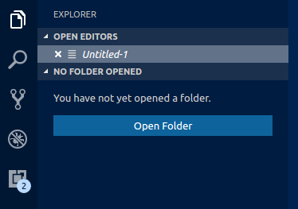

- `button.background`: Button background color.
- `button.foreground`: Button foreground color.
- `button.hoverBackground`: Button background color when hovering.

## Dropdown Control

A set of colors for all dropdown widgets such as in the Integrated Terminal or the Output panel.

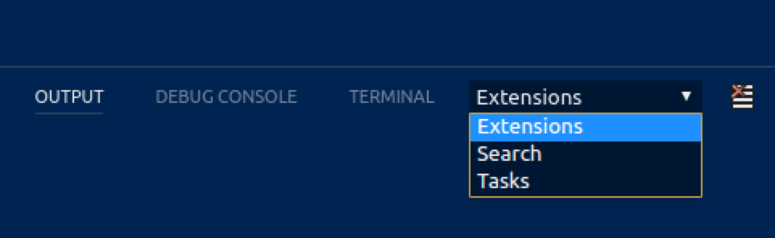

- `dropdown.background`: Dropdown background.
- `dropdown.border`: Dropdown border.
- `dropdown.foreground`: Dropdown foreground.

## Input Control

Colors for input controls such as in the Search view or the Find/Replace dialog.

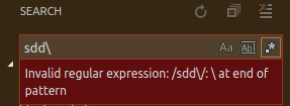

- `input.background`: Input box background.
- `input.border`: Input box border.
- `input.foreground`: Input box foreground.
- `input.placeholderForeground`: Input box foreground color for placeholder text.
- `inputOption.activeBorder`: Border color of activated options in input fields.
- `inputValidation.errorBackground`: Input validation background color for error severity.
- `inputValidation.errorBorder`: Input validation border color for error severity.
- `inputValidation.infoBackground`: Input validation background color for information severity.
- `inputValidation.infoBorder`: Input validation border color for information severity.
- `inputValidation.warningBackground`: Input validation background color for information warning.
- `inputValidation.warningBorder`: Input validation border color for warning severity.

## Scroll Bar Control

- `scrollbar.shadow`: Scroll Bar shadow to indicate that the view is scrolled.
- `scrollbarSlider.activeBackground`: Slider background color when active.
- `scrollbarSlider.background`: Slider background color.
- `scrollbarSlider.hoverBackground`: Slider background color when hovering.

## Badge

Badges are small information labels, for example, search results count.

- `badge.foreground`: Badge foreground color.
- `badge.background`: Badge background color.

## Progress Bar

- `progressBar.background`: Background color of the progress bar shown for long running operations.

## Lists and Trees

Colors for list and trees like the File Explorer. An active list/tree has keyboard focus, an inactive does not.

- `list.activeSelectionBackground`: List/Tree background color for the selected item when the list/tree is active.
- `list.activeSelectionForeground`: List/Tree foreground color for the selected item when the list/tree is active.
- `list.dropBackground`: List/Tree drag and drop background when moving items around using the mouse.
- `list.focusBackground`: List/Tree background color for the focused item when the list/tree is active.
- `list.highlightForeground`: List/Tree foreground color of the match highlights when searching inside the list/tree.
- `list.hoverBackground`: List/Tree background when hovering over items using the mouse.
- `list.inactiveSelectionBackground`: List/Tree background color for the selected item when the list/tree is inactive.
- `list.inactiveSelectionForeground`: List/Tree foreground color for the selected item when the list/tree is inactive. An active list/tree has keyboard focus, an inactive does not.
- `list.hoverForeground`: List/Tree foreground when hovering over items using the mouse.
- `list.focusForeground`: List/Tree foreground color for the focused item when the list/tree is active. An active list/tree has keyboard focus, an inactive does not.

## Activity Bar

The Activity Bar is displayed either on the far left or right of the workbench and allows fast switching between views of the Side Bar.

- `activityBar.background`: Activity Bar background color.
- `activityBar.dropBackground`: Drag and drop feedback color for the Activity Bar items.
- `activityBar.foreground`: Activity bar foreground color (for example used for the icons).
- `activityBar.border`: Activity Bar border color with the Side Bar.
- `activityBarBadge.background`: Activity notification badge background color.
- `activityBarBadge.foreground`: Activity notification badge foreground color.

## Side Bar

The Side Bar contains views like the Explorer and Search.

- `sideBar.background`: Side Bar background color.
- `sideBar.foreground`: Side Bar foreground color. The Side Bar is the container for views like Explorer and Search.
- `sideBar.border`: Side Bar border color on the side separating the editor.
- `sideBarTitle.foreground`: Side Bar title foreground color.
- `sideBarSectionHeader.background`: Side Bar section header background color.
- `sideBarSectionHeader.foreground`: Side Bar section header foreground color.

## Editor Groups & Tabs

Editor Groups are the containers of editors. There can be up to three editor groups. A Tab is the container of an editor. Multiple Tabs can be opened in one editor group.

- `editorGroup.background`: Background color of an editor group. The background color shows up when dragging editor groups around.
- `editorGroup.border`: Color to separate multiple editor groups from each other.
- `editorGroup.dropBackground`: Background color when dragging editors around.
- `editorGroupHeader.noTabsBackground`: Background color of the editor group title header when Tabs are disabled.
- `editorGroupHeader.tabsBackground`: Background color of the Tabs container.
- `editorGroupHeader.tabsBorder`: Border color of the editor group title header when tabs are enabled. Editor groups are the containers of editors.
- `tab.activeBackground`: Active Tab background color.
- `tab.activeForeground`: Active Tab foreground color in an active group.
- `tab.border`: Border to separate Tabs from each other.
- `tab.activeBorder`: Bottom border for the active tab.
- `tab.unfocusedActiveBorder`: Bottom border for the active tab in an inactive editor group.
- `tab.inactiveBackground`: Inactive Tab background color.
- `tab.inactiveForeground`: Inactive Tab foreground color in an active group.
- `tab.unfocusedActiveForeground`: Active tab foreground color in an inactive editor group.
- `tab.unfocusedInactiveForeground`: Inactive tab foreground color in an inactive editor group.

## Editor Colors

The most prominent editor colors are the token colors that are based on the language grammar installed. These colors are defined by the Color Theme and can (currently) not be customized in the settings. All other colors are listed here:

- `editor.background`: Editor background color.
- `editor.foreground`: Editor default foreground color.
- `editorLineNumber.foreground`: Color of editor line numbers.
- `editorCursor.foreground`: Color of the editor cursor.

Selection colors are visible when selecting one or more characters. In addition to the selection also all regions with the same content are highlighted.

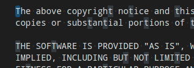

- `editor.selectionBackground`: Color of the editor selection.
- `editor.selectionHighlightBackground`: Color for regions with the same content as the selection.
- `editor.inactiveSelectionBackground`: Color of the selection in an inactive editor.

Word highlight colors are visible when the cursor is inside a symbol or a word. Depending on the language support available for the file type, all matching references and declarations are highlighted and read and write accesses get different colors. If document symbol language support is not available, this falls back to word highlighting.

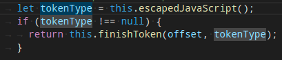

- `editor.wordHighlightBackground`: Background color of a symbol during read-access, for example when reading a variable.
- `editor.wordHighlightStrongBackground`: Background color of a symbol during write-access, for example when writing to a variable.

Find colors depend on the current find string in the Find/Replace dialog.

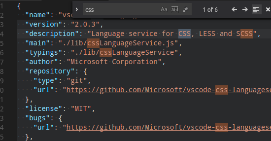

- `editor.findMatchBackground`: Color of the current search match.
- `editor.findMatchHighlightBackground`: Color of the other search matches.
- `editor.findRangeHighlightBackground`: Color the range limiting the search (Enable 'Find in Selection' in the find widget)

The hover highlight is shown behind the symbol for which a hover is shown.

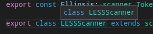

- `editor.hoverHighlightBackground`: Highlight below the word for which a hover is shown.

The current line is typically shown as either background highlight or a border (not both).

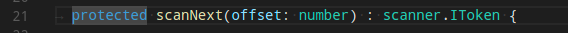

- `editor.lineHighlightBackground`: Background color for the highlight of line at the cursor position.
- `editor.lineHighlightBorder`: Background color for the border around the line at the cursor position.

The link color is visible when clicking on a link.

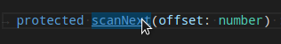

- `editorLink.activeForeground`: Color of active links.

The range highlight is visible when selecting a search result.

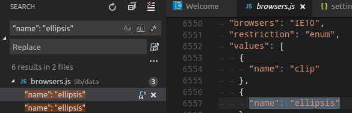

- `editor.rangeHighlightBackground`: Background color of highlighted ranges, like by like by the Quick Open, Symbol in File and Find features.

To see the editor white spaces, enable **Toggle Render Whitespace**.

- `editorWhitespace.foreground`: Color of whitespace characters in the editor.

To see the editor indent guides, set `"editor.renderIndentGuides": true`.

- `editorIndentGuide.background`: Color of the editor indentation guides.

To see editor rulers, define their location with `"editor.rulers"`

- `editorRuler.foreground`: Color of the editor rulers.

Code Lens:

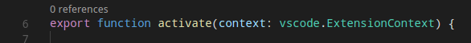

- `editorCodeLens.foreground`: Foreground color of an editor CodeLens.

Bracket matches:

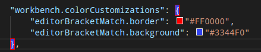

- `editorBracketMatch.background`: Background color behind matching brackets.
- `editorBracketMatch.border`: Color for matching brackets boxes.

Overview ruler:

This ruler is located beneath the scrollbar on the right edge of the editor and gives an overview of the decorations in the editor.

- `editorOverviewRuler.border`: Color of the overview ruler border.
- `editorOverviewRuler.findMatchForeground`: Overview ruler marker color for find matches.
- `editorOverviewRuler.rangeHighlightForeground`: Overview ruler marker color for highlighted ranges, like by the Quick Open, Symbol in File and Find features.
- `editorOverviewRuler.selectionHighlightForeground`: Overview ruler marker color for selection highlights.
- `editorOverviewRuler.wordHighlightForeground`: Overview ruler marker color for symbol highlights.
- `editorOverviewRuler.wordHighlightStrongForeground`: Overview ruler marker color for write-access symbol highlights.
- `editorOverviewRuler.modifiedForeground`: Overview ruler marker color for modified content.
- `editorOverviewRuler.addedForeground`: Overview ruler marker color for added content.
- `editorOverviewRuler.deletedForeground`: Overview ruler marker color for deleted content.
- `editorOverviewRuler.errorForeground`: Overview ruler marker color for errors.
- `editorOverviewRuler.warningForeground`: Overview ruler marker color for warnings.
- `editorOverviewRuler.infoForeground`: Overview ruler marker color for infos.

Errors and warnings:

- `editorError.foreground`: Foreground color of error squigglies in the editor.
- `editorError.border`: Border color of error squigglies in the editor.
- `editorWarning.foreground`: Foreground color of warning squigglies in the editor.
- `editorWarning.border`: Border color of warning squigglies in the editor.
- `editorInfo.foreground`: Foreground color of info squigglies in the editor.
- `editorInfo.border`: Border color of info squigglies in the editor.

The gutter contains the glyph margins and the line numbers:

- `editorGutter.background`: Background color of the editor gutter.
- `editorGutter.modifiedBackground`: Editor gutter background color for lines that are modified.
- `editorGutter.addedBackground`: Editor gutter background color for lines that are added.
- `editorGutter.deletedBackground`: Editor gutter background color for lines that are deleted.

## Diff Editor Colors

For coloring inserted and removed text, use either a background or a border color but not both.

- `diffEditor.insertedTextBackground`: Background color for inserted text.
- `diffEditor.insertedTextBorder`: Outline color for inserted text.
- `diffEditor.removedTextBackground`: Background color for removed text.
- `diffEditor.removedTextBorder`: Outline color for removed text.

## Editor Widget Colors

The Editor widget is shown in front of the editor content. Examples are the Find/Replace dialog, the suggestion widget, and the editor hover.

- `editorWidget.background`: Background color of editor widgets, such as Find/Replace.
- `editorWidget.border`: Border color of the editor widget unless the widget does not contain a border or defines its own border color.

- `editorSuggestWidget.background`: Background color of the suggestion widget.
- `editorSuggestWidget.border`: Border color of the suggestion widget.
- `editorSuggestWidget.foreground`: Foreground color of the suggestion widget.
- `editorSuggestWidget.highlightForeground`: Color of the match highlights in the suggestion widget.
- `editorSuggestWidget.selectedBackground`: Background color of the selected entry in the suggestion widget.

- `editorHoverWidget.background`: Background color of the editor hover.
- `editorHoverWidget.border`: Border color of the editor hover.

The Debug Exception widget is a peek view that shows in the editor when debug stops at an exception.

- `debugExceptionWidget.background`: Exception widget background color.
- `debugExceptionWidget.border`: Exception widget border color.

The editor marker view shows when navigating to errors and warnings in the editor (**Go to Next Error or Warning** command).

- `editorMarkerNavigation.background`: Editor marker navigation widget background.
- `editorMarkerNavigationError.background`: Editor marker navigation widget error color.
- `editorMarkerNavigationWarning.background`: Editor marker navigation widget warning color.
- `editorMarkerNavigationInfo.background`: Editor marker navigation widget info color.

## Peek View Colors

Peek views are used to show references and declarations as a view inside the editor.

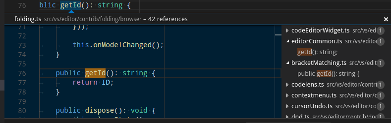

- `peekView.border`: Color of the peek view borders and arrow.
- `peekViewEditor.background`: Background color of the peek view editor.
- `peekViewEditorGutter.background`: Background color of the gutter in the peek view editor.
- `peekViewEditor.matchHighlightBackground`: Match highlight color in the peek view editor.
- `peekViewResult.background`: Background color of the peek view result list.
- `peekViewResult.fileForeground`: Foreground color for file nodes in the peek view result list.
- `peekViewResult.lineForeground`: Foreground color for line nodes in the peek view result list.
- `peekViewResult.matchHighlightBackground`: Match highlight color in the peek view result list.
- `peekViewResult.selectionBackground`: Background color of the selected entry in the peek view result list.
- `peekViewResult.selectionForeground`: Foreground color of the selected entry in the peek view result list.
- `peekViewTitle.background`: Background color of the peek view title area.
- `peekViewTitleDescription.foreground`: Color of the peek view title info.
- `peekViewTitleLabel.foreground`: Color of the peek view title.

## Merge Conflicts

Merge conflict decorations are shown when the editor contains special diff ranges.

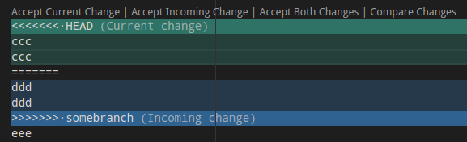

- `merge.currentHeaderBackground`: Current header background in inline merge conflicts.
- `merge.currentContentBackground`: Current content background in inline merge conflicts.
- `merge.incomingHeaderBackground`: Incoming header background in inline merge conflicts.
- `merge.incomingContentBackground`: Incoming content background in inline merge conflicts.
- `merge.border`: Border color on headers and the splitter in inline merge conflicts.
- `editorOverviewRuler.currentContentForeground`: Current overview ruler foreground for inline merge conflicts.
- `editorOverviewRuler.incomingContentForeground`: Incoming overview ruler foreground for inline merge conflicts.
- `editorOverviewRuler.commonContentForeground`: Common ancestor overview ruler foreground for inline merge conflicts.

## Panel Colors

Panels are shown below the editor area and contain views like Output and Integrated Terminal.

- `panel.background`: Panel background color.
- `panel.border`: Panel border color on the top separating to the editor.
- `panelTitle.activeBorder`: Border color for the active panel title.
- `panelTitle.activeForeground`: Title color for the active panel.
- `panelTitle.inactiveForeground`: Title color for the inactive panel.

## Status Bar Colors

The Status Bar is shown in the bottom of the workbench.

- `statusBar.background`: Standard Status Bar background color.
- `statusBar.foreground`: Status Bar foreground color.
- `statusBar.border`: Status Bar border color separating the Status Bar and editor.
- `statusBar.debuggingBackground`: Status Bar background color when a program is being debugged.
- `statusBar.debuggingForeground`: Status Bar foreground color when a program is being debugged.
- `statusBar.debuggingBorder`: Status Bar border color separating the Status Bar and editor when a program is being debugged.
- `statusBar.noFolderForeground`: Status Bar foreground color when no folder is opened.
- `statusBar.noFolderBackground`: Status Bar background color when no folder is opened.
- `statusBar.noFolderBorder`: Status Bar border color separating the Status Bar and editor when no folder is opened.
- `statusBarItem.activeBackground`: Status Bar item background color when clicking.
- `statusBarItem.hoverBackground`: Status Bar item background color when hovering.
- `statusBarItem.prominentBackground`: Status Bar prominent items background color. Prominent items stand out from other Status Bar entries to indicate importance.
- `statusBarItem.prominentHoverBackground`: Status Bar prominent items background color when hovering. Prominent items stand out from other Status Bar entries to indicate importance.

## Title Bar Colors (macOS)

- `titleBar.activeBackground`: Title Bar background when the window is active. Note that this color is currently only supported on macOS.
- `titleBar.activeForeground`: Title Bar foreground when the window is active. Note that this color is currently only supported on macOS.
- `titleBar.inactiveBackground`: Title Bar background when the window is inactive. Note that this color is currently only supported on macOS.
- `titleBar.inactiveForeground`: Title Bar foreground when the window is inactive. Note that this color is currently only supported on macOS.

## Notification Dialog Colors

Notifications slide in from the top of the workbench.


- `notification.background`: Notifications background color.
- `notification.foreground`: Notifications foreground color.
- `notification.buttonBackground`: Notifications button background color.
- `notification.buttonHoverBackground`: Notifications button hover background color.
- `notification.buttonForeground`: Notifications button foreground color.
- `notification.infoBackground`: Notifications info badge background color.
- `notification.infoForeground`: Notifications info badge foreground color.
- `notification.warningBackground`: Notifications warning badge background color.
- `notification.warningForeground`: Notifications warning badge foreground color.
- `notification.errorBackground`: Notifications error badge background color.
- `notification.errorForeground`: Notifications error badge foreground color.

## Extensions

- `extensionButton.prominentForeground`: Extension view button foreground color (for example **Install** button).
- `extensionButton.prominentBackground`: Extension view button background color.
- `extensionButton.prominentHoverBackground`: Extension view button background hover color.

## Quick Picker

- `pickerGroup.border`: Quick picker (Quick Open) color for grouping borders.
- `pickerGroup.foreground`: Quick picker (Quick Open) color for grouping labels.

## Integrated Terminal Colors

- `terminal.background`: The background of the Integrated Terminal's viewport.
- `terminal.foreground`: The default foreground color of the Integrated Terminal.
- `terminal.ansiBlack`: 'Black' ANSI color in the terminal.
- `terminal.ansiBlue`: 'Blue' ANSI color in the terminal.
- `terminal.ansiBrightBlack`: 'BrightBlack' ANSI color in the terminal.
- `terminal.ansiBrightBlue`: 'BrightBlue' ANSI color in the terminal.
- `terminal.ansiBrightCyan`: 'BrightCyan' ANSI color in the terminal.
- `terminal.ansiBrightGreen`: 'BrightGreen' ANSI color in the terminal.
- `terminal.ansiBrightMagenta`: 'BrightMagenta' ANSI color in the terminal.
- `terminal.ansiBrightRed`: 'BrightRed' ANSI color in the terminal.
- `terminal.ansiBrightWhite`: 'BrightWhite' ANSI color in the terminal.
- `terminal.ansiBrightYellow`: 'BrightYellow' ANSI color in the terminal.
- `terminal.ansiCyan`: 'Cyan' ANSI color in the terminal.
- `terminal.ansiGreen`: 'Green' ANSI color in the terminal.
- `terminal.ansiMagenta`: 'Magenta' ANSI color in the terminal.
- `terminal.ansiRed`: 'Red' ANSI color in the terminal.
- `terminal.ansiWhite`: 'White' ANSI color in the terminal.
- `terminal.ansiYellow`: 'Yellow' ANSI color in the terminal.

## Debug

- `debugToolBar.background`: Debug toolbar background color.

## Welcome Page

- `welcomePage.buttonBackground`: Background color for the buttons on the Welcome page.
- `welcomePage.buttonHoverBackground`: Hover background color for the buttons on the Welcome page.
- `walkThrough.embeddedEditorBackground`: Background color for the embedded editors on the Interactive Playground.

## Git Colors

- `gitDecoration.modifiedResourceForeground`: Color for modified git resources. Used file labels and the SCM viewlet.
- `gitDecoration.deletedResourceForeground`: Color for deleted git resources. Used file labels and the SCM viewlet.
- `gitDecoration.untrackedResourceForeground`: Color for untracked git resources. Used file labels and the SCM viewlet.
- `gitDecoration.ignoredResourceForeground`: Color for ignored git resources. Used file labels and the SCM viewlet.
- `gitDecoration.conflictingResourceForeground`: Color for conflicting git resources. Used file labels and the SCM viewlet.
