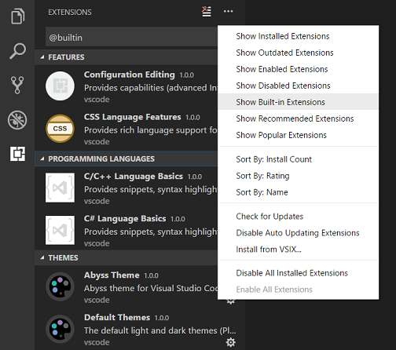
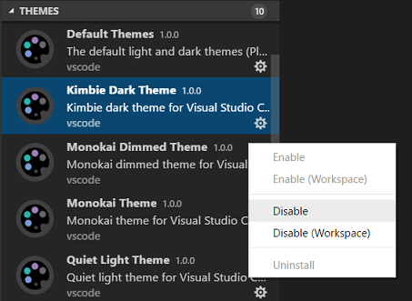
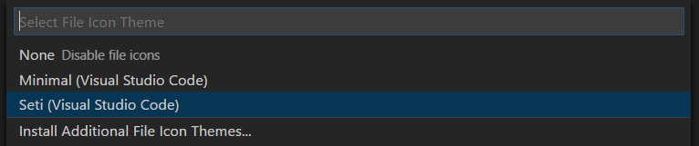

# Themes

## Color Themes

Color themes enable you to modify the colors in the Visual Studio Code user interface to match your preferences and work environment. A Color Theme affects both the VS Code user interface elements and the editor highlighting colors.


To select a different Color Theme:

1. Select the **File** > **Preferences** > **Theme** > **Color Theme** menu item, or use the **Preferences: Color Theme** command (`kb(workbench.action.selectTheme)`) to display the Color Theme picker.

1. Use the `kbstyle(Up)` and `kbstyle(Down)` keys to navigate through the list and preview the colors of the theme.

1. Select the theme you want and press `kbstyle(Enter)`.

The active color theme is stored in your user [settings](/docs/getstarted/settings.md) (keyboard shortcut `kb(workbench.action.openSettings)`).

```json
  // Specifies the color theme used in the workbench.
  "workbench.colorTheme": "Solarized Dark"
```

> **Tip:** By default, the theme is stored in your user settings and applies globally to all workspaces. You can also configure a workspace-specific theme. To do so, set a theme in the Workspace [settings](/docs/getstarted/settings.md#workspace-settings).
>
> 

## Color Themes from the Marketplace

There are several out-of-the-box color themes in VS Code for you to try. Many more themes have been uploaded to the VS Code [Extension Marketplace](/docs/editor/extension-marketplace.md) by the community.

You can select Color Themes from the VS Code Marketplace directly from the Color Theme picker by selecting **Browse Additional Color Themes...**.


Alternately, you can search for themes in the Extensions view (`kb(workbench.view.extensions)`) search box by using the `@category:"themes"` filter.


## Automatically switch based on OS color scheme

Windows and macOS support light and dark color schemes. There is a setting, `window.autoDetectColorScheme`, that instructs VS Code to listen to changes to the OS's color scheme and switch to a matching theme accordingly.

Similarly, you can use the `window.autoDetectHighContrast` setting to automatically detect if the OS switched to a high-contrast color scheme.

To customize the themes that are used when a color scheme changes, you can set the preferred light, dark, and high contrast themes in the Settings editor:

* **Workbench: Preferred Dark Color Theme** - defaults to Dark Modern
* **Workbench: Preferred Light Color Theme** - defaults to Light Modern
* **Workbench: Preferred High Contrast Color Theme** - defaults to Dark High Contrast
* **Workbench: Preferred High Contrast Light Color Theme** - defaults to Light High Contrast


## Customize a Color Theme

### Workbench colors

You can customize your active color theme with the `workbench.colorCustomizations` and `editor.tokenColorCustomizations` user [settings](/docs/getstarted/settings.md).

To set the colors of VS Code UI elements such as list & trees (File Explorer, suggestions widget), diff editor, Activity Bar, notifications, scroll bar, split view, buttons, and more, use `workbench.colorCustomizations`.


You can use IntelliSense while setting `workbench.colorCustomizations` values or, for a list of all customizable colors, see the [Theme Color Reference](/api/references/theme-color.md).

To make customizations to a specific theme, use the following syntax:

```json
"workbench.colorCustomizations": {
    "[Monokai]": {
        "sideBar.background": "#347890"
    }
}
```

If a customization applies to more than one theme, you can name multiple themes or use `*` as a wildcard at the beginning and end of the name:

```json
"workbench.colorCustomizations": {
    "[Abyss][Red]": {
        "activityBar.background": "#ff0000"
    },
    "[Monokai*]": {
        "activityBar.background": "#ff0000"
    }
}
```

If a theme sets a color or border that you don't like, you can use `default` to set it back to the original value:

```json
  "workbench.colorCustomizations": {
      "diffEditor.removedTextBorder": "default"
  }
```

### Editor syntax highlighting

To tune the editor's syntax highlighting colors, use `editor.tokenColorCustomizations` in your user [settings](/docs/getstarted/settings.md) `settings.json` file:


A preconfigured set of syntax tokens ('comments', 'strings', ...) is available for the most common constructs. If you want more, you can do so by directly specifying TextMate theme color rules:


>**Note**: Directly configuring TextMate rules is an advanced skill, as you need to understand how TextMate grammars work. Go to the [Color Theme guide](/api/extension-guides/color-theme.md) for more information.

To customize specific themes, you can do this in one of the following ways:

```json
"editor.tokenColorCustomizations": {
    "[Monokai]": {
        "comments": "#229977"
    },
    "[*Dark*]": {
        "variables": "#229977"
    },
    "[Abyss][Red]": {
        "keywords": "#f00"
    }
}
```

### Editor semantic highlighting

Some languages (currently: TypeScript, JavaScript, Java) provide semantic tokens. Semantic tokens are based on the language service's symbol understanding and are more accurate than the syntax tokens coming from the TextMate grammars that are driven by regular expressions. The semantic highlighting that is computed from the semantic tokens goes on top of syntax highlighting and can correct and enrich the highlighting as seen in the following example:

The "Tomorrow Night Blue" color theme without semantic highlighting:


The "Tomorrow Night Blue" color theme with semantic highlighting:


Notice the color differences based on language service symbol understanding:

* line 10: `languageModes` is colored as a parameter.
* line 11: `Range` and `Position` are colored as classes and `document` as a parameter.
* line 13: `getFoldingRanges` is colored as a function.

The settings `editor.semanticHighlighting.enabled` serves as the main control on whether semantic highlighting is applied. It can have values `true`, `false`, and `configuredByTheme`.

* `true` and `false` turn semantic highlighting on or off for all themes.
* `configuredByTheme` is the default and lets each theme control whether semantic highlighting is enabled or not. All the themes that ship with VS Code (for example, the "Dark+" default) have semantic highlighting enabled by default.

You can override the theme setting by:

```json
"editor.semanticTokenColorCustomizations": {
    "[Rouge]": {
        "enabled": true
    }
}
```

When semantic highlighting is enabled and available for a language, it is up to the theme to configure whether and how semantic tokens are colored. Some semantic tokens are standardized and map to well-established TextMate scopes. If the theme has a coloring rule for these TextMate scopes, the semantic tokens are rendered with that color, without the need for any additional coloring rules.

Additional styling rules can be configured in `editor.semanticTokenColorCustomizations"`:

```json
"editor.semanticTokenColorCustomizations": {
    "[Rouge]": {
        "enabled": true,
        "rules": {
            "*.declaration": { "bold": true }
        }
    }
}
```

To see what semantic tokens are computed and how they are styled, you can use the scope inspector (**Developer: Inspect Editor Tokens and Scopes**), which displays information for the text at the current cursor position.


If semantic tokens are available for the language at the given position and enabled by theme, the inspect tool shows a section **semantic token type**. The section shows the semantic token information (type and any number of modifiers) and the styling rules that apply.

More information on semantic tokens and styling rule syntax can be found in the [Semantic Highlighting Guide](/api/language-extensions/semantic-highlight-guide.md).

## Create your own Color Theme

Creating and publishing a theme extension is easy. Customize your colors in your user settings then generate a theme definition file with the **Developer: Generate Color Theme From Current Settings** command.

VS Code's Yeoman [extension generator](/api/get-started/your-first-extension.md) helps you generate the rest of the extension.

See the [Create a new Color Theme](/api/extension-guides/color-theme.md#create-a-new-color-theme) article in our Extension API section to learn more.

## Remove default Color Themes

If you'd like to remove some of the default themes shipped with VS Code from the Color Theme picker, you can disable them from the Extensions view (`kb(workbench.view.extensions)`). Select the **Filter Extensions** button from the top of the Extensions view, select the **Built-in** option, and you see a **THEMES** section that lists the default themes.



You can disable a built-in theme extension, as you would any other VS Code [extension](/docs/editor/extension-marketplace.md) with the **Disable** command on the gear context menu.



## File Icon Themes

File icons indicate a particular file type. These icons are shown alongside the file name in the Explorer view and in tabbed headings. File Icon Themes can be contributed by extensions.

To select a different File Icon Theme:

1. Select the **File** > **Preferences** > **Theme** > **File Icon Theme** menu item, or use the **Preferences: File Icon Theme** command to display the File Icon Theme picker.

1. Use the `kbstyle(Up)` and `kbstyle(Down)` keys to navigate through the list and preview the icons of the theme.

1. Select the theme you want and press `kbstyle(Enter)`.



By default, the **Seti** File Icon Theme is used and those are the icons you see in the Explorer view. VS Code remembers your File Icon Theme selection across restarts. You can disable file icons by selecting **None**.

VS Code ships with two file icon themes: **Minimal** and **Seti**. To install more File Icon Themes, select the **Install Additional File Icon Themes** item in the File Icon Theme picker, which opens the Extensions view, filtered by icon themes.

You can also browse the [VS Code Marketplace](https://marketplace.visualstudio.com/vscode/Themes) site directly to find available themes.

The active File Icon Theme is persisted in your user [settings](/docs/getstarted/settings.md) (keyboard shortcut `kb(workbench.action.openSettings)`).

```json
  // Specifies the file icon theme used in the workbench.
  "workbench.iconTheme": "vs-seti"
```

## Create your own File Icon Theme

You can create your own File Icon Theme from icons (preferably SVG), see the [File Icon Theme](/api/extension-guides/file-icon-theme.md) article in our Extension API section for details.

## VS Code for the Web

VS Code for the Web provides a free, zero-install VS Code experience running entirely in your browser at [https://vscode.dev](https://vscode.dev).

You can share and experience color themes through VS Code for the Web through the URL schema: `https://vscode.dev/editor/theme/<extensionId>`.

For instance, you can go to [https://vscode.dev/editor/theme/sdras.night-owl](https://vscode.dev/editor/theme/sdras.night-owl) to experience the [Night Owl theme](https://marketplace.visualstudio.com/items?itemName=sdras.night-owl) without having to go through the download and install process.

You can learn more about previewing and sharing themes with in the [VS Code for the Web documentation](/docs/editor/vscode-web.md#themes).

## Product Icon Themes

Product Icon Themes enable you to change the icons in the VS Code user interface, other than the icons for specific file types. For example, you can modify the icons for the views in the Activity Bar, or the icons in the title bar for changing the layout.

Notice in the following image how the Activity Bar icons are updated when selecting a different Product Icon Theme.


To select a different Product Icon Theme:

1. Select the **File** > **Preferences** > **Theme** > **Product Icon Theme** menu item, or use the **Preferences: Product Icon Theme** command to display the Product Icon Theme picker.

1. Use the `kbstyle(Up)` and `kbstyle(Down)` keys to navigate through the list and preview the icons of the theme.

1. Select the theme you want and press `kbstyle(Enter)`.

By default, VS Code comes with one Product Icon Theme, **Default**. You can select more Product Icon Themes from the VS Code Marketplace directly from the Product Icon Theme picker by selecting **Browse Additional Product Icon Themes...**.

## Next steps

Themes are just one way to customize VS Code. If you'd like to learn more about VS Code customization and extensibility, try these articles:

* [Settings](/docs/getstarted/settings) -  Learn how to configure VS Code to your preferences through user and workspace settings.
* [Snippets](/docs/editor/userdefinedsnippets.md) - Add extra snippets to your favorite language.
* [Extension API](/api) - Learn about other ways to extend VS Code.
* [Color Theme](/api/extension-guides/color-theme.md) - Color Theme extension API.
* [File Icon Theme](/api/extension-guides/file-icon-theme.md) - File Icon Theme extension API.
