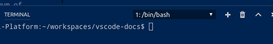
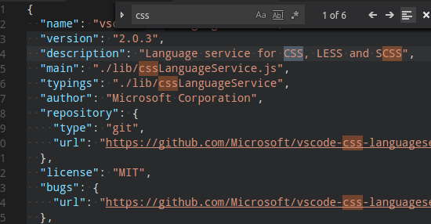
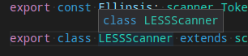

---
---
# Themable Colors

## Contrast Colors

The contrast colors are typically only set be high contrast themes. If set they add an additional border around items across the UI to increase the contrast. 

- `contrastActiveBorder`: An extra border around active elements to separate them from others for greater contrast.
- `contrastBorder`: An extra border around elements to separate them from others for greater contrast.

## Base Colors

- `focusBorder`: Overall border color for focused elements. This color is only used if not overridden by a component.
- `foreground`: Overall foreground color. This color is only used if not overridden by a component.
- `widget.shadow`: Shadow color of widgets such as find/replace inside the editor.

## Button Control

A set of colors for button widgets such as `Open Folder` button in the explorer of a new window

- `button.background`: Button background color.
- `button.foreground`: Button foreground color.
- `button.hoverBackground`: Button background color when hovering.

## Dropdown Control

A set of colors for all dropdown widgets such as in the terminal or the output panel.

- `dropdown.background`: Dropdown background.
- `dropdown.border`: Dropdown border.
- `dropdown.foreground`: Dropdown foreground.

## Input Control

Colors for input controls such as in the search view or the find/replace dialog.

- `input.background`: Input box background.
- `input.border`: Input box border.
- `input.foreground`: Input box foreground.
- `inputOption.activeBorder`: Border color of activated options in input fields.
- `inputValidation.errorBackground`: Input validation background color for error severity.
- `inputValidation.errorBorder`: Input validation border color for error severity.
- `inputValidation.infoBackground`: Input validation background color for information severity.
- `inputValidation.infoBorder`: Input validation border color for information severity.
- `inputValidation.warningBackground`: Input validation background color for information warning.
- `inputValidation.warningBorder`: Input validation border color for warning severity.

## Scrollbar Control

- `scrollbar.shadow`: Scrollbar shadow to indicate that the view is scrolled.
- `scrollbarSlider.activeBackground`: Slider background color when active.
- `scrollbarSlider.background`: Slider background color.
- `scrollbarSlider.hoverBackground`: Slider background color when hovering.

## Lists and Trees

Colors for list and trees like the File Explorer

- `list.activeSelectionBackground`: List/Tree background color for the selected item when the list/tree is active. An active list/tree has keyboard focus, an inactive does not.
- `list.activeSelectionForeground`: List/Tree foreground color for the selected item when the list/tree is active. An active list/tree has keyboard focus, an inactive does not.
- `list.dropBackground`: List/Tree drag and drop background when moving items around using the mouse.
- `list.focusBackground`: List/Tree background color for the focused item when the list/tree is active. An active list/tree has keyboard focus, an inactive does not.
- `list.highlightForeground`: List/Tree foreground color of the match highlights when searching inside the list/tree.
- `list.hoverBackground`: List/Tree background when hovering over items using the mouse.
- `list.inactiveSelectionBackground`: List/Tree background color for the selected item when the list/tree is inactive. An active list/tree has keyboard focus, an inactive does not.

## Activity Bar

The activity bar is showing either on the far left or right.

- `activityBar.background`: Activity bar background color. The activity bar is showing on the far left or right and allows to switch between views of the side bar.
- `activityBar.dropBackground`: Drag and drop feedback color for the activity bar items. The activity bar is showing on the far left or right and allows to switch between views of the side bar.
- `activityBar.foreground`: Activity bar foreground color (e.g. used for the icons). The activity bar is showing on the far left or right and allows to switch between views of the side bar.
- `activityBarBadge.background`: Activity notification badge background color. The activity bar is showing on the far left or right and allows to switch between views of the side bar.
- `activityBarBadge.foreground`: Activity notification badge foreground color. The activity bar is showing on the far left or right and allows to switch between views of the side bar.

## Side Bar

The side bar contains views like the Explorer and the Search view.

- `sideBar.background`: Side bar background color. The side bar is the container for views like explorer and search.
- `sideBarSectionHeader.background`: Side bar section header background color. The side bar is the container for views like explorer and search.
- `sideBarTitle.foreground`: Side bar title foreground color. The side bar is the container for views like explorer and search.

## Editor Groups & Tabs

Editor Groups are the containers of tabs. A tab is the container of an editor.

- `editorGroup.background`: Background color of an editor group. Editor groups are the containers of editors. The background color shows up when dragging editor groups around.
- `editorGroup.border`: Color to separate multiple editor groups from each other. Editor groups are the containers of editors.
- `editorGroup.dropBackground`: Background color when dragging editors around.
- `editorGroupHeader.noTabsBackground`: Background color of the editor group title header when tabs are disabled. Editor groups are the containers of editors.
- `editorGroupHeader.tabsBackground`: Background color of the tabs container. Tabs are the containers for editors in the editor area. Multiple tabs can be opened in one editor group. There can be multiple editor groups.

- `tab.activeBackground`: Active tab background color. Tabs are the containers for editors in the editor area. Multiple tabs can be opened in one editor group. There can be multiple editor groups.
- `tab.activeForeground`: Active tab foreground color in an active group. Tabs are the containers for editors in the editor area. Multiple tabs can be opened in one editor group. There can be multiple editor groups.
- `tab.border`: Border to separate tabs from each other. Tabs are the containers for editors in the editor area. Multiple tabs can be opened in one editor group. There can be multiple editor groups.
- `tab.inactiveBackground`: Inactive tab background color. Tabs are the containers for editors in the editor area. Multiple tabs can be opened in one editor group. There can be multiple editor groups.
- `tab.inactiveForeground`: Inactive tab foreground color in an active group. Tabs are the containers for editors in the editor area. Multiple tabs can be opened in one editor group. There can be multiple editor groups.

# Editor Colors

The most prominent editor colors are the token colors that are based on the language grammar installed. These colors are defined by the color theme and can (currently) not be customized in the settings. All other colors are listed here:

- `editor.background`: Editor background color.
- `editor.foreground`: Editor default foreground color.
- `editorLineNumber.foreground`: Color of editor line numbers.
- `editorCursor.foreground`: Color of the editor cursor.

Selection colors are visible when selecting one or more characters. In addition to the selection also all regions with the same content are highlighted.

- `editor.selectionBackground`: Color of the editor selection.
- `editor.selectionHighlightBackground`: Color for regions with the same content as the selection.
- `editor.inactiveSelectionBackground`: Color of the selection in an inactive editor.

Word highlight colors are visible when the cursor is inside a symbol or a word. Depending on the language support available for the file type, all matching references and declarations are highlighted and read and write accesses get different colors. If document symbol language support is not available, this falls back to word highlighting.

- `editor.wordHighlightBackground`: Background color of a symbol during read-access, like reading a variable.
- `editor.wordHighlightStrongBackground`: Background color of a symbol during write-access, like writing to a variable.

Find colors depend on the current find string in the Find/Replace dialog.

- `editor.findMatchBackground`: Color of the current search match.
- `editor.findMatchHighlightBackground`: Color of the other search matches.
- `editor.findRangeHighlightBackground`: Color the range limiting the search.

The hover highlight is shown behind the symbol for which a hover is shown.

- `editor.hoverHighlightBackground`: Highlight below the word for which a hover is shown.

The current line is typically shown as either background highlight or a border (not both).

- `editor.lineHighlightBackground`: Background color for the highlight of line at the cursor position.
- `editor.lineHighlightBorder`: Background color for the border around the line at the cursor position.

The link color is visible when clicking on a link.

- `editorLink.activeForeground`: Color of active links.

The range highlight is visible when selecting a search result.

- `editor.rangeHighlightBackground`: Background color of highlighted ranges, like by quick open and find features.

To see the editor white spaces enable `Toggle Render Whitespaces`.

- `editorWhitespace.foreground`: Color of whitespace characters in the editor.

To see the editor indent guides, configure `"editor.renderIndentGuides": true`.

- `editorIndentGuide.background`: Color of the editor indentation guides.

## Diff Editor Colors

For coloring the inserted and removed text parts either a background or a border should be used (not both).

- `diffEditor.insertedTextBackground`: Background color for text that got inserted.
- `diffEditor.insertedTextBorder`: Outline color for the text that got inserted.
- `diffEditor.removedTextBackground`: Background color for text that got removed.
- `diffEditor.removedTextBorder`: Outline color for text that got removed.

## Editor Widget Colors

Editor widget show up in front of the editor content. Examples are the Find/Replace dialog, the suggestion widget or the editor hover.

- `editorWidget.background`: Background color of editor widgets, such as find/replace.

- `editorSuggestWidget.background`: Background color of the suggest widget.
- `editorSuggestWidget.border`: Border color of the suggest widget.
- `editorSuggestWidget.foreground`: Foreground color of the suggest widget.
- `editorSuggestWidget.highlightForeground`: Color of the match highlights in the suggest widget.
- `editorSuggestWidget.selectedBackground`: Background color of the selected entry in the suggest widget.

- `editorHoverWidget.background`: Background color of the editor hover.
- `editorHoverWidget.border`: Border color of the editor hover.

The debug exception widget is a peek view that shows in the editor when debug stops at an exception.

- `debugExceptionWidget.background`: Exception widget background color.
- `debugExceptionWidget.border`: Exception widget border color.

The editor marker view shows when navigating to errors and warnings in the editor (`Goto Next Error or Warning` command).

- `editorMarkerNavigation.background`: Editor marker navigation widget background.
- `editorMarkerNavigationError.background`: Editor marker navigation widget error color.
- `editorMarkerNavigationWarning.background`: Editor marker navigation widget warning color.

## Peek View Colors

- `peekView.border`: Color of the peek view borders and arrow.
- `peekViewEditor.background`: Background color of the peek view editor.
- `peekViewEditor.matchHighlightBackground`: Match highlight color in the peek view editor.
- `peekViewResult.background`: Background color of the peek view result list.
- `peekViewResult.fileForeground`: Foreground color for file nodes in the peek view result list.
- `peekViewResult.lineForeground`: Foreground color for line nodes in the peek view result list.
- `peekViewResult.matchHighlightBackground`: Match highlight color in the peek view result list.
- `peekViewResult.selectionBackground`: Background color of the selected entry in the peek view result list.
- `peekViewResult.selectionForeground`: Foreground color of the selected entry in the peek view result list.
- `peekViewTitle.background`: Background color of the peek view title area.
- `peekViewTitleDescription.foreground`: Color of the peek view title info.
- `peekViewTitleLabel.foreground`: Color of the peek view title.

## Panel Colors

- `panel.background`: Panel background color. Panels are shown below the editor area and contain views like output and integrated terminal.
- `panel.border`: Panel border color on the top separating to the editor. Panels are shown below the editor area and contain views like output and integrated terminal.
- `panelTitle.activeBorder`: Border color for the active panel title. Panels are shown below the editor area and contain views like output and integrated terminal.
- `panelTitle.activeForeground`: Title color for the active panel. Panels are shown below the editor area and contain views like output and integrated terminal.
- `panelTitle.inactiveForeground`: Title color for the inactive panel. Panels are shown below the editor area and contain views like output and integrated terminal.

## Status Bar Colors

- `statusBar.background`: Standard status bar background color. The status bar is shown in the bottom of the window.
- `statusBar.debuggingBackground`: Status bar background color when a program is being debugged. The status bar is shown in the bottom of the window
- `statusBar.foreground`: Status bar foreground color. The status bar is shown in the bottom of the window.
- `statusBar.noFolderBackground`: Status bar background color when no folder is opened. The status bar is shown in the bottom of the window.
- `statusBarItem.activeBackground`: Status bar item background color when clicking. The status bar is shown in the bottom of the window.
- `statusBarItem.hoverBackground`: Status bar item background color when hovering. The status bar is shown in the bottom of the window.
- `statusBarItem.prominentBackground`: Status bar prominent items background color. Prominent items stand out from other status bar entries to indicate importance. The status bar is shown in the bottom of the window.
- `statusBarItem.prominentHoverBackground`: Status bar prominent items background color when hovering. Prominent items stand out from other status bar entries to indicate importance. The status bar is shown in the bottom of the window.

## Title Bar Colors (macOS)

- `titleBar.activeBackground`: Title bar background when the window is active. Note that this color is currently only supported on macOS.
- `titleBar.activeForeground`: Title bar foreground when the window is active. Note that this color is currently only supported on macOS.
- `titleBar.inactiveBackground`: Title bar background when the window is inactive. Note that this color is currently only supported on macOS.
- `titleBar.inactiveForeground`: Title bar foreground when the window is inactive. Note that this color is currently only supported on macOS.

## Notification Dialog Colors

- `notification.background`: Notifications background color. Notifications slide in from the top of the window.
- `notification.foreground`: Notifications foreground color. Notifications slide in from the top of the window.

## Quick Picker

- `pickerGroup.border`: Quick picker color for grouping borders.
- `pickerGroup.foreground`: Quick picker color for grouping labels.

## Terminal Colors

- `terminal.ansiBlack`: 'Black' ansi color in the terminal.
- `terminal.ansiBlue`: 'Blue' ansi color in the terminal.
- `terminal.ansiBrightBlack`: 'BrightBlack' ansi color in the terminal.
- `terminal.ansiBrightBlue`: 'BrightBlue' ansi color in the terminal.
- `terminal.ansiBrightCyan`: 'BrightCyan' ansi color in the terminal.
- `terminal.ansiBrightGreen`: 'BrightGreen' ansi color in the terminal.
- `terminal.ansiBrightMagenta`: 'BrightMagenta' ansi color in the terminal.
- `terminal.ansiBrightRed`: 'BrightRed' ansi color in the terminal.
- `terminal.ansiBrightWhite`: 'BrightWhite' ansi color in the terminal.
- `terminal.ansiBrightYellow`: 'BrightYellow' ansi color in the terminal.
- `terminal.ansiCyan`: 'Cyan' ansi color in the terminal.
- `terminal.ansiGreen`: 'Green' ansi color in the terminal.
- `terminal.ansiMagenta`: 'Magenta' ansi color in the terminal.
- `terminal.ansiRed`: 'Red' ansi color in the terminal.
- `terminal.ansiWhite`: 'White' ansi color in the terminal.
- `terminal.ansiYellow`: 'Yellow' ansi color in the terminal.

## Debug

- `debugToolBar.background`: Debug toolbar background color.

