# Visual Studio Code Tips and Tricks

"Tips and Tricks" lets you jump right in and learn how to be productive with Visual Studio Code. You'll become familiar with its powerful editing, code intelligence, and source code control features and learn useful keyboard shortcuts. This topic goes pretty fast and provides a broad overview, so be sure to look at the other in-depth topics in [Getting Started](/docs/getstarted/userinterface.md) and the [User Guide](/docs/editor/codebasics.md) to learn more.

> If you don't have Visual Studio Code installed, go to the [Download](/download) page. You can find platform specific setup instructions at [Running VS Code on Linux](/docs/setup/linux.md), [macOS](/docs/setup/mac.md), and [Windows](/docs/setup/windows.md).

## Basics

### Getting started

Open the **Welcome** page to get started with the basics of VS Code. **Help** > **Welcome**.

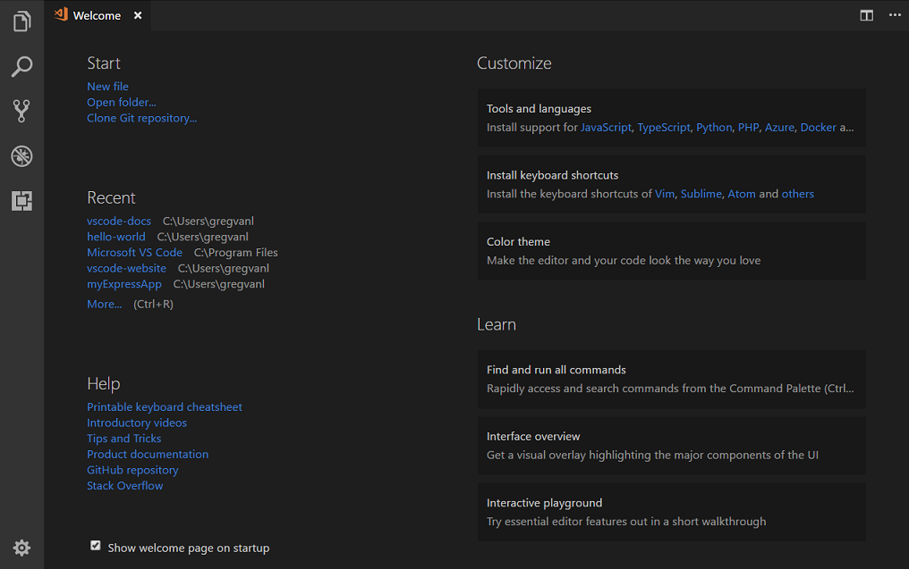

In the bottom right of the **Welcome** page, there is a link to the **Interactive playground** where you can interactively try out VS Code's features. **Help** > **Interactive Playground**.


### Command Palette

Access all available commands based on your current context.

Keyboard Shortcut: `kb(workbench.action.showCommands)`

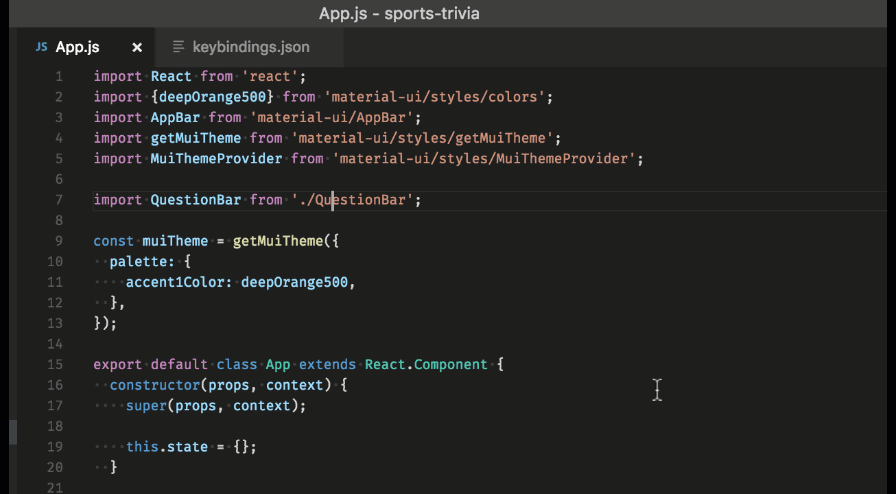

### Default keyboard shortcuts

All of the commands are in the **Command Palette** with the associated key binding (if it exists). If you forget a keyboard shortcut, use the **Command Palette** to help you out.

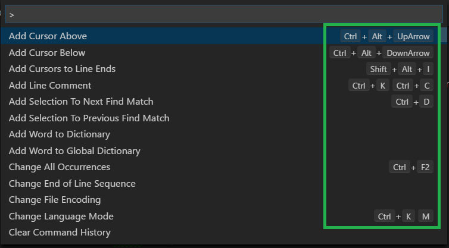

### Keyboard reference sheets

Download the keyboard shortcut reference sheet for your platform ([macOS](https://go.microsoft.com/fwlink/?linkid=832143), [Windows](https://go.microsoft.com/fwlink/?linkid=832145), [Linux](https://go.microsoft.com/fwlink/?linkid=832144)).

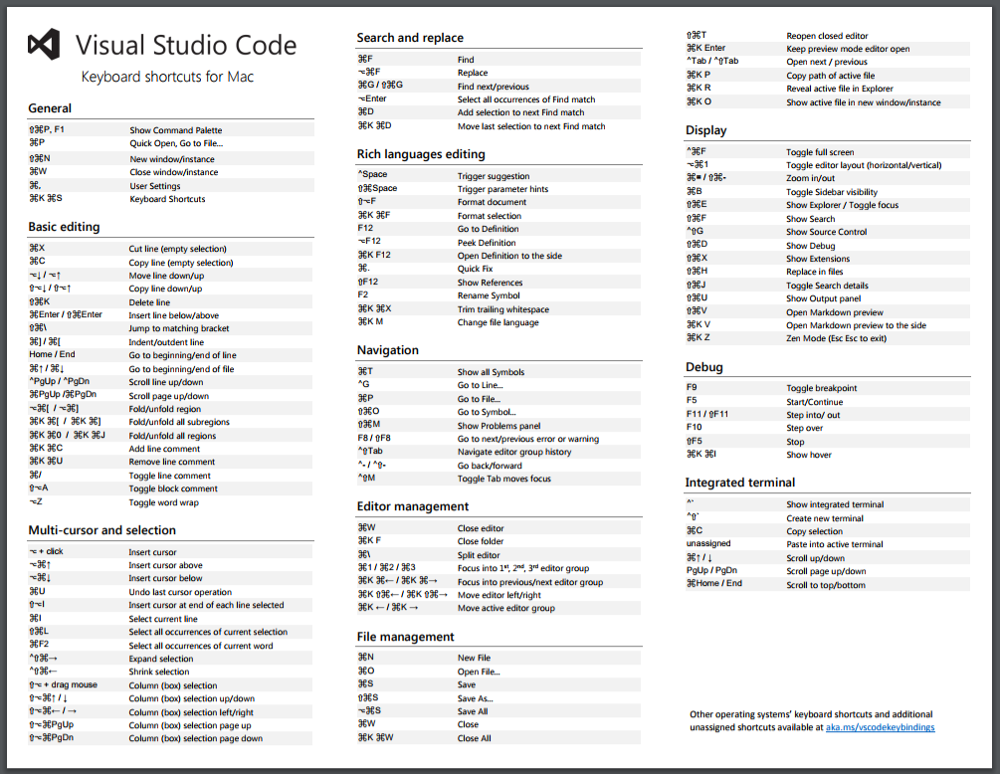

### Quick Open

Quickly open files.

Keyboard Shortcut: `kb(workbench.action.quickOpen)`


**Tip:** Type `kbstyle(?)` to view help suggestions.

### Navigate between recently opened files

Repeat the **Quick Open** keyboard shortcut to cycle quickly between recently opened files.

### Open multiple files from Quick Open

You can open multiple files from **Quick Open** by pressing the Right arrow key. This will open the currently selected file in the background and you can continue selecting files from **Quick Open**.

## Command line

VS Code has a powerful command line interface (CLI) which allows you to customize how the editor is launched to support various scenarios.

> Make sure the VS Code binary is on your path so you can simply type 'code' to launch VS Code. See the platform specific setup topics if VS Code is added to your environment path during installation ([Running VS Code on Linux](/docs/setup/linux.md), [macOS](/docs/setup/mac.md), [Windows](/docs/setup/windows.md)).

```bash
# open code with current directory
code .

# open the current directory in the most recently used code window
code -r .

# create a new window
code -n

# change the language
code --locale=es

# open diff editor
code --diff <file1> <file2>

# open file at specific line and column <file:line[:character]>
code --goto package.json:10:5

# see help options
code --help

# disable all extensions
code --disable-extensions .
```

### .vscode folder

Workspace specific files are in a `.vscode` folder at the root. For example, `tasks.json` for the Task Runner and `launch.json` for the debugger.

## Status Bar

### Errors and warnings

Keyboard Shortcut: `kb(workbench.actions.view.problems)`

Quickly jump to errors and warnings in the project.

Cycle through errors with `kb(editor.action.marker.nextInFiles)` or `kb(editor.action.marker.prevInFiles)`


You can filter problems either by type ('errors', 'warnings') or text matching.

### Change language mode

Keyboard Shortcut: `kb(workbench.action.editor.changeLanguageMode)`


If you want to persist the new language mode for that file type, you can use the **Configure File Association for** command to associate the current file extension with an installed language.

## Customization

There are many things you can do to customize VS Code.

* Change your theme
* Change your keyboard shortcuts
* Tune your settings
* Add JSON validation
* Create snippets
* Install extensions

### Change your theme

Keyboard Shortcut: `kb(workbench.action.selectTheme)`

You can install more themes from the VS Code extension [Marketplace](https://marketplace.visualstudio.com/search?target=VSCode&category=Themes&sortBy=Downloads).

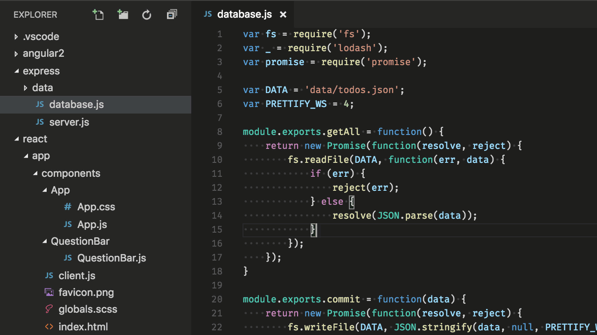

Additionally, you can install and change your File Icon themes.


### Keymaps

Are you used to keyboard shortcuts from another editor? You can install a Keymap extension that brings the keyboard shortcuts from your favorite editor to VS Code. Go to **Preferences** > **Keymap Extensions** to see the current list on the [Marketplace](https://marketplace.visualstudio.com/search?target=VSCode&category=Keymaps&sortBy=Downloads). Some of the more popular ones:

* [Vim](https://marketplace.visualstudio.com/items?itemName=vscodevim.vim)
* [Sublime Text Keymap](https://marketplace.visualstudio.com/items?itemName=ms-vscode.sublime-keybindings)
* [Emacs Keymap](https://marketplace.visualstudio.com/items?itemName=hiro-sun.vscode-emacs)
* [Atom Keymap](https://marketplace.visualstudio.com/items?itemName=ms-vscode.atom-keybindings)
* [Eclipse Keymap](https://marketplace.visualstudio.com/items?itemName=alphabotsec.vscode-eclipse-keybindings)

### Customize your keyboard shortcuts

Keyboard Shortcut: `kb(workbench.action.openGlobalKeybindings)`

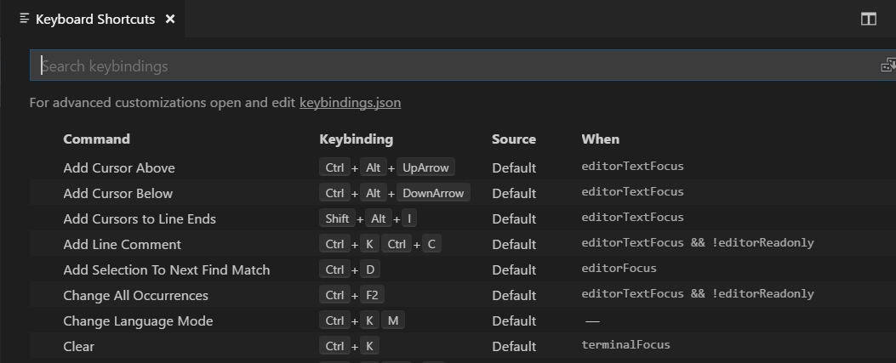

You can search for shortcuts and add your own keybindings to the `keybindings.json` file.


See more in [Key Bindings for Visual Studio Code](/docs/getstarted/keybindings.md).

### Tune your settings

By default VS Code shows the Settings editor, you can find settings listed below in a search bar, but you can still edit the underlying `settings.json` file by using the **Open Settings (JSON)** command or by changing your default settings editor with the `workbench.settings.editor` setting.

Open User Settings `settings.json`

Keyboard Shortcut: `kb(workbench.action.openSettings)`

Format on paste

```json
"editor.formatOnPaste": true
```

Change the font size of various UI elements

```json
// Main editor
"editor.fontSize": 18,
// Terminal panel
"terminal.integrated.fontSize": 14,
// Output panel
"[Log]": {
    "editor.fontSize": 15
}
```

Change the zoom level

```json
"window.zoomLevel": 5
```

Font ligatures

```json
"editor.fontFamily": "Fira Code",
"editor.fontLigatures": true
```

> **Tip:** You will need to have a font installed that supports font ligatures. [FiraCode](https://github.com/tonsky/FiraCode) is a popular font on the VS Code team.


Auto Save

```json
"files.autoSave": "afterDelay"
```

You can also toggle Auto Save from the top-level menu with the **File** > **Auto Save**.

Format on save

```json
"editor.formatOnSave": true
```

Change the size of Tab characters

```json
"editor.tabSize": 4
```

Spaces or Tabs

```json
"editor.insertSpaces": true
```

Render whitespace

```json
"editor.renderWhitespace": "all"
```

Ignore files / folders

Removes these files / folders from your editor window.

```json
"files.exclude": {
    "somefolder/": true,
    "somefile": true
}
```

Remove these files / folders from search results.

```json
"search.exclude": {
    "someFolder/": true,
    "somefile": true
}
```

And many, many [other customizations](/docs/getstarted/settings.md).

### Language specific settings

For the settings, which you only want for specific languages, you can scope the settings by the language identifier. You can find a list of commonly used language ids in the [Language Identifiers](/docs/languages/identifiers.md) reference.

```json
"[languageid]": {

}
```

> **Tip:** You can also create language specific settings with the **Configure Language Specific Settings** command.


### Add JSON validation

Enabled by default for many file types. Create your own schema and validation in `settings.json`

```json
"json.schemas": [
    {
        "fileMatch": [
            "/bower.json"
        ],
        "url": "http://json.schemastore.org/bower"
    }
]
```

or for a schema defined in your workspace

```json
"json.schemas": [
    {
        "fileMatch": [
            "/foo.json"
        ],
        "url": "./myschema.json"
    }
]
```

or a custom schema

```json
"json.schemas": [
    {
        "fileMatch": [
            "/.myconfig"
        ],
        "schema": {
            "type": "object",
            "properties": {
                "name" : {
                    "type": "string",
                    "description": "The name of the entry"
                }
            }
        }
    },
```

See more in the [JSON](/docs/languages/json.md) documentation.

## Extensions

Keyboard Shortcut: `kb(workbench.view.extensions)`

### Find extensions

1. In the VS Code [Marketplace](https://marketplace.visualstudio.com/vscode).
2. Search inside VS Code in the **Extensions** view.
3. View extension recommendations
4. Community curated extension lists, such as [awesome-vscode](https://github.com/viatsko/awesome-vscode).

### Install extensions

In the **Extensions** view, you can search via the search bar or click the **More Actions** (...) button to filter and sort by install count.

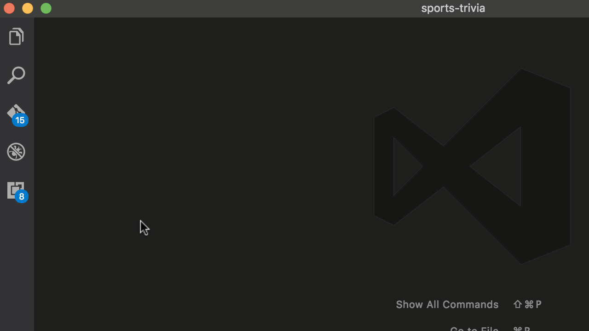

### Extension recommendations

In the **Extensions** view, click **Show Recommended Extensions** in the **More Actions** (...) button menu.


### Creating my own extension

Are you interested in creating your own extension? You can learn how to do this in the [Extension API documentation](/api), specifically check out the [documentation on contribution points](/api/references/contribution-points.md).

* configuration
* commands
* keybindings
* languages
* debuggers
* grammars
* themes
* snippets
* jsonValidation

## Files and folders

### Integrated Terminal

Keyboard Shortcut: `kb(workbench.action.terminal.toggleTerminal)`


Further reading:

* [Integrated Terminal](/docs/editor/integrated-terminal.md) documentation
* [Mastering VS Code's Terminal article](https://www.growingwiththeweb.com/2017/03/mastering-vscodes-terminal.html)

### Auto Save

Open User Settings `settings.json` with `kb(workbench.action.openSettings)`

```json
"files.autoSave": "afterDelay"
```

You can also toggle Auto Save from the top-level menu with the **File** > **Auto Save**.

### Toggle Sidebar

Keyboard Shortcut: `kb(workbench.action.toggleSidebarVisibility)`


### Zen mode

Keyboard Shortcut: `kb(workbench.action.toggleZenMode)`

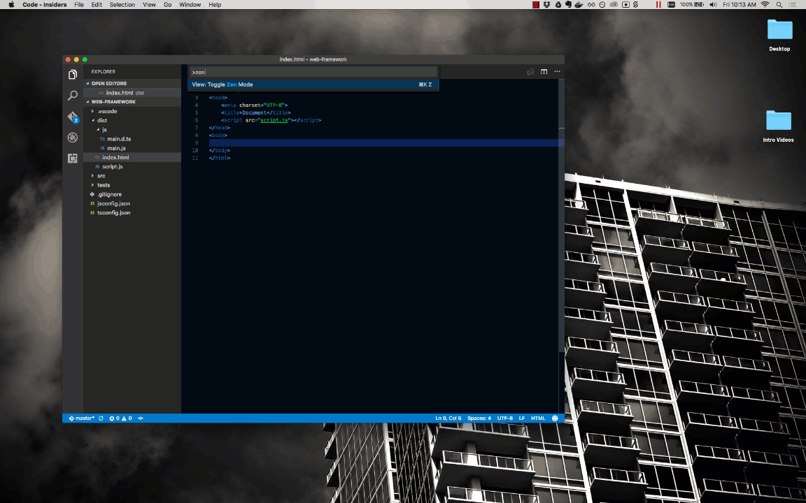

Enter distraction free Zen mode.

Press `kbstyle(Esc)` twice to exit Zen Mode.

### Side by side editing

Keyboard Shortcut: `kb(workbench.action.splitEditor)`

You can also drag and drop editors to create new editor groups and move editors between groups.


### Switch between editors

Keyboard Shortcut: `kb(workbench.action.focusFirstEditorGroup)`, `kb(workbench.action.focusSecondEditorGroup)`, `kb(workbench.action.focusThirdEditorGroup)`

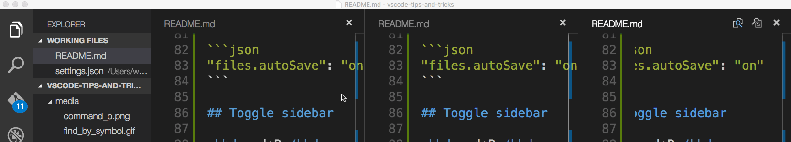

### Move to Explorer window

Keyboard Shortcut: `kb(workbench.view.explorer)`

### Create or open a file

Keyboard Shortcut: `kbstyle(Ctrl+click)` (`kbstyle(Cmd+click)` on macOS)

You can quickly open a file or image or create a new file by moving the cursor to the file link and using `kbstyle(Ctrl+click)`.


### Close the currently opened folder

Keyboard Shortcut: `kb(workbench.action.closeActiveEditor)`

### Navigation history

Navigate entire history: `kb(workbench.action.openNextRecentlyUsedEditorInGroup)`

Navigate back: `kb(workbench.action.navigateBack)`

Navigate forward: `kb(workbench.action.navigateForward)`


### File associations

Create language associations for files that aren't detected correctly. For example, many configuration files with custom file extensions are actually JSON.

```json
"files.associations": {
    ".database": "json"
}
```

### Preventing dirty writes

VS Code will show you an error message when you try to save a file that cannot be saved because it has changed on disk. VS Code blocks saving the file to prevent overwriting changes that have been made outside of the editor.

In order to resolve the save conflict, click the **Compare** action in the error message to open a diff editor that will show you the contents of the file on disk (to the left) compared to the contents in VS Code (on the right):


Use the actions in the editor toolbar to resolve the save conflict. You can either **Accept** your changes and thereby overwriting any changes on disk, or **Revert** to the version on disk. Reverting means that your changes will be lost.

**Note:** The file will remain dirty and cannot be saved until you pick one of the two actions to resolve the conflict.

## Editing hacks

Here is a selection of common features for editing code. If the keyboard shortcuts aren't comfortable for you, consider installing a [keymap extension](https://marketplace.visualstudio.com/search?target=VSCode&category=Keymaps&sortBy=Downloads) for your old editor.

**Tip**: You can see recommended keymap extensions in the **Extensions** view with `kb(workbench.extensions.action.showRecommendedKeymapExtensions)` which filters the search to `@recommended:keymaps`.

### Multi cursor selection

To add cursors at arbitrary positions, select a position with your mouse and use `kbstyle(Alt+Click)` (`kbstyle(Option+click)` on macOS).

To set cursors above or below the current position use:

Keyboard Shortcut: `kb(editor.action.insertCursorAbove)` or `kb(editor.action.insertCursorBelow)`


You can add additional cursors to all occurrences of the current selection with `kb(editor.action.selectHighlights)`.


> Note: You can also change the modifier to `kbstyle(Ctrl/Cmd)` for applying multiple cursors with the `editor.multiCursorModifier` [setting](/docs/getstarted/settings.md) . See [Multi-cursor Modifier](/docs/editor/codebasics.md#multicursor-modifier) for details.

If you do not want to add all occurrences of the current selection, you can use `kb(editor.action.addSelectionToNextFindMatch)` instead.
This only selects the next occurrence after the one you selected so you can add selections one by one.

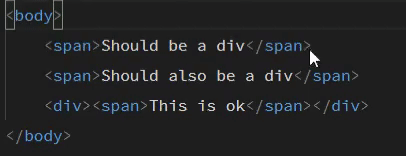

### Column (box) selection

You can select blocks of text by holding `kbstyle(Shift+Alt)` (`kbstyle(Shift+Option)` on macOS) while you drag your mouse. A separate cursor will be added to the end of each selected line.

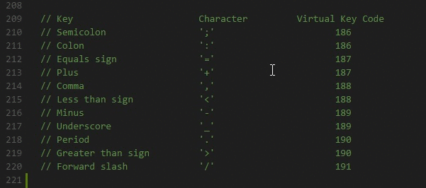

You can also use [keyboard shortcuts](/docs/editor/codebasics.md#column-box-selection) to trigger column selection.

### Fast scrolling

Pressing the `kbstyle(Alt)` key enables fast scrolling in the editor and Explorers. By default, fast scrolling uses a 5X speed multiplier but you can control the multiplier with the **Editor: Fast Scroll Sensitivity** (`editor.fastScrollSensitivity`) setting.

### Copy line up / down

Keyboard Shortcut: `kb(editor.action.copyLinesUpAction)` or `kb(editor.action.copyLinesDownAction)`

> The commands **Copy Line Up/Down** are unbound on Linux because the VS Code default keybindings would conflict with Ubuntu keybindings, see [Issue #509](https://github.com/Microsoft/vscode/issues/509). You can still set the commands `editor.action.copyLinesUpAction` and `editor.action.copyLinesDownAction` to your own preferred keyboard shortcuts.


### Move line up and down

Keyboard Shortcut: `kb(editor.action.moveLinesUpAction)` or `kb(editor.action.moveLinesDownAction)`

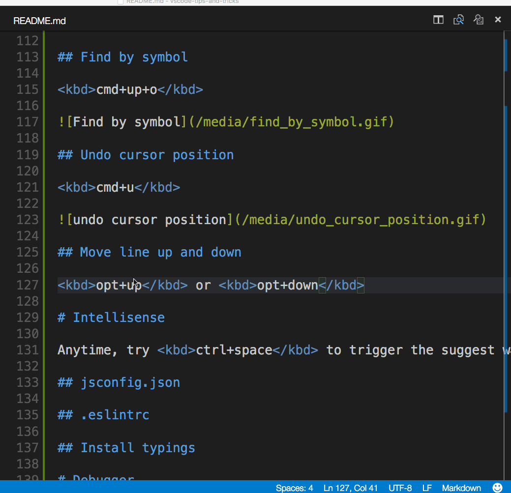

### Shrink / expand selection

Keyboard Shortcut: `kb(editor.action.smartSelect.shrink)` or `kb(editor.action.smartSelect.expand)`

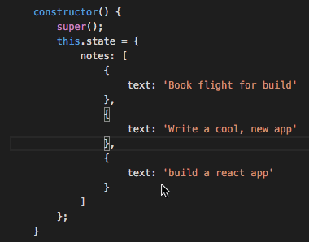

You can learn more in the [Basic Editing](/docs/editor/codebasics.md#shrinkexpand-selection) documentation.

### Go to Symbol in File

Keyboard Shortcut: `kb(workbench.action.gotoSymbol)`


You can group the symbols by kind by adding a colon, `@:`.


### Go to Symbol in Workspace

Keyboard Shortcut: `kb(workbench.action.showAllSymbols)`

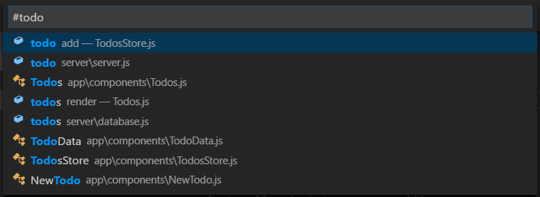

### Navigate to a specific line

Keyboard Shortcut: `kb(workbench.action.gotoLine)`

### Undo cursor position

Keyboard Shortcut: `kb(cursorUndo)`

### Trim trailing whitespace

Keyboard Shortcut: `kb(editor.action.trimTrailingWhitespace)`

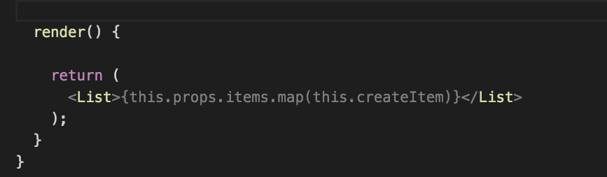

### Code formatting

Currently selected source code: `kb(editor.action.formatSelection)`

Whole document format: `kb(editor.action.formatDocument)`

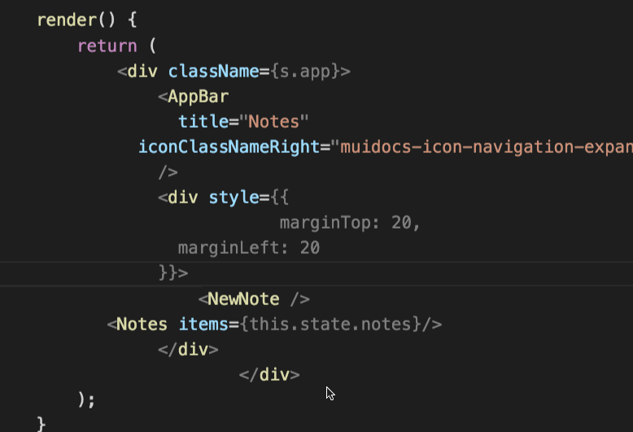

### Code folding

Keyboard Shortcut: `kb(editor.fold)` and `kb(editor.unfold)`


### Select current line

Keyboard Shortcut: `kb(expandLineSelection)`

### Navigate to beginning and end of file

Keyboard Shortcut: `kb(cursorTop)` and `kb(cursorBottom)`

### Open Markdown preview

In a Markdown file, use

Keyboard Shortcut: `kb(markdown.showPreview)`

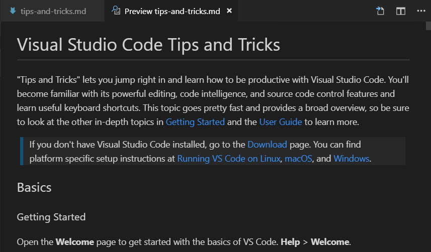

### Side by side Markdown edit and preview

In a Markdown file, use

Keyboard Shortcut: `kb(markdown.showPreviewToSide)`

The preview and editor will synchronize with your scrolling in either view.

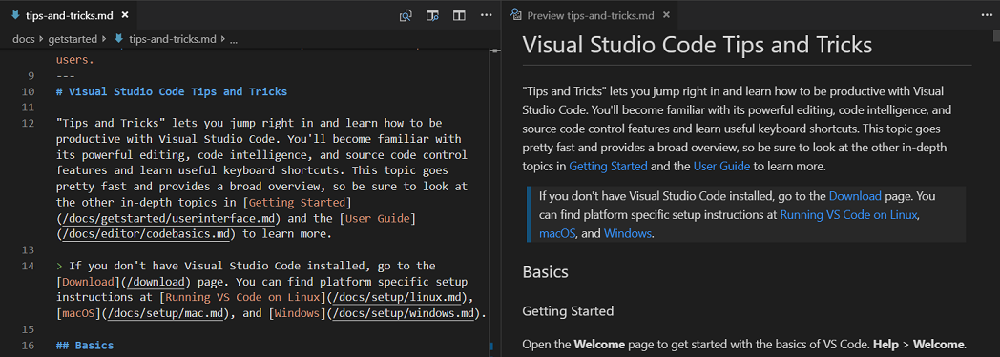

## IntelliSense

`kb(editor.action.triggerSuggest)` to trigger the Suggestions widget.

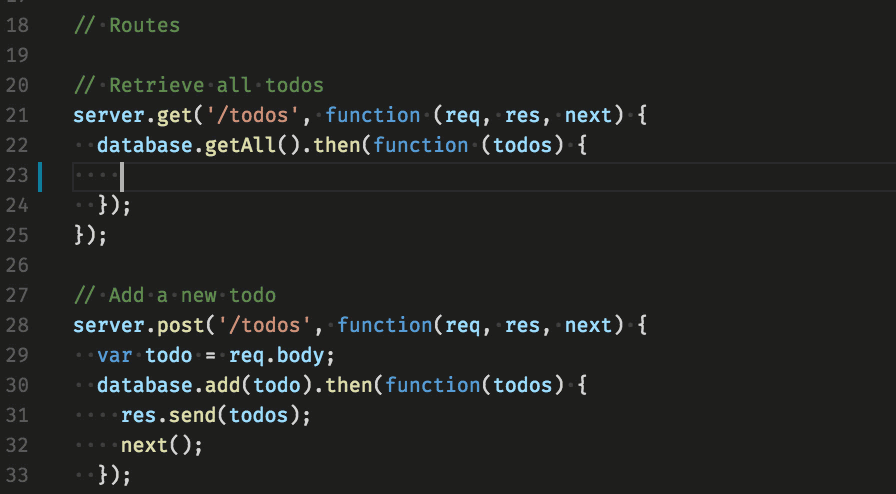

You can view available methods, parameter hints, short documentation, etc.

### Peek

Select a symbol then type `kb(editor.action.peekDefinition)`. Alternatively, you can use the context menu.

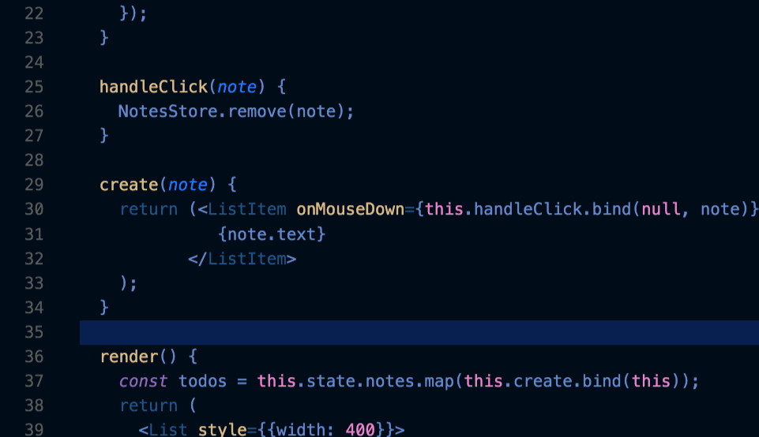

### Go to Definition

Select a symbol then type `kb(editor.action.revealDefinition)`. Alternatively, you can use the context menu or `kbstyle(Ctrl+click)` (`kbstyle(Cmd+click)` on macOS).


You can go back to your previous location with the **Go** > **Back** command or `kb(workbench.action.navigateBack)`.

You can also see the type definition if you press `kbstyle(Ctrl)` (`kbstyle(Cmd)` on macOS) when you are hovering over the type.

### Peek References

Select a symbol then type `kb(editor.action.referenceSearch.trigger)`. Alternatively, you can use the context menu.

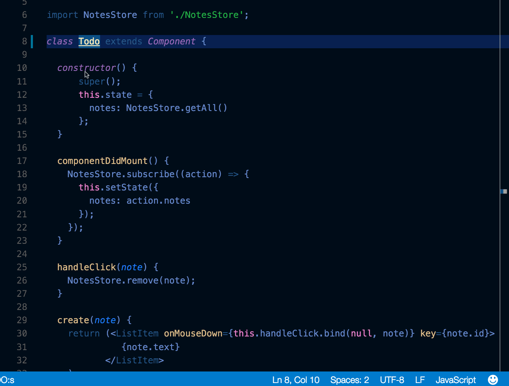

### Find All References view

Select a symbol then type `kb(references-view.find)` to open the References view showing all your file's symbols in a dedicated view.

### Rename Symbol

Select a symbol then type `kb(editor.action.rename)`. Alternatively, you can use the context menu.

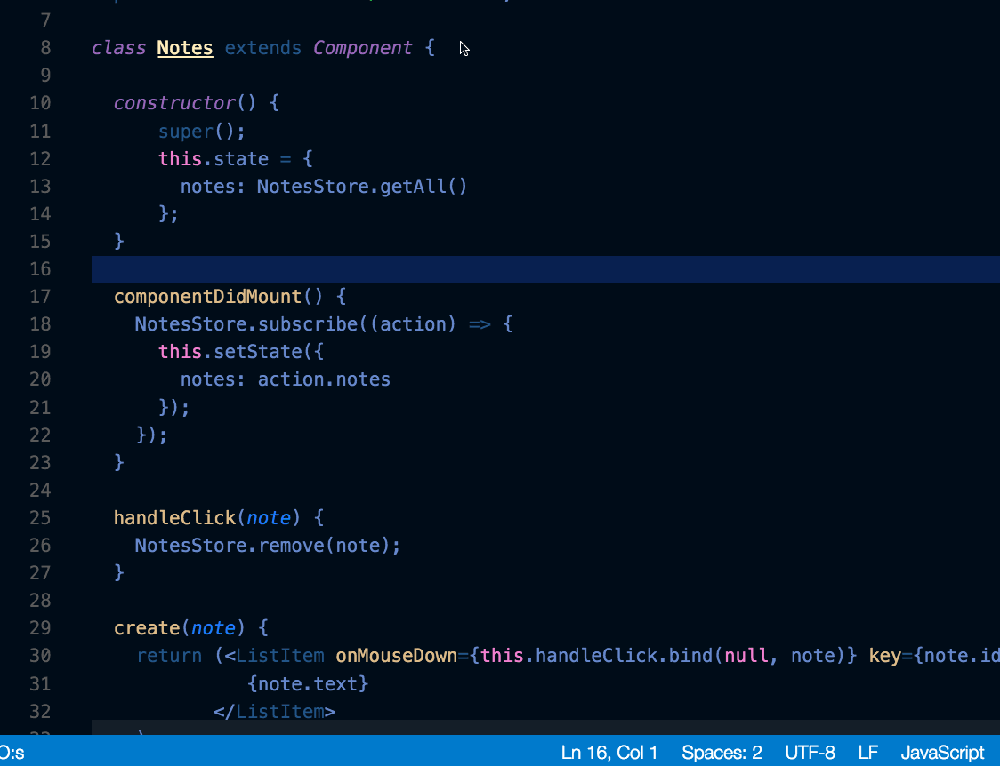

### Search and modify

Besides searching and replacing expressions, you can also search and reuse parts of what was matched, using regular expressions with capturing groups. Enable regular expressions in the search box by clicking the **Use Regular Expression** `.*` button (`kb(toggleSearchRegex)`) and then write a regular expression and use parenthesis to define groups. You can then reuse the content matched in each group by using `$1`, `$2`, etc. in the Replace field.


### .eslintrc.json

Install the [ESLint extension](https://marketplace.visualstudio.com/items?itemName=dbaeumer.vscode-eslint). Configure
your linter however you'd like. Consult the [ESLint specification](https://eslint.org/docs/user-guide/configuring) for details on its linting rules and options.

Here is configuration to use ES6.

```json
{
    "env": {
        "browser": true,
        "commonjs": true,
        "es6": true,
        "node": true
    },
    "parserOptions": {
        "ecmaVersion": 6,
        "sourceType": "module",
        "ecmaFeatures": {
            "jsx": true,
            "classes": true,
            "defaultParams": true
        }
    },
    "rules": {
        "no-const-assign": 1,
        "no-extra-semi": 0,
        "semi": 0,
        "no-fallthrough": 0,
        "no-empty": 0,
        "no-mixed-spaces-and-tabs": 0,
        "no-redeclare": 0,
        "no-this-before-super": 1,
        "no-undef": 1,
        "no-unreachable": 1,
        "no-use-before-define": 0,
        "constructor-super": 1,
        "curly": 0,
        "eqeqeq": 0,
        "func-names": 0,
        "valid-typeof": 1
    }
}
```

### package.json

See IntelliSense for your `package.json` file.

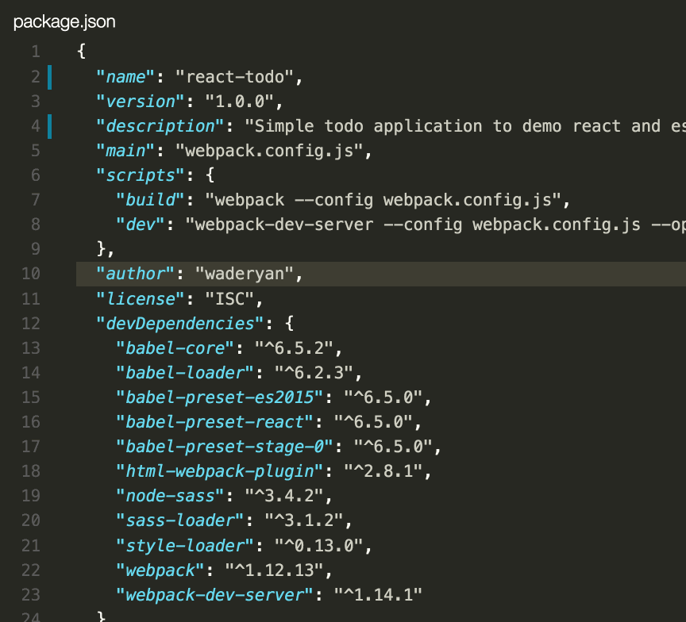

### Emmet syntax

[Support for Emmet syntax](/docs/editor/emmet.md).

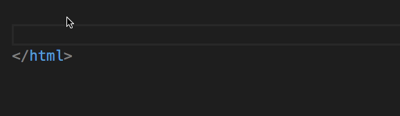

## Snippets

### Create custom snippets

**File** > **Preferences** > **User Snippets** (**Code** > **Preferences** > **User Snippets** on macOS), select the language, and create a snippet.

```json
"create component": {
    "prefix": "component",
    "body": [
        "class $1 extends React.Component {",
        "",
        "\trender() {",
        "\t\treturn ($2);",
        "\t}",
        "",
        "}"
    ]
},
```

See more details in [Creating your own Snippets](/docs/editor/userdefinedsnippets.md).

## Git integration

Keyboard Shortcut: `kb(workbench.view.scm)`

Git integration comes with VS Code "out-of-the-box". You can install other SCM providers from the extension Marketplace. This section describes the Git integration but much of the UI and gestures are shared by other SCM providers.

### Diffs

From the **Source Control** view, select the file to diff.

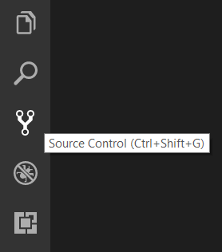

**Side by side**

Default is side by side diff.

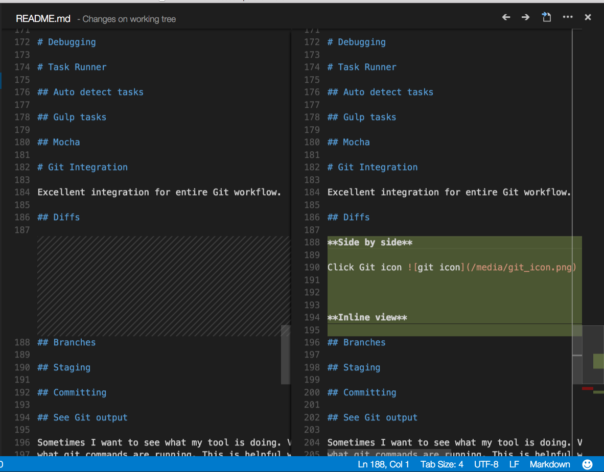

**Inline view**

Toggle inline view by clicking the **More Actions** (...) button in the top right and selecting **Switch to Inline View**.

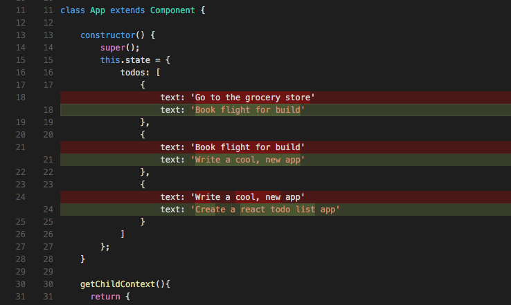

If you prefer the inline view, you can set `"diffEditor.renderSideBySide": false`.

**Review pane**

Navigate through diffs with `kb(editor.action.diffReview.next)` and `kb(editor.action.diffReview.prev)`. This will present them in a unified patch format.
Lines can be navigated with arrow keys and pressing `kbstyle(Enter)` will jump back in the diff editor and the selected line.

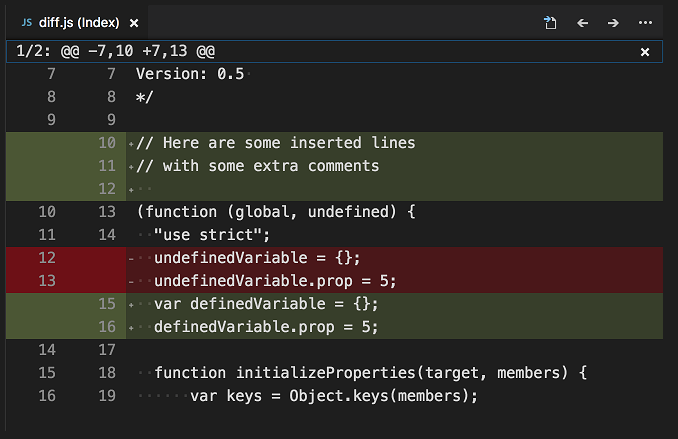

**Edit pending changes**

You can make edits directly in the pending changes of the diff view.

### Branches

Easily switch between Git branches via the Status Bar.

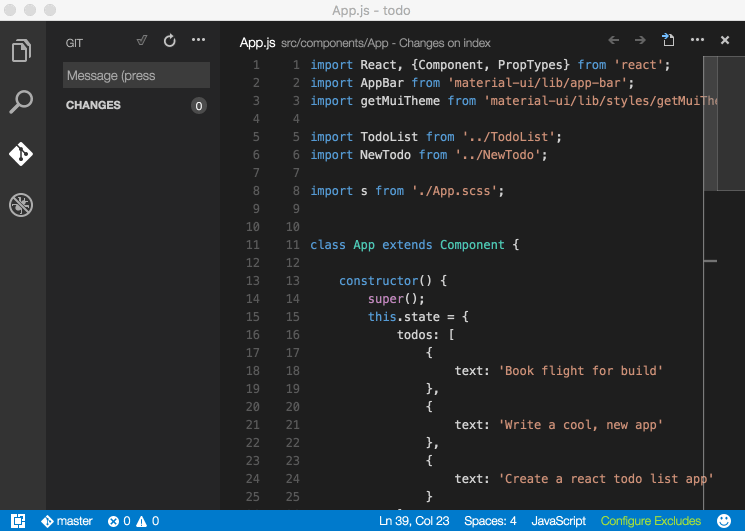

### Staging

**Stage all**

Hover over the number of files and click the plus button.

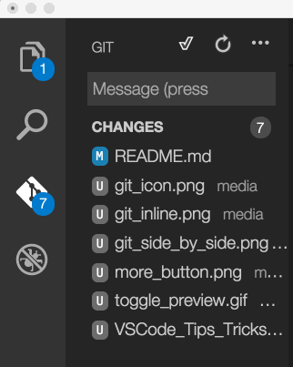

**Stage selected**

Stage a portion of a file by selecting that file (using the arrows) and then choosing **Stage Selected Ranges** from the **Command Palette**.

### Undo last commit

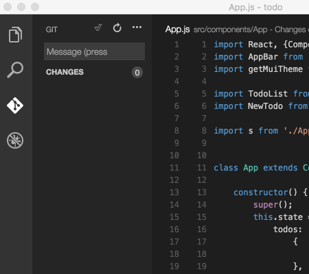

### See Git output

VS Code makes it easy to see what Git commands are actually running. This is helpful when learning Git or debugging a difficult source control issue.

Use the **Toggle Output** command (`kb(workbench.action.output.toggleOutput)`) and select **Git** in the drop-down.

### Gutter indicators

View diff decorations in editor. See [documentation](/docs/editor/versioncontrol.md#gutter-indicators) for more details.

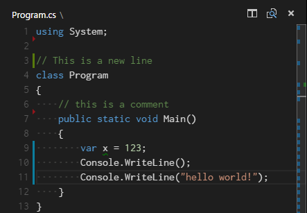

### Resolve merge conflicts

During a merge, go to the **Source Control** view (`kb(workbench.view.scm)`) and make changes in the diff view.

### Set VS Code as default merge tool

```bash
git config --global merge.tool code
```

## Debugging

### Configure debugger

Open the **Command Palette** (`kb(workbench.action.showCommands)`) and select **Debug: Open launch.json**, which will prompt you to select the environment that matches your project (Node.js, Python, C++, etc). This will generate a `launch.json` file. Node.js support is built-in and other environments require installing the appropriate language extensions. See the debugging [documentation](/docs/editor/debugging.md) for more details.

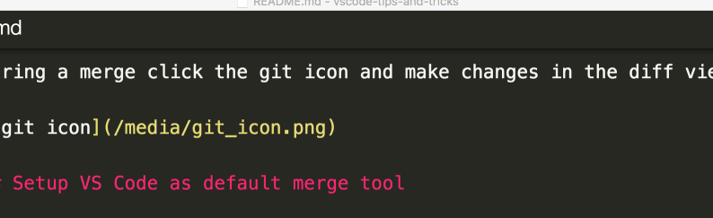

### Breakpoints and stepping through

Place breakpoints next to the line number. Navigate forward with the Debug widget.

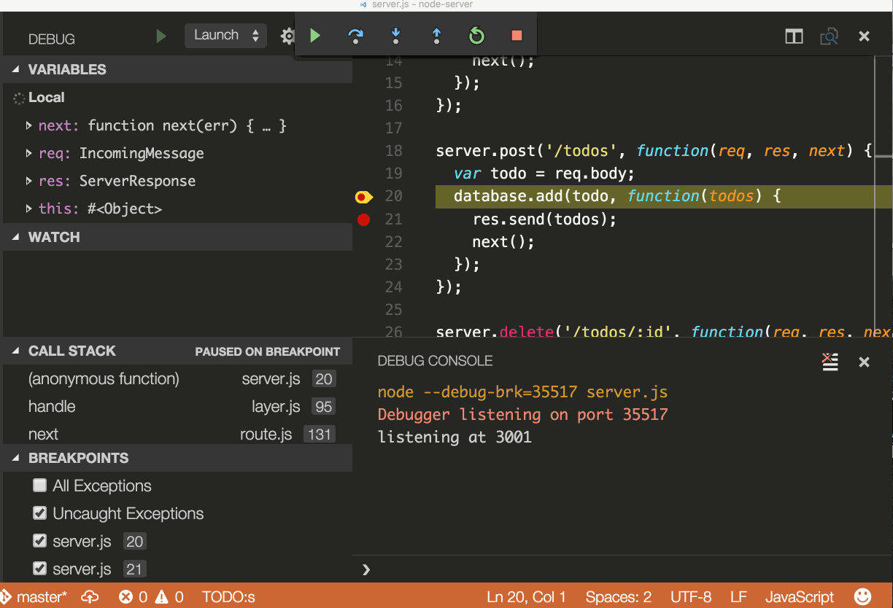

### Data inspection

Inspect variables in the **Debug** panels and in the console.


### Inline values

You can set `"debug.inlineValues": true` to see variable values inline in the debugger. This feature can be expensive and may slow down stepping, so it is disabled by default.

## Task runner

### Auto detect tasks

Select **Terminal** from the top-level menu, run the command **Configure Tasks**, then select the type of task you'd like to run.
This will generate a `tasks.json` file with content like the following. See the [Tasks](/docs/editor/tasks.md) documentation for more details.

```json
{
    // See https://go.microsoft.com/fwlink/?LinkId=733558
    // for the documentation about the tasks.json format
    "version": "2.0.0",
    "tasks": [
        {
            "type": "npm",
            "script": "install",
            "group": {
                "kind": "build",
                "isDefault": true
            }
        }
    ]
}
```

There are occasionally issues with auto generation. Check out the documentation for getting things to work properly.

### Run tasks from the Terminal menu

Select **Terminal** from the top-level menu, run the command **Run Task**, and select the task you want to run. Terminate the running task by running the command **Terminate Task**


### Define keyboard shortcuts for tasks

You can define a keyboard shortcut for any task. From the **Command Palette** (`kb(workbench.action.showCommands)`), select **Preferences: Open Keyboard Shortcuts File**, bind the desired shortcut to the `workbench.action.tasks.runTask` command, and define the **Task** as `args`.

For example, to bind `kbstyle(Ctrl+H)` to the `Run tests` task, add the following:

```json
{
    "key": "ctrl+h",
    "command": "workbench.action.tasks.runTask",
    "args": "Run tests"
}
```

### Run npm scripts as tasks from the explorer

With the setting `npm.enableScriptExplorer`, you can enable an explorer that shows the scripts defined in your workspace.


From the explorer you can open a script in the editor, run it as a task, and launch it with the node debugger (when the script defines a debug option like `--inspect-brk`). The default action on click is to open the script. To run a script on a single click, set `npm.scriptExplorerAction` to "run". Use the setting `npm.exclude` to exclude scripts in `package.json` files contained in particular folders.

## Portable mode

VS Code has a [Portable mode](/docs/editor/portable.md) which lets you keep settings and data in the same location as your installation, for example, on a USB drive.

## Insiders builds

The Visual Studio Code team uses the Insiders version to test the latest features and bug fixes of VS Code. You can also use the Insiders version by [downloading it here](/insiders).

* For Early Adopters - Insiders has the most recent code changes for users and extension authors to try out.
* Frequent Builds - New builds every day with the latest bug fixes and features.
* Side-by-side install - Insiders installs next to the Stable build allowing you to use either independently.
