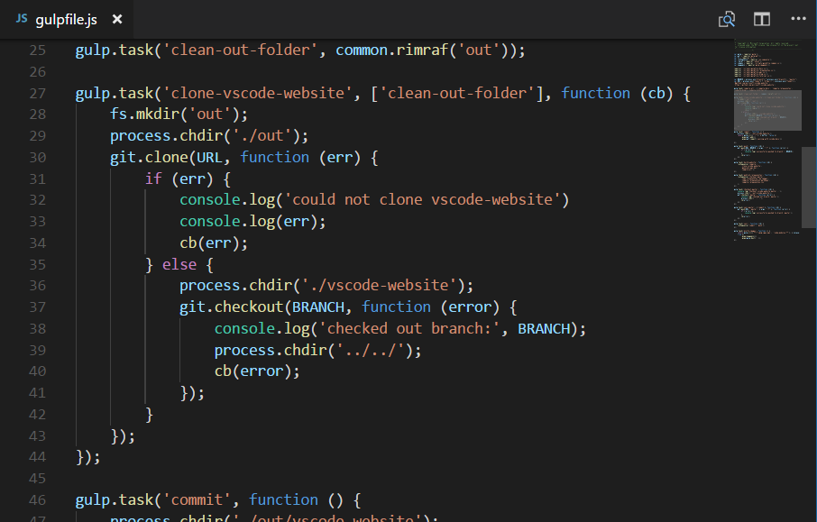
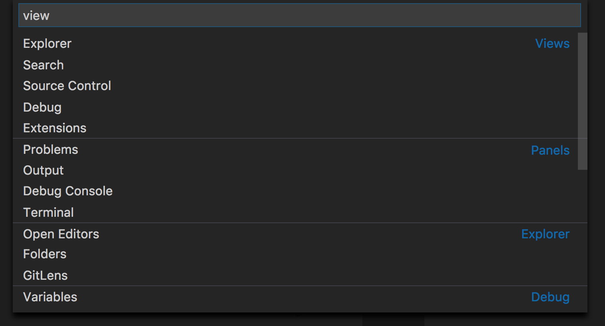
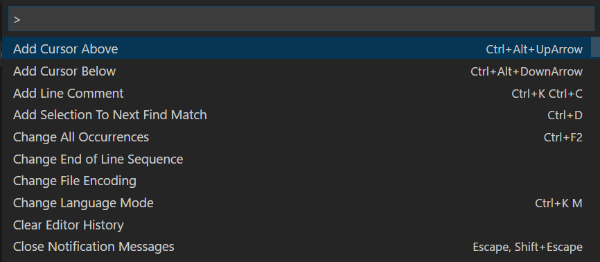
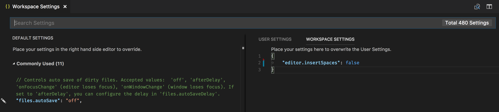
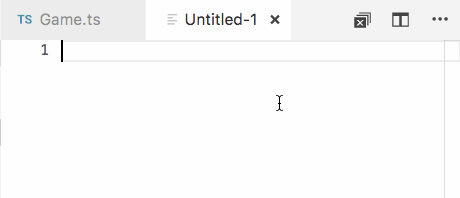

# User Interface

At its heart, Visual Studio Code is a code editor. Like many other code editors, VS Code adopts a common user interface and layout of an explorer on the left, showing all of the files and folders you have access to, and an editor on the right, showing the content of the files you have opened.


## Basic Layout

VS Code comes with a simple and intuitive layout that maximizes the space provided for the editor while leaving ample room to browse and access the full context of your folder or project. The UI is divided into five areas:

* **Editor** - The main area to edit your files. You can open as many editors as you like side by side vertically and horizontally.
* **Side Bar** - Contains different views like the Explorer to assist you while working on your project.
* **Status Bar** - Information about the opened project and the files you edit.
* **Activity Bar** -  Located on the far left-hand side, this lets you switch between views and gives you additional context-specific indicators, like the number of outgoing changes when Git is enabled.
* **Panels** - You can display different panels below the editor region for output or debug information, errors and warnings, or an integrated terminal. Panel can also be moved to the right for more vertical space.

Each time you start VS Code, it opens up in the same state it was in when you last closed it. The folder, layout, and opened files are preserved.

Open files in each editor are displayed with tabbed headers (Tabs) at the top of the editor region. To learn more about tabbed headers, see the [Tabs](/docs/getstarted/userinterface.md#tabs) section below.

>**Tip:** You can move the Side Bar to the right hand side (**View** > **Move Side Bar Right**) or toggle its visibility (`kb(workbench.action.toggleSidebarVisibility)`).

## Side by side editing

You can open as many editors as you like side by side vertically and horizontally. If you already have one editor open, there are multiple ways of opening another editor to the side of the existing one:

* `kbstyle(Alt)` click on a file in the Explorer.
* `kb(workbench.action.splitEditor)` to split the active editor into two.
* **Open to the Side** (`kb(explorer.openToSide)`) from the Explorer context menu on a file.
* Click the **Split Editor** button in the upper right of an editor.
* Drag and drop a file to any side of the editor region.
* `kbstyle(Ctrl+Enter)` (macOS: `kbstyle(Cmd+Enter)`) in the **Quick Open** (`kb(workbench.action.quickOpen)`) file list.


Whenever you open another file, the editor that is active will display the content of that file. So if you have two editors side by side and you want to open file 'foo.cs' into the right hand editor, make sure that editor is active (by clicking inside it) before opening file 'foo.cs'.

By default editors will open to the right hand side of the active one. You can change this behavior through the setting `workbench.editor.openSideBySideDirection` and configure to open new editors to the bottom of the active one instead.

When you have more than one editor open you can switch between them quickly by holding the `kbstyle(Ctrl)` (macOS: `kbstyle(Cmd)`) key and pressing `kbstyle(1)`, `kbstyle(2)`, or `kbstyle(3)`.

>**Tip:** You can resize editors and reorder them. Drag and drop the editor title area to reposition or resize the editor.

## Minimap

A Minimap (code outline) gives you a high level overview of your source code which is very useful for quick navigation and code understanding. A file's minimap is shown on the right side of the editor. You can click or drag the shaded area to quickly jump to different sections of your file.



>**Tip:** You can move the minimap to the left hand side or disable it completely by respectively setting `"editor.minimap.side": "left"` or `"editor.minimap.enabled": false` in your user or workspace [settings](/docs/getstarted/settings.md).

### Indent Guides

The image above also shows indentation guides (vertical lines) which help you quickly see matching indent levels. If you would like to disable indent guides, you can set `"editor.renderIndentGuides": false` in your user or workspace [settings](/docs/getstarted/settings.md).

## Explorer

The Explorer is used to browse, open, and manage all of the files and folders in your project. VS Code is file and folder based - you can get started immediately by opening a file or folder in VS Code.

After opening a folder in VS Code, the contents of the folder are shown in the Explorer. You can do many things from here:

* Create, delete, and rename files and folders.
* Move files and folders with drag and drop.
* Use the context menu to explore all options.

>**Tip:** You can drag and drop files into the Explorer from outside VS Code to copy them (if the explorer is empty VS Code will open them instead)


VS Code works very well with other tools that you might use, especially command-line tools. If you want to run a command-line tool in the context of the folder you currently have open in VS Code, right-click the folder and select **Open in Command Prompt** (or **Open in Terminal** on macOS or Linux).

You can also navigate to the location of a file or folder in the native Explorer by right-clicking on a file or folder and selecting **Reveal in Explorer** (or **Reveal in Finder** on the macOS or **Open Containing Folder** on Linux).

>**Tip:** Type `kb(workbench.action.quickOpen)` (**Quick Open**) to quickly search and open a file by its name.

By default, VS Code excludes some folders from the Explorer (for example. `.git`). Use the `files.exclude` [setting](/docs/getstarted/settings.md) to configure rules for hiding files and folders from the Explorer.

>**Tip:** This is really useful to hide derived resources files, like `\*.meta` in Unity, or `\*.js` in a TypeScript project. For Unity to exclude the `\*.cs.meta` files, the pattern to choose would be: `"**/*.cs.meta": true`. For TypeScript, you can exclude generated JavaScript for TypeScript files with: `"**/*.js": {"when": "$(basename).ts"}`.

### Multi-selection

You can select multiple files in the **File Explorer** and **OPEN EDITORS** view to run actions (Delete, Drag and Drop, Open to the Side) on multiple items. Use the `Ctrl/Cmd` key with `click` to select individual files and `Shift` + `click` to select a range. If you select two items, you can now use the context menu **Compare Selected** command to quickly diff two files.

**Note:** In earlier VS Code releases, clicking with the `Ctrl/Cmd` key pressed would open a file in a new Editor Group to the side. If you would still like this behavior, you can use the `workbench.list.multiSelectModifier` setting to change multi-selection to use the `Alt` key.

```json
"workbench.list.multiSelectModifier": "alt"
```

### Outline view

The Outline view is a separate section in the bottom of the File Explorer. When expanded, it will show the symbol tree of the currently active editor.


The Outline view has different **Sort By** modes, optional cursor tracking, and supports the usual open gestures. It also includes an input box which finds or filters symbols as you type. Errors and warnings are also shown in the Outline view, letting you see at a glance a problem's location.

For symbols, the view relies on information computed by your installed extensions for different file types. For example, the built-in Markdown support returns the Markdown header hierarchy for a Markdown file's symbols.


There are several Outline view [settings](/docs/getstarted/settings.md) which allow you to enable/disable icons and control the errors and warnings display (all enabled by default):

* `outline.icons` - Toggle rendering outline elements with icons.
* `outline.problems.enabled` - Show errors and warnings on outline elements.
* `outline.problems.badges` - Toggle using badges for errors and warnings.
* `outline.problems.colors` - Toggle using colors for errors and warnings.

## Open Editors

At the top of the Explorer is a view labeled **OPEN EDITORS**. This is a list of active files or previews. These are files you previously opened in VS Code that you were working on. For example, a file will be listed in the **OPEN EDITORS** view if you:

* Make a change to a file.
* Double-click a file's header.
* Double-click a file in the Explorer.
* Open a file that is not part of the current folder.

Just click an item in the **OPEN EDITORS** view, and it becomes active in VS Code.

Once you are done with your task, you can remove files individually from the **OPEN EDITORS** view, or you can remove all files by using the **View: Close All Editors** or **View: Close All Editors in Group** actions.

## Views

The File Explorer is just one of the Views available in VS Code. There are also Views for:

* **Search** - Provides global search and replace across your open folder.
* **Source Control** - VS Code includes Git source control by default.
* **Debug** - VS Code's Debug View displays variables, call stacks, and breakpoints.
* **Extensions** - Install and manage your extensions within VS Code.
* **Custom views** - Views contributed by extensions under Explorer and Debug views.

> **Tip:** You can open any view using the **View: Open View** command.



You can show or hide views from within the main view and also reorder them by drag and drop.


### Activity Bar

The **Activity Bar** on the left lets you quickly switch between Views. You can also reorder Views by dragging and dropping them on the **Activity Bar** or remove a View entirely (right click **Hide from Activity Bar**).


## Command Palette

VS Code is equally accessible from the keyboard. The most important key combination to know is `kb(workbench.action.showCommands)`, which brings up the **Command Palette**. From here, you have access to all of the functionality of VS Code, including keyboard shortcuts for the most common operations.



The **Command Palette** provides access to many commands. You can execute editor commands, open files, search for symbols, and see a quick outline of a file, all using the same interactive window. Here are a few tips:

* `kb(workbench.action.quickOpen)` will let you navigate to any file or symbol by typing its name
* `kb(workbench.action.openPreviousRecentlyUsedEditorInGroup)` will cycle you through the last set of files opened
* `kb(workbench.action.showCommands)` will bring you directly to the editor commands
* `kb(workbench.action.gotoSymbol)` will let you navigate to a specific symbol in a file
* `kb(workbench.action.gotoLine)` will let you navigate to a specific line in a file

Type `?` into the input field to get a list of available commands you can execute from here:


## Configuring the editor

VS Code gives you many options to configure the editor. From the **View** menu, you can hide or toggle various parts of the user interface, such as the **Side Bar**, **Status Bar**, and **Activity Bar**.

### Hide the Menu Bar (Windows, Linux)

You can hide the Menu Bar on Windows and Linux with the **View** > **Toggle Menu Bar** command. You can still access the Menu Bar by pressing the `kbstyle(Alt)` key (`window.menuBarVisibility` setting).

### Settings

Most editor configurations are kept in settings which can be modified directly. You can set options globally through user settings or per project/folder through workspace settings. Settings values are kept in a `settings.json` [file](/docs/getstarted/settings.md#settings-file-locations).

* Select **File** > **Preferences** > **Settings** (or press `kb(workbench.action.openSettings)`) to edit the user `settings.json` file.
* To edit workspace settings, select the **WORKSPACE SETTINGS** tab to edit the workspace `settings.json` file.

>**Note for macOS users:** The **Preferences** menu is under **Code** not **File**. For example, **Code** > **Preferences** > **Settings**.



You will see the VS Code [Default Settings](/docs/getstarted/settings.md#default-settings) in the left window and your editable `settings.json` on the right. You can easily filter settings in the `Default Settings` using the search box at the top. Copy a setting over to the editable `settings.json` on the right by clicking on the edit icon to the left of the setting. Settings with a fixed set of values allow you to pick a value as part of their edit icon menu.

After editing your settings, type `kb(workbench.action.files.save)` to save your changes. The changes will take effect immediately.

>**Note:** Workspace settings will override User settings and are useful for sharing project specific settings across a team.

### Zen Mode

Zen Mode lets you focus on your code by hiding all UI except the editor (no Activity Bar, Status Bar, Side Bar and Panel), going to full screen and centering the editor layout. Zen mode can be toggled using **View** menu, **Command Palette** or by the shortcut `kb(workbench.action.toggleZenMode)`. Double `kbstyle(Esc)` exits Zen Mode. The transition to full screen can be disabled via `zenMode.fullScreen`. Zen Mode can be further tuned by the following settings: `zenMode.hideStatusBar`, `zenMode.hideTabs`, `zenMode.fullScreen`, `zenMode.restore` and `zenMode.centerLayout`.

### Centered editor layout

Centered editor layout allows you to center align the editor area. This is particularly useful when working with a single editor on a large monitor. You can use the sashes on the side to resize the view (hold down the `Alt` key to independently move the sashes).

## Tabs

Visual Studio Code shows open items with Tabs (tabbed headings) in the title area above the editor.

When you open a file, a new Tab is added for that file.


Tabs let you quickly navigate between items and you can Drag and Drop Tabs to reorder them.

When you have more open items than can fit in the title area, you can use the **Show Opened Editors** command (available through the `...` More button) to display a drop-down list of tabbed items.

If you don't want to use Tabs, you can disable the feature by setting the `workbench.editor.showTabs` [setting](/docs/getstarted/settings.md) to false:

```json
    "workbench.editor.showTabs": false
```

See the section below to optimize VS Code when [working without Tabs](/docs/getstarted/userinterface.md#working-without-tabs).

### Tab ordering

By default, new Tabs are added to the right of the existing Tabs but you can control where you'd like new Tabs to appear with the `workbench.editor.openPositioning` setting.

For example, you might like new tabbed items to appear on the left:

```json
    "workbench.editor.openPositioning": "left"
```

## Preview mode

When you single-click or select a file in the Explorer, it is shown in a preview mode and reuses an existing Tab. This is useful if you are quickly browsing files and don't want every visited file to have its own Tab. When you start editing the file or use double-click to open the file from the Explorer, a new Tab is dedicated to that file.

Preview mode is indicated by italics in the Tab heading:


If you'd prefer to not use preview mode and always create a new Tab, you can control the behavior with these settings:

* `workbench.editor.enablePreview` to globally enable or disable preview editors
* `workbench.editor.enablePreviewFromQuickOpen` to enable or disable preview editors when opened from **Quick Open**

## Editor Groups

When you split an editor (using the **Split Editor** or **Open to the Side** commands), a new editor region is created which can hold a group of items. You can open as many editor regions as you like side by side vertically and horizontally.

You can see these clearly in the **OPEN EDITORS** section at the top of the Explorer view:


You can Drag and Drop editor groups on the workbench, move individual Tabs between groups and quickly close entire groups (**Close All**).

>**Note:** VS Code uses editor groups whether or not you have enabled Tabs.  Without Tabs, editor groups are a stack of your open items with the most recently selected item visible in the editor pane.

## Grid editor layout

By default, editor groups are laid out in vertical columns (e.g. when you split an editor to open it to the side). You can easily arrange editor groups in any layout you like, both vertically and horizontally:


To support flexible layouts, you can create empty editor groups. By default, closing the last editor of an editor group will also close the group itself, but you can change this behavior with the new setting `workbench.editor.closeEmptyGroups: false`:


There are a predefined set of editor layouts in the new **View** > **Editor Layout** menu:


Editors that open to the side (for example by clicking the editor toolbar **Split Editor** action) will by default open to the right hand side of the active editor. If you prefer to open editors below the active one, configure the new setting `workbench.editor.openSideBySideDirection: down`.

There are many keyboard commands for adjusting the editor layout with the keyboard alone, but if you prefer to use the mouse, drag and drop is a fast way to split the editor into any direction:


>**Pro Tip**: If you press and hold the `Alt` key while hovering over the toolbar action to split an editor, it will offer to split to the other orientation. This is a fast way to split either to the right or to the bottom.



### Keyboard shortcuts

Here are some handy keyboard shortcuts to quickly navigate between editors and editor groups.

>If you'd like to modify the default keyboard shortcuts, see [Key Bindings](/docs/getstarted/keybindings.md) for details.

* `kb(workbench.action.nextEditor)` go to the right editor.
* `kb(workbench.action.previousEditor)` go to the left editor.
* `kb(workbench.action.openNextRecentlyUsedEditorInGroup)` open the next editor in the editor group MRU list.
* `kb(workbench.action.openPreviousRecentlyUsedEditorInGroup)` open the previous editor in the editor group MRU list.
* `kb(workbench.action.focusFirstEditorGroup)` go to the leftmost editor group.
* `kb(workbench.action.focusSecondEditorGroup)` go to the center editor group.
* `kb(workbench.action.focusThirdEditorGroup)` go to the rightmost editor group.
* `kb(workbench.action.focusPreviousGroup)` go to the previous editor group.
* `kb(workbench.action.focusNextGroup)` go to the next editor group.
* `kb(workbench.action.closeActiveEditor)` close the active editor.
* `kb(workbench.action.closeEditorsInGroup)` close all editors in the editor group.
* `kb(workbench.action.closeAllEditors)` close all editors.

## Working without Tabs

If you prefer not to use Tabs (tabbed headings), you can disable Tabs (tabbed headings) entirely by setting `workbench.editor.showTabs` to false.

### Disable Preview mode

Without Tabs, the **OPEN EDITORS** section of the File Explorer is a quick way to do file navigation.  With [preview editor mode](/docs/getstarted/userinterface.md#preview-mode), files are not added to the **OPEN EDITOR** list nor editor group on single-click open. You can disable this feature through the `workbench.editor.enablePreview` and `workbench.editor.enablePreviewFromQuickOpen` settings.

### Ctrl+Tab to navigate in entire editor history

You can change keybindings for `kbstyle(Ctrl+Tab)` to show you a list of all opened editors from the history independent from the active editor group.

Edit your [keybindings](/docs/getstarted/keybindings.md) and add the following:

```json
{ "key": "ctrl+tab", "command": "workbench.action.openPreviousEditorFromHistory" },
{ "key": "ctrl+tab", "command": "workbench.action.quickOpenNavigateNext", "when": "inQuickOpen" },
```

### Close an entire group instead of a single editor

If you liked the behavior of VS Code closing an entire group when closing one editor, you can bind the following in your [keybindings](/docs/getstarted/keybindings.md).

macOS:

```json
{ "key": "cmd+w", "command": "workbench.action.closeEditorsInGroup" }
```

Windows/Linux:

```json
{ "key": "ctrl+w", "command": "workbench.action.closeEditorsInGroup" }
```

## Window management

VS Code has some options to control how windows (instances) should be opened or restored between sessions.

The settings `window.openFoldersInNewWindow` and `window.openFilesInNewWindow` are provided to configure opening new windows or reusing the last active window for files or folders and possible values are `default`, `on` and `off`.

If configured to be `default`, we will make the best guess about reusing a window or not based on the context from where the open request was made. Flip this to `on` or `off` to always behave the same. For example, if you feel that picking a file or folder from the **File** menu should always open into a new window, set this to `on`.

Note: There can still be cases where this setting is ignored (for example, when using the `-new-window` or `-reuse-window` command-line option).

The `window.restoreWindows` setting tells VS Code how to restore the opened windows of your previous session. By default, VS Code will
reopen the last opened window you worked on (setting: `one`). Change this setting to `none` to never reopen any windows and always start with an empty VS Code instance. Change it to `all` to restore all windows you worked on during your previous session or `folders` to only restore windows that had folders opened.

## Next steps

Now that you know the overall layout of VS Code, start to customize the editor to how you like to work by looking at the following topics:

* [Changing the Theme](/docs/getstarted/themes.md) - Set a Color and/or File Icon theme to your preference.

## Common questions

### How can I change the color of the indent guides?

The indent guide colors are customizable as are most VS Code UI elements. To [customize](/docs/getstarted/theme-color-reference.md) the indent guides color for your active color theme, use the `workbench.colorCustomizations` [setting](/docs/getstarted/settings.md) and modify the `editorIndentGuide.background` value.

For example, to make the indent guides bright blue, add the following to your `settings.json`:

```json
"workbench.colorCustomizations": {
    "editorIndentGuide.background": "#0000ff"
}
```

### Can I hide the OPEN EDITORS section in the Explorer?

Yes, you can hide the **OPEN EDITORS** list with the `explorer.openEditors.visible` [setting](/docs/getstarted/settings.md), which declares how many items to display before a scroll bar appears. Setting `"explorer.openEditors.visible": 0` will hide **OPEN EDITORS** when you have an open folder. The list will still be displayed if you are using VS Code to view loose files.
