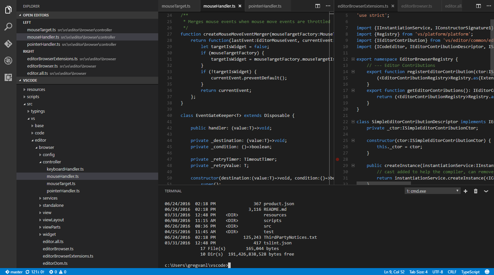

# User Interface

At its heart, Visual Studio Code is a code editor. Like many other code editors, VS Code adopts a common user interface and layout of an explorer on the left, showing all of the files and folders you have access to, and an editor on the right, showing the content of the files you have opened.

## Files, Folders & Projects

VS Code is file and folder based - you can get started immediately by opening a file or folder in VS Code.

On top of this, VS Code can read and take advantage of a variety of project files defined by different frameworks and platforms. For example, if the folder you opened in VS Code contains one or more `package.json`, `project.json`, `tsconfig.json`, or .NET Core Visual Studio solution and project files, VS Code will read these files and use them to provide additional functionality, such as rich IntelliSense in the editor.

## Basic Layout

VS Code comes with a simple and intuitive layout that maximizes the space provided for the editor while leaving ample room to browse and access the full context of your folder or project. The UI is divided into five areas:

* **Editor** The main area to edit your files. You can open up to three editors side by side.
* **Side Bar** Contains different views like the Explorer to assist you while working on your project.
* **Status Bar** Information about the opened project and the files you edit.
* **View Bar** Located on the far left-hand side, this lets you switch between views and gives you additional context-specific indicators, like the number of outgoing changes when Git is enabled.
* **Panels** You can display different panels below the editor region for output or debug information, errors and warnings, or an integrated terminal.

Each time you start VS Code, it opens up in the same state it was in when you last closed it. The folder, layout, and opened files are preserved.

VS Code allows up to three visible editors at any one time, allowing you to edit or view up to three files together side by side. The open files in each editor are displayed with tabbed headers (Tabs) at the top of the editor region. To learn more about tabbed headers, see the [Tabs](/docs/editor/tabs.md) topic.

>**Tip:** You can move the Side Bar to the right hand side (**View** > **Move Sidebar**) or toggle its visibility (`kb(workbench.action.toggleSidebarVisibility)`).

### Hide the Menu Bar (Windows, Linux)

You can hide the Menu Bar on Windows and Linux with the **View** > **Toggle Menu Bar** command (`kbstyle(Ctrl+U)`). You can still access the Menu Bar by pressing the `kbstyle(Alt)` key.

### Zen Mode

Zen Mode lets you focus on your code by hiding all UI except the editor (no Activity Bar, Status Bar, Sidebar and Panel) and going to full screen. Zen mode can be toggled using the View menu, **Command Palette** or by the shortcut `kb(workbench.action.toggleZenMode)`. Double `kbstyle(Esc)` exits Zen Mode. The transition to full screen can be disabled via `zenMode.fullScreen`. Zen Mode can be further tuned by the following settings: `zenMode.hideStatusBar`, `zenMode.hideTabs`, `zenMode.fullScreen` and `zenMode.restore`.

## Side by Side Editing

You can have up to three editors open side by side.

If you already have one editor open, there are multiple ways of opening another editor to the side of the existing one:

* `kbstyle(Ctrl)` (Mac: `kbstyle(Cmd)`) click on a file in the Explorer.
* `kb(workbench.action.splitEditor)` to split the active editor into two.
* **Open to the Side** from the Explorer context menu on a file.
* Click the **Split Editor** button in the upper right of an editor.
* Drag and drop a file to the either side of the editor region.
* `kbstyle(Ctrl+Enter)` (Mac: `kbstyle(Cmd+Enter)`) in the **Quick Open** (`kb(workbench.action.quickOpen)`) file list.

Whenever you open another file, the editor that is active will display the content of that file. So if you have two editors side by side and you want to open file 'foo.cs' into the right hand editor, make sure that editor is active (by clicking inside it) before opening file 'foo.cs'.

When you have more than one editor open you can switch between them quickly by holding the `kbstyle(Ctrl)` (Mac: `kbstyle('Cmd')`) key and pressing `kbstyle(1)`, `kbstyle(2)`, or `kbstyle(3)`.

>**Tip:** You can resize editors and reorder them. Drag and drop the editor title area to reposition or resize the editor.

## Explorer

The Explorer is used to browse, open, and manage all of the files and folders in your project.

After opening a folder in VS Code, the contents of the folder are shown in the Explorer. You can do many things from here:

* Create, delete, and rename files and folders.
* Move files and folders with drag and drop.
* Use the context menu to explore all options.

>**Tip:** You can drag and drop files into the Explorer from outside VS Code to copy them.

VS Code works very well with other tools that you might use, especially command-line tools. If you want to run a command-line tool in the context of the folder you currently have open in VS Code, right-click the folder and select **Open in Command Prompt** (or **Open in Terminal** on Mac or Linux).

You can also navigate to the location of a file or folder in the native Explorer by right-clicking on a file or folder and selecting **Reveal in Explorer** (or **Reveal in Finder** on the Mac or **Open Containing Folder** on Linux).

>**Tip:** Type `kb(workbench.action.quickOpen)` (**Quick Open**) to quickly search and open a file by its name.

By default, VS Code excludes some folders from the explorer (for example. `.git`). Use the `files.exclude` [setting](/docs/customization/userandworkspace.md) to configure rules for hiding files and folders from the explorer.

**Tip:** This is really useful to hide derived resources files, like `\*.meta` in Unity, or `\*.js` in a TypeScript project. For Unity to exclude the `\*.cs.meta` files, the pattern to choose would be: `"**/*.cs.meta": true`. For TypeScript, you can exclude generated JavaScript for TypeScript files with: `"**/*.js": {"when": "$(basename).ts"}`.

## Open Editors

At the top of the Explorer is a section labeled **OPEN EDITORS**. This is a list of active files or previews. These are files you previously opened in VS Code that you're working on. For example, a file will be listed in the **OPEN EDITORS** section if you:

* Make a change to a file.
* Double-click a file's header.
* Double-click a file in the Explorer.
* Open a file that is not part of the current folder.

Just click an item in the **OPEN EDITORS** section, and it becomes active in VS Code.

Once you are done with your task, you can remove files individually from the **OPEN EDITORS** section, or you can remove all files by using the **View: Close All Editors** or **View: Close All Editors in Group** actions.

## Configuring the Editor

VS Code gives you many options to configure the editor. You can set options globally through user settings or per project/folder through workspace settings. Settings values are kept in a `settings.json` [file](/docs/customization/userandworkspace.md#settings-file-locations).

* Select **File** > **Preferences** > **User Settings** (or press `kb(workbench.action.showCommands)`, type `user` and press `Enter`) to edit the user settings.json file.

* Select **File** > **Preferences** > **Workspace Settings** (or press `kb(workbench.action.showCommands)`, type `worksp` and press `Enter`) to edit the workspace settings.json file.

>**Note for Mac users:** The **Preferences** menu is under **Code** not **File**. For example, **Code** > **Preferences** > **User Settings**.

You will see the VS Code [Default Settings](/docs/getstarted/userandworkspace.md#default-settings) in the left window and your editable `settings.json` on the right. You can easily filter settings in the `Default Settings` using the search box at the top. Copy a setting over to the editable `settings.json` on the right by clicking on the edit icon after the setting. Settings with a fixed set values allow you to pick a value as part of their edit icon menu.

After editing your settings, type `kb(workbench.action.files.save)` to save your changes. The changes will take effect immediately.

>**Note:** Workspace settings will override User settings and are useful for sharing project specific settings across a team.

## Command Palette

VS Code is equally accessible from the keyboard. The most important key combination to know is `kb(workbench.action.showCommands)`, which brings up the **Command Palette**. From here, you have access to all of the functionality of VS Code, including keyboard shortcuts for the most common operations.

The Command Palette provides access to many commands. You can execute editor commands, open files, search for symbols, and see a quick outline of a file, all using the same interactive window. Here are a few tips:

* `kb(workbench.action.quickOpen)` will let you navigate to any file or symbol by simply typing its name
* `kb(workbench.action.openPreviousRecentlyUsedEditorInGroup)` will cycle you through the last set of files opened
* `kb(workbench.action.showCommands)` will bring you directly to the editor commands
* `kb(workbench.action.gotoSymbol)` will let you navigate to a specific symbol in a file
* `kb(workbench.action.gotoLine)` will let you navigate to a specific line in a file

Type `?` into the input field to get a list of available commands you can execute from here:

## Window Management

VS Code has some options to control how windows should be opened or restored between sessions.

The settings `window.openFoldersInNewWindow` and `window.openFilesInNewWindow` are provided to configure opening new windows or reusing the last active window for files or folders and possible values are `default`, `on` and `off`.

If configured to be `default`, we will make the best guess about reusing a window or not based on the context from where the open request was made. Flip this to `on` or `off` to always behave the same. For example, if you feel that picking a file or folder from the **File** menu should always open into a new window, set this to `on`.

Note: There can still be cases where this setting is ignored (for example, when using the `-new-window` or `-reuse-window` command line option).

The `window.reopenFolders` setting tells VS Code how to restore the opened windows of your previous session. By default, VS Code will
reopen the last opened folder you worked on (setting: `one`). Change this setting to `none` to never reopen any folders and always start with an empty VS Code instance. Change it to `all` to restore all folders you worked on during your previous session.

## Next Steps

Now that you know the overall layout of VS Code, start to customize the editor to how you like to work by looking at the following topics:

* [Changing the Theme](/docs/getstarted/themes.md) - Set a Color and/or File Icon theme to your preference.