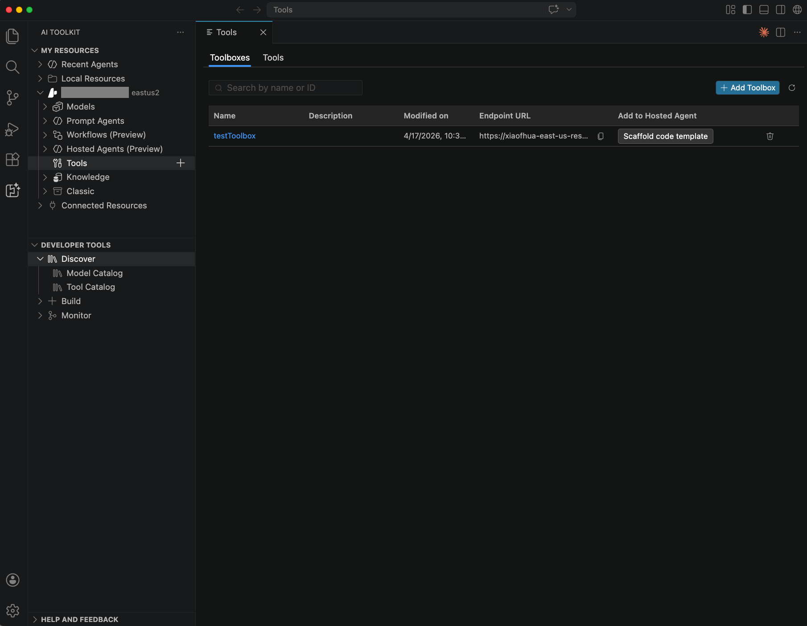

# Use Tool Catalog to connect tools and Toolboxes in Foundry Toolkit

> [!NOTE]
> Toolbox support is currently in preview and only available in pre-release version of Foundry Toolkit.

Agents often depend on more than one tool. Some tools come from Microsoft Foundry, some run as local Model Context Protocol (MCP) servers, and some belong to a shared Toolbox managed by another team. Tool Catalog in Foundry Toolkit for Visual Studio Code gives you one place to connect those options, attach them to agents, and generate hosted agent samples that are wired to a Toolbox.

In this article, you learn how to connect Foundry tools, register local MCP servers, create and consume Toolboxes, and scaffold a hosted agent sample from a Toolbox so you can move from Agent Builder to runnable code.

A [Toolbox](https://aka.ms/toolbox-learn) is a centrally managed collection of tools exposed through one MCP-compatible endpoint. Use it when multiple agents need the same governed set of tools and credentials.

## Key features

| Feature | Description |
| --- | --- |
| Connect Foundry tools | Add individual tools from your Foundry project to prompt agents in Agent Builder. |
| Connect local MCP servers | Register `stdio`, HTTP, or SSE MCP servers for local or remote agent workflows. |
| Attach Toolboxes | Reuse a centrally managed collection of tools through one MCP-compatible endpoint. |
| Generate hosted agent samples | Scaffold an Agent Framework Python project that connects to a Toolbox and exposes the Responses protocol. |
| Centralized governance | Keep credentials, policy enforcement, and auditability in Microsoft Foundry instead of in agent code. |

## Prerequisites

Before you start, make sure you have:

* Visual Studio Code.
* The Foundry Toolkit extension installed.
* Access to a Microsoft Foundry project. For more information, see [Foundry Toolkit for Visual Studio Code](/docs/intelligentapps/overview.md).
* Permission to view or attach tools and Toolboxes in your project.
* For hosted agent samples, Python 3.12 or later and Azure CLI signed in with `az login`.

> [!NOTE]
> Toolbox endpoints are MCP-compatible. Any agent runtime that supports MCP can consume a Toolbox, including agents that you build outside Foundry Toolkit.

## Get started

Tool Catalog supports several ways to bring tools into your agents. Choose the option that matches how the tool is hosted and how you want to share it across agents. The following sections walk through each option in detail.

| Option | Use it when |
| --- | --- |
| Foundry tool | You want to add one tool from your Foundry project to a prompt agent. |
| Local MCP server | You want to use a server that runs locally or at a custom MCP endpoint. |
| Toolbox | You want multiple agents to share the same centrally managed tools, credentials, and policies. |

## Connect a Foundry tool

Use this option when you want to add a single tool from your Foundry project to a prompt agent in Agent Builder.

1. Select **Foundry Toolkit** in the **Activity Bar**.
1. Under **My Resources**, expand **Your project name** > **Tools**.
1. Select the **+** icon next to **Tools** to open **Tool Catalog**.
1. On the **Catalog** tab, browse the available tools.
1. Select the tool that you want to use.
1. In the **Connect** dialog, enter the required values, such as the name, endpoint, parameters, and authentication settings.
1. Select **Connect**.

After the connection is created, the tool is available for your agents.

## Connect a local MCP server tool

Register an MCP server that runs locally on your machine or at a custom remote endpoint. Use this option when you want to test an MCP server during development or connect to a server that isn't published to your Foundry project.

1. Select **Foundry Toolkit** in the **Activity Bar**.
1. Under **My Resources**, expand **Local Resources** > **Tools**.
1. Select the **+** icon next to **Tools** to open **Tool Catalog**.
1. On the **Custom** tab, choose one of these options:
   * Select **Edit mcp.json** to define a server in `mcp.json`.
   * Select **Configure (stdio)** to run a local command.
   * Select **Configure (HTTP or SSE)** to connect to a remote endpoint.
1. Save or complete the configuration.

After you save the configuration, the MCP server appears as an available tool.

## Add a tool to an agent

After you connect tools through Tool Catalog, attach them to a specific agent in Agent Builder so the agent can call them at run time.

1. Open Agent Builder for an existing agent under **My Resources** > **Your project name** > **Prompt Agents**, or create a new agent under **Developer Tools** > **Build** > **Create Agent**.
1. On the **Playground** tab, in the **Tool** section, select **+**.
1. In the **Select a tool** dialog, choose a preconfigured tool, a catalog tool, or a custom tool.
1. Configure the tool options.
1. Select **Add Tool**.

The tool is now attached to the agent and can be used during execution.

### Create a new Toolbox and use it in a hosted agent

Build a custom Toolbox in your Foundry project to group related tools behind a single MCP-compatible endpoint, and then scaffold a hosted agent that consumes it.

1. Select **Foundry Toolkit** in the **Activity Bar**.
1. Under **My Resources**, expand **Your project name** > **Tools**.
1. Select the **+ Add Toolbox** icon to create a new Toolbox.
1. On the **Build a Custom Toolbox** tab, enter the Toolbox name and description, add tools, and then select **Publish**.
1. Go back to the **Tools** page, identify your new Toolbox, and select **Scaffold code template** to create a hosted agent that connects to the Toolbox.

> [!TIP]
> Attach a Toolbox instead of wiring the same tools into multiple agents one by one. When the Toolbox owner updates the Toolbox, consuming agents pick up the change without separate agent edits.

### Copy the Toolbox endpoint

After you create a Toolbox, you can copy its MCP-compatible endpoint from Foundry Toolkit.

1. Select **Foundry Toolkit** in the **Activity Bar**.
1. Under **My Resources**, expand **Your project name** > **Tools**.
1. On the **Toolboxes** tab, locate your Toolbox.
1. In the **Endpoint URL** column, copy the endpoint.

The **Endpoint URL** value is the Toolbox consumer endpoint. Any agent runtime that supports MCP can use this endpoint to connect to the Toolbox.

### Generate a hosted agent sample that uses a Toolbox

Foundry Toolkit can scaffold a runnable hosted agent project that is already wired to a Toolbox. The generated project uses the Agent Framework and exposes the responses protocol, so you can move from Agent Builder to code, debug locally, and deploy back to Microsoft Foundry.

1. Select **Foundry Toolkit** in the **Activity Bar**.
1. Under **My Resources**, expand **Your project name** > **Tools** and open the Toolbox that you want to consume.
1. Select **Scaffold code template**.
1. In the **Command Palette**, select a project folder when prompted.

The generated project includes the hosted agent entry point, deployment files, and a `README.md` with the exact setup, run, and deployment steps for that scaffold.

#### Run locally

Follow the generated `README.md` to install dependencies, configure environment variables, and sign in to Azure. Then start the agent in one of these ways:

* Press `F5` in VS Code and select **Debug Local Agent HTTP Server**.
* Run `python main.py` from the terminal.

> [!TIP]
> Use **Agent Inspector** with the `F5` flow when you want an interactive UI for sending messages, viewing tool calls, and debugging agent behavior with breakpoints.

#### Deploy

Follow the generated `README.md` for the scaffold-specific deployment steps. You can deploy the project in either of these ways:

* Open the **Command Palette**, run **Microsoft Foundry: Deploy Hosted Agent**, and follow the prompts.
* In the **Activity Bar**, select **Foundry Toolkit**, select **Deploy To Microsoft Foundry**, and follow the prompts.
* Open GitHub Copilot Chat and ask it to deploy the hosted agent to Microsoft Foundry. Copilot uses the `microsoft-foundry` skill to build the Docker image, push it, and register the agent.

The generated project stores hosted agent settings in `agent.yaml` and `agent.manifest.yaml`.

> [!NOTE]
> Toolbox MCP requests require the `Foundry-Features: Toolboxes=V1Preview` header. The generated agent handles this for you. You might also see a startup warning if no Application Insights connection is configured. The agent continues to run normally.

## Related content

* [Create agents with the Foundry Toolkit](/docs/intelligentapps/create-agents.md)
* [Develop agents with Agent Inspector in Foundry Toolkit](/docs/intelligentapps/agent-inspector.md)
* [Foundry Toolkit for Visual Studio Code](/docs/intelligentapps/overview.md)
