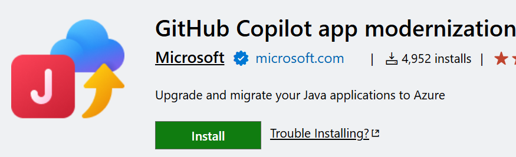

# Modernizing your legacy Java Apps

The [GitHub Copilot App Modernization extension](https://marketplace.visualstudio.com/items?itemName=vscjava.migrate-java-to-azure) (part of the [Extension Pack for Java](https://marketplace.visualstudio.com/items?itemName=vscjava.vscode-java-pack)) provides powerful capabilities to help developers modernize legacy Java applications with greater speed, accuracy, and efficiency.
Whether upgrading frameworks, addressing outdated dependencies, or preparing for cloud migration, GitHub Copilot uses intelligent automation and deep integration with Microsoft Azure to accelerate modernization, from months down to days.

The extension offer the following the key capabilities:

* Intelligent assessments and upgrade planning
    Copilot scans your codebase, analyzes dependencies and frameworks, and builds actionable plans to guide your modernization journey.

* AI-powered code transformation
    From Java 8 to the latest LTS version, Copilot automates upgrades with structured, context-aware edits,  cutting out repetitive work and reducing upgrade risk.

* Reusable migration patterns
    Capture your team’s refactoring logic into custom formulas, then reapply them across apps for consistent, scalable modernization.

✅ Build and test validation
Copilot fixes build errors, runs unit tests, and ensures your application is stable after changes—helping maintain clean CI/CD pipelines.

* CVE detection and remediation
    Automatically detect and patch known vulnerabilities post-upgrade. Copilot applies secure fixes while keeping you in full control of the changes.

* Seamless Azure integration
    Deploy upgraded apps to Azure with minimal effort. Modernized apps can immediately use Azure AI Foundry to unlock over 11,000 models, built-in observability, safety tools, and agent services.

## Get started

Get started with one of the following tutorials or learn more about [general app modernization](https://learn.microsoft.com/en-us/azure/developer/github-copilot-app-modernization/overview).
- [Upgrade a Java project](https://learn.microsoft.com/java/upgrade/quickstart-upgrade)
- [Assess and migrate a Java project](https://learn.microsoft.com/azure/developer/java/migration)
- [Detect and fix security issues in your Java project](https://learn.microsoft.com/java/upgrade/tools)
