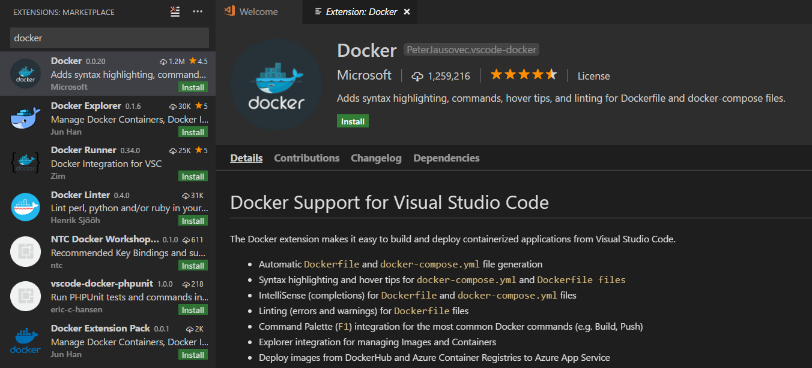
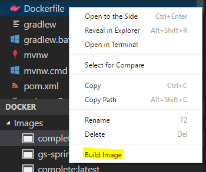
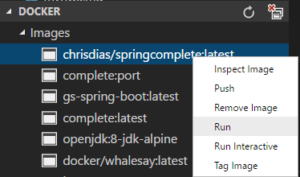
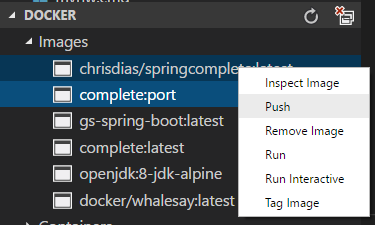
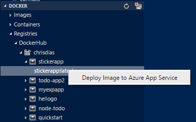

# Java with Docker in VS Code

This tutorial will walk you through building and deploying a [Docker](https://docker.com/) image for a Java application with Visual Studio Code.

We will continue using the same Spring Boot application we built in our first [Java Tutorial](/docs/java/java-tutorial.md).

[Docker](https://docker.com/) is a container management toolkit which allows users to publish and reuse container images. A Docker image is a recipe for running a containerized process. In this tutorial, we will build a Docker image for the web app, run the image locally, and then deploy it to the cloud.

## Before you begin

In addition to the Java tools that you needed to install for the [Java Tutorial](/docs/java/java-tutorial.md), you also need the tools for [Docker](https://docker.com/). See the [Install Docker](https://docs.docker.com/installation/#installation) documentation for details on setting Docker up for your machine. Before proceeding further, verify you can run Docker commands from the shell (`docker --version`).

You also need to have an [Azure](https://azure.microsoft.com) account ready for the deployment steps.

## Install the Docker extension

To have a fully integrated Docker experience, install the [Docker extension](https://github.com/Microsoft/vscode-docker) for VS Code. This extension makes it easy to build and deploy containerized applications from within Visual Studio Code. To install the Docker extension, open the Extensions view (`kb(workbench.view.extensions)`) and search for `docker` to filter the results. Select the Microsoft [Docker](https://marketplace.visualstudio.com/items?itemName=PeterJausovec.vscode-docker) extension.



For more information, see [Working with Docker](/docs/azure/docker.md).

## Create a Container

To build your project, navigate to the `complete` folder of the Sprint Boot application, and run the Maven command below in a terminal to create the Java assembly files (JAR).

```bash
mvn clean package
```

Docker has a simple [Dockerfile](https://docs.docker.com/reference/builder/) file format that it uses to specify the "layers" of an image. Create a Dockerfile in your project under the `complete` folder with the following content:

```docker
FROM openjdk:8-jdk-alpine
VOLUME /tmp
EXPOSE 8080
ADD target/gs-spring-boot-0.1.0.jar app.jar
ENV JAVA_OPTS=""
ENTRYPOINT exec java $JAVA_OPTS -Djava.security.egd=file:/dev/./urandom -jar /app.jar
```

Right click the Dockerfile from the File Explorer, and choose the **Build Image** command from the context menu. You will be prompted to name your image and once it's done, you can see the image in the Docker Explorer provided by the Docker Extension.



## Run your container image locally

Click the **Run** command by right clicking the image you just built and your Docker image will start running locally.



Test the web app by browsing to `http://localhost:8080` using a web browser. You should see the following message displayed: "Greetings from Spring Boot!".


## Push your image to Docker Hub

You can deploy your Docker image to Azure from either a public or private container registry. In this tutorial, we will use Docker Hub. If you do not have a Docker Hub account, create one from [Docker Hub](https://hub.docker.com/)

The first time you expand the Docker Hub node in Docker Explorer, you'll be prompted to log into your Docker Hub account.


Your username and password are stored in your operating system credentials vault (for example, macOS keychain or Windows Credential Store) so that you don't need to log in every time. You can log out of Docker Hub by right clicking on the Docker Hub label and choosing **Docker Hub Logout**. This will delete the credentials from the OS store.

Now push your image to Docker Hub. Make sure the name of your image starts (is 'tagged') with your Docker ID.



## Deploying images to Azure App Service

With the Docker Explorer, you can deploy images from Docker Hub Registries or Azure Container Registries, directly to an Azure App Service instance. This functionality requires installing the [Azure Account](https://marketplace.visualstudio.com/items?itemName=ms-vscode.azure-account) extension and an Azure subscription. If you do not have an Azure subscription, [sign up today](https://azure.microsoft.com//free/?b=16.48) for a free 30 day account and get $200 in Azure Credits to try out any combination of Azure services.

To log into Azure, after installing the Azure Account extensions, you can run **Azure: Sign in** from the **Command Palette** (`kb(workbench.action.showCommands)`). You then sign into your account using the **Device Login** flow. Click on **Copy & Open** in the notification to open your default browser.


Paste in the access code and continue the sign in process.


You can now right click on an image in Docker Hub or an Azure Container Registry and choose **Deploy Image to Azure App Service**.



From here you will be prompted for a Resource Group, a location, an App Service Plan, and a globally unique website name. Once it's deployed to Azure App Service, you will get a URL for the web app running in the cloud!

## Next steps

* To learn more about Java Debugging features, see [Java Debugging Tutorial](/docs/java/java-debugging.md)
* To learn more about Java on Azure, check out [Azure for Java developers](https://docs.microsoft.com//java/azure/)
