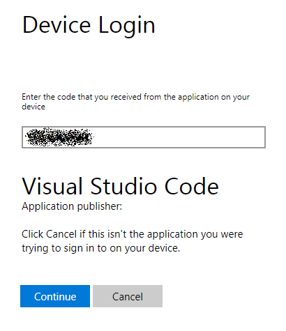

# Java with Docker in VS Code
This 15 minutes tutorial will walk you through the process of building a [Docker](https://docker.com/) image for running a Java application in VS Code.

## Scenario
We will continue using the same Spring Boot application we built in our first [Java Tutorial](/docs/java/java-tutorial).

[Docker](https://docker.com/) is a Linux container management toolkit which allows users to publish container images and consume those published by others. A Docker image is a receipe of running a containerized process. In this tutorial, we will build an docker image for the web app, run the image locally and then finally it to cloud.

## Before you begin
In addition to the Java tools you need to install for the [Java Tutorial](/docs/java/java-tutorial), you would also need to have tools for [Docker](https://docker.com/). See https://docs.docker.com/installation/#installation for details on setting Docker up for your machine. Before proceeding further, verify you can run docker commands from the shell.

You would also need to have your [Azure](http://www.azure.com) account ready for the deployment steps.

## Install Docker Extension
To enable fully integrated docker experience, you can install the [Docker extension](https://github.com/Microsoft/vscode-docker) for VS Code. This extension makes it easy to build and dploy contianerized application from Visual Studio Code. To install the Docker extension, open the Extension Viewlet by pressing `kb(workbench.view.extensions)` and search for `vscode-docker` to filter the results. Select the [Docker Support](https://marketplace.visualstudio.com/items?itemName=PeterJausovec.vscode-docker) extension.


For more information, please check [Work with Docker](/docs/language/dockerfile).

## Containerize the Application
Build your project. Navigate to the *complete* folder of the Sprint Boot application, and run below maven command in terminal to create the Java assembly files.
```
mvn clean package
```

Docker has a simple [Dockerfile](https://docs.docker.com/reference/builder/) file format that it uses to specify the "layers" of an image. So let's go ahead and create a Dockerfile in our project under the *complete* folder.
```
FROM openjdk:8-jdk-alpine
VOLUME /tmp
EXPOSE 8080
ADD target/gs-spring-boot-0.1.0.jar app.jar
ENV JAVA_OPTS=""
ENTRYPOINT exec java $JAVA_OPTS -Djava.security.egd=file:/dev/./urandom -jar /app.jar
```
After that, just right click the DockerFile from the explorer, and choose build image. You will be prompted to name your image and once it's done, you can see the image in your Docker explorer provided by the Docker Extension.


## Run your container image locally
Simply click the Run from right clicking the image you just built, now your docker image would be running locally.


Test the web app by browsing to http://localhost:8080 using a web browser. You should see the following message displayed: *Greetings from Spring Boot!*
<br><br>


## Deploying images to Azure App Service

With the Docker Explorer you can deploy images from DockerHub Registries or Azure Container Registries, directly to an Azure App Service instance. This functionality requires installing the [Azure Account](https://marketplace.visualstudio.com/items?itemName=ms-vscode.azure-account) extension and an Azure Subscription. If you do not have an Azure subscription, [sign up today](https://azure.microsoft.com/en-us/free/?b=16.48) for a free 30 day account and get $200 in Azure Credits to try out any combination of Azure services.

The first time you expand the DockerHub node you'll be prompted to log into your DockerHub account.


Your user name and password are stored in your operating system credentials vault (e.g. MacOS keychain, Windows Credential Store) so that you don't need to log in every time. You can log out of DockerHub by right clicking on the DockerHub label and choosing log out. This will delete the credentials from the OS store.

To log into Azure, press `F1` and search for `Azure Login`. You will then sign into your account using the Device Login flow. Click on "Copy & Open" to open your default browser.


Paste in the access code and continue the sign in process.



You can now right click on an image in DockerHub or an Azure Container Registry and choose "Deploy Image to Azure App Service".


From here you will be prompted for a Resource Group, location, an App Service Plan, and a globally unique website name. Once it's deployed to Azure App Service, you will get a URL for the web app running on the Cloud!

## Next steps
* If you're interested in another hot topic, serverless, please take a look at our [Java Serverless Tutorial](/docs/java/java-serverless)
* To learn more about Java Debugging features, see [Java Debugging Tutorial](/docs/java/java-debugging)
* To learn more about Java on Azure, check out [Azure for Java developers](https://docs.microsoft.com/en-us/java/azure/)

