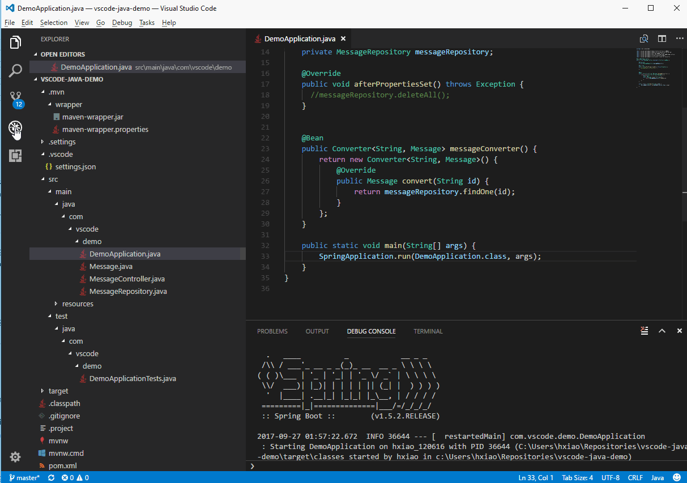

# Debugging Java in VS Code

## Overview
To enable debugging Java code using VS Code, user would need to install [Debugger for Java](https://marketplace.visualstudio.com/items?itemName=vscjava.vscode-java-debug)

It's a lightweight Java Debugger based on [Java Debug Server](https://github.com/Microsoft/java-debug) which extends the [Language Support for Java by Red Hat](https://marketplace.visualstudio.com/items?itemName=redhat.java). Here's a list of features:

- Launch/Attach
- Breakpoints
- Exceptions
- Pause & Continue
- Step In/Out/Over
- Variables
- Callstacks
- Threads
- Debug console

Just like VS Code, the debugger is an open source project which welcomes contributors to collaborate with us through our GitHub repositories
1. [Debugger for Java Extension](https://github.com/Microsoft/vscode-java-debug)
2. [Java Debugger Server for Visual Studio Code](https://github.com/Microsoft/java-debug)

## Install

For the debugger to work, you also need to have the [Language Support for Java(TM) by Red Hat](https://marketplace.visualstudio.com/items?itemName=redhat.java) with your VS Code installed. To make it easier, we provide a [Java Extension Pack](hhttps://marketplace.visualstudio.com/items?itemName=vscjava.vscode-java-pack) which bundles both the [Language Support for Java(TM) by Red Hat](https://marketplace.visualstudio.com/items?itemName=redhat.java) and the [Debugger for Java](https://marketplace.visualstudio.com/items?itemName=vscjava.vscode-java-debug).

The first time you edit a Java file you will be prompted to install the extension pack. You can also install it manually. Open VS Code and press `F1` or `Ctrl + Shift + P` to open command palette, select **Install Extension** and type `java extension pack`.

Or launch VS Code Quick Open (`Ctrl + P`), paste the following command, and press enter.
```bash
ext install vscode-java-pack
```

## Use
It's very easy to run and debug your Java application
- Launch VS Code
- Open a Java project (Maven/Gradle/Eclipse)
- Open a Java file to activate the extensions
- (Optional) Add debug configurations and edit launch.json
- Press F5



If there's no debug configuration (launch.json) in your project, the debugger will automatically find the main class and generate the configuration for your to launch your application.


You can also configure the launch.json by yourself to set your customized settings or attach to another Java process.

Even if there's just a single Java file without any project, you can also use VS Code to run and debug the file.


The Java debugger also supports external source filies. So you can also debug with third party classes, even it's inside a JAR or a source attachment. And you can set breakpoint in those classes ahead of debugging. Java 9 is supported with VS Code as well.

Please also check the documentation of [Language Support for Java by Red Hat](https://marketplace.visualstudio.com/items?itemName=redhat.java) if you have trouble setting up your project.

## Options

### Launch

- `mainClass` (required) - The main class of the program (fully qualified name, e.g. com.xyz.MainClass).
- `args` - The command line arguments passed to the program.
- `sourcePaths` - The extra source directories of the program. The debugger looks for source code from project settings by default. This option allows the debugger to look for source code in extra directories.
- `classPaths` - The classpaths for launching the JVM. If not specified, the debugger will automatically resolve from current project.
- `encoding` - The `file.encoding` setting for the JVM. If not specified, 'UTF-8' will be used. Possible values can be found in http://docs.oracle.com/javase/8/docs/technotes/guides/intl/encoding.doc.html.
- `vmArgs` - The extra options and system properties for the JVM (e.g. -Xms\<size\> -Xmx\<size\> -D\<name\>=\<value\>).
- `projectName` - The preferred project in which the debugger searches for classes. There could be duplicated class names in different projects. This setting also works when the debugger looks for the specified main class when launching a program.
- `cwd` - The working directory of the program.
- `env` - The extra environment variables for the program.

### Attach

- `hostName` (required) - The host name or IP address of remote debuggee.
- `port` (required) - The debug port of remote debuggee.
- `timeout` - Timeout value before reconnecting, in milliseconds (default to 30000ms).
- `sourcePaths` - The extra source directories of the program. The debugger looks for source code from project settings by default. This option allows the debugger to look for source code in extra directories.
- `projectName` - The preferred project in which the debugger searches for classes. There could be duplicated class names in different projects. This setting also works when the debugger looks for the specified main class when launching a program.

### User Settings

- `java.debug.logLevel`: minimum level of debugger logs that are sent to VS Code, defaults to `warn`.

## Feedback and Questions
You can find the full list of issues at [Issue Tracker](https://github.com/Microsoft/vscode-java-debug/issues). You can submit a [bug or feature suggestion](https://github.com/Microsoft/vscode-java-debug/issues/new), and participate community driven [](https://gitter.im/Microsoft/vscode-java-debug)

## Next Steps

Read on to find out about:

* [Debugging](/docs/editor/debugging.md) - find out how to use the debugger with your project for any language


