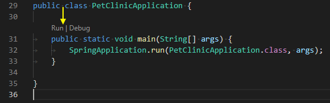
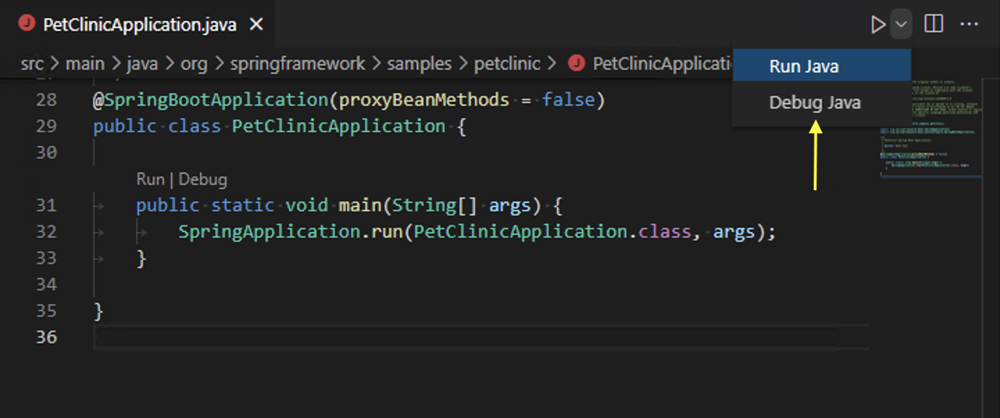

# Running and debugging Java

Visual Studio Code allows you to debug Java applications through the [Debugger for Java](https://marketplace.visualstudio.com/items?itemName=vscjava.vscode-java-debug) extension. It's a lightweight Java debugger based on [Java Debug Server](https://github.com/microsoft/java-debug), which extends the [Language Support for Java™ by Red Hat](https://marketplace.visualstudio.com/items?itemName=redhat.java).

Here's a list of supported debugging features:

- Launch/Attach
- Breakpoints
- Exceptions
- Pause & Continue
- Step In/Out/Over
- Variables
- Call Stacks
- Threads
- Debug Console
- Evaluation
- Hot Code Replace

The Java debugger is an open-source project, which welcomes contributors to collaborate through GitHub repositories:

- [Debugger for Java](https://github.com/microsoft/vscode-java-debug)
- [Java Debug Server for Visual Studio Code](https://github.com/microsoft/java-debug)

If you run into any issues when using the features below, you can contact us by entering an [issue](https://github.com/microsoft/vscode-java-pack/issues).

## Install

To get the complete Java language support in Visual Studio Code, you can install the [Extension Pack for Java](https://marketplace.visualstudio.com/items?itemName=vscjava.vscode-java-pack), which includes the Debugger for Java extension.

<a class="install-extension-btn" href="vscode:extension/vscjava.vscode-java-pack">Install the Extension Pack for Java</a>

>For details on how to get started with the extension pack, you can review the [Getting Started with Java](/docs/java/java-tutorial.md) tutorial.

## Configure

By default, the debugger will run out-of-box by automatically finding the main class and generating a default launch configuration in memory to launch your application.

If you would like to customize and persist your launch configuration, you can select the **create a launch.json file** link in the **Run and Debug** view.

The `launch.json` file is located in a `.vscode` folder in your workspace (project root folder).

For more details on how to create the `launch.json`, read [Launch configurations](/docs/editor/debugging.md#launch-configurations); for more details on configuration options for Java, you can read [Configuration options](/docs/java/java-debugging.md#configuration-options).

## Run and Debug

The debugger extension provides multiple ways to run and debug your Java application.

### Run from CodeLens

You will find **Run|Debug** on the [CodeLens](/blogs/2017/02/12/code-lens-roundup.md) of your `main()` function.

### Run from Editor menu

Another way to start debugging is to select **Run Java** or **Debug Java** menu from the top editor title bar.

### Run from pressing F5

Pressing `kb(workbench.action.debug.start)`, the debugger will automatically find the entry point of your project and start debugging. You can also start a debugging session from the **Run and Debug** view from the side bar of VS Code. See more at [Debugging in VS Code](/docs/editor/debugging.md).

## Debugging single files

In addition to support for debugging Java projects managed by build tools, VS Code also supports for debugging single Java files without any project.

<video autoplay loop muted playsinline controls>
  <source src="/docs/java/java-debugging/single-file-debugging.mp4" type="video/mp4">
</video>

## Debug session inputs

The default Debug Console in VS Code doesn't support inputs. If your program need inputs from a terminal, you can use the Integrated Terminal (`kb(workbench.action.terminal.toggleTerminal)`) within VS Code or an external terminal to launch it. You can also use the user setting `java.debug.settings.console` to configure a global console for all Java debug sessions.

<video autoplay loop muted playsinline controls>
  <source src="/docs/java/java-debugging/launch-in-terminal.mp4" type="video/mp4">
</video>

## Breakpoints

The Debugger for Java supports various breakpoints, such as line breakpoints, conditional breakpoints, data breakpoints, logpoints.

### Breakpoint - Conditional breakpoint

With the help of expression evaluation, the debugger also supports conditional breakpoint. You can set your breakpoint to break when expression evaluates to true.

<video autoplay loop muted playsinline controls>
  <source src="/docs/java/java-debugging/conditional-bp.mp4" type="video/mp4">
</video>

### Breakpoint - Data breakpoint

You can have the debugger break when a variable changes its value. Note that the data breakpoint can only be set inside a debug session. This means you need to launch your application and break on a regular breakpoint first. You can then pick a field in the **VARIABLES** view and set a data breakpoint.

### Breakpoint - Logpoints

[Logpoints](/blogs/2018/07/12/introducing-logpoints-and-auto-attach.md#introducing-logpoints) is also supported by Java Debugger. Logpoints allow you to send output to Debug Console without editing code. They're different from breakpoints because they don't stop the execution flow of your application.

<video autoplay loop muted playsinline controls>
  <source src="/docs/java/java-debugging/logpoints.mp4" type="video/mp4">
</video>

## Expression evaluation

The debugger also lets you evaluate expressions in the **WATCH** window as well as the Debug Console.

<video autoplay loop muted playsinline controls>
  <source src="/docs/java/java-debugging/expression-evaluation.mp4" type="video/mp4">
</video>

## Hot Code Replace

Another advanced feature the debugger supports is 'Hot Code' replacement. Hot Code Replace (HCR) is a debugging technique whereby the Debugger for Java transmits the class changes over the debugging channel to another Java Virtual Machine (JVM). HCR facilitates experimental development and fosters iterative trial-and-error coding. With this new feature, you can start a debugging session and change a Java file in your development environment, and the debugger will replace the code in the running JVM. No restart is required, which is why it's called "hot". Below is an illustration of how you can use HCR with Debugger for Java in VS Code.

<video autoplay loop muted playsinline controls>
  <source src="/docs/java/java-debugging/hcr.mp4" type="video/mp4">
</video>

You may use the debug setting `java.debug.settings.hotCodeReplace` to control how to trigger Hot Code Replace. The possible setting values are:

- `manual` - Click the toolbar to apply the changes (default).
- `auto` - Automatically apply the changes after compilation.
- `never` - Disable Hot Code Replace.

## Step filtering

Step filter is supported by the extension to filter out types that you do not want to see or step through while debugging. With this feature, you can configure the packages to filter within your `launch.json` so they could be skipped when you step through.

<video autoplay loop muted playsinline controls>
  <source src="/docs/java/java-debugging/step-filter.mp4" type="video/mp4">
</video>

## Configuration options

There are many options and settings available to configure the debugger. For example, configuring the JVM arguments and environment variables is easily done with launch options.

<video autoplay loop muted playsinline controls>
  <source src="/docs/java/java-debugging/launch-configuration.mp4" type="video/mp4">
</video>

Consult the documentation for the [Language Support for Java™ by Red Hat](https://marketplace.visualstudio.com/items?itemName=redhat.java) extension for help with setting up your project.

For many commonly used setups, there are samples available in [VS Code Java Debugger Configuration](https://github.com/microsoft/vscode-java-debug/blob/main/Configuration.md). The document explains how the Java debugger automatically generates configurations for you, and if you need to modify them, how to do so with Main class, different arguments, environment, attaching to other Java processes, and usage of more advanced features.

Below are all the configurations available for `Launch` and `Attach`. For more information about how to write the `launch.json` file, refer to [Debugging](/docs/editor/debugging.md).

### Launch

- `mainClass` (required) - The fully qualified class name (for example [java module name/]com.xyz.MainApp) or the java file path of the program entry.
- `args` - The command-line arguments passed to the program. Use `"${command:SpecifyProgramArgs}"` to prompt for program arguments. It accepts a string or an array of string.
- `sourcePaths` - The extra source directories of the program. The debugger looks for source code from project settings by default. This option allows the debugger to look for source code in extra directories.
- `modulePaths` - The modulepaths for launching the JVM. If not specified, the debugger will automatically resolve from current project.
  - `$Auto` - Automatically resolve the modulepaths of current project.
  - `$Runtime` - The modulepaths within 'runtime' scope of current project.
  - `$Test` - The modulepaths within 'test' scope of current project.
  - `!/path/to/exclude` - Exclude the specified path from modulepaths.
  - `/path/to/append` - Append the specified path to the modulepaths.
- `classPaths` - The classpaths for launching the JVM. If not specified, the debugger will automatically resolve from current project.
  - `$Auto` - Automatically resolve the classpaths of current project.
  - `$Runtime` - The classpaths within 'runtime' scope of current project.
  - `$Test` - The classpaths within 'test' scope of current project.
  - `!/path/to/exclude` - Exclude the specified path from classpaths.
  - `/path/to/append` - Append the specified path to the classpaths.
- `encoding` - The `file.encoding` setting for the JVM. If not specified, 'UTF-8' will be used. Possible values can be found in [Supported Encodings](https://docs.oracle.com/javase/8/docs/technotes/guides/intl/encoding.doc.html).
- `vmArgs` - The extra options and system properties for the JVM (for example -Xms\<size\> -Xmx\<size\> -D\<name\>=\<value\>), it accepts a string or an array of string.
- `projectName` - The preferred project in which the debugger searches for classes. There could be duplicated class names in different projects. This setting also works when the debugger looks for the specified main class when launching a program. It is required when the workspace has multiple Java projects, otherwise the expression evaluation and conditional breakpoint may not work.
- `cwd` - The working directory of the program. Defaults to `${workspaceFolder}`.
- `env` - The extra environment variables for the program.
- `envFile` - Absolute path to a file containing environment variable definitions.
- `stopOnEntry` - Automatically pause the program after launching.
- `console` - The specified console to launch the program. If not specified, use the console specified by the `java.debug.settings.console` user setting.
  - `internalConsole` - VS Code Debug Console (input stream not supported).
  - `integratedTerminal` - VS Code Integrated Terminal.
  - `externalTerminal` - External terminal that can be configured in user settings.
- `shortenCommandLine` - When the project has long classpath or big VM arguments, the command line to launch the program may exceed the maximum command-line string limitation allowed by the OS. This configuration item provides multiple approaches to shorten the command line. Defaults to `auto`.
  - `none` - Launch the program with the standard command line 'java {options} classname {args}'.
  - `jarmanifest` - Generate the classpath parameters to a temporary classpath.jar file, and launch the program with the command line 'java -cp classpath.jar classname {args}'.
  - `argfile` - Generate the classpath parameters to a temporary argument file, and launch the program with the command line 'java @argfile {args}'. This value only applies to Java 9 and higher.
  - `auto` - Automatically detect the command-line length and determine whether to shorten the command line via an appropriate approach.
- `stepFilters` - Skip specified classes or methods when stepping.
  - `classNameFilters` - [**Deprecated** - replaced by `skipClasses`] Skip the specified classes when stepping. Class names should be fully qualified. Wildcard is supported.
  - `skipClasses` - Skip the specified classes when stepping. You could use the built-in variables such as '$JDK' and '$Libraries' to skip a group of classes, or add a specific class name expression, for example `java.*`, `*.Foo`.
  - `skipSynthetics` - Skip synthetic methods when stepping.
  - `skipStaticInitializers` - Skip static initializer methods when stepping.
  - `skipConstructors` - Skip constructor methods when stepping.

### Attach

- `hostName` (required) - The host name or IP address of remote debuggee.
- `port` (required) - The debug port of remote debuggee.
- `processId` - Use process picker to select a process to attach, or Process ID as integer.
  - `${command:PickJavaProcess}` - Use process picker to select a process to attach.
  - An integer PID - Attach to the specified local process.
- `timeout` - Time out value before reconnecting, in milliseconds (default to 30000 ms).
- `sourcePaths` - The extra source directories of the program. The debugger looks for source code from project settings by default. This option allows the debugger to look for source code in extra directories.
- `projectName` - The preferred project in which the debugger searches for classes. There could be duplicated class names in different projects. It is required when the workspace has multiple Java projects, otherwise the expression evaluation and conditional breakpoint may not work.
- `stepFilters` - Skip specified classes or methods when stepping.
  - `classNameFilters` - [**Deprecated** - replaced by `skipClasses`] Skip the specified classes when stepping. Class names should be fully qualified. Wildcard is supported.
  - `skipClasses` - Skip the specified classes when stepping. You could use the built-in variables such as '$JDK' and '$Libraries' to skip a group of classes, or add a specific class name expression, for example `java.*`, `*.Foo`.
  - `skipSynthetics` - Skip synthetic methods when stepping.
  - `skipStaticInitializers` - Skip static initializer methods when stepping.
  - `skipConstructors` - Skip constructor methods when stepping.

### User settings

- `java.debug.logLevel`: Minimum level of debugger logs that are sent to VS Code, defaults to `warn`.
- `java.debug.settings.showHex`: Show numbers in hex format in **Variables**, defaults to `false`.
- `java.debug.settings.showStaticVariables`: Show static variables in **Variables**, defaults to `false`.
- `java.debug.settings.showQualifiedNames`: Show fully qualified class names in **Variables**, defaults to `false`.
- `java.debug.settings.showLogicalStructure`: Show the logical structure for the Collection and Map classes in **Variables**, defaults to `true`.
- `java.debug.settings.showToString`: Show 'toString()' value for all classes that override 'toString' method in **Variables**, defaults to `true`.
- `java.debug.settings.maxStringLength`: The maximum length of strings displayed in **Variables** or **Debug Console**. Strings longer than this limit will be trimmed. The default is `0`, which means no trim is performed.
- `java.debug.settings.hotCodeReplace`: Reload the changed Java classes during debugging, defaults to `manual`. Make sure `java.autobuild.enabled` is not disabled for the [Java Language Support extension](https://github.com/redhat-developer/vscode-java). See the [Hot Code Replace wiki page](https://github.com/microsoft/vscode-java-debug/wiki/Hot-Code-Replace) for more information about usages and limitations.
  - manual - Click the toolbar to apply the changes.
  - auto - Automatically apply the changes after compilation.
  - never - Never apply the changes.
- `java.debug.settings.enableHotCodeReplace`: Enable Hot Code Replace for Java code. Make sure the auto build is not disabled for [VS Code Java](https://github.com/redhat-developer/vscode-java). See the [Hot Code Replace wiki page](https://github.com/microsoft/vscode-java-debug/wiki/Hot-Code-Replace) for more information about usages and limitations.
- `java.debug.settings.enableRunDebugCodeLens`: Enable the CodeLens provider for the run and debug buttons over main entry points, defaults to `true`.
- `java.debug.settings.forceBuildBeforeLaunch`: Force building the workspace before launching java program, defaults to `true`.
- `java.debug.settings.console`: The specified console to launch a Java program, defaults to `integratedTerminal`. If you want to customize the console for a specific debug session, please modify the `console` configuration in `launch.json`.
  - `internalConsole` - VS Code Debug Console (input stream not supported).
  - `integratedTerminal` - VS Code Integrated Terminal.
  - `externalTerminal` - External terminal that can be configured in user settings.
- `java.debug.settings.exceptionBreakpoint.skipClasses`: Skip the specified classes when breaking on exception. You could use the built-in variables such as '$JDK' and '$Libraries' to skip a group of classes, or add a specific class name expression, for example `java.*`, `*.Foo`.
- `java.debug.settings.stepping.skipClasses`: Skip the specified classes when stepping. You could use the built-in variables such as '$JDK' and '$Libraries' to skip a group of classes, or add a specific class name expression, for example `java.*`, `*.Foo`.
- `java.debug.settings.stepping.skipSynthetics`: Skip synthetic methods when stepping.
- `java.debug.settings.stepping.skipStaticInitializers`: Skip static initializer methods when stepping.
- `java.debug.settings.stepping.skipConstructors`: Skip constructor methods when stepping.
- `java.debug.settings.jdwp.limitOfVariablesPerJdwpRequest`: The maximum number of variables or fields that can be requested in one JDWP request. The higher the value, the less frequently debuggee will be requested when expanding the variable view. Also a large number can cause JDWP request timeout. Defaults to 100.
- `java.debug.settings.jdwp.requestTimeout`: The timeout (ms) of JDWP request when the debugger communicates with the target JVM. Defaults to 3000.
- `java.debug.settings.vmArgs`: The default VM arguments to launch the Java program. For example, use '-Xmx1G -ea' to increase the heap size to 1 GB and enable assertions. If you want to customize the VM arguments for a specific debug session, you can modify the 'vmArgs' config in `launch.json`.
- `java.silentNotification`: Controls whether notifications can be used to report progress. If true, use status bar to report progress instead. Defaults to `false`.

## Troubleshooting

If you encounter issues when using the debugger, a detailed troubleshooting guide can be found in the [vscode-java-debug GitHub repository](https://github.com/microsoft/vscode-java-debug/blob/main/Troubleshooting.md).

Common issues explained include:

- Java Language Support extension fails to start.
- Build failed, do you want to continue?
- *.java isn't on the classpath. Only syntax errors will be reported.
- Program Error: Could not find or load main class X.
- Program throws ClassNotFoundException.
- Failed to complete Hot Code Replace.
- Please specify the host name and the port of the remote debuggee in the launch.json.
- Failed to evaluate. Reason: Cannot evaluate because the thread is resumed.
- Cannot find a class with the main method.
- No delegateCommandHandler for vscode.java.startDebugSession when starting Debugger.
- Failed to resolve classpath.
- Request type "X" is not supported. Only "launch" and "attach" are supported.

## Feedback and questions

You can find the full list of issues at the [vscode-java-debug](https://github.com/microsoft/vscode-java-debug/issues) repository. You can submit a [bug or feature suggestion](https://github.com/microsoft/vscode-java-debug/issues/new) and participate in the community driven [vscode-java-debug Gitter channel](https://gitter.im/Microsoft/vscode-java-debug).

## Next steps

Read on to find out about:

- [Debugging](/docs/editor/debugging.md) - Find out how to use the debugger in VS Code with your project for any language.

And for Java:

- [Java testing](/docs/java/java-testing.md) - Test Java within VS Code with the Java Test Runner extension.
- [Java extensions](/docs/java/extensions.md) - Learn about more useful Java extensions for VS Code.
