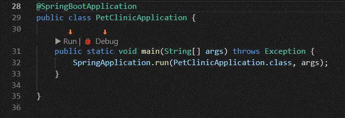

# Running and debugging Java

Visual Studio Code allows you to debug Java applications through the [Debugger for Java](https://marketplace.visualstudio.com/items?itemName=vscjava.vscode-java-debug) extension. It's a lightweight Java debugger based on [Java Debug Server](https://github.com/microsoft/java-debug), which extends the [Language Support for Java by Red Hat](https://marketplace.visualstudio.com/items?itemName=redhat.java).

Here's a list of supported debugging features:

- Launch/Attach
- Breakpoints
- Exceptions
- Pause & Continue
- Step In/Out/Over
- Variables
- Call Stacks
- Threads
- Debug Console
- Evaluation
- Hot Code Replace

The Java debugger is an open-source project, which welcomes contributors to collaborate through GitHub repositories:

- [Debugger for Java Extension](https://github.com/microsoft/vscode-java-debug)
- [Java Debugger Server for Visual Studio Code](https://github.com/microsoft/java-debug)

If you run into any issues when using the features below, you can contact us by clicking the **Report an issue** button below.

<a class="tutorial-feedback-btn" onclick="reportIssue('java-tutorial', 'debugging')" href="javascript:void(0)">Report an issue</a>

## Install

For the debugger to work, you also need to have the [Language Support for Java(TM) by Red Hat](https://marketplace.visualstudio.com/items?itemName=redhat.java) extension installed. To make it easier, there is a [Java Extension Pack](https://marketplace.visualstudio.com/items?itemName=vscjava.vscode-java-pack), which bundles the [Language Support for Java(TM) by Red Hat](https://marketplace.visualstudio.com/items?itemName=redhat.java), the [Debugger for Java](https://marketplace.visualstudio.com/items?itemName=vscjava.vscode-java-debug) and several other popular Java [extensions](/docs/java/extensions.md).

You can manually install the extension pack from the Extensions view (`kb(workbench.view.extensions)`) by typing `vscode-java-pack` in the search box. You will also be prompted to install the Java Extension Pack when you edit a Java file in VS Code for the first time.

For more details, please read [Java tutorial](/docs/java/java-tutorial.md).

## Configure

By default, the debugger will run out-of-box by automatically finding the main class and generate the default configuration for you to launch your application.

If you would like to create your configuration and save it, you can click the **create a launch.json file** link in the Run view where you will also find the **Debug** and **Run** buttons.


The `launch.json` file is located in a `.vscode` folder in your workspace (project root folder) or in your [user settings](/docs/editor/debugging.md#global-launch-configuration) or [workspace settings](/docs/editor/multi-root-workspaces.md#workspace-launch-configurations).

It's possible to create multiple debugging configurations for your project and select the desired one to run.

<video autoplay loop muted playsinline controls>
  <source src="/docs/java/java-debugging/java-debug.mp4" type="video/mp4">
</video>

If you want to debug `current file`, there is a convenient setting, so the editor will choose currently active file as the entry point.

<video autoplay loop muted playsinline controls>
  <source src="/docs/java/java-debugging/current-file.mp4" type="video/mp4">
</video>

For more details on how to create the `launch.json`, please read [Launch configurations](/docs/editor/debugging.md#launch-configurations); for more details on configuraiton options for Java, please read [Configuration options](/docs/java/java-debugging.md#configuration-options).

## Use

To run and debug your Java application, there are several entry points for starting a debugging session.

### CodeLens

You will find **Run|Debug** on the [CodeLens](/blogs/2017/02/12/code-lens-roundup.md) of your `main()` function.



You can disable the CodeLens if you prefer, with the **Enable Run Debug CodeLens** setting. While CodeLens is disabled, you can still access the **Run|Debug** actions by hovering over your `main()` function.

<video autoplay loop muted playsinline controls>
  <source src="/docs/java/java-debugging/debug-hover.mp4" type="video/mp4">
</video>

### Context menu

Another way to start debugging is to right-click a Java file in the File Explorer or editor and select **Run** or **Debug** in the context menu.


### Pressing F5

Pressing `kb(workbench.action.debug.start)`, the debugger will automatically find the entry point of your project and start debugging. You can also start a debugging session from the **Run** menu or the Run view opened by the Run icon in the Activity Bar on the side of VS Code. See more at [Debugging in VS Code](/docs/editor/debugging.md).

<video autoplay loop muted playsinline controls>
  <source src="/docs/java/java-debugging/debug-intro.mp4" type="video/mp4">
</video>

### Debugging single files

VS Code can run and debug single Java files without any project.

<video autoplay loop muted playsinline controls>
  <source src="/docs/java/java-debugging/single-file-debugging.mp4" type="video/mp4">
</video>

### Debugging external files

The Java debugger also supports external source files. This lets you debug third-party classes when they are inside a JAR or a source attachment. Set your breakpoints in those classes before you start debugging. You can also attach missing source code with a `zip/jar` file using the Context menu **Attach Source** action.

<video autoplay loop muted playsinline controls>
  <source src="/docs/java/java-debugging/attach-source.mp4" type="video/mp4">
</video>

Java 9 and newer versions are supported with VS Code Java Debugger as well.

<video autoplay loop muted playsinline controls>
  <source src="/docs/java/java-debugging/java9.mp4" type="video/mp4">
</video>

### Threads

You can see all the running threads in the **Call Stack** pane and work with individual thread using the context menu.


### Debug session inputs

The default Debug Console in VS Code doesn't support inputs. If your program need inputs from a terminal, you can use the Integrated Terminal (`kb(workbench.action.terminal.toggleTerminal)`) within VS Code or an external terminal to launch it.

<video autoplay loop muted playsinline controls>
  <source src="/docs/java/java-debugging/launch-in-terminal.mp4" type="video/mp4">
</video>

### Step filtering

Step filter is supported by the extension to filter out types that you do not wish to see or step through while debugging. With this feature, you can configure the packages to filter within your `launch.json` so they could be skipped when you step through.

<video autoplay loop muted playsinline controls>
  <source src="/docs/java/java-debugging/step-filter.mp4" type="video/mp4">
</video>

### Expression evaluation

The debugger also lets you evaluate expressions in the **WATCH** window as well as the Debug Console. You can also use this feature for conditional breakpoint setting.

<video autoplay loop muted playsinline controls>
  <source src="/docs/java/java-debugging/expression-evaluation.mp4" type="video/mp4">
</video>

Currently, the VS Code Java Debugger uses the Integrated Terminal as the default console, which doesn't support expression evaluation. In order for the console to use this feature, you need to change the console to use the Internal Console in `launch.json`.

```json
"console": "internalConsole"
```

If you'd like to use that setting each time you launch a Java program, you can configure it as a global user setting with `java.debug.settings.console`.

### Conditional breakpoint

With the help of expression evaluation, the debugger also supports conditional breakpoint. You can set your breakpoint to break when expression evaluates to true.

<video autoplay loop muted playsinline controls>
  <source src="/docs/java/java-debugging/conditional-bp.mp4" type="video/mp4">
</video>

### Data breakpoint

You can have the debugger break when a variable change its value. Note that the data breakpoint can only be set inside a debug session. This means you need to launch your application and break on a regular breakpoint first. You can then pick a field in the `VARIABLES` view and set a data breakpoint.


### Hot Code replacement

Another advanced feature the debugger supports is 'Hot Code' replacement. Hot code replacement (HCR) is a debugging technique whereby the Java debugger transmits new class files over the debugging channel to another Java Virtual Machine (JVM). HCR facilitates experimental development and fosters iterative trial-and-error coding. With this new feature, you can start a debugging session and change a Java file in your development environment, and the debugger will replace the code in the running JVM. No restart is required, which is why it's called "hot". Below is an illustration of how you can use HCR with Debugger for Java in VS Code.

<video autoplay loop muted playsinline controls>
  <source src="/docs/java/java-debugging/hcr.mp4" type="video/mp4">
</video>

You may use the debug setting `java.debug.settings.hotCodeReplace` to control how to trigger Hot Code replacement. The possible setting values are:

* `manual` - Click the toolbar to apply the changes (default).
* `auto` - Automatically apply the changes after compilation.
* `never` - Disable Hot Code replacement.

### Logpoints

[Logpoints](/blogs/2018/07/12/introducing-logpoints-and-auto-attach.md#introducing-logpoints) is also supported by Java Debugger. Logpoints allow you to send output to debug console without editing code. They're different from breakpoints because they don't stop the execution flow of your application.

<video autoplay loop muted playsinline controls>
  <source src="/docs/java/java-debugging/logpoints.mp4" type="video/mp4">
</video>

## Configuration options

There are many options and settings available to configure the debugger. For example, configuring the current working directory (cwd) and environment variables is easily done with launch options.

<video autoplay loop muted playsinline controls>
  <source src="/docs/java/java-debugging/cwd-env.mp4" type="video/mp4">
</video>

Consult the documentation for the [Language Support for Java by Red Hat](https://marketplace.visualstudio.com/items?itemName=redhat.java) extension for help with setting up your project.

For many commonly used setups, there are samples available in [VS Code Java Debugger Configuration](https://github.com/microsoft/vscode-java-debug/blob/master/Configuration.md). The document explains how the Java debugger automatically generates configurations for you, and if you need to modify them, how to do so with Main class, different arguments, environment, attaching to other Java processes, and usage of more advanced features.

Below are all the configurations available for `Launch` and `Attach`. For more information about how to write the `launch.json` file, refer to [Debugging](/docs/editor/debugging.md).

### Launch

- `mainClass` (required) - The fully qualified class name (for example [java module name/]com.xyz.MainApp) or the java file path of the program entry.
- `args` - The command-line arguments passed to the program. Use `"${command:SpecifyProgramArgs}"` to prompt for program arguments. It accepts a string or an array of string.
- `sourcePaths` - The extra source directories of the program. The debugger looks for source code from project settings by default. This option allows the debugger to look for source code in extra directories.
- `modulePaths` - The modulepaths for launching the JVM. If not specified, the debugger will automatically resolve from current project.
- `classPaths` - The classpaths for launching the JVM. If not specified, the debugger will automatically resolve from current project.
- `encoding` - The `file.encoding` setting for the JVM. If not specified, 'UTF-8' will be used. Possible values can be found in [Supported Encodings](https://docs.oracle.com/javase/8/docs/technotes/guides/intl/encoding.doc.html).
- `vmArgs` - The extra options and system properties for the JVM (for example -Xms\<size\> -Xmx\<size\> -D\<name\>=\<value\>), it accepts a string or an array of string.
- `projectName` - The preferred project in which the debugger searches for classes. There could be duplicated class names in different projects. This setting also works when the debugger looks for the specified main class when launching a program. It is required when the workspace has multiple Java projects, otherwise the expression evaluation and conditional breakpoint may not work.
- `cwd` - The working directory of the program. Defaults to `${workspaceFolder}`.
- `env` - The extra environment variables for the program.
- `stopOnEntry` - Automatically pause the program after launching.
- `console` - The specified console to launch the program. If not specified, use the console specified by the `java.debug.settings.console` user setting.
  - `internalConsole` - VS Code debug console (input stream not supported).
  - `integratedTerminal` - VS Code Integrated Terminal.
  - `externalTerminal` - External terminal that can be configured in user settings.
- `shortenCommandLine` - When the project has long classpath or big VM arguments, the command line to launch the program may exceed the maximum command-line string limitation allowed by the OS. This configuration item provides multiple approaches to shorten the command line. Defaults to `auto`.
  - `none` - Launch the program with the standard command line 'java [options] classname [args]'.
  - `jarmanifest` - Generate the classpath parameters to a temporary classpath.jar file, and launch the program with the command line 'java -cp classpath.jar classname [args]'.
  - `argfile` - Generate the classpath parameters to a temporary argument file, and launch the program with the command line 'java @argfile [args]'. This value only applies to Java 9 and higher.
  - `auto` - Automatically detect the command-line length and determine whether to shorten the command line via an appropriate approach.
- `stepFilters` - Skip specified classes or methods when stepping.
  - `classNameFilters` - Skip the specified classes when stepping. Class names should be fully qualified. Wildcard is supported.
  - `skipSynthetics` - Skip synthetic methods when stepping.
  - `skipStaticInitializers` - Skip static initializer methods when stepping.
  - `skipConstructors` - Skip constructor methods when stepping.

### Attach

- `hostName` (required) - The host name or IP address of remote debuggee.
- `port` (required) - The debug port of remote debuggee.
- `timeout` - Time out value before reconnecting, in milliseconds (default to 30000 ms).
- `sourcePaths` - The extra source directories of the program. The debugger looks for source code from project settings by default. This option allows the debugger to look for source code in extra directories.
- `projectName` - The preferred project in which the debugger searches for classes. There could be duplicated class names in different projects. It is required when the workspace has multiple Java projects, otherwise the expression evaluation and conditional breakpoint may not work.
- `stepFilters` - Skip specified classes or methods when stepping.
  - `classNameFilters` - Skip the specified classes when stepping. Class names should be fully qualified. Wildcard is supported.
  - `skipSynthetics` - Skip synthetic methods when stepping.
  - `skipStaticInitializers` - Skip static initializer methods when stepping.
  - `skipConstructors` - Skip constructor methods when stepping.

### User Settings

- `java.debug.logLevel`: Minimum level of debugger logs that are sent to VS Code, defaults to `warn`.
- `java.debug.settings.showHex`: Show numbers in hex format in **Variables**, defaults to `false`.
- `java.debug.settings.showStaticVariables`: Show static variables in **Variables**, defaults to `false`.
- `java.debug.settings.showQualifiedNames`: Show fully qualified class names in **Variables**, defaults to `false`.
- `java.debug.settings.showLogicalStructure`: Show the logical structure for the Collection and Map classes in **Variables**, defaults to `true`.
- `java.debug.settings.showToString`: Show 'toString()' value for all classes that override 'toString' method in **Variables**, defaults to `true`.
- `java.debug.settings.maxStringLength`: The maximum length of strings displayed in **Variables** or **Debug Console**. Strings longer than this limit will be trimmed. The default is `0`, which means no trim is performed.
- `java.debug.settings.hotCodeReplace`: Reload the changed Java classes during debugging, defaults to `manual`. Make sure `java.autobuild.enabled` is not disabled for [VSCode Java](https://github.com/redhat-developer/vscode-java). See the [Hot Code Replace wiki page](https://github.com/microsoft/vscode-java-debug/wiki/Hot-Code-Replace) for more information about usages and limitations.
  - manual - Click the toolbar to apply the changes.
  - auto - Automatically apply the changes after compilation.
  - never - Never apply the changes.
- `java.debug.settings.enableHotCodeReplace`: Enable hot code replace for Java code. Make sure the auto build is not disabled for [VS Code Java](https://github.com/redhat-developer/vscode-java). See the [Hot Code Replace wiki page](https://github.com/microsoft/vscode-java-debug/wiki/Hot-Code-Replace) for more information about usages and limitations.
- `java.debug.settings.enableRunDebugCodeLens`: Enable the CodeLens provider for the run and debug buttons over main entry points, defaults to `true`.
- `java.debug.settings.forceBuildBeforeLaunch`: Force building the workspace before launching java program, defaults to `true`.
- `java.debug.settings.console`: The specified console to launch a Java program, defaults to `integratedTerminal`. If you want to customize the console for a specific debug session, please modify the `console` configuration in `launch.json`.
  - `internalConsole` - VS Code debug console (input stream not supported).
  - `integratedTerminal` - VS Code Integrated Terminal.
  - `externalTerminal` - External terminal that can be configured in user settings.

## Troubleshooting

If you encounter issues when using the debugger, a detailed troubleshooting guide can be found in the [vscode-java-debug GitHub repository](https://github.com/microsoft/vscode-java-debug/blob/master/Troubleshooting.md).

Common issues explained include:

* Java Language Support extension fails to start.
* Build failed, do you want to continue?
* *.java isn't on the classpath. Only syntax errors will be reported.
* Program Error: Could not find or load main class X.
* Program throws ClassNotFoundException.
* Failed to complete hot code replace.
* Please specify the host name and the port of the remote debuggee in the launch.json.
* Failed to evaluate. Reason: Cannot evaluate because the thread is resumed.
* Cannot find a class with the main method.
* No delegateCommandHandler for vscode.java.startDebugSession when starting Debugger.
* Failed to resolve classpath.
* Request type "X" is not supported. Only "launch" and "attach" are supported.

## Feedback and questions

You can find the full list of issues at [Issue Tracker](https://github.com/microsoft/vscode-java-debug/issues). You can submit a [bug or feature suggestion](https://github.com/microsoft/vscode-java-debug/issues/new) and participate in the community driven [vscode-java-debug Gitter channel](https://gitter.im/Microsoft/vscode-java-debug).

## Next steps

Read on to find out about:

* [Debugging](/docs/editor/debugging.md) - Find out how to use the debugger in VS Code with your project for any language.

And for Java:

* [Java Testing](/docs/java/java-testing.md) - Test Java within VS Code with the Java Test Runner extension.
* [Java Extensions](/docs/java/extensions.md) - Learn about more useful Java extensions for VS Code.
