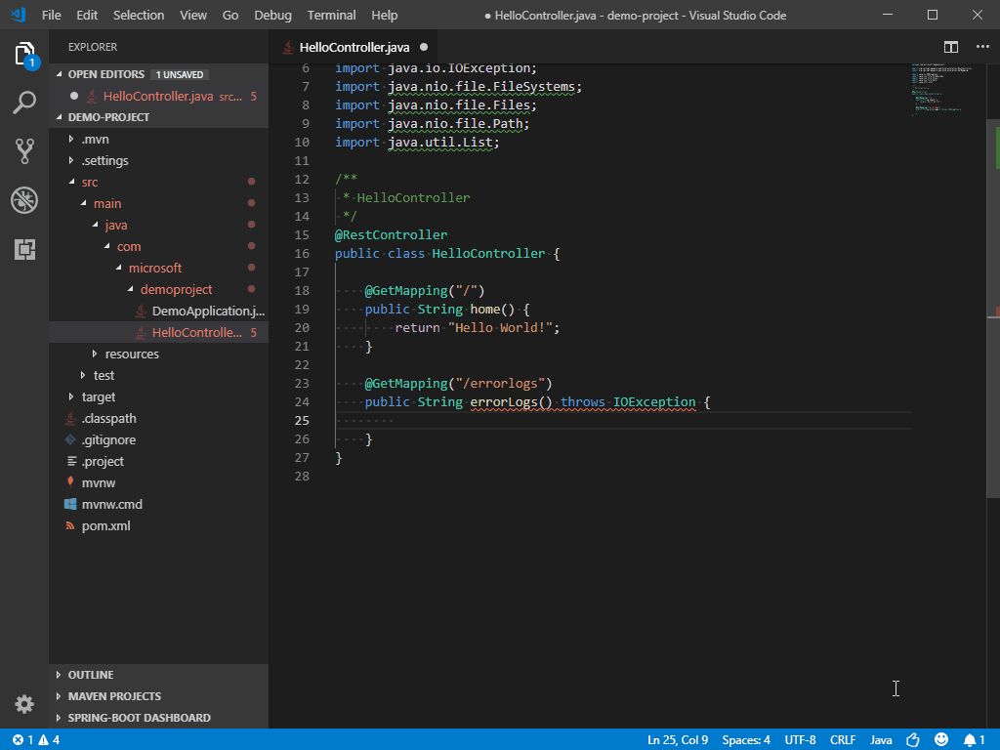
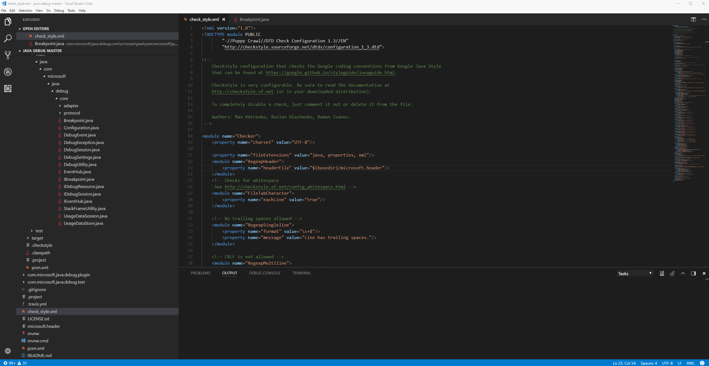

# Editing Java  in Visual Studio Code

As a code editor-centric development tool, Visual Studio Code has a lot of editing related [features](https://code.visualstudio.com/docs/editor/codebasics). In this document, we will go through couple Java specific things which are helpful with Java code.

## Code Navigating

// Spring

// Outline

## IntelliSense

Code completion in Visual Studio Code for Java is provided by [Language Support for Java(TM) by Red Hat](https://marketplace.visualstudio.com/items?itemName=redhat.java). Since the extensions is powered by the same [Java development tools (JDT)](https://www.eclipse.org/jdt/) behind Eclipse, you can expect the same level of competency from that.

In additional, there's also an AI-assisted IntelliSense called [IntelliCode](https://visualstudio.microsoft.com/services/intellicode/). It saves you time by putting what you're most likely to use at the top of your completion list. IntelliCode recommendations are based on thousands of open source projects on GitHub each with over 100 stars, so it’s trained on best practices. When combined with the context of your code, the completion list is tailored to promote those practices. Here's IntelliCode for Java in action.

IntelliCode works well with popular Java libraries and frameworks like Java SE and Spring. It will help you whether you are doing monolithic web apps or modern microservices.

## Refactoring

Here we will show you the most used refactoring features for Java in Visual Studio Code, namely rename, extract methods and variables.

### Rename

Rename allows you to rename variables, classes, methods, packages, folders, and almost any Java identifiers. When you rename an identifier, all references to that identifier are also renamed. The shortcut to invoke the Rename refactoring is `F2`. When you invoke the shortcut on an identifier in the editor, a small box displays within the editor itself where you can change the identifier name. When you press Enter, all references to that identifier are changed, too.

### Extract methods and variables

## Code Snippets

## Formatting

[Language Support for Java(TM) by Red Hat](https://marketplace.visualstudio.com/items?itemName=redhat.java) also provides [formatting settings](https://github.com/redhat-developer/vscode-java/wiki/Formatter-settings). You can export an Eclipse formatter file and then use it for your project in VS Code.

In addition, there's a [Checkstyle for Java](https://marketplace.visualstudio.com/items?itemName=shengchen.vscode-checkstyle) extension which you can use with either some popular `checkstyle` configurations or your customized files.

For more details about [Checkstyle for Java](https://marketplace.visualstudio.com/items?itemName=shengchen.vscode-checkstyle), please visit its [GitHub Repository](https://github.com/jdneo/vscode-checkstyle).