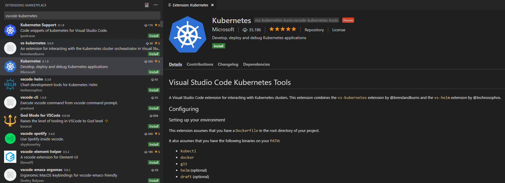
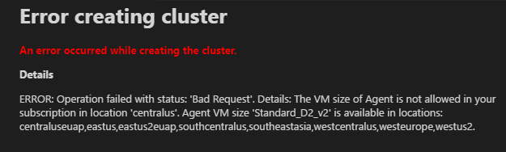
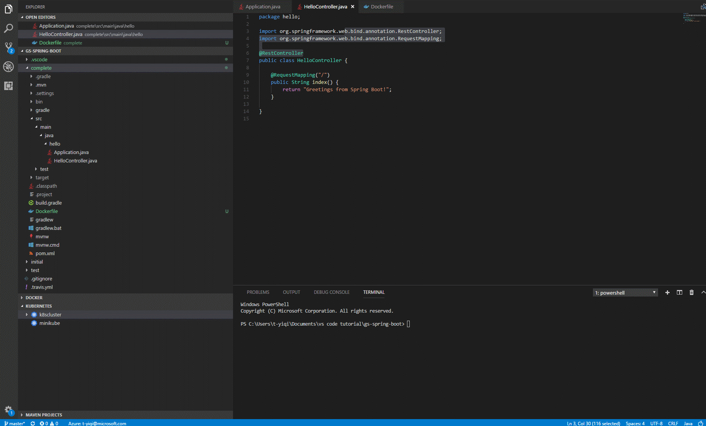

# Java with Kubernetes in VS Code

This 15 minutes tutorial will walk you through the process of deplolying a Java application to [Kubernetes](https://kubernetes.io/) in Visual Studio Code. [Kubernetes](https://kubernetes.io/) is an open-source system for automating deployment, scaling, and management of containerized applications.

We will continue using the same Spring Boot application we built in our first [Java Tutorial](/docs/java/java-tutorial.md). In this tutorial, we will create a Kubernetes cluster, write a Kubernetes manifest file (usually written in YAML) which tells Kubernetes everything it needs to know about the application, and then finally deploy the application to the Kubernetes cluster.

## Before you begin

In addition to the Java tools you needed to install for the [Java Tutorial](/docs/java/java-tutorial.md), you would also need to have tools for [Docker](https://docker.com/) and [kubectl](https://kubernetes.io/docs/reference/kubectl/overview/). See the [Install Docker](https://docs.docker.com/installation/#installation) documentation for details on setting Docker up for your machine and [Install kubectl](https://kubernetes.io/docs/tasks/tools/install-kubectl/). Before proceeding further, verify you can run Docker andk kubectl commands from the shell.

You can create a local Kuberentes cluster with [minikube](https://kubernetes.io/docs/getting-started-guides/minikube/) or an Azure Kubernetes cluster in [Azure Kubernetes Service(AKS)](https://docs.microsoft.com/azure/aks/). In this tutorial, we will use [Azure Container Service(AKS)](https://docs.microsoft.com/azure/aks/), then you would also need to have your [Azure](http://www.azure.com) account ready for the deployment steps.

## Install the Kubernetes extension

To enable fully integrated Kubernetes experience, you can install the [Kubernetes Tools](https://marketplace.visualstudio.com/items?itemName=ms-kubernetes-tools.vscode-kubernetes-tools) extension which lets you quickly develop Kubernetes manifests and HELM charts, then deploy containerized micro-service based applications to local or Azure Kubernetes cluster and live debug your applications running in containers of a Kubernetes cluster. It also makes it easy to browse and manage your Kubernetes cluster in VS Code. Furthermore it provides seamless integration with Draft to streamline Kubernetes development.

To install the Kuberentes extension, open the Extension view by pressing `kb(workbench.view.extensions)` and search for `vscode-kubernetes` to filter the results. Select the [Kubernetes](https://marketplace.visualstudio.com/items?itemName=ms-kubernetes-tools.vscode-kubernetes-tools) extension.

## Containerize the application and push docker image to Docker Hub

You can follow the tutorial of [Java with Docker in VS Code](/docs/java/java-container.md) to build your project, generate a docker image  and push it to public or private container registry through [Docker Extension](https://github.com/Microsoft/vscode-docker).

## Create and config a Kuberentes cluster

You can create a Kubernetes cluster running on Azure using Kubernetes extension in VS Code. Once you have installed the Kubernetes extension, you can see `Kubernetes` in the Explorer. Click on `More` and choose `Create Cluster`. Just follow the instructions to choose cluster type (here we choose `Azure Kubernetes Service`), select your subscription, set up Azure cluster settings and Azure agent settings. It will take minutes to complete the whole workflow.

**Important**: To create Kubernetes cluster on Azure, you need to [install Azure CLI and login.](https://docs.microsoft.com/en-us/cli/azure/get-started-with-azure-cli?view=azure-cli-latest)

**Tips**: You will encounter an error requiring an RSA key file if you don't have availalbe key. Follow [create SSH public-private key](https://docs.microsoft.com/azure/virtual-machines/linux/mac-create-ssh-keys) to create your key before creating an Azure Kubernetes cluster.

**Tips**: You might encounter an error indicating conflicting location and VM size when creating an Azure Kubernetes cluster. Pay attention to choose proper location and VM size.

## Deploy the application to Azure Kubernetes Service

Kubernetes extension provides auto-completion, code snippet and verification for the Kubernetes manifest file. For example, once you type `Deployment`, a manifest file with fundamental structure is auto-generated for you. You only need to enter your app name, image and port manually.

Here we provide an example of a manifest file.

Get your manifest file ready and you only need one command to start a deployment. Press `Ctrl+Shift+P` to open the Command Palette and run `Kubernetes: Create`. It will deploy the application to your kubernetes cluster and create objects according to the configuration in the opening Kubernetes manifest file.

After deployment, Kubernetes extension can help you check the status of your application. From the Explorer, click on `Workloads`, right click on `Pods` and then choose `Get` to see whether the application has started. To view the status of your app, select `Services`, right click on your app, and then click `Get`. The status will be printed in the Terminal. Once your application has got an `EXTERNAL_IP`, you can open a browser and see your web app running.

Congratulations! Now your app is successfully running in Azure Kubernetes Service!

## Next steps

* To learn more about Java Debugging features, see [Java Debugging Tutorial](/docs/java/java-debugging.md)
* To learn more about Java on Azure, check out [Azure for Java developers](https://docs.microsoft.com//java/azure/)
