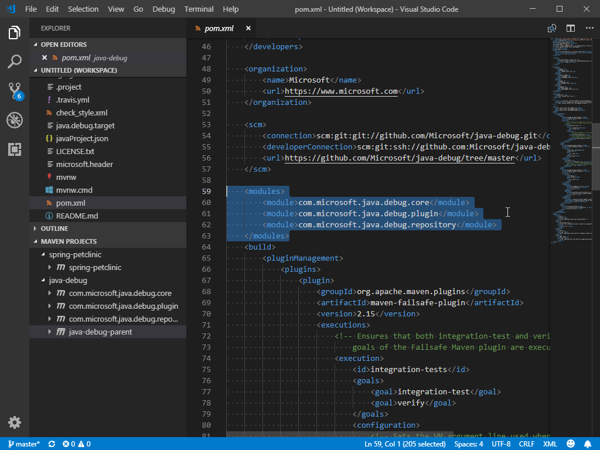

# Java Project Management in VS Code

This document will give you an overview of how to use the [Java Dependency Viewer](https://marketplace.visualstudio.com/items?itemName=vscjava.vscode-java-dependency) and [Maven for Java](https://marketplace.visualstudio.com/items?itemName=vscjava.vscode-maven) extensions to manage your projects within Visual Studio Code.

If you run into any issues when using the features below, you can contact us by clicking the **Report an issue** button below.

<a class="tutorial-feedback-btn" onclick="reportIssue('java-tutorial', 'project')" href="javascript:void(0)">Report an issue</a>

## Project management

Project Management in Visual Studio Code is provided by the [Java Dependency Viewer](https://marketplace.visualstudio.com/items?itemName=vscjava.vscode-java-dependency) extension. This extension has many features including creating projects as well as viewing the package structure of the project and its dependencies.

<a class="tutorial-install-extension-btn" href="vscode:extension/vscjava.vscode-java-dependency">Install the Java Dependency Viewer</a>

### Create project

In addition to creating a project through Maven Archetype, you can also use the following command to create a simple Java project: **Java: Create Java Project** from the Command Palette.

<video autoplay loop muted playsinline controls>
  <source src="/docs/java/java-project/create-project.mp4" type="video/mp4">
</video>

If you're creating a Spring Boot project, you can also use the [Spring Initializr](https://marketplace.visualstudio.com/items?itemName=vscjava.vscode-spring-initializr) extension, see [Spring Boot in Visual Studio Code](/docs/java/java-spring-boot.md).

### Package and dependency view

The extension also has a hierarchy view of your project and dependencies, which supplements the file view and outline provided by Visual Studio Code, so you don't need to expand multiple subfolders to just view your Java package.

<video autoplay loop muted playsinline controls>
  <source src="/docs/java/java-project/package-viewer.mp4" type="video/mp4">
</video>

<video autoplay loop muted playsinline controls>
  <source src="/docs/java/java-project/hierarchical.mp4" type="video/mp4">
</video>

### Multiple source folders

If you have multiple subfolders that have source code for your project, you can easily add these folders to source path, then all the code inside will be correctly compiled.

<video autoplay loop muted playsinline controls>
  <source src="/docs/java/java-project/multiple-source.mp4" type="video/mp4">
</video>

### Standalone Java file support

Visual Studio Code also supports Java files without a project (or an invisible project, which it creates without affecting your folders). The solution is folder-based, so you can open a folder with Visual Studio Code, and all the Java files within the folder will be properly compiled with all language features available. You can also run and debug standalone files.

<video autoplay loop muted playsinline controls>
  <source src="/docs/java/java-project/standalone.mp4" type="video/mp4">
</video>

### Adding external JAR

In case you need to bring additional JAR files as dependencies, you can create a `lib/` folder in the root directory of the standalone files and place your JAR files there. Source for `foo.jar` is automatically detected if there is a `foo-sources.jar` in the `lib/` folder.

<video autoplay loop muted playsinline controls>
  <source src="/docs/java/java-project/lib.mp4" type="video/mp4">
</video>

## Maven

[Maven](http://maven.apache.org/) is a software tool that helps you manage Java projects and automate application builds. The [Maven for Java](https://marketplace.visualstudio.com/items?itemName=vscjava.vscode-maven) extension for Visual Studio Code provides fully integrated Maven support, allowing you to explore Maven projects, execute Maven commands, and perform the goals of build lifecycle and plugins.

<a class="tutorial-install-extension-btn" href="vscode:extension/vscjava.vscode-maven">Install the Maven for Java extension</a>

### Exploring Maven project

Once a Maven project is loaded, the extension will be activated and it will automatically scan for `pom.xml` files in your workspace and displays all Maven projects and their modules in the side bar.

### Working with POM.xml

The extension provides code snippets and auto completion for adding Maven dependencies based on local Maven repositories. See how easy it is to add a new dependency to your `pom.xml` with those convenient features.

<video autoplay loop muted playsinline controls>
  <source src="/docs/java/java-project/maven-pom-editing.mp4" type="video/mp4">
</video>

The extension also enables you to generate effective POM.

<video autoplay loop muted playsinline controls>
  <source src="/docs/java/java-project/maven-effective-pom.mp4" type="video/mp4">
</video>

You can also use the command **Maven: Add a Dependency** (or `maven.project.addDependency`) to help add a new dependency to `pom.xml`. The process is interactive.

<video autoplay loop muted playsinline controls>
  <source src="/docs/java/java-project/maven-add-dependency.mp4" type="video/mp4">
</video>

Furthermore, VS Code also supports showing dependencies in a tree view which allows you to inspect all dependencies in your project at a single place and check for potential issues.

<video autoplay loop muted playsinline controls>
  <source src="/docs/java/java-project/maven-dependency-tree.mp4" type="video/mp4">
</video>

### Execute Maven commands and goals

By right-clicking each Maven project in the explorer, you can conveniently run Maven goals.

<video autoplay loop muted playsinline controls>
  <source src="/docs/java/java-project/maven-run.mp4" type="video/mp4">
</video>

The extension also preserves the history of goals for each project, so you can quickly rerun the previous command, which is useful when you're running a long custom goal.

There are two ways to rerun a goal:

1. Command Palette > Select **Maven: History** > Select a project > Select command from the history.
2. Right-click a project > Click **History** > Select command from history.

<video autoplay loop muted playsinline controls>
  <source src="/docs/java/java-project/maven-history.mp4" type="video/mp4">
</video>

You can also specify your favorite commands in settings for future execution.

<video autoplay loop muted playsinline controls>
  <source src="/docs/java/java-project/maven-favorite-command.mp4" type="video/mp4">
</video>

For each plug-in you use with your project, the extension also provides you an easy way to access the goals within each plugin.

<video autoplay loop muted playsinline controls>
  <source src="/docs/java/java-project/maven-plugin-goal.mp4" type="video/mp4">
</video>

To debug Maven goals, just right click on a goal and start debugging. The Maven extension will call the Java debugger with the right parameters. This is handy and super time-saving.

<video autoplay loop muted playsinline controls>
  <source src="/docs/java/java-project/debug-maven-plugin-goals.mp4" type="video/mp4">
</video>

### Generate project from Maven Archetype

Another handy feature provided by this extension is to generate a Maven project from [Archetype](https://maven.apache.org/guides/introduction/introduction-to-archetypes.html). The extension loads archetypes listed in local/remote catalogs. After selection, the extension sends `mvn archetype:generate -D...` to the terminal.

There are two ways to generate a Maven project:

1. From the Command Palette, select **Maven: Generate from Maven Archetype**.
2. Right-click on a folder and select **Generate from Maven Archetype**.

<video autoplay loop muted playsinline controls>
  <source src="/docs/java/java-project/maven-archetype.mp4" type="video/mp4">
</video>

### Additional resources

Visit the [GitHub Repo](https://github.com/Microsoft/vscode-maven) of the Maven extension for additional [configurations](https://github.com/Microsoft/vscode-maven/tree/master#additional-configurations) and a [troubleshooting guide](https://github.com/Microsoft/vscode-maven/blob/master/Troubleshooting.md).

In addition to Maven, there's also a [Bazel extension](https://marketplace.visualstudio.com/items?itemName=BazelBuild.vscode-bazel) if you use Bazel to build and test your project.

## Next steps

Read on to find out more about:

* [Java Editing](/docs/java/java-editing.md) - Explore the editing features for Java in VS Code.
* [Java Debugging](/docs/java/java-debugging.md) - Find out how to debug your Java project with VS Code.
* [Java Testing](/docs/java/java-testing.md) - Use VS Code for your JUnit and TestNG cases.
* [Java Extensions](/docs/java/extensions.md) - Learn about more useful Java extensions for VS Code.
