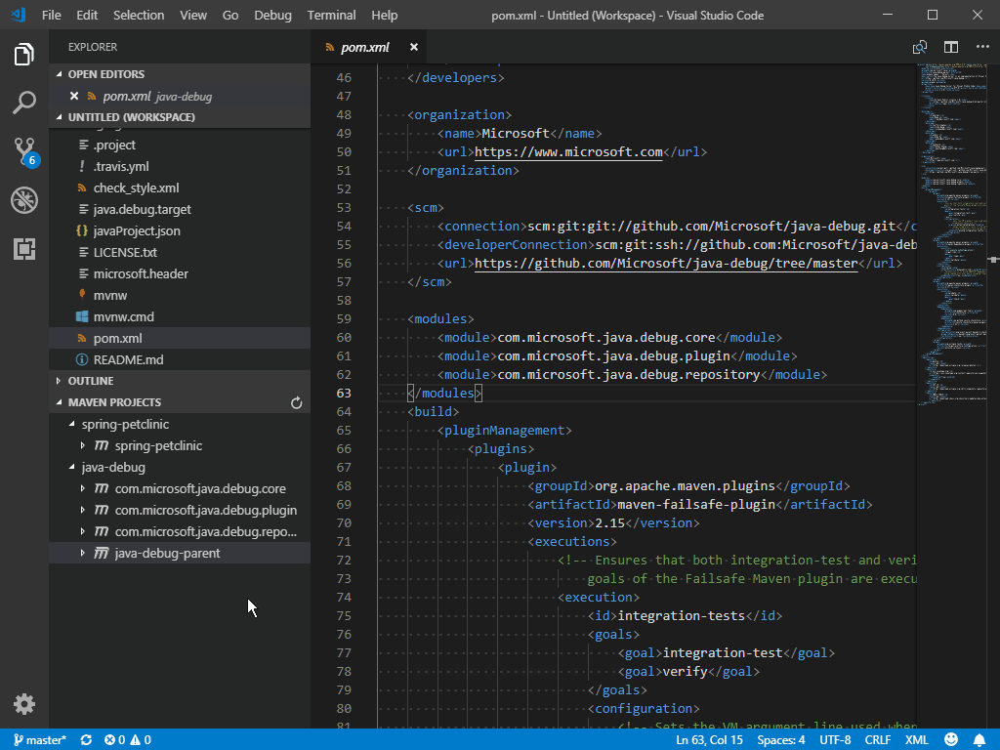
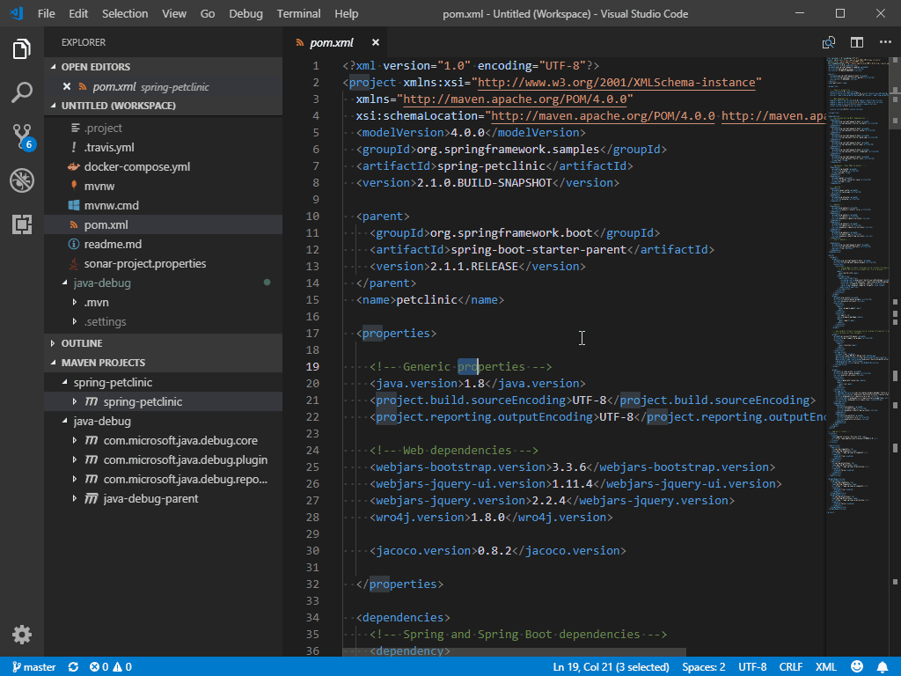
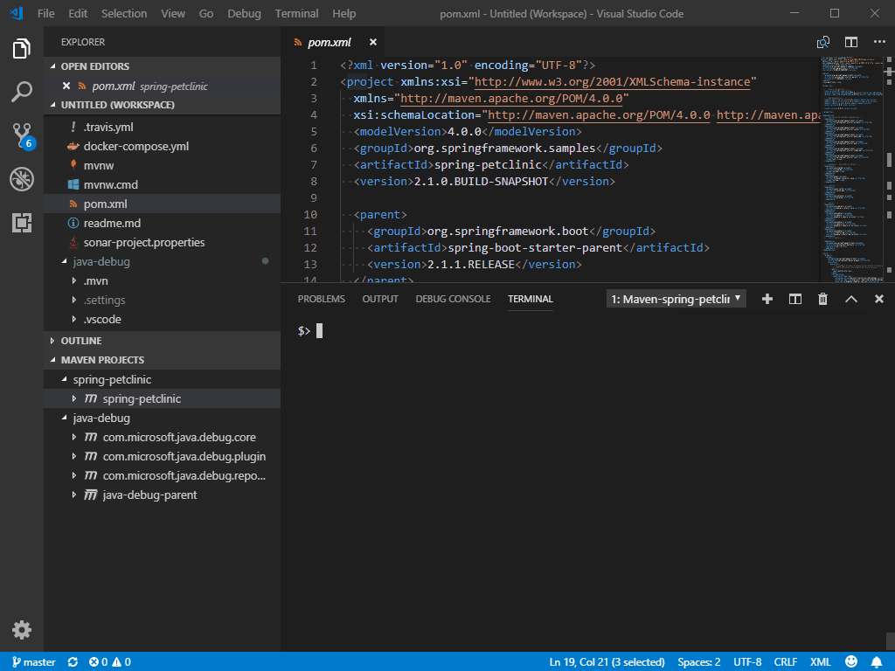
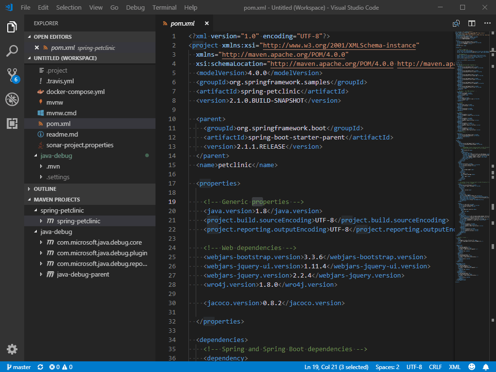
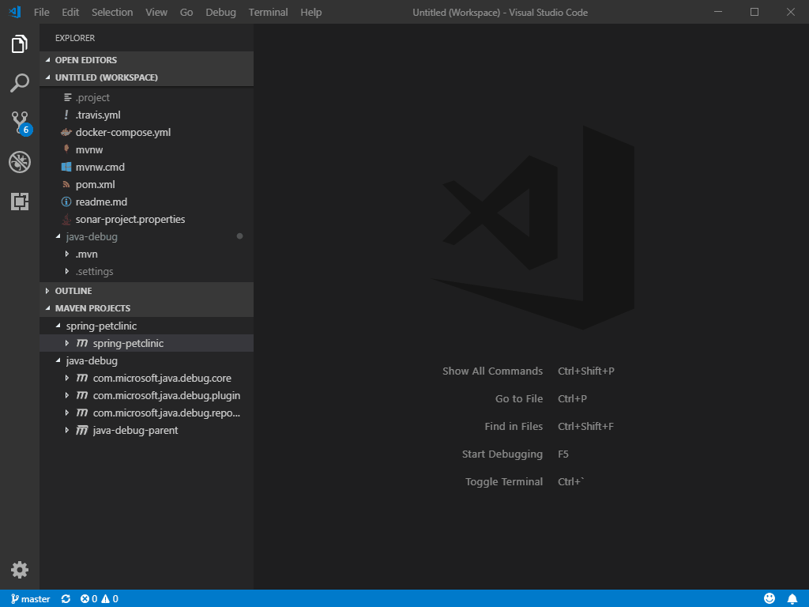
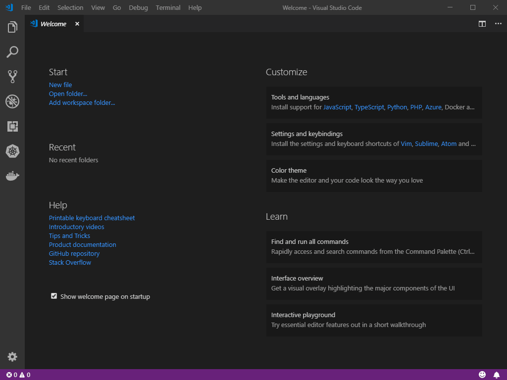
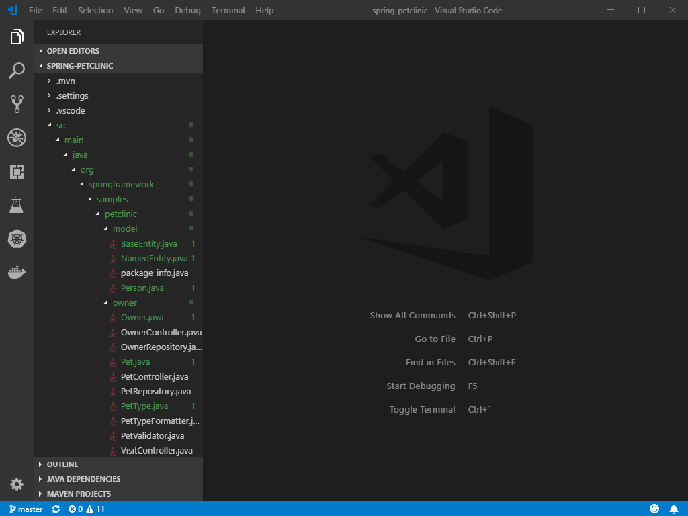

# Maven Support, Java Package and Dependency Management in Visual Studio Code

This document will give you an overview of how to use [Maven for Java](https://marketplace.visualstudio.com/items?itemName=vscjava.vscode-maven) and [Java Dependency Viewer](https://marketplace.visualstudio.com/items?itemName=vscjava.vscode-java-dependency) extension to manage your project within Visual Studio Code.

## Maven

[Maven](http://maven.apache.org/) is a software tool that helps you manage Java projects, and automate application builds. [Maven for Java](https://marketplace.visualstudio.com/items?itemName=vscjava.vscode-maven) extension for Visual Studio Code provides you a fully integrated experience, allowing you to explore Maven project, execute Maven commands and perform the goals of build lifecycle and plugins.

### Exploring Maven project
Once a Maven extension is activated, it automatically scans `pom.xml` in your workspace, and displays all Maven projects and their modules in the side bar.

### Working with POM.xml
The extension enables you to generate effective POM.

[comment]:# (editing POM.xml)

### Execute Maven commands and goals
By right click each Maven project in the explorer, you can run Maven goals conveniently.

The extension also preserves history of goals for each project, so you can fast re-run previous command, which is very useful especially when you're running a long custom one. There're 2 entries for it:

1. Command Palette -> Select `Maven: History ...` -> Select a project -> Select command from the history
2. Right-click a project -> Click `History ...` -> Select command from history

For each plug-in you use with your project, the extension also provides you a easy way to access the goals within each plugin

### Generate project from maven Archetype

Another handy feature provided by this extension is to generate Maven project from Archetype. The extension loads archetypes listed in local/remote catalog. After selection, the extension sends `mvn archetype:generate -D...` to terminal.
There are 2 entries for it:
1. Command Palette -> select `Maven: Generate from Maven Archetype`
2. Right-click on a folder -> Click `Generate from Maven Archetype`

### Additional Resources

Please visit the [GitHub Repo](https://github.com/Microsoft/vscode-maven) of the Maven extension for additional [configurations](https://github.com/Microsoft/vscode-maven/tree/master) and [troubleshooting guide](https://github.com/Microsoft/vscode-maven/blob/master/Troubleshooting.md).

## Project Management

Project Management in Visual Studio Code is mainly provided by [Java Dependency Viewer](https://marketplace.visualstudio.com/items?itemName=vscjava.vscode-java-dependency). This extension provides features including creating project as well as viewing the package structure of the project and its dependencies.

### Create project

In addition to creating project through Maven Archetype, you can also use the following command to create a simple Java project
Command Palette -> select `Java: Create Java Project`

If you're creating a Spring Boot project, you can also use the [Spring Initializr](https://marketplace.visualstudio.com/items?itemName=vscjava.vscode-spring-initializr) extension, see [Spring Boot in Visual Studio Code](/docs/java/java-spring-boot.md)

### Package and Dependency View

The extension also provides you a hierarchy view of your project and dependencies, which supplements the original file view and outline provided by Visual Studio Code so you don't need to expand multiple sub-folders to just view your Java package.

## Next steps

Read on to find out about:

* [Debugging](/docs/java/java-editing.md) - Explore the editing features for Java in VS Code.
* [Debugging](/docs/java/java-debugging.md) - Find out how to debug your Java project with VS Code.
* [Java Extensions](/docs/java/extensions.md) - Learn about more useful Java extensions for VS Code.
