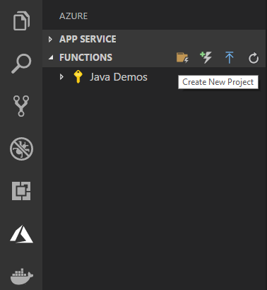
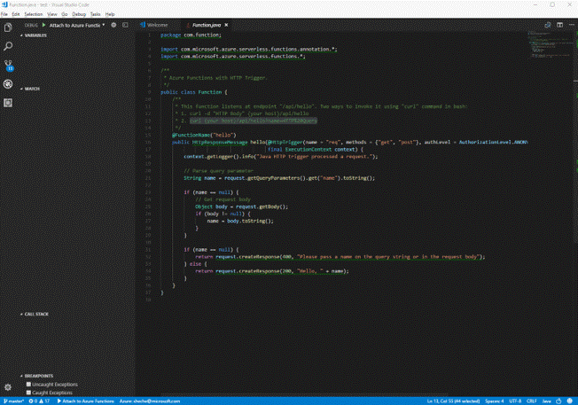
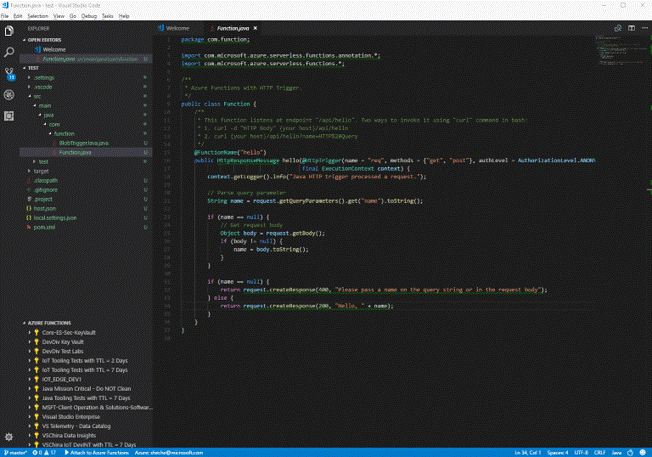
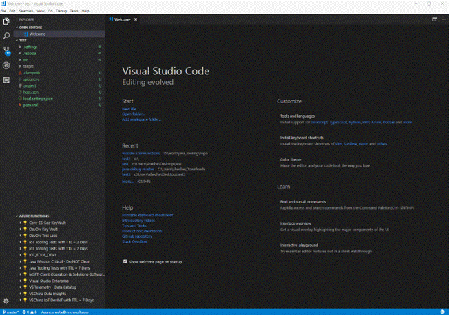

# Serverless Java Apps with VS Code

Serverless, as indicated by its name, allows you to execute your code in an environment without having to first create a VM or publish a web application.

This tutorial guides you through creating a [serverless](https://azure.microsoft.com/overview/serverless-computing/) function project with VS Code and the [Azure Functions](https://marketplace.visualstudio.com/items?itemName=ms-azuretools.vscode-azurefunctions) extension. You be able to test it locally and deploy it to Azure Functions. When you're done, you'll have a HTTP-triggered function app running in Azure.


If you don't have an Azure subscription, you can sign up for a [free Azure account](https://azure.microsoft.com/pricing/free-trial/
).

<a class="tutorial-next-btn" href="https://azure.microsoft.com/pricing/free-trial/" target="_blank" style="background-color:#68217A">Create your free Azure account</a>

## Prerequisites

To develop Functions apps with Java, you must have the following installed:

- [Java Developer Kit](https://www.azul.com/downloads/zulu/), version 1.8.
- [Apache Maven](https://maven.apache.org), version 3.0 or above.

>**Important**: The `JAVA_HOME` environment variable must be set to the install location of the JDK to complete this tutorial.

## Install the Azure Functions extension

[Azure Functions](https://marketplace.visualstudio.com/items?itemName=ms-azuretools.vscode-azurefunctions) extension provides an easy way for you to manage your serverless functions with Azure. It supports both Java and JavaScript Functions with features including:

- Create new project.
- Create new Function from template.
- Debug Function projects locally.
- View Azure Function Apps.
- Create, delete, start, stop and restart Azure Function Apps.
- JSON Intellisense for `function.json`, `host.json` and `proxies.json` files.

In this tutorial, we will leverage this extension to create the serverless function. For a more command line Maven-centric experience, you can also check out the  [Maven Functions Tutorial](https://docs.microsoft.com/en-gb/azure/azure-functions/functions-create-first-java-maven). The Java support of this extension leverages a lot from our [Maven Plugin for Azure Functions](https://github.com/Microsoft/azure-maven-plugins/tree/master/azure-functions-maven-plugin).

To install the Functions extension, open the Extension view by pressing `kb(workbench.view.extensions)` and search for `azure functions` to filter the results. Select the [Azure Functions](https://marketplace.visualstudio.com/items?itemName=ms-azuretools.vscode-azurefunctions) extension.

## Install the Azure Functions Core Tools

**Note**: This step is optional and only required to locally run and debug your Java Functions source code.

The [Azure Functions Core Tools 2.0](https://www.npmjs.com/package/azure-functions-core-tools) provide a local development environment for writing, running, and debugging Azure Functions. Install the tools with the [npm](https://www.npmjs.com/) package manager, included with [Node.js](https://nodejs.org/) (version 8.6 or higher).

```bash
npm install -g azure-functions-core-tools@core
```

Right now, running the tool also requires installation of the latest version of [.NET Core](https://www.microsoft.com/net/core).

> **Note**: If you have trouble installing Azure Functions Core Tools version 2.0, see [Version 2.x runtime](https://docs.microsoft.com/azure/azure-functions/functions-run-local#version-2x-runtime).

## Generate a new Functions project

Once you've installed the Azure Functions extension, you can easily create a new project by:

1. Click **Create New Project** button on the **AZURE FUNCTIONS** Explorer view.
2. Select target folder.
3. Select Java the target language.
4. Fill in the parameters.

The extension will leverage [Maven archetype](https://maven.apache.org/guides/introduction/introduction-to-archetypes.html) to create the function project in the folder you specified.



Within the created project, there's a simple HTTP triggered 'Hello World' Function which reads the input from HTTP query string or body and returns it back immediately.

```java
/**
 * Azure Functions with HTTP Trigger.
 */
public class Function {
    @FunctionName("hello")
    public HttpResponseMessage<String> httpHandler(
            @HttpTrigger(name = "req", methods = {"get", "post"}, authLevel = AuthorizationLevel.ANONYMOUS) HttpRequestMessage<Optional<String>> request,
            final ExecutionContext context
    ) {
        context.getLogger().info("Java HTTP trigger processed a request.");

        String query = request.getQueryParameters().get("name");
        String name = request.getBody().orElse(query);

        if (name == null) {
            return request.createResponse(400, "Please pass a name on the query string or in the request body");
        } else {
            return request.createResponse(200, "Hello, " + name);
        }
    }
}
```

## Run and debug the function locally

Once the function is created, you can easily hit `kbstyle(F5)` to start the function. Behind the scene, we've configured the `launch.json` debugger configuration file to build the functions project and then start the local runtime provided by [Azure Functions Core Tools 2.0](https://www.npmjs.com/package/azure-functions-core-tools).  If you would like to debug your function, set a break point and then send a request to trigger the HTTP function.

```bash
curl -w '\n' -d LocalFunction http://localhost:7071/api/hello
```

You should see:

```bash
Hello LocalFunction!
```



Use `kbstyle(Ctrl+C)` in the terminal to stop the function code.

## Deploy the function to Azure

The deploy process leverages the [Azure Account](https://marketplace.visualstudio.com/items?itemName=ms-vscode.azure-account) extension (installed along with the Azure Functions extension as an dependency) and you would need to sign in with your Azure subscription. If you do not have an Azure subscription, [sign up today](https://azure.microsoft.com//free/?b=16.48) for a free 30 day account and get $200 in Azure Credits to try out any combination of Azure services.

To log into Azure, run **Azure: Sign In** from the **Command Palette** (`kb(workbench.action.showCommands)`). You can then sign into your account using the **Device Login** flow. Click on **Copy & Open** to open your default browser.


Paste in the access code and continue the sign in process.


After signing in, you can just click **Deploy to Function App** button, select the folder of the project you would like to deploy from, and easily follow the prompt hint to configure your function project.



Once the deploy is completed, test the function app running on Azure using curl:

```bash
curl -w '\n' https://fabrikam-function-20170920120101928.azurewebsites.net/api/hello -d AzureFunctions
```

You should see:

```bash
Hello AzureFunctions!
```

## Add additional functions to the project

The extension also supports adding new functions to the existing project. You only need to:

1. Click **Add Function** button on the **AZURE FUNCTIONS** Explorer bar.
2. Select project folder.
3. Select function type.
4. Fill in the parameters for this function type.



## Remote debug functions running in the cloud

Although the local core tool from Azure Functions is running the same code as in the cloud, sometimes environment differences may cause your function to behave differently. With remote debugging, can troubleshoot those issues.

We've released a special [Remote Debugging Tool](https://www.npmjs.com/package/cloud-debug-tools) to help you set up the remote debugging session. You can easily install it via npm:

```bash
npm install -g cloud-debug-tools
```

Once it's installed, run the tool to attach to the running Function on Azure

```bash
dbgproxy fabrikam-function-20170920120101928.azurewebsites.net
```

The tool depends on [Azure CLI](https://docs.microsoft.com/cli/azure) to fetch your credential so make sure you've logged in with the same account.

```bash
az login
```

The tool will then figure out the rest for you. Once it's connected to the running Functions, add a new debugging configuration to attach to the local port opened by it.

```bash
{
    "name": "Attach to Azure Functions on Cloud",
    "type": "java",
    "request": "attach",
    "hostName": "localhost",
    "port": 8898
}
```

Now you can set a break point and attach to your cloud function using VS Code. When you launch a debug session with the above configuration, you can step through it just like you did locally. It's also useful if you don't have .Net Core and the Azure Functions CLI core tool installed on your local environment and you want to jump start within the cloud directly.

## Next steps

You have created a Java function app with a simple HTTP trigger and deployed it to Azure Functions.

- Review the [Java Functions developer guide](https://docs.microsoft.com/azure/azure-functions/functions-reference-java) for more information on developing Java functions.
- To learn more about Java Debugging features, see [Java Debugging Tutorial](/docs/java/java-debugging.md)
