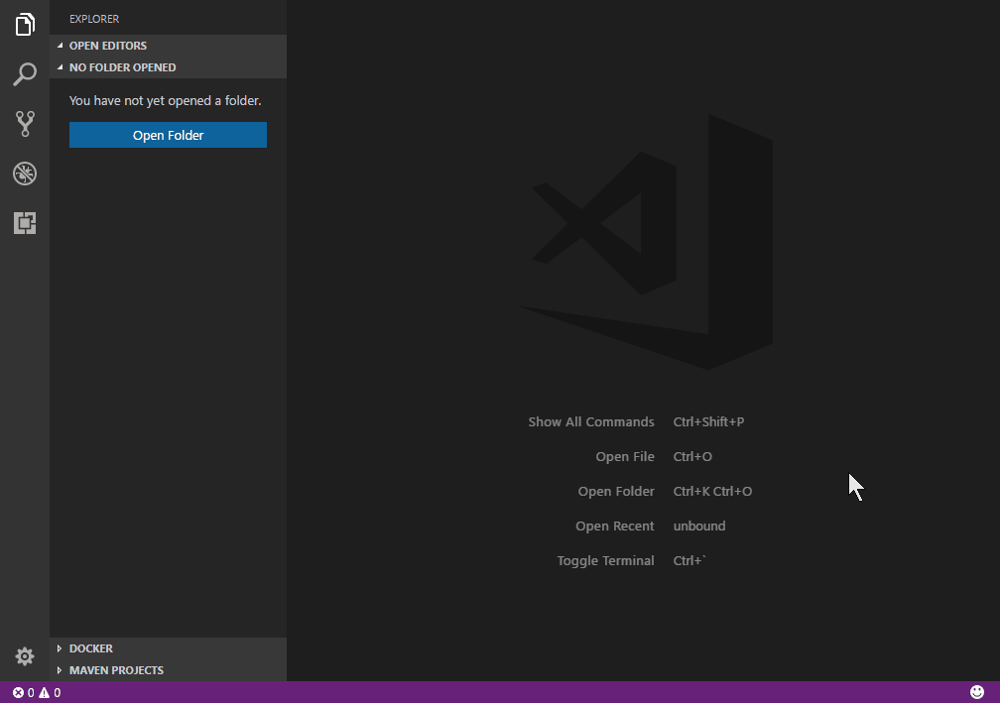

# Build Spring Boot Apps with VS Code

Visual Studio Code is an ideal lightweight development environment for Spring Boot developers and there are several useful VS Code extensions including:

* [Spring Boot Support](https://marketplace.visualstudio.com/items?itemName=Pivotal.vscode-spring-boot)
* [Spring Initializr](https://marketplace.visualstudio.com/items?itemName=vscjava.vscode-spring-initializr)

## Prerequisites

* [Java Development Kit (JDK)](http://www.oracle.com/technetwork/java/javase/downloads/), version 1.8.

* [Apache Maven](http://maven.apache.org/), version 3.0 or later.

## Create Project

The [Spring Initializr](https://marketplace.visualstudio.com/items?itemName=vscjava.vscode-spring-initializr) extension allows you to search for dependencies and generate new Spring Boot projects.

To install, launch VS Code and from the Extensions view (`kb(workbench.view.extensions)`), search for `vscode-spring-initializr`.

Once you have the extension installed, open the **Command Palette** (`kb(workbench.action.showCommands)`) and type `Spring Initializr` to start generating a Maven or Gradle project and then follow the wizard.



## Develop Application

The [Spring Boot Support](https://marketplace.visualstudio.com/items?itemName=Pivotal.vscode-spring-boot) extension includes rich language support for working with Spring Boot `application.properties`, `application.yml` and `.java` files.

The extension supports quick navigate through source code, smart code completions, quick access to running apps, and live application information. Similar code completion and validation features are also available for `.properties` and `.yml` files.


## Connect with Data Service

**Azure Cosmos DB** is a globally-distributed database service that allows developers to work with data using a variety of standard APIs, such as SQL, MongoDB, Cassandra, Graph, and Table.

**Spring Boot Starter** `azure-documentdb-spring-boot-starter` makes it easy to store data in and retrieve data from your Azure Cosmos DB with SQL API.

Before running this sample on [Azure](https://azure.microsoft.com), you need to have an Azure subscription.

If you don't have an Azure subscription, you can sign up for a [free Azure account](https://azure.microsoft.com/pricing/free-trial/):

<a class="tutorial-next-btn" href="https://azure.microsoft.com/pricing/free-trial/" target="_blank" style="background-color:#68217A">Create your free Azure account</a>

### Create an Azure Cosmos DB on Azure

1. Go to [Azure portal](https://portal.azure.com/) and click **+ New** .
2. Click Databases, and then click Azure Cosmos DB to create your database.
3. Select **SQL (Document DB) API** and type in other information for your database.
3. Navigate to the database you have created, and click **Keys** and copy your **URI** and **PRIMARY KEY** for your database.

### Config your project

1. You can start from the [Spring Data Azure Cosmos DB Sample Project](https://github.com/Microsoft/azure-spring-boot/tree/master/azure-spring-boot-samples/azure-documentdb-spring-boot-sample).

2. Navigate to `src/main/resources` and open `application.properties`. Replace below properties in `application.properties` with information of your database.

    ```
    azure.documentdb.uri=your-documentdb-uri
    azure.documentdb.key=your-documentdb-key
    azure.documentdb.database=your-documentdb-databasename
    ```

## Run and Debug the Application

You can press `kb(workbench.action.debug.start)` to run your application. To check the result, open [Azure portal](https://portal.azure.com/) and access your Cosmos DB. Click **Data Explorer**, and next choose **Documents**. You will see data being shown if it is successfully written into Cosmos DB. You can also browse your data entries in CosmosDB with [Azure Cosmos DB Extension](https://marketplace.visualstudio.com/items?itemName=ms-azuretools.vscode-cosmosdb).

After setting a breakpoint (`kb(editor.debug.action.toggleBreakpoint)`) in your source code, refresh your browser to hit the breakpoint. Details about debugging can be found in [Java Debugging](/docs/java/java-debugging.md)

Alternatively, you can also use Maven to package and run your project as steps below
1. Navigate to the diretory `azure-spring-boot` and run the command.

	```
    mvn install
    ```


2. Navigate to the directory `azure-documentdb-spring-boot-sample` and run the command.

	```
    mvn package
    java -jar target/azure-documentdb-spring-boot-sample-0.0.1-SNAPSHOT.jar
    ```

## Next steps

* To deploy your web app, see the [Deploy a Java Application to Azure](/docs/java/java-webapp.md) tutorial.
* To containerize a web app and deploy as a Docker container, check out the [Java Container Tutorial](/docs/java/java-container.md).
* To learn more about Java Debugging features, see [Java Debugging Tutorial](/docs/java/java-debugging.md).
