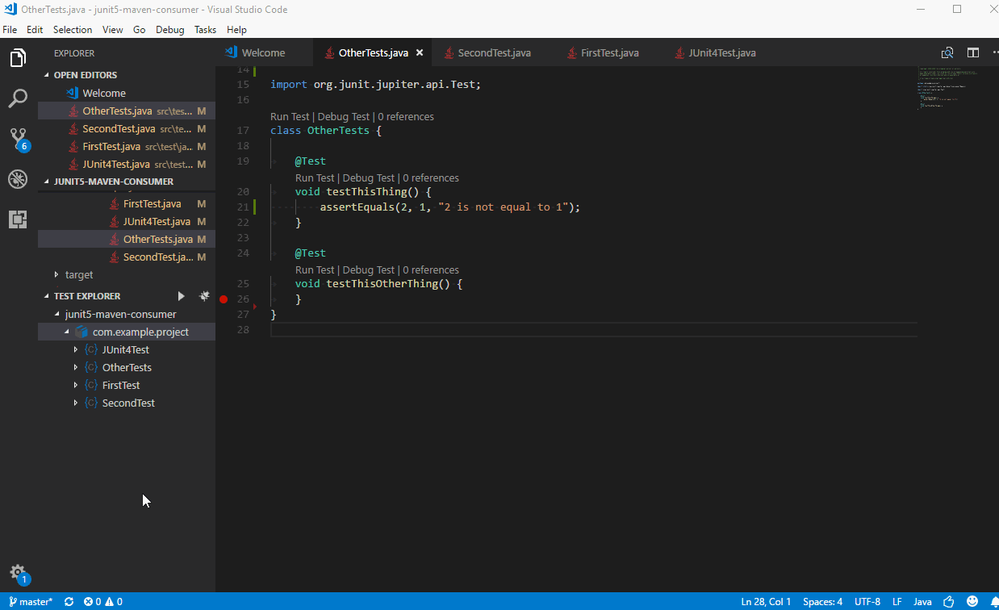

# Testing Java with Visual Studio Code

Testing Java in Visual Studio Code is enabled by [Java Test Runner](https://marketplace.visualstudio.com/items?itemName=vscjava.vscode-java-test) extension. It's a lightweight extension to run and debug Java test cases. The extension supports following test frameworks:

- JUnit 4 (v4.8.0+)
- JUnit 5 (v5.1.0+)
- TestNG (v6.8.0+)

The [Java Test Runner](https://marketplace.visualstudio.com/items?itemName=vscjava.vscode-java-test) works with [Language Support for Java by Red Hat](https://marketplace.visualstudio.com/items?itemName=redhat.java) and [Debugger for Java](https://marketplace.visualstudio.com/items?itemName=vscjava.vscode-java-debug) to provide the following features:

- Run test cases
- Debug test cases
- View test report
- View tests in Test Explorer

Here's a brief instruction with TestNG

And with JUnit5

The JUnit 5 support also covers frequently used annotations such as `@DisplayName` and `@ParameterizedTest`

Please visit the [GitHub repository](https://github.com/Microsoft/vscode-java-test) of the [Java Test Runner](https://marketplace.visualstudio.com/items?itemName=vscjava.vscode-java-test) for more details such as commands and settings.

## Next steps

Read on to find out about:

* [Debugging](/docs/java/java-debugging.md) - Find out how to debug your Java project with VS Code.
* [Java Extensions](/docs/java/extensions.md) - Learn about more useful Java extensions for VS Code.
