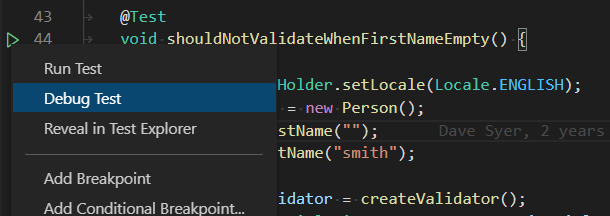
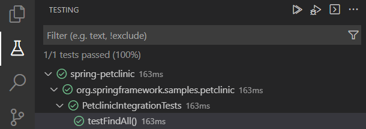

# Testing Java with Visual Studio Code

Testing Java in Visual Studio Code is enabled by the [Java Test Runner](https://marketplace.visualstudio.com/items?itemName=vscjava.vscode-java-test) extension. It's a lightweight extension to run and debug Java test cases.

## Overview

The extension supports the following test frameworks:

- [JUnit 4](https://junit.org/junit4/) (v4.8.0+)
- [JUnit 5](https://junit.org/junit5/) (v5.1.0+)
- [TestNG](https://testng.org/doc/) (v6.8.0+)

> Note: JUnit 3 styled tests are not supported in this extension (for example, `extends junit.framework.TestCase`).

The [Java Test Runner](https://marketplace.visualstudio.com/items?itemName=vscjava.vscode-java-test) works with the [Language Support for Java by Red Hat](https://marketplace.visualstudio.com/items?itemName=redhat.java) and [Debugger for Java](https://marketplace.visualstudio.com/items?itemName=vscjava.vscode-java-debug) extensions to provide the following features:

- Run/Debug test cases
- Customize test configurations
- View test report
- View tests in Test Explorer

We recommend installing the [Extension Pack for Java](https://marketplace.visualstudio.com/items?itemName=vscjava.vscode-java-pack) which includes the features above to get the complete Java development experience

<a class="tutorial-install-extension-btn" href="vscode:extension/vscjava.vscode-java-pack">Install the Extension Pack for Java</a>

If you run into any issues when using the features below, you can contact us by entering an [issue](https://github.com/microsoft/vscode-java-pack/issues).

## Requirements

- JDK (version 11 or later)
- VS Code (version 1.59.0 or later)
- [Language Support for Java by Red Hat](https://marketplace.visualstudio.com/items?itemName=redhat.java)
- [Debugger for Java](https://marketplace.visualstudio.com/items?itemName=vscjava.vscode-java-debug)

## Features

### Run/Debug Test Cases

The extension will generate shortcuts (the green play button) on the left side of the class and method definition. To run the target test cases, select the green play button. You can also right-click on the play button to see more options.

### Test Explorer

The Test Explorer shows all the test cases in your workspace. You can also run/debug your test cases from there.

### Customize test configurations

Sometimes you may want to customize the configuration to run your test cases. To achieve this, you can add the configuration into your workspace [settings](/docs/getstarted/settings.md) under the section: `java.test.config`.

More details can be found on the [vscode-java-test Wiki](https://github.com/Microsoft/vscode-java-test/wiki/Run-with-Configuration).

### View test results

After running/debugging the test cases, the state of the related test items will be updated in both editor decorations and the Test Explorer.

You can trigger the command **Test: Peek Output** to peek the results view. You can select the links in the stack trace to navigate to the source location.

### VS Code testing commands

There are other testing commands (for example, **Run Tests in Current File**) that can be found by searching for 'Test:' in the Command Palette (`kb(workbench.action.showCommands)`).

## Settings

| Setting Name | Description | Default Value |
|---|---|---|
| `java.test.config` | Specify the configuration for the test cases to run with. [More details](https://aka.ms/java-test-config). | `{}` |
| `java.test.defaultConfig` | Specify the name of the default test configuration. | `""` |

### VS Code testing settings

There are VS Code settings specific to testing that can be found by searching for 'testing' in the Settings editor (`kb(workbench.action.openSettings)`).

## Project Setup

### JUnit 5

Please refer to [Getting Started](https://junit.org/junit5/docs/current/user-guide/#overview-getting-started) from the JUnit 5's official website for getting started documentation.

> Note: If your project does not use build tools (Maven/Gradle/...), make sure [junit-platform-console-standalone.jar](https://search.maven.org/search?q=g:org.junit.platform%20AND%20a:junit-platform-console-standalone) is on your project classpath.

### JUnit 4

Refer to [Download and Install](https://github.com/junit-team/junit4/wiki/Download-and-Install) from the JUnit 4's official website for the getting started documentation.

### TestNG

Refer to the [TestNG documentation](https://testng.org/doc/) from the TestNG official website for getting started information.

## FAQ

If you meet any problem when using the extension, you can review the [FAQ](https://github.com/microsoft/vscode-java-test/wiki/FAQ) and our [issue list](https://github.com/microsoft/vscode-java-test/issues) to check if there is an answer to your problem.

## Contributing and Feedback

If you are interested in providing feedback or contributing directly to the code base, please read [Contributing to Java Test Runner](https://github.com/Microsoft/vscode-java-test/blob/main/CONTRIBUTING.md), which covers the following:

- [Questions and Feedback](https://github.com/Microsoft/vscode-java-test/blob/main/CONTRIBUTING.md#questions-and-feedback)
- [Reporting Issues](https://github.com/Microsoft/vscode-java-test/blob/main/CONTRIBUTING.md#reporting-issues)
- [Contributing Fixes](https://github.com/Microsoft/vscode-java-test/blob/main/CONTRIBUTING.md#contributing-fixes)

## Next steps

Read on to find out about:

- [Debugging](/docs/java/java-debugging.md) - Find out how to debug your Java project with VS Code.
- [Java Extensions](/docs/java/extensions.md) - Learn about more useful Java extensions for VS Code.
