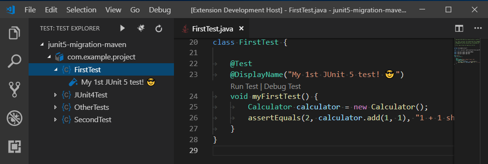
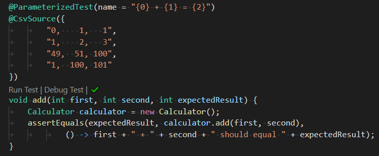

# Testing Java with Visual Studio Code

Testing Java in Visual Studio Code is enabled by the [Java Test Runner](https://marketplace.visualstudio.com/items?itemName=vscjava.vscode-java-test) extension. It's a lightweight extension to run and debug Java test cases. The extension supports the following test frameworks:

- [JUnit 4](https://junit.org/junit4/) (v4.8.0+)
- [JUnit 5](https://junit.org/junit5/) (v5.1.0+)
- [TestNG](https://testng.org/doc/) (v6.8.0+)

>**Note**: More information about the test frameworks can be found at [JUnit](https://junit.org/) and [TestNG](https://testng.org/).

The [Java Test Runner](https://marketplace.visualstudio.com/items?itemName=vscjava.vscode-java-test) works with the [Language Support for Java by Red Hat](https://marketplace.visualstudio.com/items?itemName=redhat.java) and [Debugger for Java](https://marketplace.visualstudio.com/items?itemName=vscjava.vscode-java-debug) extensions to provide the following features:

- Run/Debug test cases
- Customize test configurations
- View test report
- View tests in Test Explorer
- Show test logs

<a class="tutorial-install-extension-btn" href="vscode:extension/vscjava.vscode-java-test">Install the Java Test Runner</a>

If you run into any issues when using the features below, you can contact us by clicking the **Report an issue** button below.

<a class="tutorial-feedback-btn" onclick="reportIssue('java-tutorial', 'testing')" href="javascript:void(0)">Report an issue</a>

## Quickstart

Make sure you have the below tools available already

- JDK (version 11 or later)
- VS Code (version 1.23.0 or later)
- [Language Support for Java by Red Hat](https://marketplace.visualstudio.com/items?itemName=redhat.java)
- [Debugger for Java](https://marketplace.visualstudio.com/items?itemName=vscjava.vscode-java-debug)

You may refer to [Java Extensions](/docs/java/java-tutorial.md#before-you-begin) to set up the environment.

>**Note**: More information about JDK can be found at [supported Java versions](/docs/java/java-tutorial.md#supported-java-versions).

### Getting Started for JUnit 5

Please refer to [Getting Started](https://junit.org/junit5/docs/current/user-guide/#overview-getting-started) from the JUnit 5 official documentation.

> **Note**: You can use [junit-platform-console-standalone.jar](https://search.maven.org/search?q=g:org.junit.platform%20AND%20a:junit-platform-console-standalone) in projects that manually manage their dependencies similar to the [plain-old JAR known from JUnit 4](https://github.com/junit-team/junit4/wiki/Download-and-Install#plain-old-jar).

### Getting Started for JUnit 4

Please refer to [Download and Install](https://github.com/junit-team/junit4/wiki/Download-and-Install) from the JUnit 4 official documentation.

### Getting Started for TestNG

Please refer to [TestNG Docs](https://testng.org/doc/) from the TestNG official documentation.

### Run|Debug CodeLens

When you open a project with test cases from supported frameworks, Test Runner will be activated and you will find **Run|Debug** on the CodeLens of your test functions. Click on the CodeLens to run the individual test case. You can also access and run a group of test cases from the Test Explorer. For more information on debugging test cases, see [Debugging Java](/docs/java/java-debugging.md).

Here's a brief session with TestNG:

<video autoplay loop muted playsinline controls>
  <source src="/docs/java/java-testing/testng.mp4" type="video/mp4">
</video>

## Run/Debug Test Cases

- The extension will generate **Run Test** and **Debug Test** shortcuts (also known as CodeLens) above the class and method definition. Select them to start running or debugging the target test cases.

> Note: If you cannot see the CodeLens in your editor, please refer to this [issue comment](https://github.com/microsoft/vscode-java-test/issues/470#issuecomment-444681714) as a workaround.

## Test Explorer

- The Test Explorer is the place to show all the test cases in your project. You can also run/debug your test cases from here.
- Click the node in the Test Explorer will navigate to the location of the source code.

> Note: If the Test Explorer is empty, please refer to this [issue comment](https://github.com/microsoft/vscode-java-test/issues/470#issuecomment-444681714) as a workaround.

## Customize Test Configurations

- Sometimes you may want to customize the configuration for running the test cases. To achieve this, you can add it into your workspace settings under the section: `java.test.config`.

> Note: More details can be found in [Run with Configuration](https://github.com/microsoft/vscode-java-test/wiki/Run-with-Configuration).

## View Test Report

- After running/debugging the test cases, the test report is opened automatically. You can also see the final results in the status bar, by clicking on it to show the Test Report.
- You can also click the ✔️ or ❌ mark in the CodeLens to open the Test Report.

- For a quick peek of the test status or results, you can see them in the Test Explorer directly.

- You can navigate to the source location of the target test case by clicking the navigate button.

<video autoplay loop muted playsinline controls>
  <source src="/docs/java/java-testing/report.mp4" type="video/mp4">
</video>

## JUnit5 Support

<video autoplay loop muted playsinline controls>
  <source src="/docs/java/java-testing/test-junit5.mp4" type="video/mp4">
</video>

The JUnit 5 support covers frequently used annotations such as `@DisplayName`, `@ParameterizedTest`, `@TestFactory`, `@TestTemplate`, and `@Nested`. It also supports meta-annotations and composed annotations.

## FAQ

If you meet any problem when using the extension, you can refer to the [FAQ](https://github.com/microsoft/vscode-java-test/wiki/FAQ) to check if there is an answer to your problem.

## More Information

Visit the [GitHub repository](https://github.com/microsoft/vscode-java-test) of the [Java Test Runner](https://marketplace.visualstudio.com/items?itemName=vscjava.vscode-java-test) for more details on commands and settings.

## Next steps

Read on to find out about:

- [Debugging](/docs/java/java-debugging.md) - Find out how to debug your Java project with VS Code.
- [Java Extensions](/docs/java/extensions.md) - Learn about more useful Java extensions for VS Code.
