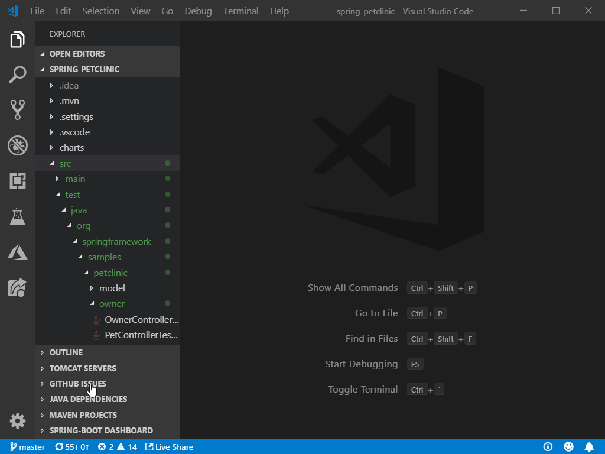

# Testing Java with Visual Studio Code

Testing Java in Visual Studio Code is enabled by the [Java Test Runner](https://marketplace.visualstudio.com/items?itemName=vscjava.vscode-java-test) extension. It's a lightweight extension to run and debug Java test cases. The extension supports the following test frameworks:

- JUnit 4 (v4.8.0+)
- JUnit 5 (v5.1.0+)
- TestNG (v6.8.0+)

>**Note**: More information about the test frameworks can be found at [JUnit](https://junit.org/) and [TestNG](https://testng.org/).

The [Java Test Runner](https://marketplace.visualstudio.com/items?itemName=vscjava.vscode-java-test) works with the [Language Support for Java by Red Hat](https://marketplace.visualstudio.com/items?itemName=redhat.java) and [Debugger for Java](https://marketplace.visualstudio.com/items?itemName=vscjava.vscode-java-debug) extensions to provide the following features:

- Run test cases
- Debug test cases
- View test report
- View tests in Test Explorer

Once the test runner is activated, you will find **Run|Debug** on the CodeLens of your test functions. Click on the CodeLens to run the individual test case. You can also access and run a group of test cases from the Test Explorer. For more information on debugging test cases, see [Debugging Java](/docs/java/java-debugging.md).

Here's a brief session with TestNG:

And with JUnit5:

The JUnit 5 support also covers frequently used annotations such as `@DisplayName` and `@ParameterizedTest`

Visit the [GitHub repository](https://github.com/Microsoft/vscode-java-test) of the [Java Test Runner](https://marketplace.visualstudio.com/items?itemName=vscjava.vscode-java-test) for more details on commands and settings.

You can also view the Test Report and navigate to source from there.

## Next steps

Read on to find out about:

* [Debugging](/docs/java/java-debugging.md) - Find out how to debug your Java project with VS Code.
* [Java Extensions](/docs/java/extensions.md) - Learn about more useful Java extensions for VS Code.
