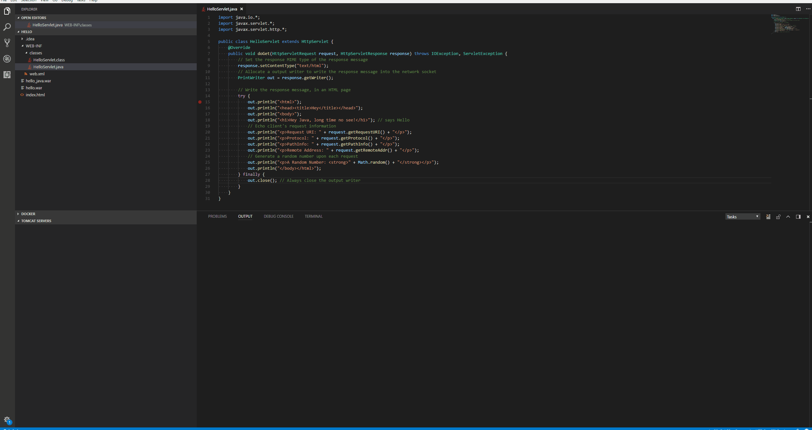
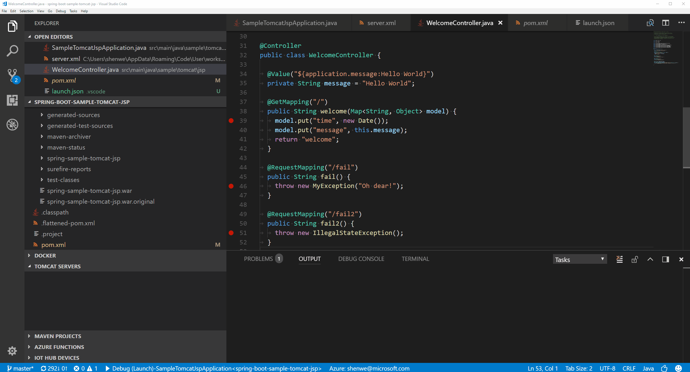
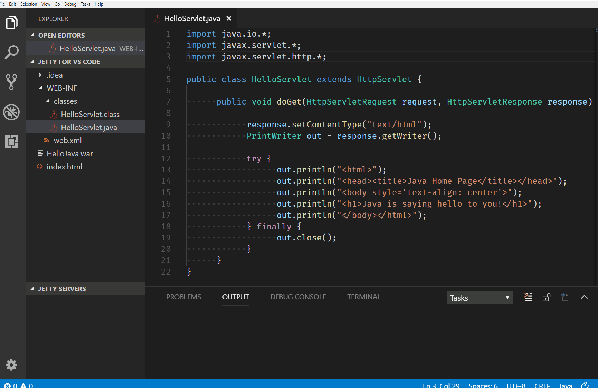

# Tomcat and Jetty support in VS Code

Although Visual Studio Code is a code editor-centric development tool, we know that for certain Java workloads, server integration is very useful. With Visual Studio Code, you can find extensions for popular application servers, for example [Tomcat](http://tomcat.apache.org/) and [Jetty](http://www.eclipse.org/jetty/), which are very helpful when working with those servers locally.

For [Spring Boot Dashboard](https://marketplace.visualstudio.com/items?itemName=vscjava.vscode-spring-boot-dashboard), see [Spring Boot in Visual Studio Code](/docs/java/java-spring-boot.md).

## Tomcat

With the [Tomcat](https://marketplace.visualstudio.com/items?itemName=adashen.vscode-tomcat) extension, you can manage all your local Tomcat servers within the editor and easily debug and run your war package on Tomcat and link Tomcat into workspace.

You can also create new Tomcat server from explorer using the `Add` button and run war package on it. You can also create the server during the deployment.

For running and debugging a package, you can right-click a server to select a `war` package to debug. More details could be found in the [GitHub repository](https://github.com/adashen/vscode-tomcat) of the [Tomcat](https://marketplace.visualstudio.com/items?itemName=adashen.vscode-tomcat) extension.

## Jetty

The [Jetty for Java](https://marketplace.visualstudio.com/items?itemName=SummerSun.vscode-jetty) extension for Visual Studio Code makes it much easier for you to run and deploy your `war` package, operate your Jetty Server, and interact with your application within the editor.

The extension includes the following features:

* Add Jetty Server from download directory
* Start/Restart/Stop/Delete Jetty Server
* Run/Debug/Delete war package
* Reveal war package in file explorer
* Open Server homepage
* Open war package homepage

More details could be found in the [GitHub repository](https://github.com/summersun/vscode-jetty) of the [Tomcat](https://marketplace.visualstudio.com/items?itemName=adashen.vscode-tomcat) extension.
