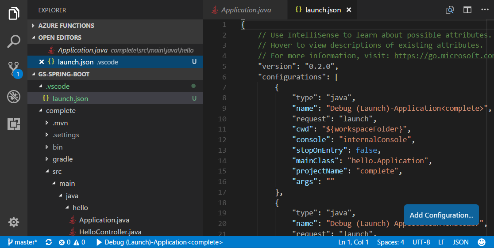

# Build Java Web Apps with VS Code

This 5 minutes tutorial shows you how to create a simple Java web application with Visual Studio Code. You'll learn how to run and debug it locally, and prepare for running it in the cloud.

## Scenario

A simple Spring Boot Getting Started web app

## Before you begin

Before running and deploying this sample, you must have JDK and Maven on your local development environment. If not, please install them.

Download and install the Java SE Development Kit (JDK), version 8:

<a class="tutorial-next-btn" href="http://www.oracle.com/technetwork/java/javase/downloads/jdk8-downloads-2133151.html" target="_blank" style="background-color:#68217A">Download JDK</a>

>**Note**: The `JAVA_HOME` environment variable must be set to the install location of the JDK to complete this tutorial.

Download Apache Maven version 3 or greater:

<a class="tutorial-next-btn" href="https://maven.apache.org/download.cgi" target="_blank" style="background-color:#68217A">Download Apache Maven</a>

Install Apache Maven for your local development environment:

<a class="tutorial-next-btn" href="https://maven.apache.org/install" target="_blank" style="background-color:#68217A">Install Apache Maven</a>

## Download and test the Spring Boot app

Clone the [Spring Boot Getting Started](https://github.com/spring-guides/gs-spring-boot) sample project to your local machine. You can clone a Git repository with the **Git: Clone** command in the **Command Palette** (`kb(workbench.action.showCommands)`). Paste `https://github.com/microsoft/gs-spring-boot.git` as the URL of the remote repository and then decide the parent directory under which to put the local repository. After that, you can open the cloned repository in VS Code.

>**Note**: You can install Visual Studio Code from [https://code.visualstudio.com](https://code.visualstudio.com/) and Git from [https://git-scm.com](https://git-scm.com/).

After cloning the repo, navigate to the `complete` folder that contains the project which is ready to run. Open any of the Java files in the repository (for example `complete\src\main\java\hello\Application.java`). If you haven't got the Java related extensions installed with your VS Code, you will be prompted to install the Java Extension Pack. Just follow the instruction and install the Java Extension Pack from Microsoft. Reload VS Code after the installation.

Once you have the Extension Pack installed, it will automatically build the project for you (this may take several minutes). You can run the application within VS Code by pressing `kb(workbench.action.debug.start)` and selecting the **Java** environment. The Java Debug extension will generate a debugging configuration file `launch.json` for you under a `.vscode` folder in your project. You can see the progress in the VS Code Status Bar and see the final active debug configuration displayed.

You can learn more about how VS Code launches your app at [Launch Configurations](/docs/editor/debugging.md#launch-configurations). Press `kb(workbench.action.debug.start)` again to launch the debugger.

Test the web app by browsing to `http://localhost:8080` using a web browser. You should see the following message displayed: "Greetings from Spring Boot!".

## Make a change

Let's now edit `HelloController.java` to change "Greetings from Spring Boot!" to something else like "Hello World". VS Code provide a great editing experience for Java, check out [Editing and Navigating Code](/docs/languages/java.md#editing-and-navigating-code) to learn about VS Code's editing and code navigation features.

Simply click the Restart button on the top of the editor to reload the app and see result by reloading the browser.

## Debug the application

Set a breakpoint in the application source code, and reload your browser to hit the breakpoint.

If you would like to learn more about debugging Java with VS Code, please read [Java Debugging](/docs/java/java-debugging.md).

Congratulations, you have your first Spring Boot web app running locally! Read on to learn how to host it in the cloud.

## Next steps

* If you'd like to learn how to deploy your web application, checkout out the [Deploy a Java Application to Azure Web App](/docs/java/java-webapp.md) tutorial where we show how to run your web app in the cloud.
* To see how you can containerize the web app and deploy to the cloud as a Docker container, check out [Java Container Tutorial](/docs/java/java-container.md)
* To learn more about Java Debugging features, see [Java Debugging Tutorial](/docs/java/java-debugging.md)
