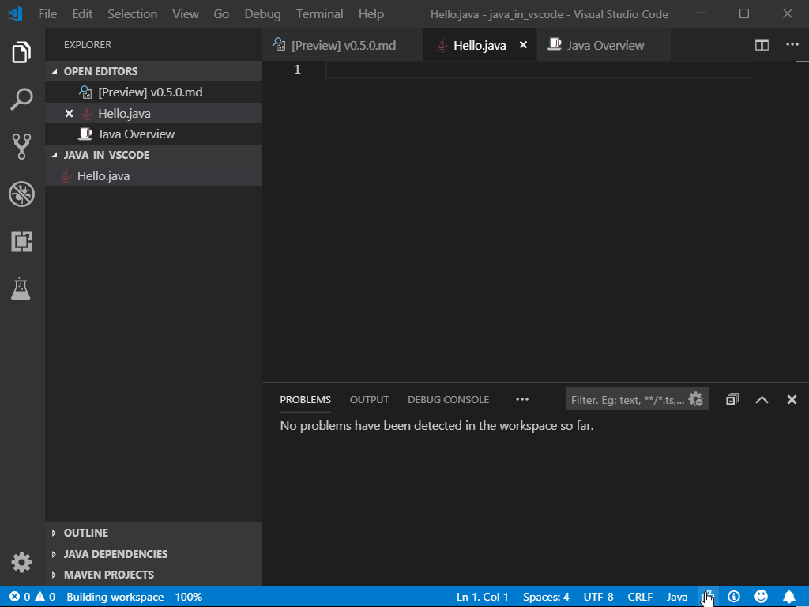
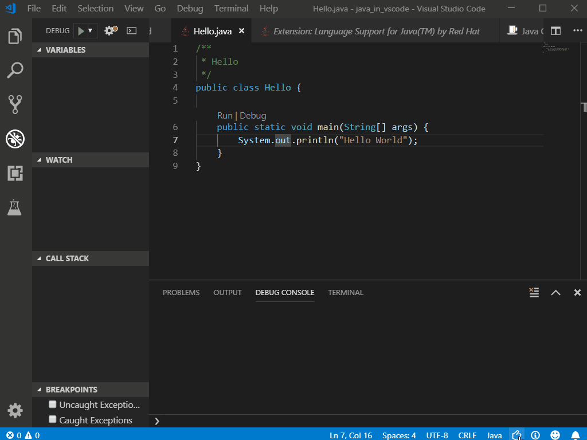

# Writing Java with Visual Studio Code

This tutorial shows you how to write and run a simple Hello World program in Java with Visual Studio Code. It also covers a few advanced features, which you can explore by reading other documents in this section.

## Before you begin

Before going through this tutorial, you must have the Java SE Development Kit (JDK) and Apache Maven build tools on your local development environment. If you don't have, please install them.

Download and install the Java SE Development Kit (JDK). Java support on Visual Studio Code works with all major Java version up to 11, below is a link for version 8:

<a class="tutorial-install-extension-btn" href="http://www.oracle.com/technetwork/java/javase/downloads/jdk8-downloads-2133151.html" target="_blank" style="background-color:#68217A">Download JDK</a>

>**Note**: The `JAVA_HOME` environment variable must be set to the install location of the JDK to complete this tutorial.

Download Apache Maven version 3 or greater:

<a class="tutorial-install-extension-btn" href="https://maven.apache.org/download.cgi" target="_blank" style="background-color:#68217A">Download Apache Maven</a>

Install Apache Maven for your local development environment:

<a class="tutorial-install-extension-btn" href="https://maven.apache.org/install" target="_blank" style="background-color:#68217A">Install Apache Maven</a>

## Install Visual Studio Code and Java Extensions

>**Note**: You can install Visual Studio Code from [https://code.visualstudio.com](https://code.visualstudio.com/).

To help set up Java on VS Code, there is the Microsoft [Java Extension Pack](https://marketplace.visualstudio.com/items?itemName=vscjava.vscode-java-pack), which contains these popular extensions:

1. [Language Support for Java(TM) by Red Hat](https://marketplace.visualstudio.com/items?itemName=redhat.java)
2. [Debugger for Java](https://marketplace.visualstudio.com/items?itemName=vscjava.vscode-java-debug)
3. [Java Test Runner](https://marketplace.visualstudio.com/items?itemName=vscjava.vscode-java-test)
4. [Maven for Java](https://marketplace.visualstudio.com/items?itemName=vscjava.vscode-maven)
5. [Java Dependency Viewer](https://marketplace.visualstudio.com/items?itemName=vscjava.vscode-java-dependency)

<a class="tutorial-install-extension-btn" href="vscode:extension/vscjava.vscode-java-pack">Install the Java Extension Pack</a>

You can also select which extensions you would like to install separately. For this tutorial, only [Language Support for Java(TM) by Red Hat](https://marketplace.visualstudio.com/items?itemName=redhat.java) and [Debugger for Java](https://marketplace.visualstudio.com/items?itemName=vscjava.vscode-java-debug) are needed.

## Create the program

Create a folder for your Java program and open the folder with Visual Studio Code. Within Visual Studio Code, you can then create a new file `Hello.java`. When you open that file, the Java Language Server will automatically be activated as you can see a rocket icon on the right of the Status bar. When it finishes loading, you will see a thumbs up icon instead.

Visual Studio Code also supports more complex Java projects, see [Project Management](/docs/java/java-project.md).

>**Note**: The Java Language Server might not work properly if you open a standalone Java file in Visual Studio Code without opening its folder.

## Editing code

In Visual Studio Code, you can easily use code snippet to scaffold your class and method. It also provides IntelliSense for code completion.

You can also use various refactor methods within the editor. To learn more about Java code editing in Visual Studio Code, see [Java Editing](/docs/java/java-editing.md).

## Running and debugging your program

It is easy to run and debug Java in Visual Studio Code. You can either click `kb(workbench.action.debug.start)` or use the **Run|Debug** CodeLens options. Just set a breakpoint and you can see all your variables and threads in the Debug view.

The debugger also supports advanced features such as Hot Code replacement and conditional breakpoints. For more information, see [Java Debugging](/docs/java/java-debugging.md).

## More features

Now you've seen how easy it is to write a simple Java program with Visual Studio Code. The editor has much more capability to offer for your Java workload.

* [Editing Java](/docs/java/java-editing.md) explains how to navigate and edit Java in more details.
* [Debugging](/docs/java/java-debugging.md) illustrates all the key features provided for Java debug.
* [Testing](/docs/java/java-resting.md) provides comprehensive supports for JUnit and TestNG framework.
* [Maven Support, Java Package, and Dependency Management](/docs/java/java-project.md) shows you how it provides you a project view and works with Maven.
* [Spring Boot Support](/docs/java/java-spring-boot.md) and [Tomcat and Jetty](/docs/java/java-tomcat-jetty.md) demonstrate great support for Spring Boot, Tomcat, and Jetty.

To learn how to work with Java Web App in VS Code, read [Java Web App](/docs/java/java-webapp.md).
