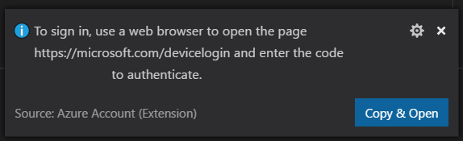

# Java Web Apps with Visual Studio Code

This tutorial shows you how to create a Java web application with Visual Studio Code. You'll learn how to run, debug, and edit the Java web app locally and eventually on the cloud.

## Scenario

A simple Spring Boot Getting Started web app


## Before you begin

Before running and deploying this sample, you must have the Java SE Development Kit (JDK) and Apache Maven build tools on your local development environment. If you don't have, please install them.

Download and install the Java SE Development Kit (JDK), version 8:

<a class="tutorial-next-btn" href="http://www.oracle.com/technetwork/java/javase/downloads/jdk8-downloads-2133151.html" target="_blank" style="background-color:#68217A">Download JDK</a>

>**Note**: The `JAVA_HOME` environment variable must be set to the install location of the JDK to complete this tutorial.

Download Apache Maven version 3 or greater:

<a class="tutorial-next-btn" href="https://maven.apache.org/download.cgi" target="_blank" style="background-color:#68217A">Download Apache Maven</a>

Install Apache Maven for your local development environment:

<a class="tutorial-next-btn" href="https://maven.apache.org/install" target="_blank" style="background-color:#68217A">Install Apache Maven</a>

## Download and test the Spring Boot app

Clone the [Spring Boot Getting Started](https://github.com/spring-guides/gs-spring-boot) sample project to your local machine. You can clone a Git repository with the **Git: Clone** command in the **Command Palette** (`kb(workbench.action.showCommands)`). Paste `https://github.com/spring-guides/gs-spring-boot.git` as the URL of the remote repository and then decide the parent directory under which to put the local repository. After that, open the cloned repository in VS Code by navigating to the repository folder and typing `code .`.

>**Note**: You can install Visual Studio Code from [https://code.visualstudio.com](https://code.visualstudio.com/) and Git from [https://git-scm.com](https://git-scm.com/).


From within VS Code, navigate to the `complete` folder that contains the project which is ready to run. Open any of the Java files in the repository (for example `complete\src\main\java\hello\Application.java`). If you don't have the Java language extensions installed for VS Code, you will be prompted to install the Microsoft [Java Extension Pack](https://marketplace.visualstudio.com/items?itemName=vscjava.vscode-java-pack). Follow the instructions and reload VS Code after the installation.


Once you have the Java Extension Pack installed, it will automatically build the project for you (this may take several minutes). You can run the application within VS Code by pressing `kb(workbench.action.debug.start)` and selecting the **Java** environment. The Java Debug extension will generate a debugging configuration file `launch.json` for you under a `.vscode` folder in your project. You can see build progress in the VS Code Status Bar and when everything is finished, the final active debug configuration is displayed.


You can learn more about how VS Code launches your application in Debugging [Launch Configurations](/docs/editor/debugging.md#launch-configurations). Press `kb(workbench.action.debug.start)` again to launch the debugger.


Test the web app by browsing to `http://localhost:8080` using a web browser. You should see the following message displayed: "Greetings from Spring Boot!".


## Make a change

Let's now edit `HelloController.java` to change "Greetings from Spring Boot!" to something else like "Hello World". VS Code provides a great editing experience for Java, check out [Editing and Navigating Code](/docs/languages/java.md#editing-and-navigating-code) to learn about VS Code's editing and code navigation features.

Click the **Restart** button on the top of the editor to relaunch the app and see result by reloading the browser.


## Debug the application

Set a breakpoint (`kb(editor.debug.action.toggleBreakpoint)`) in the application source code, and reload your browser to hit the breakpoint.


If you would like to learn more about debugging Java with VS Code, you can read [Java Debugging](/docs/java/java-debugging.md).

Congratulations, you have your first Spring Boot web app running locally! Read on to learn how to host it in the cloud.

## Deploy Web Apps to the cloud

We just built a Java web application and ran it locally. Now you will learn how to deploy from Visual Studio Code and run it on [Azure](https://azure.microsoft.com) in the cloud.

If you don't have an Azure subscription, you can sign up for a [free Azure account](https://azure.microsoft.com/pricing/free-trial/).
<a class="tutorial-next-btn" href="https://azure.microsoft.com/pricing/free-trial/" target="_blank" style="background-color:#68217A">Create your free Azure account</a>

### Install the Azure App Service extension

The [Azure App Service](https://marketplace.visualstudio.com/items?itemName=ms-azuretools.vscode-azureappservice) extension is used to create, manage, and deploy to Azure App Service with key features including:

- Create new Azure Web App/Deployment Slot
- Deploy to Azure Web App/Deployment Slot
- Start, stop, and restart the Azure Web App/Deployment Slot
- View a Web App's log files
- Swap Deployment Slots

To install the Azure App Service extension, open the Extensions view (`kb(workbench.view.extensions)`) and search for `azure app service` to filter the results. Select the Microsoft [Azure App Service](https://marketplace.visualstudio.com/items?itemName=ms-azuretools.vscode-azureappservice) extension. For a more command-line Maven-centric experience, you can also check out the [Maven plugin for Azure App Service Linux tutorial](https://docs.microsoft.com/azure/app-service/containers/quickstart-java).

### Create a new Web App

Once the extension is installed, you can take the following steps to create a new Web App.

1. Click **Create New Project** button on the **APP SERVICE** Explorer view.
2. Select a subscription.
3. Enter a unique name for the new Web App.
4. Select a location for the new Web App.
5. Select the OS as `Linux`.
6. Select the runtime of the Web App, for example `Tomcat 8.5 (JRE8)`.


### Build and deploy to a Web App

The deploy process leverages the [Azure Account](https://marketplace.visualstudio.com/items?itemName=ms-vscode.azure-account) extension (installed along with the Azure Functions extension as a dependency) and you need to sign in with your Azure subscription. If you do not have an Azure subscription, [sign up today](https://azure.microsoft.com//free/?b=16.48) for a free 30 day account and get $200 in Azure Credits to try out any combination of Azure services.

To log into Azure, run **Azure: Sign In** from the **Command Palette** (`kb(workbench.action.showCommands)`). You can then sign into your account using the **Device Login** flow. Click on **Copy & Open** to open your default browser.



Paste in the access code and continue the sign in process.


Once you have signed in, you can open the command prompt or terminal window and build the project using Maven commands. This will generate a new `name.war` or `name.jar` file in the `target` directory.

```bash
mvn clean package
```
After building the project, open the `target` directory in VS Code Explorer. Right-click on the `name.war` or `name.jar` file and choose **Deploy to Web App**, and follow the prompts to choose the Web App for your deployment.


Open the **Output** window in VS Code to view the deployment logs. Once the deployment is completed, it will print out the URL for your Web App. Click the link to open it in a browser, you can see the web app running on Azure!


> **Note:** For more advanced features of App Service, you can check out the [Azure App Service](https://marketplace.visualstudio.com/items?itemName=ms-azuretools.vscode-azureappservice) extension.

## Next steps

* To containerize and deploy a web application, check out the [Docker Container Tutorial](/docs/azure/docker.md).
* To learn more about Java Debugging features, see the [Java Debugging Tutorial](/docs/java/java-debugging.md).
