# Ballerina in Visual Studio Code

Flexible, powerful, beautiful integrations as code with [Ballerina](https://ballerina.io) open source, cloud-native programming language optimized for integration.

- Batteries included: Rich ecosystem of network protocols, data formats, and connectors
- Edit/view source code textually or graphically as sequence diagrams and flowcharts
- Built-in, easy, and efficient concurrency with sequence diagrams and safety primitives
- Developed by [WSO2](https://ballerina.io) since 2016 and first released in February 2022

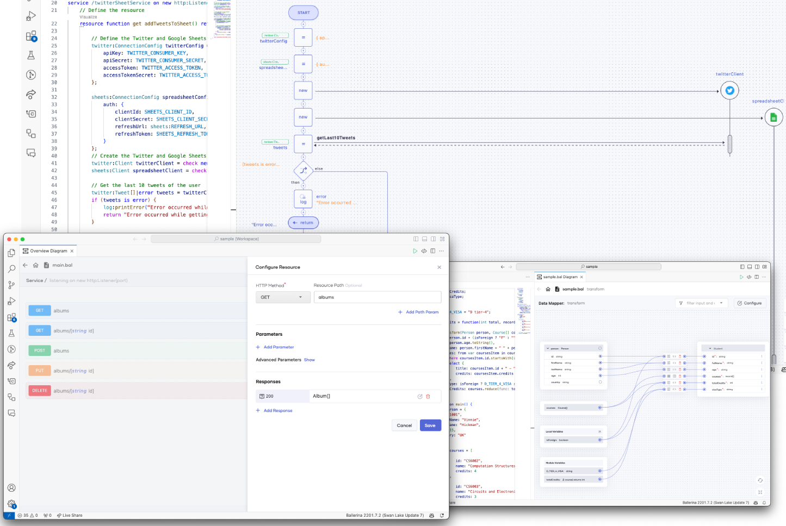

## [Get started](https://wso2.com/ballerina/vscode/docs/)

The sections below walk you through how to get started with the Ballerina VS Code extension by installing it and opening a Ballerina package via it.

Download and install [Ballerina](https://ballerina.io/downloads/)

## Visual editing
### [Explore the Sequence Diagram View](https://wso2.com/ballerina/vscode/docs/implement-the-code/sequence-diagram-view/)
The visual representation provided by the Ballerina VS Code extension has its roots in sequence diagrams. They can capture how the logic of your program flows, how the concurrent execution flow works, which remote endpoints are involved, and how those endpoints interact with the different workers in the program.

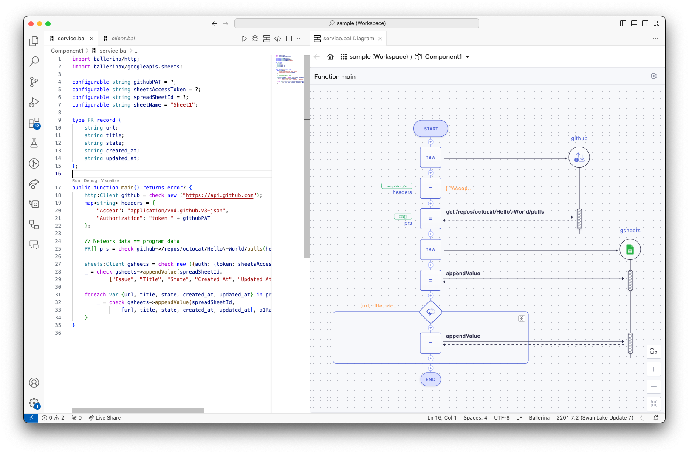

### [Explore the Data Mapper view](https://wso2.com/ballerina/vscode/docs/implement-the-code/data-mapper/)
When you map data via the user interface, the Data Mapper generates the required Ballerina source code. Since the Ballerina source code is the single source of truth for the Visual Data Mapper, it also lets you open and edit the existing data mappings made via the source code without changing the user experience.

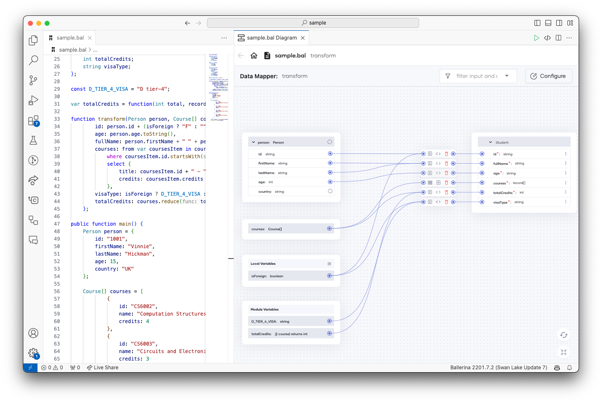

### [Explore the Architecture View](https://wso2.com/ballerina/vscode/docs/design-the-application/explore-the-architecture-view/)
Click the `Ballerina: Architecture View` command in the Command Palette to open the Architecture View.

Once you open the Architecture View, you will see the following types of diagrams.

Level 1 Diagram            |Level 2 Diagram            |Type Diagram
:-------------------------:|:-------------------------:|:-------------------------:
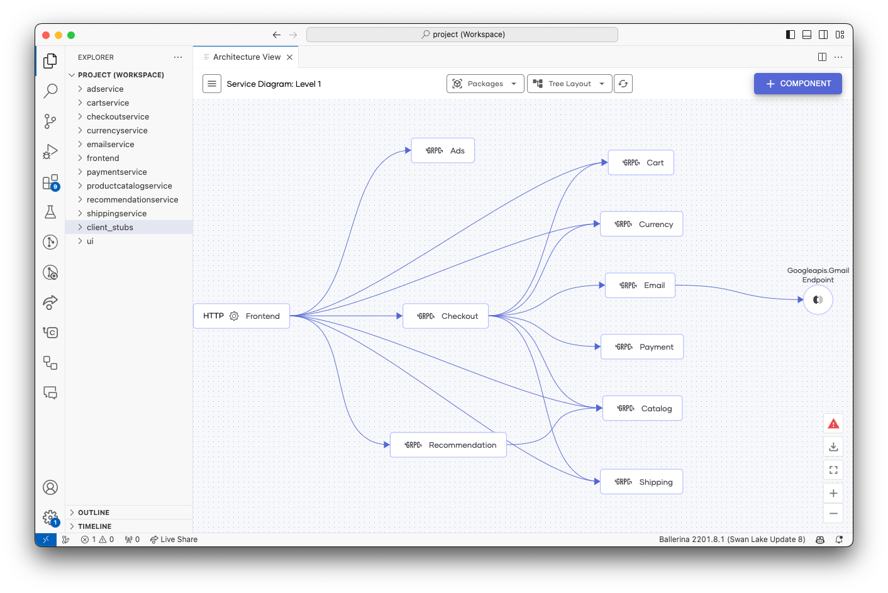  |  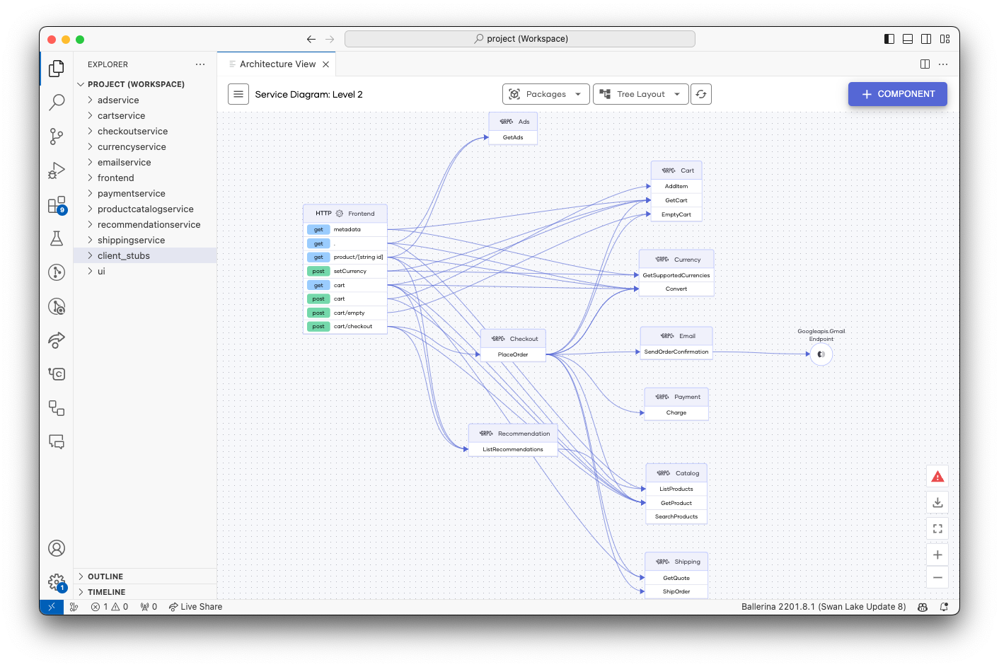 | 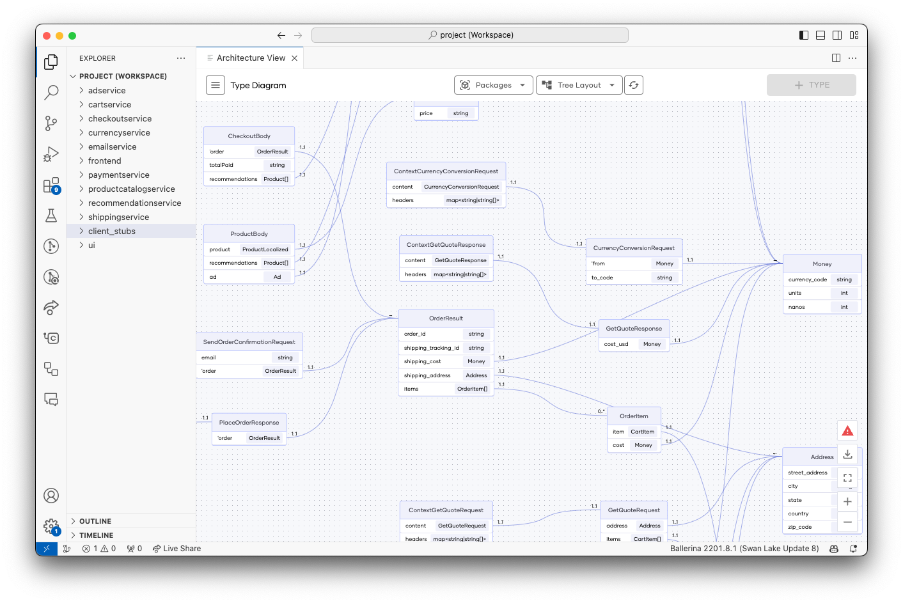

In addition to the above, the Architecture View includes the following features.

- Filter the services and types based on the packages
- Navigate to the source code from the diagram components
- Rearrange the diagram
- Export the diagrams in JPEG format

### Explore the ER Diagram view

This module provides the ER diagram feature for persist modules. It allows developers to visualize the Entity Relationship Diagram of their persist model.

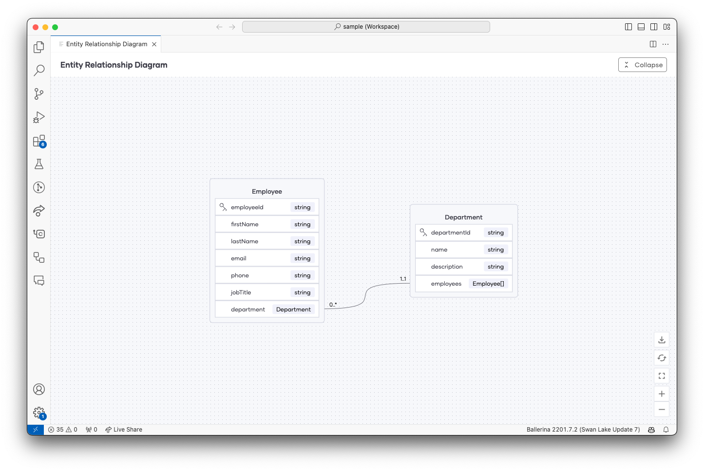

### [Explore the API Designer view](https://wso2.com/ballerina/vscode/docs/design-the-services/)
The HTTP API Designer enables you to design HTTP services interactively. This feature allows you to design services rapidly without the need to have extensive knowledge of the HTTP service syntax of Ballerina.

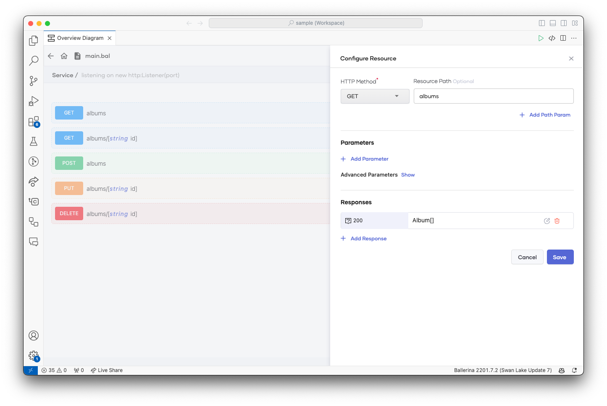

Learn More:
 - [HTTP API Designer](https://wso2.com/ballerina/vscode/docs/design-the-services/http-api-designer/)
 - [GraphQL API Designer](https://wso2.com/ballerina/vscode/docs/design-the-services/graphql-api-designer/)

### [Try the services](https://wso2.com/ballerina/vscode/docs/try-the-services/)

While you develop an HTTP/GraphQL service, you need to try and debug it to check how it works. The Ballerina VS Code extension provides the Swagger and Graphql `Try it` views, which gives the ability to try HTTP/GraphQL services within VS Code instead of using any third-party software.

HTTP                    |GraphQL                    |
:-------------------------:|:-------------------------:|
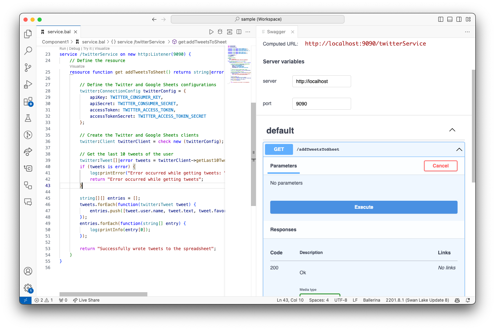 | 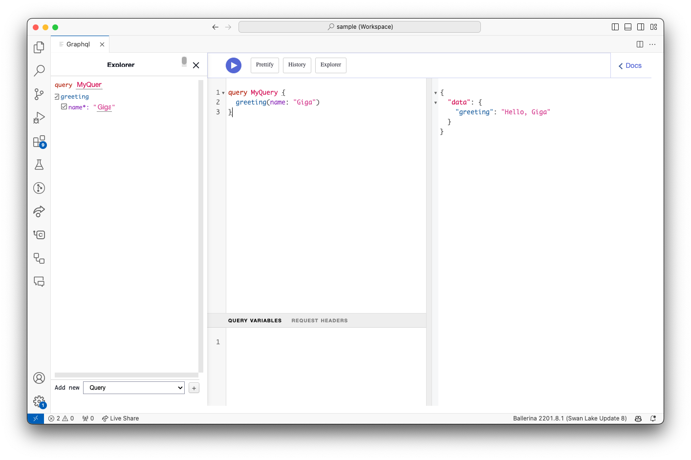

## Language Support
### Run a program

Run the program using one of the options below.

- Click on the Run CodeLens on the editor.
- Click Run on the title bar of the editor.

    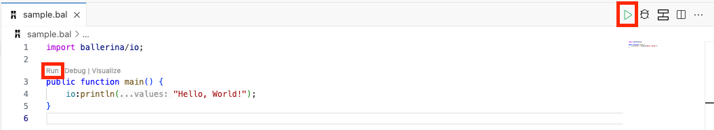

### Debug a program

The VS Code extension provides three types of sessions below to debug your Ballerina code.

- Program debug sessions - debug a Ballerina program
- Test debug sessions - debug a test function
- Remote debug sessions - debug a Ballerina program that is running remotely

There are two methods to debug the above sessions.

1. Click on the `Debug` CodeLens, which appears at the top of a Ballerina program or a test function.

2. Create a `launch.json` file with the required configuration attributes (use the default configurations or edit them as required) and use either of the options below.

    1. Ballerina Debug
    2. Ballerina Test
    3. Ballerina Remote

### IntelliSense
- Code completion and snippets

    The extension provides suggestions on variables, keywords, and code snippets of the language constructs (such as functions, type definitions, services, iterable constructs, etc.).

- Context-aware completion items

    The completion items list is sorted based on the context of the current cursor position.

- Suggestions for service templates

    Service templates corresponding to each available listener are provided in the list of completion items.

- Completion support for iterables

    The `foreach` and `foreach i` completion items are provided for iterable variables.

- Completion support for type guarding a variable

    The typeguard completion item is provided for union-typed variables.

- Filling required fields of a record

    The Fill Record required fields completion item is provided for filling the remaining fields of a record-typed value.

- Help via hover

    When hovering over a symbol name, you will be provided with quick information about the particular symbol. For example, when hovering over a function name, you will be prompted with the associated documentation.

- Signature help

    When typing a function/method call expression, the signature help will show information such as the function/method call’s description and parameter information. Signature help will be triggered when typing the open parenthesis and comma.

## Next steps

This has been a brief overview of the Ballerina extension features within VS Code. For more information, see the details provided in the [official website of the Ballerina extension  ](https://wso2.com/ballerina/vscode/docs/).

If you have any issues or feature requests, feel free to create an issue in Ballerina VS Code [GitHub repo](https://github.com/wso2/ballerina-vscode/issues).
