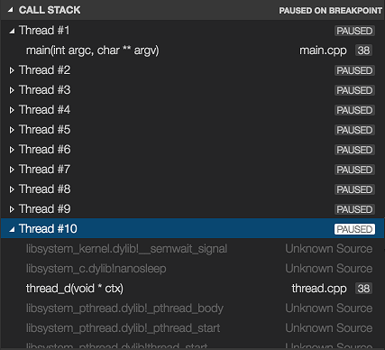

# C/C++ for Visual Studio Code (Preview)

C/C++ support for Visual Studio Code is provided by a [Microsoft C/C++ extension](https://marketplace.visualstudio.com/items?itemName=ms-vscode.cpptools) to enable cross-platform C and C++ development using VS Code on Windows, Linux, and macOS. The extension is still in preview and our focus is code editing, navigation, and debugging support for C and C++ code everywhere that VS Code runs.


If you just want a lightweight tool to edit your C++ files, Visual Studio Code is a great choice. But if you want the best possible experience for your existing Visual C++ projects or debugging on Windows, we recommend you use a version of the Visual Studio IDE such as [Visual Studio Community](https://visualstudio.microsoft.com/vs/community).

If you run into any issues or have suggestions for the Microsoft C/C++ extension, please file [issues and suggestions on GitHub](https://github.com/Microsoft/vscode-cpptools/issues). If you haven't already provided feedback, please take this [quick survey](https://www.research.net/r/VBVV6C6) to help shape this extension for your needs.

## Getting Started

**To install the Microsoft C/C++ extension:**

* Open VS Code.
* Click the Extensions View icon on the Sidebar.
* Search for `c++`.
* Click **Install**, then click **Reload**.


**Note**: The C/C++ extension does not include a C++ compiler or debugger. You will need to install these tools or use those already installed on your computer. Popular C++ compilers are [mingw-w64](http://www.mingw-w64.org/) for Windows, Clang for [XCode](https://developer.apple.com/xcode/) for macOS, and [GCC](https://gcc.gnu.org/) on Linux. Make sure your compiler executable is in your platform path so the extension can find it. The extension also supports the [Windows Subsystem for Linux](https://github.com/Microsoft/vscode-cpptools/blob/master/Documentation/LanguageServer/Windows%20Subsystem%20for%20Linux.md).

For instructions on configuring VS Code for specific environments, see:

* [Get Started with C++ and WSL](/docs/cpp/config-wsl.md)
* [Get Started with C++ and Mingw-w64](/docs/cpp/config-mingw.md)
* [Get Started with C++ and Clang/LLVM on macOS](/docs/cpp/config-clang-mac.md)
* [Get Started with C++ MSVC](/docs/cpp/config-msvc.md)

## Editing Code

### Code Formatting

The C/C++ extension for Visual Studio Code supports source code formatting using [clang-format](https://clang.llvm.org/docs/ClangFormat.html) which is included with the extension.

You can format an entire file with **Format Document** (`kb(editor.action.formatDocument)`) or just the current selection with **Format Selection** (`kb(editor.action.formatSelection)`) in right-click context menu. You can also configure auto-formatting with the following [settings](/docs/getstarted/settings.md):

* `editor.formatOnSave` - to format when you save your file.
* `editor.formatOnType` - to format as you type (triggered on the `kbstyle(;)` character).

By default, the clang-format style is set to "file" which means it looks for a `.clang-format` file inside your workspace. If the `.clang-format` file is found, formatting is applied according to the settings specified in the file. If no `.clang-format` file is found in your workspace, formatting is applied based on a default style specified in the `C_Cpp.clang_format_fallbackStyle` [setting](/docs/getstarted/settings.md) instead. Currently, the default formatting style is "Visual Studio" which is an approximation of the default code formatter in Visual Studio.

The "Visual Studio" clang-format style is not yet an official OOTB clang-format style but it implies the following clang-format settings:

```json
UseTab: (VS Code current setting)
IndentWidth: (VS Code current setting)
BreakBeforeBraces: AllMan
AllowShortIfStatementsOnASingleLine: false
IndentCaseLabels: false
ColumnLimit: 0
```

If you'd like to use a different version of clang-format than the one that ships with the extension, you can use the `C_Cpp.clang_format_path` [setting](/docs/getstarted/settings.md) and set its value to the path where the clang-format binary is installed.

For example, on the Windows platform:

```json
  "C_Cpp.clang_format_path": "C:\\Program Files (x86)\\LLVM\\bin\\clang-format.exe"
```

### Auto-Complete

Auto-complete is powered by the same engine as Visual Studio. You will get the most relevant suggestions when your workspace is configured with all necessary include paths and defines (see the "Configuring IntelliSense" section above).

## Navigating Code

The source code navigation features provided by the C/C++ extension are powerful tools for understanding and getting around in your codebase. These features are powered by tags stored in an offline database of symbol information. With the C/C++ extension installed, this database is generated whenever a folder containing C++ source code files is loaded into VS Code. The database icon appears next to the active configuration name ("Win32" in the image below) while the tag-parser is generating this information.


When the icon disappears, the source code symbols have been tagged in the offline database.

### Specifying Additional Include Directories for Better Symbol Support

To provide the best experience, the C/C++ extension for VS Code needs to know where it can find each header file referenced in your code. By default, the extension searches the current source directory, its sub-directories, and some platform-specific locations. If a referenced header file can't be found, VS Code displays a green squiggle underneath each #include directive that references it.

To specify additional include directories to be searched, place your cursor over any #include directive that displays a green squiggle, then click the lightbulb action when it appears. This opens the file `c_cpp_properties.json` for editing; here you can specify additional include directories for each platform configuration individually by adding more directories to the 'browse.path' property.

### Search for Symbols

You can search for symbols in the current file or workspace to navigate your code more quickly.

To search for a symbol in the current file, press `kb(workbench.action.gotoSymbol)`, then enter the name of the symbol you're looking for. A list of potential matches will appear and be filtered as you type. Choose from the list of matches to navigate to its location.


To search for a symbol in the current workspace, press `kb(workbench.action.showAllSymbols)`, then enter the name of the symbol. A list of potential matches will appear as before. If you choose a match that was found in a file that's not already open, the file will be opened before navigating to the match's location.


Alternatively, you can search for symbols by accessing these commands through the **Command Palette** if you prefer. Use **Quick Open** (`kb(workbench.action.quickOpen)`) then enter the '@' command to search the current file, or the '#' command to search the current workspace. `kb(workbench.action.gotoSymbol)` and `kb(workbench.action.showAllSymbols)` are just shortcuts for the '@' and '#' commands, respectively, so everything works the same.

### Peek Definition

You can take a quick look at how a symbol was defined by using the Peek Definition feature. This feature displays a few lines of code near the definition inside a peek window so you can take a look without navigating away from your current location.

To peek at a symbol's definition, place your cursor on the symbol anywhere it's used in your source code and then press `kb(editor.action.peekDefinition)`. Alternatively, you can choose **Peek Definition** from the context menu (right-click, then choose **Peek Definition**).


Currently, the C/C++ extension doesn't parse code in a way that helps it distinguish between competing definitions based on how the symbol is used. These competing definitions arise when the symbol defines different things in different contexts, such as occurs with overloaded functions, classes and their constructors, and other situations. When this happens, each of the competing definitions are listed in the right-hand side of the peek window with the source code of the current selection displayed on the left.

With the peek window open, you browse the list of competing definitions to find the one you're interested in. If you want to navigate to the location of one of the definitions just double-click the definition you're interested in, or by double-clicking anywhere in the source code displayed on the left-hand side of the peek window.

### Go to Definition

You can also quickly navigate to where a symbol is defined by using the Go to Definition feature.

To go to a symbol's definition, place your cursor on the symbol anywhere it is used in your source code and then press `kb(editor.action.revealDefinition)`. Alternatively, you can choose **Go to Definition** from the context menu (right-click, then choose **Go to Definition**). When there's only one definition of the symbol, you'll navigate directly to its location, otherwise the competing definitions are displayed in a peek window as described in the previous section and you have to choose the definition that you want to go to.

## Debugging

After you have set up the basics of your debugging environment as specified in [Getting Started](/docs/languages/cpp.md#getting-started), you can learn more details about debugging C/C++ in this section.

VS Code supports the following debuggers for C/C++ depending on the operating system you are using:

* **Linux**: GDB
* **macOS**: LLDB or GDB
* **Windows**: the Visual Studio Windows Debugger or GDB (using Cygwin or MinGW)

### Windows Debugging with GDB

You can debug Windows applications created using Cygwin or MinGW by using VS Code. To use Cygwin or MinGW debugging features, the debugger path must be set manually in the launch configuration (`launch.json`). To debug your Cygwin or MinGW application, add the `miDebuggerPath` property and set its value to the location of the corresponding gdb.exe for your Cygwin or MinGW environment.

For example:

```json
    "miDebuggerPath": "c:\\mingw\\bin\\gdb.exe"
```

Cygwin/MinGW debugging on Windows supports both attach and launch debugging scenarios.

To learn more, see [Configuring launch.json for C/C++ debugging](https://github.com/Microsoft/vscode-cpptools/blob/master/launch.md).

If you are debugging with GDB on Windows, see [Windows Debugging with MinGW64](/docs/cpp/config-mingw.md).

### Conditional Breakpoints

Conditional breakpoints enable you to break execution on a particular line of code only when the value of the condition is true. To set a conditional breakpoint, right-click on an existing breakpoint and select **Edit Breakpoint**. This opens a small peek window where you can enter the condition that must evaluate to true in order for the breakpoint to be hit during debugging.


In the editor, conditional breakpoints are indicated by a breakpoint symbol that has a black equals sign inside of it. You can place the cursor over a conditional breakpoint to show its condition.

### Function Breakpoints

Function breakpoints enable you to break execution at the beginning of a function instead of on a particular line of code. To set a function breakpoint, on the **Debug** pane right-click inside the **Breakpoints** section, then choose **Add Function Breakpoint** and enter the name of the function on which you want to break execution.

### Expression Evaluation

VS Code supports expression evaluation in several contexts:

* You can type an expression into the **Watch** section of the **Debug** panel and it will be evaluated each time a breakpoint is hit.
* You can type an expression into the **Debug Console** and it will be evaluated only once.
* You can evaluate any expression that appears in your code while you're stopped at a breakpoint.

Note that expressions in the **Watch** section take effect in the application being debugged; an expression that modifies the value of a variable will modify that variable for the duration of the program.

### Multi-threaded Debugging

The C/C++ extension for VS Code has the ability to debug multi-threaded programs. All threads and their call stacks appear in the **Call Stack** section:



### Memory Dump Debugging

The C/C++ extension for VS Code also has the ability to debug memory dumps. To debug a memory dump, open your `launch.json` file and add the `coreDumpPath` (for GDB or LLDB) or `dumpPath` (for the Visual Studio Windows Debugger) property to the **C++ Launch** configuration, set its value to be a string containing the path to the memory dump. This will even work for x86 programs being debugged on an x64 machine.

### Additional Symbols

If there are additional directories where the debugger can find symbol files (for example, `.pdb` files for the Visual Studio Windows Debugger), they can be specified by adding the `additionalSOLibSearchPath` (for GDB or LLDB) or `symbolSearchPath` (for the Visual Studio Windows Debugger).

For example:

```json
    "additionalSOLibSearchPath": "/path/to/symbols;/another/path/to/symbols"
```

or

```json
    "symbolSearchPath": "C:\\path\\to\\symbols;C:\\another\\path\\to\\symbols"
```

### Locate source files

The source file location can be changed if the source files are not located in the compilation location. This is done by simple replacement pairs added in the `sourceFileMap` section. The first match in this list will be used.

For example:

```json
"sourceFileMap": {
    "/build/gcc-4.8-fNUjSI/gcc-4.8-4.8.4/build/i686-linux-gnu/libstdc++-v3/include/i686-linux-gnu": "/usr/include/i686-linux-gnu/c++/4.8",
    "/build/gcc-4.8-fNUjSI/gcc-4.8-4.8.4/build/i686-linux-gnu/libstdc++-v3/include": "/usr/include/c++/4.8"
}
```

### GDB, LLDB and MI Commands (GDB/LLDB)

For the `C++ (GDB/LLDB)` debugging environment, you can execute GDB, LLDB and MI commands directly through the debug console with the `-exec` command, but be careful, executing commands directly in the debug console is untested and might crash VS Code in some cases.

### Other Debugging Features

* Unconditional breakpoints
* Watch window
* Call stack
* Stepping

 For more information on debugging with VS Code, see this introduction to [debugging in VS Code](/docs/editor/debugging.md).

## Known Limitations

### Symbols and Code Navigation

All platforms:

* Because the extension doesn't parse function bodies, Peek Definition and Go to Definition don't work for symbols defined inside the body of a function.

### Debugging

Windows:

* GDB on Cygwin and MinGW cannot break a running process. To set a breakpoint when the application is running (not stopped under the debugger), or to pause the application being debugged, press `kbstyle(Ctrl-C)` in the application's terminal.
* GDB on Cygwin cannot open core dumps.

Linux:

* GDB needs elevated permissions to attach to a process. When using *attach to process*, you need to provide your password before the debugging session can begin.

macOS:

* LLDB:
    * When debugging with LLDB, if the Terminal window is closed while in break mode, debugging does not stop. Debugging can be stopped by pressing the **Stop** button.
    * When debugging is stopped the Terminal window is not closed.
* GDB:
    * Additional manual install steps need to be completed to use GDB on macOS. See _Manual Installation of GDB for OS X_ in the [README](https://marketplace.visualstudio.com/items?itemName=ms-vscode.cpptools).
    * When attaching to a process with GDB, the application being debugged cannot be interrupted. GDB will only bind breakpoints set while the application is not running (either before attaching to the application, or while the application is in a stopped state). This is due to [a bug in GDB](https://sourceware.org/bugzilla/show_bug.cgi?id=20035).
    * Core dumps cannot be loaded when debugging with GDB because GDB [does not support the core dump format used in macOS](https://www.sourceware.org/ml/gdb/2014-01/msg00036.html).
    * When attached to a process with GDB, break-all will end the process.

## Next steps

Read on to find out about:

* [Configure VS Code for Windows Subsystem for Linux](/docs/cpp/config-wsl.md)
* [Configure VS Code for Mingw-w64 and GCC](/docs/cpp/config-mingw.md)
* [Configure VS Code for macOS](/docs/cpp/config-clang-mac.md)
* [Basic Editing](/docs/editor/codebasics.md) - Learn about the powerful VS Code editor.
* [Code Navigation](/docs/editor/editingevolved.md) - Move quickly through your source code.
* [Tasks](/docs/editor/tasks.md) - use tasks to build your project and more
* [Debugging](/docs/editor/debugging.md) - find out how to use the debugger with your project

## Common questions

### My project won't load

VS Code doesn't currently support C++ project files, instead it considers a directory of your choosing to be the workspace of your project. Source code files inside that directory and its sub-directories are part of the workspace.

### How do I build/run my project?

VS Code supports tasks that you can configure to build your application, and natively understands the output of MSBuild, CSC, and XBuild. For more information, see the [Tasks](/docs/editor/tasks.md) documentation.

If you have any other questions or run into any issues, please file an issue on [GitHub](https://github.com/Microsoft/vscode-cpptools/issues).
