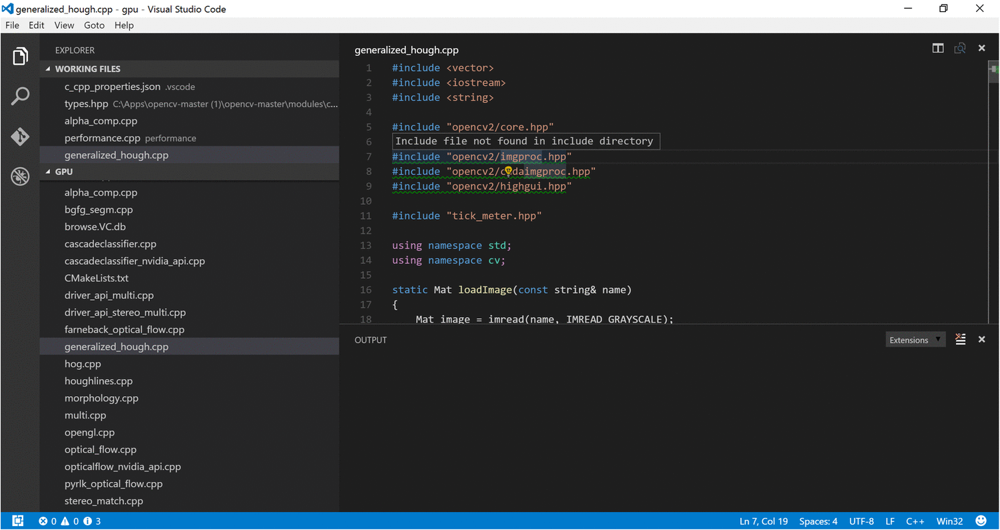

# C/C++ for VS Code (Preview)

C/C++ support for Visual Studio Code is provided today as a preview of our work to enable cross-platform C and C++ development using VS Code on Windows, Linux, and OS X. Our focus in this preview release is code editing and navigation support for C and C++ code everywhere that VS Code runs, as well as debugging on Linux (Ubuntu 14.04 64-bit is supported; other versions of Linux might work, but are unsupported) and OS X (see _Known limitations_ below).

If you just want a lightweight tool to edit your C++ files VS Code has you covered wherever you are, but if you want the best possible experience for your existing Visual C++ projects or debugging on Windows, we recommend you use a version of Visual Studio such as [Visual Studio Community](https://www.visualstudio.com/products/visual-studio-community-vs).

Because we're still shaping the C++ experience in VS Code, now is a great time to [provide bug reports, feature requests, and feedback](mailto:c_cpp_support@microsoft.com), and for those of you who use Linux or OS X as your development environment to [get engaged](http://landinghub.visualstudio.com/c-nonwin) with the Visual Studio team.

## Installing C++ support

C++ language support is an optional [install from the Marketplace](https://marketplace.visualstudio.com/items?itemName=ms-vscode.cpptools). Or, just install it from VS Code by launching the __Quick Open__ (`kb(workbench.action.quickOpen)`) and then entering the command **ext install cpptools**.

> Tip: On Linux, only Ubuntu 14.04 64-bit is officially supported. Other versions of Linux might work, but are untested and unsupported.

> Tip: On OS X, additional install steps need to be completed manually to enable debugging on OS X. See _Manual Installation for the C++ Debugger extension_ in the [README](https://marketplace.visualstudio.com/items?itemName=ms-vscode.cpptools).

In addition to the [Microsoft C++ extension](https://marketplace.visualstudio.com/items?itemName=ms-vscode.cpptools), the community has produced other extensions.

<div class="marketplace-extensions-cpp"></div>

> Tip: The extensions shown above are dynamically queried. Click on an extension tile above to read the description and reviews to decide which extension is best for you. See more in the [Marketplace](https://marketplace.visualstudio.com).

## Editing code

### Code Formatting

The C/C++ extension for Visual Studio Code supports automatic formatting with [clang-format](http://llvm.org/releases/download.html). To use this feature, you must install `clang-format` manually and add its path to your user [settings](/docs/customization/userandworkspace.md) file (`settings.json`).

To configure code formatting, open your `settings.json` file (**File** > **Preferences** > **User Settings**), then add the `c_cpp.clang_format_path` property and set its value to the path where clang-format.exe is installed.

For example:

```json
  "c_cpp.clang_format_path":"C:\\Program Files (x86)\\LLVM\\bin\\clang-format.exe"
```

By default, the clang-format style is set to __file__ which means it looks for a `.clang-format` file inside your workspace. If the `.clang-format` file is found, formatting is applied according the settings specified in the file. If no `.clang-format` file is found in your workspace, formatting is applied according to a default style specified in `c_cpp_properties.json` instead. Currently, the default formatting style is __LLVM__.

To access the `c_cpp_properties.json` file, launch the __Command Palette__ (`kb(workbench.action.showCommands)`) prompt and begin typing **C/Cpp: Edit Configurations**, then choose this command from the command list that appears.

### Fuzzy Auto-Complete (preview)

Fuzzy auto-complete is powered by an enhanced tag-parser approach. Although suggestions are not based on semantic analysis of your code, this feature provides a wider selection of matches than the single-file IntelliSense experience provided today.

In particular, this feature's capabilities give a good experience for C code.

## Navigating code

The source code navigation features provided by the C/C++ extension are powerful tools for understanding and getting around in your codebase. These features are powered by tags stored in an offline database of symbol information (in the file `browse.VC.db`). With the C/C++ extension installed, this database is generated whenever a folder containing C++ source code files is loaded into VS Code. The platform indicator (Win32 in the figure below) turns red and appears next to a flame icon while the tag-parser is generating this information.


When the platform indicator returns to its normal appearance, the source code symbols have been tagged in the offline database and source code navigation features are ready to be used.

### Specifying Additional Include Directories for Better Symbol Support.

To provide the best experience, the C/C++ extension for VS Code needs to know where it can find each header file referenced in your code. By default, the extension searches the current source directory, its sub-directories, and some platform-specific locations. If a referenced header file can't be found, VS Code displays a green squiggle underneath each #include directive that references it.

To specify additional include directories to be searched, place your cursor over any #include directive that displays a green squiggle, then click the lightbulb action when it appears. This opens the file `c_cpp_properties.json` for editing; here you can specify additional include directories for each platform configuration individually by adding more directories to its 'includePath' property.



### Search for Symbols

You can search for symbols in the current file or workspace to navigate your code more quickly.

To search for a symbol in the current file, press `kb(workbench.action.gotoSymbol)`, then enter the name of the symbol you're looking for. A list of potential matches will appear and be filtered as you type. Choose from the list of matches to navigate to its location.


To search for a symbol in the current workspace, start by pressing `kb(workbench.action.showAllSymbols)` instead, then enter the name of the symbol. A list of potential matches will appear as before. If you choose a match that was found in a file that's not already open, the file will be opened before navigating to the match's location.


Alternatively, you can search for symbols by accessing these commands through the __Command Palette__ if you prefer. Use __Quick Open__ (`kb(workbench.action.quickOpen)`) then enter the '@' command to search the current file, or the '#' command to search the current workspace. `kb(workbench.action.gotoSymbol)` and `kb(workbench.action.showAllSymbols)` are just shortcuts for the '@' and '#' commands, respectively, so everything works the same.

### Peek Definition

You can take a quick look at how a symbol was defined by using the Peek Definition feature. This feature displays a few lines of code near the definition inside a peek window so you can take a look without navigating away from your current location.

To peek at a symbol's definition, place your cursor on the symbol anywhere its used in your code and then press `kb(editor.action.previewDeclaration)`. Alternatively, you can choose __Peek Definition__ from the context menu (right-click, then choose __Peek Definition__). 


Currently, the C/C++ extension doesn't parse code in a way that helps it distinguish between competing definitions based on how the symbol is used. These competing definitions arise when the symbol defines different things in different contexts, such as occurs with overloaded functions, classes and their constructors, and other situations. When this happens, each of the competing definitions are listed in the right-hand side of the peek window with the source code of the current selection displayed on the left.

With the peek window open, you browse the list of competing definitions to find the one you're interested in. If you want to navigate to the location of one of the definitions just double-click the definition you're interested in, or by double-clicking anywhere in the source code displayed on the left-hand side of the peek window. 

### Go to Definition

You can also quickly navigate to where a symbol is defined by using the Go to Definition feature.

To go to a symbol's definition, place your cursor on the symbol anywhere its used in your code and then press `kb(editor.action.goToDeclaration)`. Alternatively, you can choose __Go to Definition__ from the context menu (right-click, then choose __Go to Definition__). When there's only one definition of the symbol, you'll navigate directly to its location, otherwise the competing definitions are displayed in a peek window as described in the previous section and you have to choose the definition that you want to go to.

## Debugging

Debugging is supported on Windows (Cygwin/MinGW), Linux (Ubuntu 14.04 64-bit), and OS X (see _Known limitations_ below).

### Preparing your launch.json file for debugging

Before you can debug your app you'll need to set a few things up. Navigate to the Debug View (click the debug icon in the toolbar on the left-hand side of the VS Code window) then in the __Debug Panel__, click the __Settings__ icon and select `C++ Launch (GDB)`. This opens the `launch.json` file for editing.


This file, `launch.json`, contains configurations that tell the debugger how to interact with your app. Two configurations are included by default -- one that defines the properties for launching your app under GDB from VS Code, and another that defines the properties for attaching GDB to a process that's already running. Note that launching your app under GDB is not currently supported on OS X, for now you have to use Attach to debug OS X apps.

At the minimum, you'll need to update the 'program' property to contain the program name and path, but you can modify other properties as well. You can view a tooltip that describes each property and its possible values by placing your cursor over a property. For more information about the properties inside the launch.json file and how to use them, see the VS Code [debugging documentation](/docs/editor/debugging.md).

After your launch.json file is configured, you're ready to start debugging, but remember that VS Code won't rebuild your program when you make changes to it between debugging sessions unless you also create a task.json file to invoke the build and set it as the `preLaunchTask` property in the launch.json file

### Windows debugging (Cygwin/MinGW)

You can debug Windows applications created using Cygwin or MinGW by using VS Code. To use Cygwin or MinGW debugging features, the debugger path must be set manually in the launch configuration (`launch.json`). To debug your Cygwin or MinGW app, add the `miDebuggerPath` property and set its value to the location of the corresponding gdb.exe for your Cygwin or MinGW environment.

For example:

```json
    "miDebuggerPath":"c:\\mingw\\bin\\gdb.exe"
```

Cygwin/MinGW debugging on Windows supports both attach and launch debugging scenarios.

### Conditional Breakpoints

Conditional breakpoints enable you to break execution on a particular line of code only when the value of the conditional is true. To set a conditional breakpoint, right-click on an existing breakpoint and select __Edit Breakpoint__, this opens a small peek window where you can enter the condition that must evaluate to true in order for the breakpoint to activate and break execution.


In the editor, conditional breakpoints are indicated by a breakpoint symbol that has a black equals sigh inside of it. You can place the cursor over a conditional breakpoint to show its condition.

### Function breakpoints

Function breakpoints enable you to break execution at the beginning of a function instead of on a particular line of code. To set a function breakpoint, on the __Debug Panel__, right click inside the __Breakpoints__ pane, then choose __Add Function Breakpoint__ and enter the name of the function on which you want to break execution.

### Expression evaluation

VS Code supports expression evaluation in several contexts:

* You can type an expression into the __Watch__ pane and it will be evaluated each time a breakpoint is hit.
* You can type an expression into the __Debug Console__ and it will be evaluated only once.
* You can evaluate any expression that appears in your code while you're stopped at a breakpoint.

Note that expressions in the Watch Pane take effect in the application being debugged; an expression that modifies the value of a variable will modify that variable for the duration of the program.

### Multi-threaded debugging

The C/C++ extension for VS Code now has the ability to debug threaded code. 

### Core Dump debugging

The C/C++ extension for VS Code also has the ability to debug using a memory dump. To debug using a memory dump, open your launch.json file for editing and add the `coreDumpPath` property to the __C++ Launch__ configuration, setting its value to be a string containing the path to the core dump. This will even work for multi-threaded programs and x86 programs being debugged on an x64 machine.

### GDB and MI commands

You can execute GDB or MI commands directly through the debug console with the `-exec` command, but be careful -- executing GDB commands directly in the debug console is untested and might crash VS Code in some cases. For more information on debugging with VS Code, see this introduction to [debugging in VS Code](/docs/editor/debugging.md).

### Other Debugging Features

* Unconditional breakpoints
* Watch window
* Call stack
* Stepping

## Known limitations

### Symbols and Code Navigation

All platforms:

* Because the extension doesn't parse function bodies, Peek Definition and Go to Definition don't work for symbols defined inside the body of a function. 

### Debugging

Windows:

* Debugging of Windows applications created using Visual Studio is not currently supported. The extension supports debugging of Cygwin and MinGW applications on Windows.
* GDB on Cygwin and MinGW cannot break a running process. To set a breakpoint in run mode, or to pause the application being debugged, press `kbstyle(Ctrl-C)` in the application's terminal.
* GDB on Cygwin cannot open core dumps.

Linux:

* Ubuntu 14.04 64-bit remains the only version of Linux that officially supports debugging, but automatic installation of debugging features is no longer blocked on versions of Linux other than Ubuntu 14.04 64-bit. While this makes installation on other versions of Linux easier and we encourage you to try debugging on your preferred version of Linux, such installations remain unsupported for now.
* GDB needs elevated permissions to attach to a process. When using *attach to process*, you need to provide your password before the debugging session can begin.

OS X:

* Additional install steps need to be completed manually to enable debugging on OS X. See _Manual Installation for the C++ Debugger extension_ in the [README](https://marketplace.visualstudio.com/items?itemName=ms-vscode.cpptools).
* *Launch process* is not currently supported on OS X.
* When attaching to a process with GDB, the application being debugged cannot be interrupted. GDB will only bind breakpoints set while the application is not running (either before attaching to the application, or while the application is in a stopped state). This is due to [a bug in GDB](https://sourceware.org/bugzilla/show_bug.cgi?id=20035).
* Core dumps cannot be loaded when debugging with GDB because GDB [does not support the core dump format used in OS X](https://www.sourceware.org/ml/gdb/2014-01/msg00036.html).
* When attached to a process with GDB, break-all will ends the process.

## Next Steps

Read on to find out about:

* [Editing Evolved](/docs/editor/editingevolved.md) - find out more about advanced editing features
* [Tasks](/docs/editor/tasks.md) - use tasks to build your project and more
* [Debugging](/docs/editor/debugging.md) - find out how to use the debugger with your project

## Common Questions

**Q: Which versions of Linux support debugging?**

**A:** In this release, Ubuntu 14.04 64-bit remains the only version of Linux that officially supports debugging. However, the extension no longer relies on the install script found in previous versions to install the necessary dependencies; previously, this script blocked automatic installation on Linux versions other than Ubuntu 14.04 64-bit. Because of this, you no longer have to manually perform the steps found in the script to enable the debugging features on other versions of Linux. While this makes installation on other versions of Linux easier and we encourage you to try out debugging on your preferred version of Linux, such installations remain unsupported for now.

**Q: I can't debug multi-threaded code.**

**A:** For multi-threaded debugging, you must use the version 1.1.1 of the C/C++ Extension for Visual Studio Code.

**Q: My project won't load.**

**A:** VS Code doesn't currently support C++ project files, instead it considers a directory of your choosing to be the workspace of your project. Source code files inside that directory and its sub-directories are part of the workspace.

**Q: IntelliSense isn't working.**

**A:** In this release, IntelliSense isn't supported. We plan to enable this and other features in future releases.

**Q: How do I build/run my project?**

**A:** VS Code supports tasks that you can configure to build your application, and natively understands the output of MSBuild, CSC, and XBuild. For more information, see the [Tasks](/docs/editor/tasks.md) documentation.

**Q: Why is there a .browse.VC.db file in my workspace?**

**A:** The C/C++ extension automatically creates a database of symbol information for your workspace and stores it in a `.browse.VC.db` file in your workspace's `.vscode` folder. This improves the extension's performance and this file should not be added to source control.