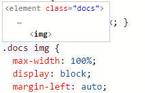

# CSS, SCSS and Less

Visual Studio Code has built-in support for editing style sheets in CSS `.css`, SCSS `.scss` and Less `.less`. In addition, you can install an extension for greater functionality.

<div class="marketplace-extensions-css-curated"></div>

> **Tip:** Click on an extension tile above to read the description and reviews to decide which extension is best for you. See more in the [Marketplace](https://marketplace.visualstudio.com).

## IntelliSense

VS Code has support for selectors, properties and values. Use `kb(editor.action.triggerSuggest)` to get a list of context specific options.


Proposals contain extensive documentation, including a list of browsers that support the property. To see the full description text of the selected entry, use `kb(toggleSuggestionDetails)`.

## Syntax coloring & color preview

As you type, there is syntax highlighting as well as in context preview of colors.


Clicking on a color preview will launch the integrated color picker which supports configuration of hue, saturation and opacity.


> **Tip:** You can trigger between different color modes by clicking on the color string at the top of the picker.

You can hide VS Code's color previews by setting the following [setting](/docs/getstarted/settings.md):

```json
"editor.colorDecorators": false
```

To just disable it for css, Less and SCSS, use

```json
"[css]": {
    "editor.colorDecorators": false
}

```

## Folding

You can fold regions of source code using the folding icons on the gutter between line numbers and line start. Folding regions are available for all declarations (for example, rule declarations) and for multiline comments in the source code.

Additionally you can use the following region markers to define a folding region:
`/*#region*/` and `/*#endregion*/` in CSS/SCSS/Less or `// #region` and `// #endregion` In SCSS/Less.

If you prefer to switch to indentation based folding for CSS, Less and SCSS, use:

```json
"[css]": {
    "editor.foldingStrategy": "indentation"
},
```

## Emmet snippets

[Emmet abbreviation support](/docs/editor/emmet.md) is built into VS Code, suggestions are listed along with other suggestions and snippets in the editor auto-completion list.

>**Tip:** See the CSS section of the [Emmet cheat sheet](https://docs.emmet.io/cheat-sheet) for valid abbreviations.

VS Code also supports [User Defined Snippets](/docs/editor/userdefinedsnippets.md).

## Syntax Verification & Linting

There is support for CSS version <= 2.1, Sass version <= 3.2 and Less version <= 2.3.

>**Note:** You can disable VS Code's default CSS, Sass or Less validation by setting the corresponding `.validate` User or Workspace [setting](/docs/getstarted/settings.md) to false.
>```json
>"css.validate": false
>```

## Go to Symbol in file

You can quickly navigate to the relevant CSS symbol in the current file by pressing `kb(workbench.action.gotoSymbol)`.

## Hovers

Hovering over a selector or property will provide an HTML snippet that is matched by the CSS rule.



## Go to Declaration and Find References

This is supported for Sass and Less variables in the same file. [CSS variables](https://developer.mozilla.org/docs/Web/CSS/Using_CSS_variables) per the [draft standards proposal](https://drafts.csswg.org/css-variables/) are also supported.

There is jump to definition for `@import` and `url()` links in CSS, SCSS and Less.

## CSS custom data

You can extend VS Code's CSS support through a declarative [custom data format](https://github.com/microsoft/vscode-css-languageservice/blob/main/docs/customData.md). By setting `css.customData` to a list of JSON files following the custom data format, you can enhance VS Code's understanding of new CSS properties, at-directives, pseudo-classes and pesudo-elements. VS Code will then offer language support such as completion & hover information for the provided properties, at-directives, pseudo-classes and pesudo-elements.

You can read more about using custom data in the [vscode-custom-data](https://github.com/microsoft/vscode-custom-data) repository.

## Formatting

The CSS Languages Features extension also provides a formatter. The formatter works with CSS, LESS and SCSS. It is implemented by the [JS Beautify library](https://github.com/beautify-web/js-beautify) and comes with the following settings:

* `css.format.enable` - Enable/disable default CSS formatter.
* `css.format.newlineBetweenRules` - Separate rulesets by a blank line.
* `css.format.newlineBetweenSelectors` - Separate selectors with a new line.
* `css.format.spaceAroundSelectorSeparator` - Ensure a space character around selector separators '>', '+', '~' (for example, `a > b`).

The same settings also exist for `less` and `scss`.

## Transpiling Sass and Less into CSS

VS Code can integrate with Sass and Less transpilers through our integrated [task runner](/docs/editor/tasks.md). We can use this to transpile `.scss` or `.less` files into `.css` files. Let's walk through transpiling a simple Sass/Less file.

### Step 1: Install a Sass or Less transpiler

For this walkthrough, let's use either the [sass](https://www.npmjs.com/package/sass) or [less](https://www.npmjs.com/package/less) Node.js module.

>**Note:** If you don't have [Node.js](https://nodejs.org) and the [npm](https://www.npmjs.com/) package manager already installed, you'll need to do so for this walkthrough. [Install Node.js for your platform](https://nodejs.org/en/download/). The Node Package Manager (npm) is included in the Node.js distribution. You'll need to open a new terminal (command prompt) for `npm` to be on your PATH.

```bash
npm install -g sass less
```

### Step 2: Create a simple Sass or Less file

Open VS Code on an empty folder and create a `styles.scss` or `styles.less` file. Place the following code in that file:

```scss
$padding: 6px;

nav {
  ul {
    margin: 0;
    padding: $padding;
    list-style: none;
  }

  li { display: inline-block; }

  a {
    display: block;
    padding: $padding 12px;
    text-decoration: none;
  }
}
```

For the Less version of the above file, just change `$padding` to `@padding`.

>**Note:** This is a very simple example, which is why the source code is almost identical between both file types. In more advanced scenarios, the syntaxes and constructs will be much different.

### Step 3: Create tasks.json

The next step is to set up the task configuration. To do this, run **Terminal** > **Configure Tasks** and click **Create tasks.json file from template**. In the selection dialog that shows up, select **Others**.

This will create a sample `tasks.json` file in the workspace `.vscode` folder. The initial version of file has an example to run an arbitrary command. We will modify that configuration for transpiling Sass/Less instead:

```json
// Sass configuration
{
    // See https://go.microsoft.com/fwlink/?LinkId=733558
    // for the documentation about the tasks.json format
    "version": "2.0.0",
    "tasks": [
        {
            "label": "Sass Compile",
            "type": "shell",
            "command": "sass styles.scss styles.css",
            "group": "build"
        }
    ]
}
```

```json
// Less configuration
{
    // See https://go.microsoft.com/fwlink/?LinkId=733558
    // for the documentation about the tasks.json format
    "version": "2.0.0",
    "tasks": [
        {
            "label": "Less Compile",
            "type": "shell",
            "command": "lessc styles.less styles.css",
            "group": "build"
        }
    ]
}
```

### Step 4: Run the Build Task

As this is the only command in the file, you can execute it by pressing `kb(workbench.action.tasks.build)` (**Run Build Task**). The sample Sass/Less file should not have any compile problems, so by running the task all that happens is a corresponding `styles.css` file is created.

Since in more complex environments there can be more than one build task we prompt you to pick the task to execute after pressing `kb(workbench.action.tasks.build)` (**Run Build Task**). In addition, we allow you to scan the output for compile problems (errors and warnings). Depending on the compiler, select an appropriate entry in the list to scan the tool output for errors and warnings. If you don't want to scan the output, select **Never scan the build output** from the presented list.

At this point, you should see an additional file show up in the file list `styles.css`.

If you want to make the task the default build task to run execute **Configure Default Build Task** from the global **Terminal** menu and select the corresponding **Sass** or **Less** task from the presented list.

>**Note:** If your build fails or you see an error message such as "An output directory must be specified when compiling a directory", be sure the filenames in your `tasks.json` match the filenames on disk. You can always test your build by running `sass styles.scss styles.css` from the command line.

## Automating Sass/Less compilation

Let's take things a little further and automate Sass/Less compilation with VS Code. We can do so with the same task runner integration as before, but with a few modifications.

### Step 1: Install Gulp and some plug-ins

We will use [Gulp](https://gulpjs.com/) to create a task that will automate Sass/Less compilation. We will also use the [gulp-sass](https://www.npmjs.com/package/gulp-sass) plug-in to make things a little easier. The Less plug-in is [gulp-less](https://www.npmjs.com/package/gulp-less).

We need to install gulp both globally (`-g` switch) and locally:

```bash
npm install -g gulp
npm install gulp gulp-sass gulp-less
```

> **Note:** `gulp-sass` and `gulp-less` are Gulp plug-ins for the `sass` and `lessc` modules we were using before. There are many other Gulp Sass and Less plug-ins you can use, as well as plug-ins for Grunt.

You can test that your gulp installation was successful by typing `gulp -v` in the terminal. You should see a version displayed for both the global (CLI) and local installations.

### Step 2: Create a simple Gulp task

Open VS Code on the same folder from before (contains `styles.scss`/`styles.less` and `tasks.json` under the `.vscode` folder), and create `gulpfile.js` at the root.

Place the following code in the `gulpfile.js` file:

```javascript
// Sass configuration
var gulp = require('gulp');
var sass = require('gulp-sass')(require('sass'));

gulp.task('sass', function(cb) {
    gulp.src('*.scss')
        .pipe(sass())
        .pipe(gulp.dest(function(f) {
            return f.base;
        }));
    cb();
});

gulp.task('default', gulp.series('sass', function(cb) {
    gulp.watch('*.scss', gulp.series('sass'));
    cb();
}));
```

```javascript
// Less configuration
var gulp = require('gulp');
var less = require('gulp-less');

gulp.task('less', function(cb) {
    gulp.src('*.less')
        .pipe(less())
        .pipe(gulp.dest(function(f) {
            return f.base;
        }));
    cb();
});

gulp.task('default', gulp.series('less', function(cb) {
    gulp.watch('*.less', gulp.series('less'));
    cb();
}));
```

What is happening here?

1. Our `default` gulp task first runs the `sass` or `less` task once when it starts up.
2. It then watches for changes to any SCSS/Less file at the root of our workspace, for example the current folder open in VS Code.
3. It takes the set of SCSS/Less files that have changed and runs them through our respective compiler, for example `gulp-sass`, `gulp-less`.
4. We now have a set of CSS files, each named respectively after their original SCSS/Less file. We then put these files in the same directory.

### Step 3: Run the gulp default task

To complete the tasks integration with VS Code, we will need to modify the task configuration from before to run the default Gulp task we just created. You can either delete the `tasks.json` file or empty it only keeping the `"version": "2.0.0"` property. Now execute **Run Task** from the global **Terminal** menu. Observe that you are presented with a picker listing the tasks defined in the gulp file. Select **gulp: default** to start the task. We allow you to scan the output for compile problems. Depending on the compiler, select an appropriate entry in the list to scan the tool output for errors and warnings. If you don't want to scan the output, select **Never scan the build output** from the presented list. At this point, if you create and/or modify Less or SASS files, you see the respective CSS files generated and/or changes reflected on save. You can also enable [Auto Save](/docs/editor/codebasics.md#save-auto-save) to make things even more streamlined.

If you want to make the **gulp: default** task the default build task executed when pressing `kb(workbench.action.tasks.build)` run **Configure Default Build Task** from the global **Terminal** menu and select **gulp: default** from the presented list.

### Step 4: Terminate the gulp default Task

The **gulp: default** task runs in the background and watches for file changes to Sass/Less files. If you want to stop the task, you can use the **Terminate Task** from the global **Terminal** menu.

## Customizing CSS, SCSS and Less Settings

You can configure the following lint warnings as [User and Workspace Settings](/docs/getstarted/settings.md).

The `validate` setting allows you turn off the built-in validation. You would do this if you rather use a different linter.

Id|Description|Default
---|------------|----
css.validate | Enables or disables all css validations | true
less.validate | Enables or disables all less validations | true
scss.validate | Enables or disables all scss validations | true

To configure an option for CSS, use `css.lint.` as the prefix to the id; for SCSS and Less, use `scss.lint.` and `less.lint.`.

Set a setting to `warning` or `error` if you want to enable lint checking, use `ignore` to disable it. Lint checks are performed as you type.

Id|Description|Default
---|------------|----
validate | Enables or disables all validations | true
compatibleVendorPrefixes | When using a property with a vendor-specific prefix (for example `-webkit-transition`), make sure to also include all other vendor-specific properties e.g. `-moz-transition`, `-ms-transition` and `-o-transition` | ignore
vendorPrefix | When using a property with a vendor-specific prefix for example `-webkit-transition`, make sure to also include the standard property if it exists e.g. `transition` | warning
duplicateProperties | Warn about duplicate properties in the same ruleset | ignore
emptyRules | Warn about empty rulesets | warning
importStatement | Warn about using an `import` statement as import statements are loaded sequentially which has a negative impact on web page performance | ignore
boxModel | Do not use `width` or `height` when using `padding` or `border` | ignore
universalSelector | Warn when using the universal selector `*` as it is known to be slow and should be avoided | ignore
zeroUnits | Warn when having zero with a unit e.g. `0em` as zero does not need a unit. | ignore
fontFaceProperties | Warn when using `@font-face` rule without defining a `src` and `font-family` property | warning
hexColorLength | Warn when using hex numbers that don't consist of three or six hex numbers | error
argumentsInColorFunction | Warn when an invalid number of parameters in color functions e.g. `rgb` | error
unknownProperties | Warn when using an unknown property | warning
ieHack | Warn when using an IE hack `*propertyName` or `_propertyName` | ignore
unknownVendorSpecificProperties | Warn when using an unknown vendor-specific property | ignore
propertyIgnoredDueToDisplay | Warn when using a property that is ignored due to the display. For example, with `display: inline`, the `width`, `height`, `margin-top`, `margin-bottom`, and `float` properties have no effect. | warning
important | Warn when using `!important` as it is an indication that the specificity of the entire CSS has gotten out of control and needs to be refactored. | ignore
float | Warn when using `float` as floats lead to fragile CSS that is easy to break if one aspect of the layout changes. | ignore
idSelector | Warn when using selectors for an id `#id` as selectors should not contain IDs because these rules are too tightly coupled with the HTML. | ignore

## Next steps

Read on to find out about:

* [Configure Tasks](/docs/editor/tasks.md) - Dig into Tasks to help you transpile your SCSS and Less to CSS.
* [Basic Editing](/docs/editor/codebasics.md) - Learn about the powerful VS Code editor.
* [Code Navigation](/docs/editor/editingevolved.md) - Move quickly through your source code.
* [HTML](/docs/languages/html.md) - CSS is just the start, HTML is also very well supported in VS Code.

## Common questions

### Does VS Code provide a color picker?

Yes, hover over a CSS color reference and the color picker is displayed.

### Is there support for the indentation based Sass syntax (.sass)?

No, but there are several extensions in the Marketplace supporting the indented flavor of Sass, for example, the [Sass](https://marketplace.visualstudio.com/items?itemName=Syler.sass-indented) extension originally created by Robin Bentley, now maintained by Leonard Grosoli.
