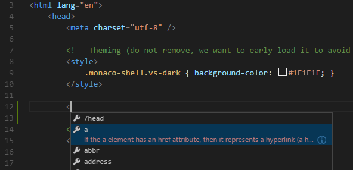

# HTML in Visual Studio Code

Visual Studio Code provides basic support for HTML programming out of the box. There is syntax highlighting, smart completions with IntelliSense, and customizable formatting. VS Code also includes great Emmet support.

## IntelliSense

As you type in HTML, we offer suggestions via HTML IntelliSense. In the image below, you can see a suggested HTML element closure `</div>` as well as a context specific list of suggested elements.



Document symbols are also available for HTML, allowing you to quickly navigate to DOM nodes by id and class name.

You can also work with embedded CSS and JavaScript. However, note that script and style includes from other files are not followed, the language support only looks at the content of the HTML file.

You can trigger suggestions at any time by pressing `kb(editor.action.triggerSuggest)`.

You can also control which built-in code completion providers are active. Override these in your user or workspace [settings](/docs/getstarted/settings.md) if you prefer not to see the corresponding suggestions.

```json
// Configures if the built-in HTML language suggests HTML5 tags, properties and values.
"html.suggest.html5": true
```

## Close tags

Tag elements are automatically closed when `>` of the opening tag is typed.


The matching closing tag is inserted when `/` of the closing tag is entered.


You can turn off autoclosing tags with the following [setting](/docs/getstarted/settings.md):

```json
"html.autoClosingTags": false
```

## Auto update tags

When modifying a tag, the linked editing feature automatically updates the matching closing tag. The feature is optional and can be enabled by setting:

```json
"editor.linkedEditing": true
```

## Color picker

The VS Code color picker UI is now available in HTML style sections.


It supports configuration of hue, saturation and opacity for the color that is picked up from the editor. It also provides the ability to trigger between different color modes by clicking on the color string at the top of the picker. The picker appears on a hover when you are over a color definition.

## Hover

Move the mouse over HTML tags or embedded styles and JavaScript to get more information on the symbol under the cursor.


## Validation

The HTML language support performs validation on all embedded JavaScript and CSS.

You can turn that validation off with the following settings:

```json
// Configures if the built-in HTML language support validates embedded scripts.
"html.validate.scripts": true,

// Configures if the built-in HTML language support validates embedded styles.
"html.validate.styles": true
```

## Folding

You can fold regions of source code using the folding icons on the gutter between line numbers and line start. Folding regions are available for all HTML elements for multiline comments in the source code.

Additionally you can use the following region markers to define a folding region:
`<!-- #region -->` and `<!-- endregion -->`

If you prefer to switch to indentation based folding for HTML use:

```json
"[html]": {
    "editor.foldingStrategy": "indentation"
},
```

## Formatting

To improve the formatting of your HTML source code, you can use the **Format Document** command `kb(editor.action.formatDocument)` to format the entire file or **Format Selection** `kb(editor.action.formatSelection)` to just format the selected text.

The HTML formatter is based on [js-beautify](https://www.npmjs.com/package/js-beautify). The formatting options offered by that library are surfaced in the VS Code [settings](/docs/getstarted/settings.md):

* `html.format.wrapLineLength`: Maximum amount of characters per line.
* `html.format.unformatted`: List of tags that shouldn't be reformatted.
* `html.format.contentUnformatted`: List of tags, comma separated, where the content shouldn't be reformatted.
* `html.format.extraLiners`: List of tags that should have an extra newline before them.
* `html.format.preserveNewLines`: Whether existing line breaks before elements should be preserved.
* `html.format.maxPreserveNewLines`: Maximum number of line breaks to be preserved in one chunk.
* `html.format.indentInnerHtml`: Indent `<head>` and `<body>` sections.
* `html.format.wrapAttributes`: Wrapping strategy for attributes:
  * `auto`: Wrap when the line length is exceeded
  * `force`: Wrap all attributes, except first
  * `force-aligned`: Wrap all attributes, except first, and align attributes
  * `force-expand-multiline`: Wrap all attributes
  * `aligned-multiple`: Wrap when line length is exceeded, align attributes vertically
  * `preserve`: Preserve wrapping of attributes
  * `preserve-aligned`: Preserve wrapping of attributes but align
* `html.format.wrapAttributesIndentSize`: Alignment size when using `force aligned` and `aligned multiple` in `html.format.wrapAttributes` or `null` to use the default indent size.
* `html.format.templating`: Honor django, erb, handlebars and php templating language tags.
* `html.format.unformattedContentDelimiter`: Keep text content together between this string.

>**Tip:** The formatter doesn't format the tags listed in the `html.format.unformatted` and `html.format.contentUnformatted` settings. Embedded JavaScript is formatted unless 'script' tags are excluded.

The Marketplace has several alternative formatters to choose from. If you want to use a different formatter, define
`"html.format.enable": false` in your settings to turn off the built-in formatter.

## Emmet snippets

VS Code supports [Emmet snippet](https://emmet.io/) expansion. Emmet abbreviations are listed along with other suggestions and snippets in the editor auto-completion list.


>**Tip:** See the HTML section of the [Emmet cheat sheet](https://docs.emmet.io/cheat-sheet) for valid abbreviations.

If you'd like to use HTML Emmet abbreviations with other languages, you can associate one of the Emmet modes (such as `css`, `html`) with other languages with the `emmet.includeLanguages` [setting](/docs/getstarted/settings.md). The setting takes a [language identifier](/docs/languages/overview.md#language-identifier) and associates it with the language ID of an Emmet supported mode.

For example, to use Emmet HTML abbreviations inside JavaScript:

```json
{
    "emmet.includeLanguages": {
        "javascript": "html"
     }
}
```

We also support [User Defined Snippets](/docs/editor/userdefinedsnippets.md).

## HTML custom data

You can extend VS Code's HTML support through a declarative [custom data format](https://github.com/microsoft/vscode-html-languageservice/blob/main/docs/customData.md). By setting `html.customData` to a list of JSON files following the custom data format, you can enhance VS Code's understanding of new HTML tags, attributes and attribute values. VS Code will then offer language support such as completion & hover information for the provided tags, attributes and attribute values.

You can read more about using custom data in the [vscode-custom-data](https://github.com/microsoft/vscode-custom-data) repository.

## HTML extensions

Install an extension to add more functionality. Go to the **Extensions** view (`kb(workbench.view.extensions)`) and type 'html' to see a list of relevant extensions to help with creating and editing HTML.

<div class="marketplace-extensions-html-curated"></div>

> Tip: Click on an extension tile above to read the description and reviews to decide which extension is best for you. See more in the [Marketplace](https://marketplace.visualstudio.com).

## Next steps

Read on to find out about:

* [CSS, SCSS, and Less](/docs/languages/css.md) - VS Code has first class support for CSS including Less and SCSS.
* [Emmet](/docs/editor/emmet.md) - Learn about VS Code's powerful built-in Emmet support.
* [Emmet official documentation](https://docs.emmet.io/) - Emmet, the essential toolkit for web-developers.

## Common questions

### Does VS Code have HTML preview?

No, VS Code doesn't have built-in support for HTML preview but there are extensions available in the VS Code [Marketplace](https://marketplace.visualstudio.com/vscode). Open the **Extensions** view (`kb(workbench.view.extensions)`) and search on 'live preview' or 'html preview' to see a list of available HTML preview extensions.
