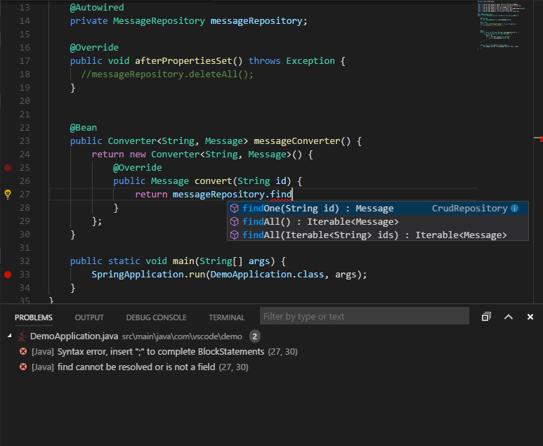
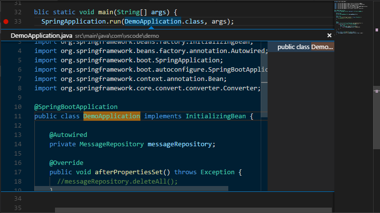

---
Order:
Area: languages
TOCTitle: Java
ContentId:
PageTitle: Java in VS Code
DateApproved:
MetaDescription: Learn about Visual Studio Code editor features (code completion, debugging, snippets, linting) for Java.
---
# Java in VS Code

Java is fully supported in Visual Studio Code through [extensions](/docs/editor/extension-gallery.md). Popular extensions in the [Marketplace](https://marketplace.visualstudio.com) provide project support, code completion, linting, debugging, code formatting, snippets, and more.

> [Download VS Code](/download) - If you haven't downloaded VS Code yet, quickly install for your platform (Windows, Mac, Linux).

## Install Java Extensions

VS Code is a fast editor and ships with only the basic features. Add Java language support to VS Code by installing the popular Python extensions.

1. Select an extension.
2. Install the extension by typing `ext install` into the Command Palette `kb(workbench.action.showCommands)`.

> Tip: The extensions shown above are dynamically queried. Click on an extension tile above to read the description and reviews to decide which extension is best for you. See more in the [Marketplace](https://marketplace.visualstudio.com/vscode).

The examples in this document will use
1. [Language Support for Java(TM) by Red Hat](https://marketplace.visualstudio.com/items?itemName=redhat.java)
2. [Java Debugger for Visual Studio Code](https://marketplace.visualstudio.com/items?itemName=microsoft.vscode-java-debug)

## Java Project Support
Maven, Eclipse and Gradle Java project are supported through [Language Support for Java(TM) by Red Hat](https://marketplace.visualstudio.com/items?itemName=redhat.java), by utilizing [M2Eclipse](http://www.eclipse.org/m2e/) which provides Maven support and [Buildship](https://github.com/eclipse/buildship) which provides Gradle support through the [Eclipse JDT Language Server](https://github.com/eclipse/eclipse.jdt.ls).

Please note that [Gradle-based Android projects are not supported](https://github.com/redhat-developer/vscode-java/issues/10#issuecomment-268834749).

## Editing Code

### Linting
A [linter](https://en.wikipedia.org/wiki/Lint_%28software%29) is a tool that provides warnings for suspicious looking code. [Language Support for Java(TM) by Red Hat](https://marketplace.visualstudio.com/items?itemName=redhat.java) provides this feature to report parsing and compliation errors as you type, so you can fix them inside VS Code.

### Code completion
[Language Support for Java(TM) by Red Hat](https://marketplace.visualstudio.com/items?itemName=redhat.java) also supports code completion and Intellisense. [Intellisense](/docs/editor/intellisense.md) is a general term for a number of features, including intelligent code completion (in-context method and variable suggestions) across all your files and for built-in and thirty-party modules.

Other code editing features provided by [Language Support for Java(TM) by Red Hat](https://marketplace.visualstudio.com/items?itemName=redhat.java) include
- Code formatting
- Code lens (references)
- Javadoc hovers
- Rename
- Highlights

## Navigating Code

### Search for symbols
You can search for symbols in the current file or workspace to navigate your code more quickly.

To search for a symbol in the current file, use __Quick Open__ (`kb(workbench.action.quickOpen)`) then enter the '@' command, then enter the name of the symbol you're looking for. A list of potential matches will appear and be filtered as you type. Choose from the list of matches to navigate to its location.

To search for a symbol in the current workspace, start by pressing `kb(workbench.action.showAllSymbols)`, then enter the name of the symbol. A list of potential matches will appear as before. If you choose a match that was found in a file that's not already open, the file will be opened before navigating to the match's location. Alternatively, you can also use  __Quick Open__ (`kb(workbench.action.quickOpen)`) then enter the '#' command to search the current workspace. `kb(workbench.action.showAllSymbols)` is just the shortcut for the '#' commands, respectively, so everything works the same.

### Peek Definition

You can take a quick look at how a symbol was defined by using the Peek Definition feature. This feature displays a few lines of code near the definition inside a peek window so you can take a look without navigating away from your current location.

To peek at a symbol's definition, place your cursor on the symbol anywhere it's used in your source code and then press `kb(editor.action.previewDeclaration)`. Alternatively, you can choose __Peek Definition__ from the context menu (right-click, then choose __Peek Definition__).

### Go to Definition

You can also quickly navigate to where a symbol is defined by using the Go to Definition feature.

To go to a symbol's definition, place your cursor on the symbol anywhere its used in your code and then press `kb(editor.action.goToDeclaration)`. Alternatively, you can choose __Go to Definition__ from the context menu (right-click, then choose __Go to Definition__). When there's only one definition of the symbol, you'll navigate directly to its location, otherwise the competing definitions are displayed in a peek window as described in the previous section and you have to choose the definition that you want to go to.

## Debugging
[Java Debugger for Visual Studio Code](https://marketplace.visualstudio.com/items?itemName=microsoft.vscode-java-debug) is a lightweight Java Debugger based on [Java Debug Server](https://github.com/Microsoft/java-debug). It works with [Language Support for Java by Red Hat](https://marketplace.visualstudio.com/items?itemName=redhat.java) to allow users debugging Java code using Visual Studio Code (VS Code). It supports following features
- Launch/Attach
- Breakpoints
- Exceptions
- Pause & Continue
- Step In/Out/Over
- Variables
- Callstacks
- Threads
- Debug console

You can launch the debugger following steps below
1. Switch to the Debug tab
2. Add Java debug configurations
3. In the _Debug (Launch)_ section in `launch.json`, specify the _mainClass_ and save
4. Click _start_ button or press _F5_ to start debugging

To attach the debugger to a running JVM, you may specify the _hostName_ and _port_ in the _Debug (Attach)_ section in `launch.json`. See a quick demo for [Developing Azure Functions in Java with VS Code]()

## Next Steps

Read on to find out about:

* [Basic Editing](/docs/editor/codebasics.md) - Learn about the powerful VS Code editor.
* [Code Navigation](/docs/editor/editingevolved.md) - Move quickly through your source code.
* [Tasks](/docs/editor/tasks.md) - use tasks to build your project and more
* [Debugging](/docs/editor/debugging.md) - find out how to use the debugger with your project
