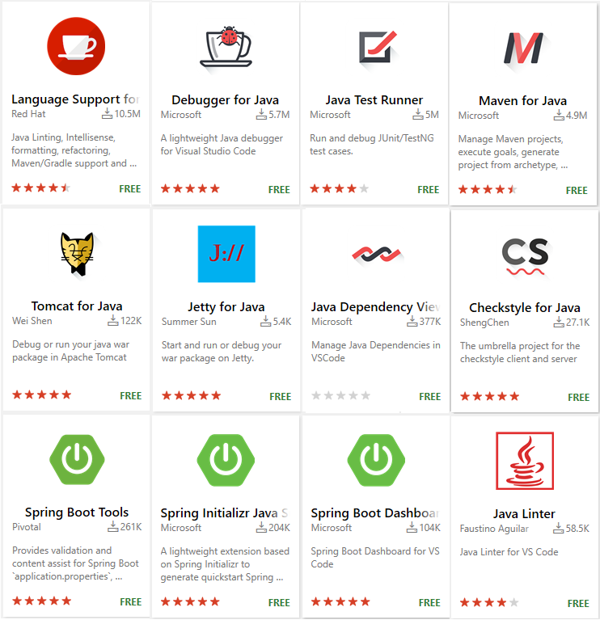

# Java in Visual Studio Code

The Java support in Visual Studio Code is provided through a wide range of [extensions](/docs/editor/extension-gallery.md). By installing extensions, you can have a lightweight and performant code editor which also supports many popular Java development tools. VS Code provides essential language features such as code completion, refactoring, linting, formatting, and code snippets along with convenient debugging and unit test support. VS Code can also integrate with tooling and frameworks such as Maven, Tomcat, Jetty, and Spring Boot. Leveraging the power of Visual Studio Code, Java developers get an excellent tool for both quick code editing and also the full debugging and testing cycle. It's a great choice for your Java work if you're looking for a tool which:

- Is fast and lightweight, free, and open source
- Supports multiple, or all the programming languages you use
- Helps start your Java journey without installing and learning a complex IDE
- Provides great microservices support including popular framework, container tooling and cloud integration
- Improves your productivity through smartness and collaboration features

This article will give you an overview of different capabilities of Visual Studio Code for Java developers. For a quick walkthrough of editing, running, and debugging a Java program with Visual Studio Code, see the [Java Tutorial](/docs/java/java-tutorial).

## Install Visual Studio Code for Java

VS Code is a fast editor and ships with great editing features. Before you begin, you must have the Java SE Development Kit (JDK) on your local environment. Visual Studio Code works with all major Java versions up to 12.

To help you get started quickly, we created a special [Installer of Visual Studio Code for Java developers](https://aka.ms/vscode-java-installer-win). The package can be used as a clean install or an update for an existing development environment to add Java or Visual Studio Code. Once [downloaded](https://aka.ms/vscode-java-installer-win) and opened, it automatically detects if you have the fundamental components in your local development environment, including the JDK, Visual Studio Code, and essential Java extensions. During install, it downloads the stable versions of those tools from trusted online sources and installs them on your system.

<a class="tutorial-install-extension-btn" href="https://aka.ms/vscode-java-installer-win">Download Visual Studio Code Java Pack Installer</a>

> **Note**: The installer is currently only available for Windows. For other OS, please install those components (JDK, VS Code and Java extensions) individually. We're working on the macOS version, please stay tuned.

Alternatively, you can also add Java language support to VS Code by installing the popular Java extensions by yourself.

> [Download VS Code](/download) - If you haven't downloaded VS Code yet, quickly install for your platform (Windows, macOS, Linux).

To help set up Java on VS Code, there is a [Java Extension Pack](https://marketplace.visualstudio.com/items?itemName=vscjava.vscode-java-pack), which contains the most popular extensions for most Java developers:

1. [Language Support for Java(TM) by Red Hat](https://marketplace.visualstudio.com/items?itemName=redhat.java)
2. [Debugger for Java](https://marketplace.visualstudio.com/items?itemName=vscjava.vscode-java-debug)
3. [Java Test Runner](https://marketplace.visualstudio.com/items?itemName=vscjava.vscode-java-test)
4. [Maven for Java](https://marketplace.visualstudio.com/items?itemName=vscjava.vscode-maven)
5. [Java Dependency Viewer](https://marketplace.visualstudio.com/items?itemName=vscjava.vscode-java-dependency)
6. [Visual Studio IntelliCode](https://marketplace.visualstudio.com/items?itemName=VisualStudioExptTeam.vscodeintellicode)

<a class="tutorial-install-extension-btn" href="vscode:extension/vscjava.vscode-java-pack">Install the Java Extension Pack</a>

There are also other popular Java extensions you can pick for your own needs, including:

1. [Spring Boot Tools](https://marketplace.visualstudio.com/items?itemName=Pivotal.vscode-spring-boot)
2. [Spring Initializr Java Support](https://marketplace.visualstudio.com/items?itemName=vscjava.vscode-spring-initializr)
3. [Spring Boot Dashboard](https://marketplace.visualstudio.com/items?itemName=vscjava.vscode-spring-boot-dashboard)
4. [Tomcat](https://marketplace.visualstudio.com/items?itemName=adashen.vscode-tomcat)
5. [Jetty](https://marketplace.visualstudio.com/items?itemName=SummerSun.vscode-jetty)
6. [CheckStyle](https://marketplace.visualstudio.com/items?itemName=shengchen.vscode-checkstyle)

Thanks to the great Java community around VS Code, the list doesn't end there. You can search for more Java extensions easily within VS Code:

1. Go to the **Extensions** view (`kb(workbench.view.extensions)`).
2. Filter the extensions list by typing "java".

This document describes some of the key features included in those Java extensions.

## Java project support

Maven, Eclipse, and Gradle Java projects are supported through [Language Support for Java(TM) by Red Hat](https://marketplace.visualstudio.com/items?itemName=redhat.java), by utilizing [M2Eclipse](https://www.eclipse.org/m2e/), which provides Maven support, and [Buildship](https://github.com/eclipse/buildship), which provides Gradle support through the [Eclipse JDT Language Server](https://github.com/eclipse/eclipse.jdt.ls).

With [Maven for Java](https://marketplace.visualstudio.com/items?itemName=vscjava.vscode-maven), you can generate projects from [Maven Archetype](https://maven.apache.org/guides/introduction/introduction-to-archetypes.html), browse through all the Maven projects within your workspace, and execute Maven goals easily from an embedded explorer. Projects can also be created and managed with the [Java Dependency Viewer](https://marketplace.visualstudio.com/items?itemName=vscjava.vscode-java-dependency) extension.

<video autoplay loop muted playsinline controls>
  <source src="/docs/languages/java/package-viewer.mp4" type="video/mp4">
</video>

More details about Java project support can be found in [Java Project Management in Visual Studio Code](/docs/java/java-project.md).

Visual Studio Code also supports working with standalone Java files outside of a Java project, described in the [Java Tutorial with VS Code](/docs/java/java-tutorial.md).

## Editing

### IntelliSense

[IntelliSense](/docs/editor/intellisense.md) is a general term for language features, including intelligent code completion (in-context method and variable suggestions) across all your files and for built-in and third-party modules. VS Code supports code completion and IntelliSense for Java through [Language Support for Java(TM) by Red Hat](https://marketplace.visualstudio.com/items?itemName=redhat.java). It also provides AI-assisted IntelliSense called [IntelliCode](https://visualstudio.microsoft.com/services/intellicode/) by putting what you're most likely to use at the top of your completion list.

<video autoplay loop muted playsinline controls>
  <source src="/docs/languages/java/intellisense.mp4" type="video/mp4">
</video>

### Navigating

Java in Visual Studio Code also supports source code navigation features such as search for symbol, Peek Definition, and Go to Definition. The [Spring Boot Tools](https://marketplace.visualstudio.com/items?itemName=Pivotal.vscode-spring-boot) extension provides enhanced navigation and code completion support for [Spring Boot](https://projects.spring.io/spring-boot/) projects.

There are also other editing related features available for Java, such as refactoring and formatting. To learn more, read [Editing Java in Visual Studio Code](/docs/java/java-editing.md).

## Debugging

[Debugger for Java](https://marketplace.visualstudio.com/items?itemName=vscjava.vscode-java-debug) is a lightweight Java Debugger based on [Java Debug Server](https://github.com/Microsoft/java-debug). It works with [Language Support for Java by Red Hat](https://marketplace.visualstudio.com/items?itemName=redhat.java) to allow users to debug Java code within Visual Studio Code.

Starting a debugging session is easy, click on the **Run|Debug** button available at the CodeLens of your `main()` function, or press `kb(workbench.action.debug.start)`. The debugger will automatically generate the proper configuration for you.

<video autoplay loop muted playsinline controls>
  <source src="/docs/languages/java/resolve-main.mp4" type="video/mp4">
</video>

Although it's lightweight, the Java debugger supports advanced features such as expression evaluation, conditional breakpoints, and hot code replacement. For more debugging related information, visit [Java Debugging](/docs/java/java-debugging.md).

## Testing

With the support from the [Java Test Runner](https://marketplace.visualstudio.com/items?itemName=vscjava.vscode-java-test) extension, you can easily run, debug, and manage your JUnit and TestNG test cases.

<video autoplay loop muted playsinline controls>
  <source src="/docs/languages/java/testng.mp4" type="video/mp4">
</video>

For more about testing, read [Testing Java](/docs/java/java-testing.md).

## Spring Boot, Tomcat, and Jetty

To further improve your Java productivity in VS Code, there are extensions for most popular frameworks and tools such as [Spring Boot](https://projects.spring.io/spring-boot/), [Tomcat](https://tomcat.apache.org/), and [Jetty](http://www.eclipse.org/jetty/) created by the community.

The [Tomcat](https://marketplace.visualstudio.com/items?itemName=adashen.vscode-tomcat) extension includes an explorer to easily navigate and manage your Tomcat servers. You can create, start, debug, stop, and rename your Tomcat server with the extension.

<video autoplay loop muted playsinline controls>
  <source src="/docs/languages/java/tomcat.mp4" type="video/mp4">
</video>

See [Tomcat and Jetty Support](/docs/java/java-tomcat-jetty.md) to learn more about Tomcat and Jetty support with VS Code.

[Spring Boot](https://projects.spring.io/spring-boot/) support is provided by [Pivotal](https://marketplace.visualstudio.com/search?term=publisher%3A%22Pivotal%22&target=VSCode&category=All%20categories&sortBy=Relevance). There are also [Spring Initializr Java Support](https://marketplace.visualstudio.com/items?itemName=vscjava.vscode-spring-initializr) and [Spring Boot Dashboard](https://marketplace.visualstudio.com/items?itemName=vscjava.vscode-spring-boot-dashboard) extensions available from Microsoft to further improve your experience with Spring Boot in Visual Studio Code.

See [Spring Boot with VS Code](/docs/java/java-spring-boot.md) to learn more about Spring Boot support with VS Code.

## Next steps

You may [Sign up](https://devblogs.microsoft.com/visualstudio/java-on-visual-studio-code-april-update#signup) to follow the latest of Java on Visual Studio Code.

Learn more about Java in VS Code

* [Java Tutorial with VS Code](/docs/java/java-tutorial.md)
* [Code Editing and Navigation](/docs/java/java-editing.md)
* [Java Debugging](/docs/java/java-debugging.md)
* [Java Testing](/docs/java/java-testing.md)
* [Java Project Management](/docs/java/java-project.md)
* [Spring Boot with VS Code](/docs/java/java-spring-boot.md)
* [Tomcat and Jetty Support](/docs/java/java-tomcat-jetty.md)

Read on to find out more about Visual Studio Code:

* [Basic Editing](/docs/editor/codebasics.md) - Learn about the powerful VS Code editor.
* [Code Navigation](/docs/editor/editingevolved.md) - Move quickly through your source code.
* [Tasks](/docs/editor/tasks.md) - use tasks to build your project and more
* [Debugging](/docs/editor/debugging.md) - find out how to use the debugger with your project
