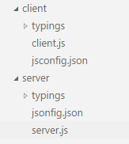
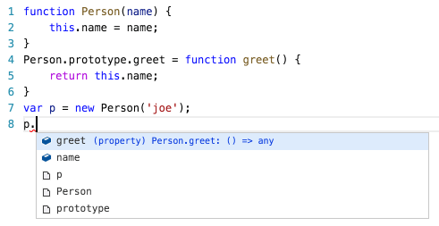
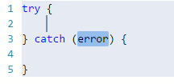

# JavaScript

## Rich Editing Support

Visual Studio Code uses the TypeScript language service to make authoring JavaScript easy. In addition to syntactical features like format, format on type and outlining, you also get language service features such as **Peek**, **Go to Definition**, **Find all References**, and **Rename Symbol**.

## JavaScript Projects (jsconfig.json)

VS Code's JavaScript support can operate in two different modes:

* **File Scope - no jsconfig.json**: In this mode, JavaScript files opened in Visual Studio Code are treated as independent units. As long as a file `a.js` doesn't reference a file `b.ts` explicitly (either using /// reference [directives](http://www.typescriptlang.org/docs/handbook/triple-slash-directives.html) or **CommonJS** [modules](http://www.commonjs.org/specs/modules/1.0)), there is no common project context between the two files.

* **Explicit Project - with jsconfig.json**: A JavaScript project is defined via a `jsconfig.json` file. The presence of such a file in a directory indicates that the directory is the root of a JavaScript project. The file itself can optionally list the files belonging to the project, the files to be excluded from the project, as well as compiler options (see below).

The JavaScript experience is much better when you have a `jsconfig.json` file in your workspace that defines the project context. For this reason, we provide a hint to create a `jsconfig.json` file when you open a JavaScript file in a fresh workspace. The `jsconfig.json` file corresponds to a TypeScript project [tsconfig.json](https://github.com/Microsoft/TypeScript/wiki/tsconfig.json) file with the attribute `allowJS` implicitly set to `true`. If no `files` attribute is present, then this defaults to including all files in the containing directory and subdirectories. When a `files` attribute is specified, only those files are included.

Make sure that you place the `jsconfig.json` at the root of your JavaScript project and not just at the root of your workspace. Below is a `jsconfig.json` file which defines the JavaScript `target` to be `ES6` and the `exclude` attribute excludes the `node_modules` folder.

```json
{
    "compilerOptions": {
        "target": "ES6"
    },
    "exclude": [
        "node_modules"
    ]
}
```

Here is an example with an explicit `files` attribute.
```json
{
    "compilerOptions": {
        "target": "ES6"
    },
    "files": [
        "src/app.js"
    ]
}
```

The `files` attribute cannot be used in conjunction with the `exclude` attribute. If both are specified, the `files` attribute takes precedence.

In more complex projects, you may have more than one `jsconfig.json` file defined inside a workspace, as illustrated in below for a project with a `client` and `server` folder, that are a separate project context:



### Excludes 

Whenever possible, you should exclude folders with JavaScript files that are not part of the source code for your project.

>**Note:** If you do not have a `jsconfig.json` in your workspace, VS Code will by default exclude the `node_modules` folder and the folder defined by the `out` attribute.

Below is a table mapping common project components to their installation folders which are recommended to exclude:

Component | folder to exclude
----------|-----------
`node` | exclude the `node_modules` folder
`webpack`, `webpack-dev-server` | exclude the content folder, e.g., `dist`.
`bower` | exclude the `bower_components` folder
`ember` | exclude the `tmp` and `temp` folders
`jspm` | exclude the `jspm_packages` folder

When your JavaScript project is growing too large, it is often because of library folders like `node_modules`. If VS Code detects that your project is growing too large, it will prompt you to edit the `exclude` list.

>**Tip:** Sometimes changes to configuration, such as adding or editing a `jsconfig.json` file are not picked up correctly. Running the **Reload Java Script** command should reload the project and pick up the changes.

### jsconfig Options

Below are jsconfig options to configure the JavaScript language support.

Option  | Description
----------------|-----
`noLib` | Do not include the default library file (lib.d.ts)
`target`| Specifies which default library (lib.d.ts) to use. The values are "ES3", "ES5", "ES6".
`experimentalDecorators`|Enables experimental support for proposed ES decorators.
`allowSyntheticDefaultImports`|Allow default imports from modules with no default export. This does not affect code emit, just typechecking.

## IntelliSense

The JavaScript Support uses different strategies to provide IntelliSense.

### IntelliSense based on type inference

JavaScript uses the same inference as TypeScript to determine the type of a value.

The following patterns are also recognized:

- **"ES3-style"** classes, specified using a constructor function and assignments to the prototype property.
- **CommonJS**-style module patterns, specified as property assignments on the exports object, or assignments to the `module.exports` property.

The **AMD** (Asynchronous Module Definition) module pattern is currently not supported.

IntelliSense offers both inferred proposals and the global identifiers of the project. The inferred symbols are presented first, followed by the global identifiers (with the document icon), as you can see in the image below.



### JSDoc annotations

Where type inference does not provide the desired type information, (or just for documentation purposes), type information may be provided explicitly via **JSDoc** annotations.

This [document](https://github.com/Microsoft/TypeScript/wiki/JsDoc-support-in-JavaScript) describes the **JSDoc** annotations currently supported.

### TypeScript definition file

 You can also get IntelliSense for libraries through the use of type definition `.d.ts` files. [DefinitelyTyped](https://github.com/DefinitelyTyped/DefinitelyTyped) is a repository of typings files for all major JavaScript libraries and environments. The typings are easily managed using [Typings](https://github.com/typings/typings), the TypeScript Definition manager.

For example `typings install --ambient node` installs all the typings for the built-in Node.js modules. If your project has a `jsconfig.json` file, then make sure that `typings` is contained in the project context defined by the location of the `jsconfig.json` file. If you have no `jsconfig.json`, then you need to manually add a `/// reference`  to the `.d.ts` from each JavaScript file.

>**Tip**: When you want to use ES6 style imports but the typings do not yet use ES6 style exports, then set the [TypeScript compiler option](https://www.typescriptlang.org/docs/handbook/compiler-options.html) `allowSyntheticDefaultImports` to true.

```json
{
  "compilerOptions": {
    "target": "ES6",
    "module": "commonjs",
    "allowSyntheticDefaultImports": true
  },
  "exclude": [
    "node_modules"
  ]
}
```

## Mixed TypeScript and JavaScript projects

It is now possible to have mixed TypeScript and JavaScript projects. Existing JavaScript code using the **CommonJS** module format, may be imported and consumed by TypeScript code using the **ECMAScript 2015** module syntax. Conversely, TypeScript code written to provide a well-defined API contract for a service, may be referenced by JavaScript code that is written to call that service, thus providing rich IntelliSense at design time.

To enable JavaScript inside a TypeScript project, you can set the `allowJs` property to `true` in the TypeScript project's `tsconfig.json` file.

## Compiling JavaScript down-level

One of the key features TypeScript provides is the ability to use the latest JavaScript language features, and emit code that can execute in JavaScript runtimes that don't yet understand those newer features. With JavaScript using the same language service, it too can now take advantage of this same feature.

The TypeScript compiler `tsc` can down-level compile JavaScript files from ES6 to another language level. Configure the `jsconfig.json` with the desired options and then use the –p argument to make `tsc` use your `jsconfig.json` file, e.g. `tsc -p jsconfig.json` to down-level compile.

The following compiler options in `jsconfig.json` apply when `tsc` is used for down level compiling of ES6 JavaScript to an older version:

Option | Description
----------|----------
`module`|Specify module code generation. The values are "commonjs", "system", "umd", "amd", "es6", "es2015"
`diagnostics`|Show diagnostic information.
`emitBOM`|Emit a UTF-8 Byte Order Mark (BOM) in the beginning of output files.
`inlineSourceMap`|Emit a single file with source maps instead of having a separate file.
`inlineSources`|Emit the source alongside the sourcemaps within a single file; requires --inlineSourceMap to be set.
`jsx`|Specify JSX code generation: "preserve" or "react".
`reactNamespace`|Specifies the object invoked for createElement and __spread when targeting 'react' JSX emit.
`mapRoot`|Specifies the location as an uri in a string where debugger should locate map files instead of generated locations.
`noEmit`|Do not emit output.
`noEmitHelpers`|Do not generate custom helper functions like __extends in compiled output.
`noEmitOnError`|Do not emit outputs if any type checking errors were reported.
`noResolve`|Do not resolve triple-slash references or module import targets to the input files.
`outFile`|Concatenate and emit output to single file.
`outDir`|Redirect output structure to the directory.
`removeComments`|Do not emit comments to output.
`rootDir`|Specifies the root directory of input files. Use to control the output directory structure with --outDir.
`sourceMap`| Generates corresponding '.map' file.
`sourceRoot`| Specifies the location where debugger should locate JavaScript files instead of source locations.
`stripInternal`|`do not emit declarations for code that has an '@internal' annotation.
`watch`|Watch input files.
`emitDecoratorMetadata`|Emit design-type metadata for decorated declarations in source.
`noImplicitUseStrict`|Do not emit "use strict" directives in module output.


## JavaScript Formatting

VS Code provides several formatting settings for JavaScript. They can all be found in the `javascript.format` [settings](/docs/customization/userandworkspace.md) name space.

```typescript
// Defines space handling after a comma delimiter
"javascript.format.insertSpaceAfterCommaDelimiter": boolean,

// Defines space handling after a semicolon in a for statement
"javascript.format.insertSpaceAfterSemicolonInForStatements": boolean,

// Defines space handling after a binary operator
"javascript.format.insertSpaceBeforeAndAfterBinaryOperators": boolean,

// Defines space handling after keywords in control flow statement
"javascript.format.insertSpaceAfterKeywordsInControlFlowStatements": boolean,

// Defines space handling after function keyword for anonymous functions
"javascript.format.insertSpaceAfterFunctionKeywordForAnonymousFunctions": boolean,

// Defines space handling after opening and before closing non empty parenthesis
"javascript.format.insertSpaceAfterOpeningAndBeforeClosingNonemptyParenthesis": boolean,

// Defines space handling after opening and before closing non empty brackets
"javascript.format.insertSpaceAfterOpeningAndBeforeClosingNonemptyBrackets": boolean,

// Defines whether an open brace is put onto a new line for functions or not
"javascript.format.placeOpenBraceOnNewLineForFunctions": boolean,

// Defines whether an open brace is put onto a new line for control blocks or not
"javascript.format.placeOpenBraceOnNewLineForControlBlocks": boolean,
```

## Snippets for JavaScript

VS Code has several built-in snippets that will come up as you type or you can press `kb(editor.action.triggerSuggest)` (**Trigger Suggest**) and you will see a context specific list of suggestions.


Selecting the snippet with `kbstyle(Tab)` results in:



>**Tip:** You can add in your own User Defined Snippets for JavaScript.  See [User Defined Snippets](/docs/customization/userdefinedsnippets.md) to find out how.

## Run Babel inside VS Code

The [Babel](https://babeljs.io) transpiler turns ES6 files into readable ES5 JavaScript with Source Maps. You can easily integrate **Babel** into your workflow by adding this code to your `tasks.json` file (located under the workspace's `.vscode` folder). The `isBuildCommand` switch makes this task the `Task: Run Build Task` gesture.  `isWatching` tells VS Code not to wait for this task to finish. To learn more, go to [Tasks](/docs/editor/tasks.md).

```json
{
    "version": "0.1.0",
    "command": "${workspaceRoot}/node_modules/.bin/babel",
    "isShellCommand": true,
    "tasks": [
        {
            "args": ["src", "--out-dir", "lib", "-w", "--source-maps"],
            "taskName": "watch",
            "suppressTaskName": true,
            "isBuildCommand": true,
            "isWatching": true
        }
    ]
}
```

Once you have added this, you can start **Babel** with the `kb(workbench.action.tasks.build)` (**Run Build Task**) command and it will compile all files from the `src` directory into the `lib` directory.

## JSX and React Native

VS Code supports **JSX** and **React Native**. To get IntelliSense for **React/JSX**, install the typings for `react-global` by running `typings install --ambient react-global` from the terminal. To get IntelliSense for **React Native**, run `typings install --ambient react-native.`

**React Native** examples often use the experimental **Object Rest/Spread** operator. This is not yet supported by VS Code. If you want to use it, it is recommended that you disable the built-in syntax checking (see below).

To enable ES6 import statements for **React Native**, you need to set the `allowSyntheticDefaultImports` compiler option to `true`. This tells the compiler to create synthetic default members and you get IntelliSense. **React Native** uses **Babel** behind the scenes to create the proper run-time code with default members. If you also want to do debugging of **React Native** code then you can install the [React Native Extension](https://marketplace.visualstudio.com/items?itemName=vsmobile.vscode-react-native).

## Disable Syntax Validation when using non ES6 constructs

Some users want to use syntax constructs like the proposed Object Rest/Spread Properties. However, these are currently not supported by VS Code's JavaScript support and are flagged as errors. For users who still want to use these future features, we provide the `javascript.validate.enable` [setting](/docs/customization/userandworkspace.md). With `javascript.validate.enable: false` you disable all built-in syntax checking. If you do this, we recommend that you use a linter like [ESLint](http://eslint.org) to validate your code. Since the JavaScript support doesn't understand ES7 constructs, features like IntelliSense might not be fully accurate.

## JavaScript Linters (ESLint, JSHint)

VS Code provides support for [ESLint](http://eslint.org/) and [JSHint](http://jshint.com/) via [extensions](/docs/editor/extension-gallery.md). If enabled, the JavaScript code is validated as you type and reported problems can be navigated to and fixed inside VS Code.

To enable one of the linters, do the following:

* Install the corresponding linter globally or inside the workspace folder that contains the JavaScript code to be validated. For example, using `npm install -g eslint` or `npm install -g jshint`, respectively.
* Install the [ESLint](https://marketplace.visualstudio.com/items/dbaeumer.vscode-eslint) or [JSHint](https://marketplace.visualstudio.com/items/dbaeumer.jshint) extension. The linter is enabled after installation. You can disable a linter via the corresponding settings `"eslint.enable": true` or `"jshint.enable": true`, respectively.
* Use a `.eslintrc.json` or `.jshintrc` file in the root of your workspace to configure the linter. You can use `eslint --init` to create an initial version of the `.eslintrc.json` file.

>**Tip**: You get IntelliSense and hovering inside the `.eslintrc.json` and the `.jshintrc` files.

It is recommended that you enable the linter rules that warn about undefined and unused variables.

In JSHint:

```json
"undef": true,
"unused": true,
```

In ESLint:

```json
"no-undef": 1,
"no-unused-vars": 1,
```

## Next Steps

Read on to find out about:

* [TypeScript](typescript) - VS Code has great support for TypeScript which brings structure and strong typing to your JavaScript code, without compromising the good parts.

## Common Questions

**Q: Can I debug minified/uglified JavaScript?**

**A:** Yes, you can.
